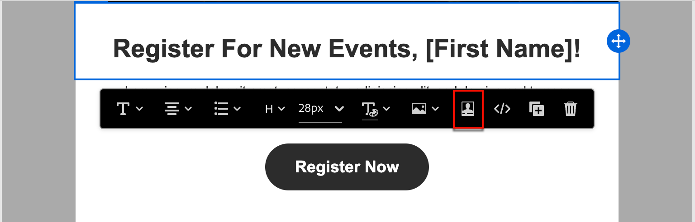
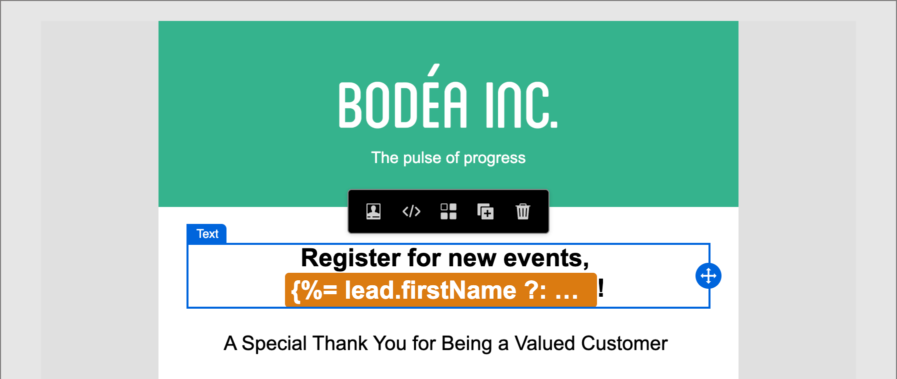

# Creación de contenido: personalización

Journey Optimizer B2B edition utiliza una sintaxis simple en línea que le permite crear expresiones con contenido personalizado entre llaves `{}`. Puede agregar varias expresiones en el mismo contenido o campo sin restricciones.

Ejemplos:

* `Hello {{lead.firstName}} {{lead.lastName}}`
* `Hello `

>[!NOTE]
>
>Journey Optimizer B2B edition ahora sigue la sintaxis de _camel case_ para los tokens de personalización en los correos electrónicos que coincidan con otras aplicaciones de Adobe Experience Platform para lograr una experiencia coherente. Este formato de token es totalmente compatible con el [idioma de plantilla Handlebars](https://handlebarsjs.com/guide/#what-is-handlebars){target="_blank"}. Todos los tokens que se hayan agregado antes de este cambio se actualizan automáticamente.

Al procesar el contenido, Journey Optimizer B2B edition reemplaza la expresión con los datos contenidos en la base de datos de Experience Platform. Así, el primer ejemplo se convierte en _Hello John Doe_.

En el siguiente ejemplo se describen los pasos para personalizar el contenido mediante atributos de cliente potencial/cuenta y tokens del sistema.

1. Seleccione el componente de texto y haga clic en el icono _Agregar personalización_ de la barra de herramientas.

   {width="600"}

   Esta acción abre el diálogo _Editar Personalization_.

1. Agregue un token haciendo clic en el símbolo más ( **+** ) que hay junto a él.

   Si desea agregar el token con una reserva (texto predeterminado que aparece cuando ese campo no está disponible para un posible cliente), haga clic en el icono _Más_ ( **...** ) y elija **[!UICONTROL Insertar con texto de reserva]**.

   {width="700" zoomable="yes"}

1. Agregue cualquier token adicional u otro texto estático que desee incluir.

1. Haga clic en **[!UICONTROL Guardar]**.

   Los scripts de personalización se muestran en el espacio de diseño visual. Puede seleccionarlo para realizar cambios cuando sea necesario.

   {width="600"}
