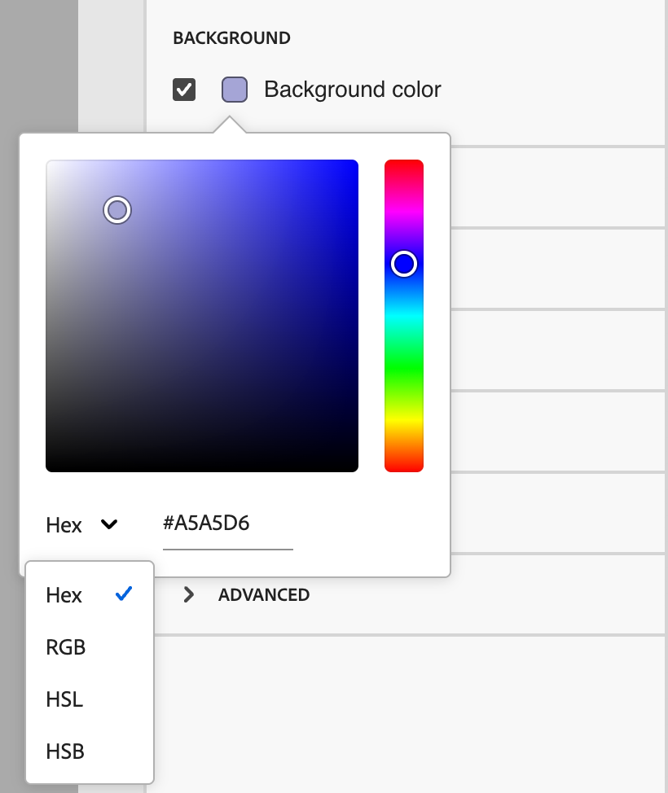

# Fragmentos

<!-- Content authoring steps for reuse -->

## Configuración de datos por intención {#intent-data-note}

>[!NOTE]
>
>Los datos de intención se incluyen cuando se configuran para la instancia de Journey Optimizer B2B edition. También requiere que se publiquen uno o más recorridos **o** que hayan creado grupos compradores. Para obtener más información acerca del modelo de detección de intención y cómo enviar palabras clave, productos y categorías, vea [Datos por intención](../user/admin/intent-data.md).

## nota de licencia de AEM Assets {#aem-assets-licensing-note}

>[!NOTE]
>
>Las licencias para AEM Assets y las licencias de as a Cloud Service y Dynamic Media son requisitos previos para la integración. Asegúrese de que [Dynamic Media con API abierta](https://experienceleague.adobe.com/es/docs/experience-manager-cloud-service/content/assets/dynamicmedia/dynamic-media-open-apis/dynamic-media-open-apis-overview){target="_blank"} esté habilitado. La integración se limita a repositorios del _nivel de entrega_. Si usa el _nivel de creación_ y desea convertirlo, póngase en contacto con el soporte técnico de Adobe Experience Manager. 
>Según el contrato y la configuración, se puede acceder directamente a Adobe Experience Manager Assets as a Cloud Service desde Adobe Journey Optimizer B2B edition al diseñar contenido visual.

## Creación de contenido: componentes, paso de estructuras {#structures-step}

1. Para iniciar el diseño de contenido, arrastre un elemento desde **[!UICONTROL Structures]** y suéltelo en el lienzo.

   Agregue tantos elementos de _[!UICONTROL Structures]_ como necesite y edite la configuración de cada uno en el panel de la derecha.

   >[!TIP]
   >
   >Seleccione el componente _[!UICONTROL n:n column]_ para definir el número de columnas que desee (entre tres y 10). También puede definir el ancho de cada columna moviendo las flechas debajo de la columna.

   {width="800" zoomable="yes"}

   Cada tamaño de columna no puede ser inferior al 10 % de la anchura total del componente de estructura. Solo se pueden eliminar columnas vacías.

## Creación de contenido: componentes, paso de contenido {#contents-step}

1. Expanda la sección **[!UICONTROL Contenido]** y agregue tantos elementos como necesite a uno o más componentes de estructura.

   {width="800" zoomable="yes"}
   <!--
   reference to the contents elements--->

## Creación de contenido: componentes, paso de configuración {#settings-step}

1. Si es necesario, puede realizar personalizaciones adicionales para cada componente en las fichas _[!UICONTROL Configuración]_ o _[!UICONTROL Estilo]_.

   Por ejemplo, puede cambiar el estilo del texto, el relleno o el margen de cada componente.

## Creación de contenido: paso de activos {#assets-step}

1. Desde el selector _Asset_, puede seleccionar directamente los recursos almacenados en la biblioteca de recursos.

   Haga doble clic en la carpeta que contiene los recursos. Arrastre y suelte los elementos en un componente de estructura.

   Para obtener más información sobre el uso de recursos del tipo de origen, consulte [Agregar recursos al contenido](../user/content/assets-overview.md#use-assets-for-content-authoring).

   {width="800" zoomable="yes"}

## Creación de contenido: paso de personalización {#personalization-step}

1. Inserte campos de personalización para personalizar el contenido a partir de atributos de perfiles, pertenencias a audiencias, atributos contextuales, etc.

## Creación de contenido: paso para habilitar el contenido de condición {#dynamic-content-step}

1. Haga clic en **[!UICONTROL Habilitar contenido de condición]** para agregar contenido dinámico y adaptar el contenido a los perfiles de destino según las reglas condicionales.

## Creación de contenido: paso de seguimiento de vínculos {#links-tracking-step}

1. Seleccione la ficha **[!UICONTROL Vínculos]** del panel izquierdo para mostrar todas las direcciones URL del contenido del que se realiza un seguimiento.

   Puede modificar _Tracking Type_ o _Label_ y agregar etiquetas si es necesario.

## Componentes de contenido: estilos avanzados {#styles-advanced}

Para aplicar atributos adicionales compatibles con CSS con valores, use la configuración de estilo **[!UICONTROL Avanzado]**. Puede cambiar los valores de los atributos existentes o agregar nuevos. El estilo se aplica al componente mediante el modelo de herencia CSS para los componentes principal-secundario (elementos).

Los atributos mostrados reflejan los estilos definidos actualmente para el componente. Puede cambiar los valores según [las definiciones de CSS](https://www.w3schools.com/CSSref/index.php){target="_blank"}. Haga clic en el icono _Agregar_ (**+**) para agregar un nuevo atributo de estilo para el componente.

{width="250"}

## Componentes de contenido: estilos de alineación horizontales {#styles-alignment-h}

Expanda la sección **[!UICONTROL Alignment]** y elija la alineación horizontal que desee utilizar: izquierda, centro o derecha. Este estilo se traduce a un estilo CSS `text-align` estándar y afecta a la forma en que se coloca el componente dentro del componente que lo contiene.

{width="250"}

## Componentes de contenido: estilos de alineación verticales {#styles-alignment-v}

Expanda la sección **[!UICONTROL Alignment]** y elija la alineación vertical que desee usar: superior, central o inferior. Este estilo se traduce a un estilo CSS `vertical-align` estándar y afecta a la posición dentro del componente que lo contiene.

{width="250"}

## Componentes de contenido: estilos de alineación horizontal y vertical {#styles-alignment-h-v}

Expanda la sección **[!UICONTROL Alignment]** y elija la alineación horizontal y vertical que desee utilizar. Los estilos de alineación afectan a cómo se coloca el componente HTML dentro del componente contenedor (estructural o contenedor).

La alineación horizontal se traduce en un estilo CSS estándar de `text-align` y puede elegir entre izquierda, centro o derecha. La alineación vertical se traduce al estilo CSS estándar de `vertical-align` y puede elegir entre superior, medio o inferior.

{width="300"}

## Componentes de contenido: estilos de fondo {#styles-background}

Con la ficha _[!UICONTROL Estilos]_ seleccionada en el panel derecho, use la sección **[!UICONTROL Fondo]** para definir el color de fondo del componente.

Seleccione la casilla de verificación y haga clic en el cuadrado de color para elegir un color del selector. Puede elegir un color introduciendo un valor RGB, HSL, HSB o hexadecimal conocido. O bien, puede utilizar el regulador de color y el campo de color para seleccionar el color.

{width="300"}

## Componentes de contenido: estilos de borde {#styles-border}

1. En el panel derecho con la ficha _[!UICONTROL Estilos]_ seleccionada, expanda la sección **[!UICONTROL Borde]** y establezca las opciones para mostrar un borde para el componente:

1. Mueva el conmutador a la derecha para habilitar las opciones de visualización de bordes y configúrelas según los criterios de diseño:

   * Para establecer el **[!UICONTROL color del borde]**, seleccione la casilla de verificación y haga clic en el cuadrado de color para elegir un color del selector. Puede elegir un color introduciendo un valor RGB, HSL, HSB o hexadecimal conocido. O bien, puede utilizar el regulador de color y el campo de color para seleccionar el color.

   {width="300"}

   * Para establecer el **[!UICONTROL tamaño del borde]** (ancho de línea), haga clic en los iconos de flecha arriba y abajo para aumentar o reducir el número de píxeles.

   * Para establecer el **[!UICONTROL estilo de borde]**, elija un valor de la lista de valores de CSS `border-style` estándar.

   * Para determinar dónde se muestra el borde, active cada casilla de verificación **[!UICONTROL Posición del borde]**.

   {width="250"}

1. Para el **[!UICONTROL Radio del borde]**, establezca el valor numérico según la curva que desee para las esquinas.

   Un valor de 0 (por defecto) produce una esquina cuadrada.

## Componentes de contenido: estilos de margen {#styles-margin}

En el panel derecho con la ficha _[!UICONTROL Estilos]_ seleccionada, expanda la sección **[!UICONTROL Margen]** y establezca las opciones de espaciado de los márgenes dentro del componente estructural. Este estilo replica el parámetro `margin` de CSS, que controla el espacio fuera del borde de un componente y lo separa de otros componentes. Crea un espacio alrededor del componente para influir en su posición y el diseño del contenido circundante.

Establezca los valores de los márgenes en píxeles según sus necesidades de diseño. Puede establecer el margen para todos los lados, el superior inferior, el izquierdo-derecho o cada lado del componente de forma independiente:

* **Todos los lados**: para establecer un valor que se aplicará a todos los lados, desactive la casilla de verificación **[!UICONTROL Margen diferente para cada lado]**. Haga clic en los iconos de flecha arriba y abajo para aumentar o disminuir el número de píxeles.

  {width="250"}

* **Superior-inferior**: para establecer los márgenes superior e inferior con el mismo valor, establezca el icono _Bloqueado_ entre la configuración superior e inferior. Haga clic en los iconos de flecha arriba y abajo para aumentar o disminuir el número de píxeles.

* **Izquierda-derecha**: para establecer los márgenes izquierdo y derecho en el mismo valor, establezca el icono _Bloqueado_ entre la configuración izquierda y derecha. Haga clic en los iconos de flecha arriba y abajo para aumentar o disminuir el número de píxeles.

  {width="250"}

* **Independiente**: para establecer cada margen en un valor independiente, establezca el icono _Desbloqueado_ entre la configuración superior e inferior y entre la izquierda y la derecha. Para cada configuración, haga clic en los iconos de flecha arriba y abajo para aumentar o reducir el número de píxeles.

  {width="250"}

## Componentes de contenido: estilos de relleno {#styles-padding}

En el panel derecho con la ficha _[!UICONTROL Estilos]_ seleccionada, expanda la sección **[!UICONTROL Relleno]** y establezca las opciones de relleno dentro del componente estructural. Este estilo replica el parámetro CSS `padding`, que es el espacio entre el contenido de un componente y su borde. El relleno proporciona un espacio interno que puede utilizar para controlar la distancia entre el contenido y el borde del componente.

Establezca los valores de relleno en píxeles según sus necesidades de diseño. Puede establecer el relleno para todos los lados, el botón superior, el lado izquierdo-derecho o cada lado del componente de forma independiente:

* **Todos los lados**: para establecer un valor que se aplicará a todos los lados, desactive la casilla de verificación **[!UICONTROL Relleno diferente para cada lado]**. Haga clic en los iconos de flecha arriba y abajo para aumentar o disminuir el número de píxeles.

  {width="250"}

* **Superior-inferior**: para establecer el relleno superior e inferior con el mismo valor, establezca el icono _Bloqueado_ entre la configuración superior e inferior. Haga clic en los iconos de flecha arriba y abajo para aumentar o disminuir el número de píxeles.

* **Izquierda-derecha**: para establecer el relleno izquierdo y derecho en el mismo valor, establezca el icono _Bloqueado_ entre la configuración izquierda y derecha. Haga clic en los iconos de flecha arriba y abajo para aumentar o disminuir el número de píxeles.

  {width="250"}

* **Independiente**: para establecer el relleno de cada lado en un valor independiente, establezca el icono _Desbloqueado_ entre la configuración superior e inferior y entre la izquierda y la derecha. Para cada configuración, haga clic en los iconos de flecha arriba y abajo para aumentar o reducir el número de píxeles.

  {width="250"}

## Componentes de contenido: estilos de tamaño {#styles-size}

En el panel derecho con la ficha _[!UICONTROL Estilos]_ seleccionada, expanda la sección **[!UICONTROL Tamaño]** y establezca las opciones para la altura y anchura del componente:

* **[!UICONTROL Altura]**: haga clic en los iconos de flecha arriba y abajo para aumentar o reducir el número de píxeles. Un valor vacío (Automático) es el valor predeterminado y ajusta el tamaño de la altura del elemento según su contenido.

* **[!UICONTROL Anchura]**: utilice la opción para establecer la anchura en píxeles o porcentaje.

   * Para una anchura porcentual, utilice el control deslizante para definir el valor porcentual. El porcentaje determina el tamaño del elemento en función del cuadro de contenido del bloque contenedor, que excluye el relleno y los bordes. Por ejemplo, un valor de 50 establece el ancho del elemento en el 50 % del ancho del contenido del bloque que lo contiene.

     {width="250"}

   * Para un ancho basado en píxeles, haga clic en los iconos de flecha arriba y abajo para aumentar o reducir el número de píxeles. Un valor vacío (Automático) es el valor predeterminado y ajusta el ancho del elemento según su contenido.

     {width="250"}

## Componentes de contenido: estilos de texto {#styles-text}

En el panel derecho con la ficha _[!UICONTROL Estilos]_ seleccionada, expanda la sección **[!UICONTROL Texto]** y establezca las opciones para los estilos de texto del componente:

* **[!UICONTROL Familia de fuentes]**: haga clic en el icono de flecha hacia abajo para seleccionar una familia de fuentes para el texto dentro del componente.

* **[!UICONTROL Tamaño de fuente]**: haga clic en los iconos de flecha arriba y abajo para aumentar o reducir el tamaño de fuente o escriba un valor. Para los valores introducidos, puede utilizar decimales.

* **[!UICONTROL Altura de línea]**: haga clic en los iconos de flecha arriba y abajo para aumentar o reducir la altura de línea o escriba un valor. Para los valores introducidos, puede utilizar decimales.

  {width="250"}

* **[!UICONTROL Estilos de texto]** - Seleccione el icono para el estilo de texto: _Negrita_, _Cursiva_, _Subrayado_ o _Tachado_.

* **[!UICONTROL Alineación de texto]** - Seleccione el icono para la alineación de texto horizontal: _Izquierda_, _Centrada_, _Derecha_ o _Justificada_.

* **[!UICONTROL Color de fuente]**: haga clic en el cuadrado de color para elegir un color de fuente del selector. Puede elegir un color introduciendo un valor RGB, HSL, HSB o hexadecimal conocido. O bien, puede utilizar el regulador de color y el campo de color para seleccionar el color.

  {width="300"}

## Contenido: selección de imágenes: Marketo DAM {#me-dam}

Elija este tipo para examinar y seleccionar un recurso de imagen de la biblioteca B2B edition de Journey Optimizer o de la instancia conectada de Market Engage.

{width="700" zoomable="yes"}

En el cuadro de diálogo, puede elegir una imagen del repositorio seleccionado. Haga clic en **[!UICONTROL Seleccionar]** para agregar el recurso.

Hay herramientas disponibles para ayudarle a localizar el recurso que necesita:

* Haga clic en el icono _Filtrar_ en la parte superior izquierda para filtrar los elementos mostrados según sus criterios.

* Escriba texto en el campo _Buscar_ para filtrar los elementos mostrados y buscar una coincidencia del nombre del recurso.

  {width="700" zoomable="yes"}

## Contenido: selección de imágenes, AEM Assets {#aem-assets-dam}

Elija este tipo para examinar y seleccionar un recurso de imagen de un [repositorio configurado de Experience Manager Assets](../user/admin/configure-aem-repositories.md).

En el cuadro de diálogo _[!UICONTROL Seleccionar Assets]_, elija una imagen con las herramientas disponibles para localizar el recurso que necesita y haga clic en **[!UICONTROL Seleccionar]**.:

* Cambie **[!UICONTROL Repositorio]** en la parte superior derecha.

* Haga clic en **[!UICONTROL Administrar recursos]** en la parte superior derecha para abrir el repositorio de Assets en otra pestaña del explorador y usar las herramientas de administración de AEM Assets.

* Haga clic en el selector _Tipo de vista_ en la parte superior derecha para cambiar la pantalla a **[!UICONTROL Vista de lista]**, **[!UICONTROL Vista de cuadrícula]**, **[!UICONTROL Vista de galería]** o **[!UICONTROL Vista de cascada]**.

* Haga clic en el icono _Orden_ para cambiar el orden de clasificación entre ascendente y descendente.

  {width="700" zoomable="yes"}

* Haga clic en la flecha de menú **[!UICONTROL Ordenar por]** para cambiar los criterios de ordenación a **[!UICONTROL Nombre]**, **[!UICONTROL Tamaño]** o **[!UICONTROL Modificado]**.

* Haga clic en el icono _Filtrar_ en la parte superior izquierda para filtrar los elementos mostrados según sus criterios.

* Escriba texto en el campo _Buscar_ para filtrar los elementos mostrados y buscar una coincidencia del nombre del recurso.

  {width="700" zoomable="yes"}

## Contenido: carga de imagen {#image-upload}

Elija este tipo para seleccionar un archivo del sistema e importarlo a la biblioteca de recursos de Journey Optimizer B2B edition.

En el cuadro de diálogo _[!UICONTROL Cargar imagen]_, arrastre y suelte un archivo de su sistema en el cuadro de archivo. El tamaño máximo de archivo es 100 MB.

{width="450"}

Los nombres de archivo de las imágenes seleccionadas se muestran en el cuadro de diálogo. Los nombres de los archivos de recursos deben ser únicos (en todas las carpetas) y, si ya existe un archivo con el nombre, se muestra un mensaje. Los nombres pueden tener un máximo de 100 caracteres y no pueden contener caracteres especiales (como `;`, `:`, `\` y `|`).

Haga clic en **[!UICONTROL Importar]**.

## Actividades de puntuación de participación {#engagement-activities}

| Nombre de la actividad | Descripción | Tipo de participación | Recuento máximo de frecuencia diaria | Peso de actividad del modelo predeterminado |
| --- | --- | --- | --- | --- |
| [!UICONTROL Asistir al evento] | Un miembro asistió a un evento | Evento | 20 | 60 |
| [!UICONTROL Correo electrónico en el que se hizo clic] | Un miembro hace clic en un vínculo de un correo electrónico | Correo electrónico | 20 | 30 |
| [!UICONTROL Correo electrónico abierto] | Un miembro abre un correo electrónico | Correo electrónico | 20 | 30 |
| [!UICONTROL Formulario Rellenado] | Un miembro rellena y envía un formulario en una página web | Web | 20 | 40 |
| [!UICONTROL Momento interesante] | Un miembro experimenta un momento interesante | Revisado | 20 | 60 |
| [!UICONTROL Clics en vínculos] | Un miembro hace clic en un vínculo de una página web | Web | 20 | 40 |
| [!UICONTROL Vistas de página] | Un miembro ve una página web | Web | 20 | 40 |
| [!UICONTROL Registrarse en el evento] | Un miembro registrado para un evento | Evento | 20 | 60 |
