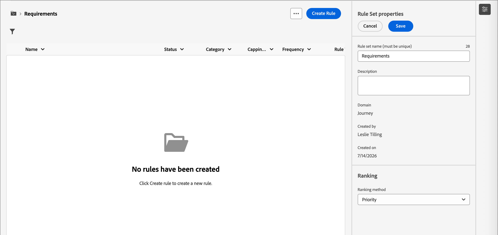
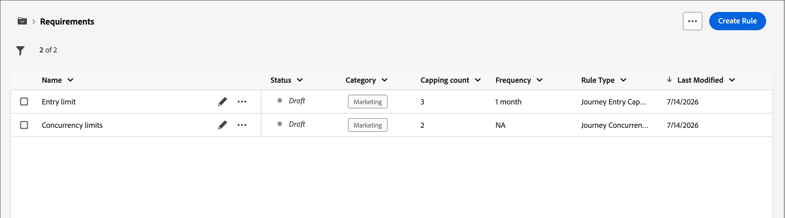
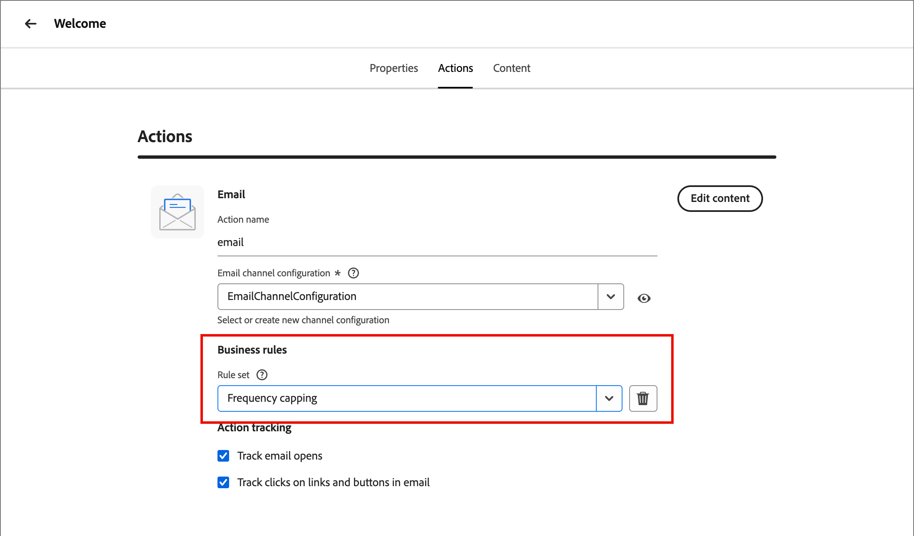

# Reglas empresariales {#business-rules}

>[!CONTEXTUALHELP]
>id="ajo-b2b-prime_business_rules_rule_sets"
>title="Conjuntos de reglas"
>abstract="Utilice conjuntos de reglas para aplicar reglas de límite de frecuencia o de horas de inactividad a diferentes tipos de comunicaciones de marketing. También puede aplicar un conjunto de reglas para excluir este recorrido para parte del público, en función de las reglas de restricción de frecuencia."

Las reglas empresariales permiten a su organización definir y agrupar varias reglas en conjuntos de reglas para que los especialistas en marketing puedan aplicarlas a sus correos electrónicos según sea necesario. Esto proporciona una granularidad mejorada para limitar la frecuencia y la cantidad de recorridos que un cliente puede introducir en un lapso de tiempo determinado o controlar la frecuencia con la que los usuarios reciben mensajes según el tipo de comunicación.

Puede crear dos tipos de conjuntos de reglas:

* Los conjuntos de reglas del **canal** aplican reglas a los canales de comunicación. Permiten establecer lo siguiente:

   * **Reglas de límite de frecuencia** - Ejemplo: *No envíe más de una comunicación por correo electrónico, SMS, push, correo directo o WhatsApp al día.*
   * **Reglas de horas tranquilas** - Ejemplo: *No envíe mensajes de correo electrónico fuera de la franja horaria de 8 a. m. a 9 p. m.*.

* Los conjuntos de reglas **Recorrido** aplican reglas de límite de entrada y concurrencia a un recorrido. (Aún no es compatible con la versión de Beta).

>[!PREREQUISITES]
>
>Para trabajar con reglas empresariales, necesita los siguientes permisos de CX Enterprise:
>
>* **[!UICONTROL Ver reglas de frecuencia]**: Acceda y vea reglas de negocio.
>* **[!UICONTROL Administrar reglas de frecuencia]**: cree, edite o elimine reglas de negocio.

## Acceso y administración de conjuntos de reglas {#access-manage}

Para acceder a todos los conjuntos de reglas existentes, expanda **[!UICONTROL Administración]** en el panel de navegación izquierdo y seleccione **[!UICONTROL Reglas de negocio]**.

{width="800" zoomable="yes"}

### Conjuntos de reglas globales y personalizadas {#global-custom}

Al obtener acceso a _Conjuntos de reglas_ por primera vez, se crea previamente y se activa un conjunto de reglas predeterminado: **_[!UICONTROL CONJUNTO DE REGLAS GLOBALES]_**. Este es un conjunto de reglas globales que puede aplicar para controlar la frecuencia con la que los usuarios reciben mensajes a través de uno o varios canales. Las reglas definidas en este conjunto de reglas se aplican a todos los canales seleccionados.

{width="700" zoomable="yes"}

Además de este conjunto de reglas predeterminado, puede crear sus propios conjuntos de reglas personalizadas y aplicarlos a un nodo de recorrido o canal para utilizar reglas de límite y horas de inactividad específicas.

### Apertura de un conjunto de reglas {#open-rule-set}

Haga clic en el nombre de un conjunto de reglas para ver y editar sus definiciones de reglas. Se muestran todas las reglas incluidas en ese conjunto de reglas. Use el _menú Más_ ( **...** ) de la parte superior derecha para activarlo, desactivarlo o eliminarlo.

{width="700" zoomable="yes"}

### Editar las reglas {#edit-rules}

Para cualquier borrador de regla del conjunto de reglas, haga clic en el icono _Editar_ (  ) junto al nombre de la regla para editar su configuración. También puede hacer clic en el icono _Menú más_ ( **...** ) para activar o eliminar la regla.

{width="500" zoomable="yes"}

Para desactivar una regla, haz clic en el icono _Desactivar_ (  ) que está junto a la regla activa. En el cuadro de diálogo de confirmación, haga clic en **[!UICONTROL Desactivar]**. El estado cambia a **_[!UICONTROL Inactivo]_** y la regla no se aplica a futuras ejecuciones de mensajes. Los mensajes que se están ejecutando actualmente no se ven afectados.

>[!NOTE]
>
>La desactivación de una regla o un conjunto de reglas no afecta ni restablece ningún recuento de perfiles individuales.

## Creación y activación de conjuntos de reglas personalizadas {#create}

>[!CONTEXTUALHELP]
>id="ajo-b2b-prime_rule_set_domain"
>title="Dominio del conjunto de reglas"
>abstract="Al crear un conjunto de reglas, debe especificar si las reglas dentro del conjunto de reglas aplicarán reglas de límite específicas a los canales de comunicación o a los recorridos."

>[!CONTEXTUALHELP]
>id="ajo-b2b-prime_rule_sets_category"
>title="Seleccione la categoría de regla de mensaje"
>abstract="Cuando está activada y se aplica a un mensaje, todas las reglas de frecuencia que coincidan con la categoría seleccionada se aplican automáticamente a este mensaje. Actualmente, solo está disponible la categoría Marketing."

>[!CONTEXTUALHELP]
>id="ajob2b-prime_rule_type"
>title="Tipo de regla"
>abstract="Seleccione el tipo de regla deseado para el conjunto de reglas de canal: use el tipo **Límite de frecuencia** para aplicar reglas de límite a los canales de comunicación. Por ejemplo, no envíe más de una comunicación por correo electrónico o SMS al día. Seleccione **Horas tranquilas** para definir las exclusiones basadas en el tiempo a fin de asegurarse de que no se envíen mensajes durante períodos de tiempo específicos."

>[!CONTEXTUALHELP]
>id="ajo-b2b-prime_rule_sets_duration"
>title="Restablecer frecuencia de límite"
>abstract="Seleccione el periodo del calendario utilizado para restablecer el contador de límite: cada hora, cada día, semanalmente o mensualmente. El contador se restablece automáticamente a 0 al comienzo de cada nuevo período."

>[!CONTEXTUALHELP]
>id="ajo-b2b-prime_rule_set_rule_capping"
>title="Límite de reglas"
>abstract="Establezca la restricción de la regla. En función del dominio del conjunto de reglas y de la selección del campo Tipo de regla, este campo puede definir el número máximo de mensajes que se pueden enviar a un perfil o el número máximo de recorridos que el perfil puede introducir o en los que puede estar inscrito simultáneamente."

>[!CONTEXTUALHELP]
>id="ajo-b2b-prime_journey_business_rules"
>title="Conjunto de reglas"
>abstract="Seleccione el conjunto de reglas que se aplicará a la acción personalizada."

>[!NOTE]
>
>Puede crear hasta 10 conjuntos de reglas para el dominio de canal y 10 conjuntos de reglas para el dominio de recorrido, con un total de 20 conjuntos de reglas.

1. Expanda **[!UICONTROL Administración]** en el panel de navegación izquierdo y seleccione **[!UICONTROL Reglas de negocio]**.

1. En la página de lista _[!UICONTROL Conjuntos de reglas]_, haga clic en **[!UICONTROL Crear conjunto de reglas]** en la parte superior derecha.

   {width="400"}

1. Escriba un **[!UICONTROL Nombre]** único (obligatorio) para el conjunto de reglas y agregue una **[!UICONTROL Descripción]** (opcional).

1. Seleccione el conjunto de reglas **[!UICONTROL Dominio]**.

   * **[!UICONTROL Canal]**: aplique reglas de límite o reglas de horas silenciosas a los canales de comunicación.
   * **[!UICONTROL Recorrido]**: aplique reglas de límite de entrada y concurrencia a un recorrido.

   >[!IMPORTANT]
   >
   >Las reglas de recorrido aún no son compatibles con esta versión de Beta.

1. Haga clic en **[!UICONTROL Guardar]**.

   {width="700" zoomable="yes"}

### Añadir las reglas {#add-rules}

Después de crear el conjunto de reglas, agregue cada regla que desee incluir.

1. Haga clic en **[!UICONTROL Agregar regla]**.

1. Configure los parámetros de la regla según su propósito.

   Los parámetros disponibles para la regla dependen del dominio del conjunto de reglas seleccionado en su creación.

   {width="700" zoomable="yes"}

   Encontrará información detallada sobre la configuración de reglas de recorrido y canal en estas secciones:

   <!-- * [Journey capping](../conflict-prioritization/journey-capping.md) -->
   * [Restricción de frecuencia por canal y tipo de comunicación](#frequency-capping)
   * [Horario silencioso](#quiet-hours)

1. Haga clic en **[!UICONTROL Crear regla]** para confirmar la creación de la regla.

   La nueva regla aparece en el conjunto de reglas con el estado _Borrador_.

1. Repita los pasos anteriores para agregar tantas reglas como sea necesario para el conjunto de reglas.

   Cuando se crea, una regla tiene el estado _[!UICONTROL Borrador]_ y aún no puede afectar a ningún mensaje.

   {width="700" zoomable="yes"}

1. Para activar una regla para el conjunto de reglas, haga clic en el icono _Más menú_ ( **...** ) junto al nombre de la regla y elija **[!UICONTROL Activar]**.

   En el cuadro de diálogo de confirmación, haga clic en **[!UICONTROL Activar]**.

### Activación del conjunto de reglas {#activate-rule-set}

Al activar el conjunto de reglas, estará disponible para aplicarse a un mensaje de recorrido o canal. Cuando un conjunto de reglas está activo, no se le pueden agregar más reglas. Puede desactivarlo para realizar cambios y, a continuación, activarlo de nuevo.

1. Abra el conjunto de reglas desde la página de lista _Conjuntos de reglas_.

1. Haga clic en el _menú Más_ ( **...** ) en la parte superior derecha y elija **[!UICONTROL Activar conjunto de reglas]**.

   {width="700" zoomable="yes"}

1. En el cuadro de diálogo de confirmación, haga clic en **[!UICONTROL Activar]**.

   >[!NOTE]
   >
   >Una regla o un conjunto de reglas puede tardar hasta 10 minutos en activarse completamente. No es necesario modificar los mensajes ni volver a publicar los recorridos para que una regla surta efecto.

Puede aplicar el conjunto de reglas activo a un mensaje o a un recorrido, según la configuración de dominio del conjunto de reglas.

## Límite de frecuencia por canal {#frequency-capping}

Establezca límites de frecuencia por canal y tipo de comunicación para limitar la cantidad de mensajes que recibe un perfil y evitar saturar a los clientes con comunicaciones similares. Los conjuntos de reglas de canal aplican reglas de límite a los canales de comunicación. Por ejemplo, no envíe más de una comunicación por correo electrónico o SMS al día.

El uso de conjuntos de reglas de canal le permite establecer límites de frecuencia por tipo de comunicación para evitar sobrecargar a los clientes con mensajes similares. Por ejemplo, puede crear un conjunto de reglas para limitar el número de _comunicaciones promocionales_ enviadas a sus clientes y otro conjunto de reglas para limitar el número de _boletines_ enviados a ellos. Puede optar por aplicar la comunicación promocional o el conjunto de reglas de los boletines informativos.

>[!IMPORTANT]
>
>Para garantizar que el límite de nivel de canal funciona correctamente, asegúrese de elegir el área de nombres de mayor prioridad al crear un recorrido. Obtenga más información sobre la prioridad del espacio de nombres en la [Guía del servicio de identidad de Platform](https://experienceleague.adobe.com/es/docs/experience-platform/identity/features/identity-graph-linking-rules/namespace-priority){target="_blank"}

### Crear una regla de límite de recorrido {#create-capping-rule}

>[!CONTEXTUALHELP]
>id="ajo-b2b-prime_rule_sets_channel"
>title="Defina los canales a los que se aplica la regla"
>abstract="Seleccione al menos un canal. El límite se aplica a todos los canales como un recuento total."

1. Seleccione el conjunto de reglas de canal en el que desea agregar la regla de límite o cree un nuevo conjunto de reglas de canal.

1. En la página del conjunto de reglas, haga clic en **[!UICONTROL Agregar regla]** e introduzca un nombre único para la regla.

   >[!NOTE]
   >
   > El campo _[!UICONTROL Categoría]_ especifica la categoría de mensajería para la regla. Actualmente, este campo es de solo lectura y solo está disponible la categoría **[!UICONTROL Marketing]**.

1. Para el _[!UICONTROL Tipo de regla]_, elija **[!UICONTROL Límite de canal]**.

   {width="700" zoomable="yes"}

1. En el campo **[!UICONTROL Cantidad de límite]**, establezca el valor de límite para la regla.

   Este valor es el número máximo de mensajes que se pueden enviar a un perfil de usuario individual cada mes, semana, día u hora, según la selección que haya hecho en los demás campos.

1. Para **[!UICONTROL Restablecer la frecuencia de límite]**, seleccione si desea que se aplique el límite.

   El límite de frecuencia se basa en el periodo de calendario seleccionado. Se restablece al principio del lapso de tiempo correspondiente. Elija la caducidad del contador para cada período:

   * **[!UICONTROL Por hora]**: el límite de frecuencia es válido para el número seleccionado de horas. El contador se restablece automáticamente al principio de cada intervalo de tiempo. Para un límite de frecuencia de 1 hora, se restablece cada hora, coincidiendo con el final de una hora UTC.
   * **[!UICONTROL Diario]**: el límite de frecuencia diario es válido para el día hasta el 23:59:59 UTC y se restablece en 0 al comienzo del día siguiente.
   * **[!UICONTROL Semanal]**: el límite de frecuencia es válido hasta el sábado 23:59:59 UTC de esa semana. La fecha de caducidad se aplica independientemente del momento en que se creó la regla. Por ejemplo, si la regla se crea el jueves, es válida hasta el sábado a las 23:59:59.
   * **[!UICONTROL Mensual]**: el límite de frecuencia es válido hasta el último día del mes a las 23:59:59 UTC. Por ejemplo, la caducidad mensual para enero es del 01 al 31 23:59:59 UTC.

   >[!IMPORTANT]
   >
   >* Para garantizar la precisión, asegúrese de elegir el área de nombres de mayor prioridad al crear un recorrido. Obtenga más información sobre la prioridad del espacio de nombres en la [Guía del servicio de identidad de Platform](https://experienceleague.adobe.com/es/docs/experience-platform/identity/features/identity-graph-linking-rules/namespace-priority){target="_blank"} 
   >
   >* El valor del contador de perfiles se actualiza cuando se envía la comunicación. Tenga esto en cuenta esto cuando envíe grandes volúmenes de comunicaciones, ya que el rendimiento podría provocar que el destinatario reciba el correo electrónico minutos o incluso horas después del inicio de la comunicación (en el caso de que envíe millones de comunicaciones simultáneamente). Esto es importante en el caso de que un destinatario reciba dos comunicaciones muy juntas. Se recomienda espaciar las comunicaciones entre sí durante al menos dos horas, siempre que sea posible, para que el destinatario reciba la comunicación y el valor del contador se actualice en consecuencia.

1. Utilice el campo **[!UICONTROL Cada]** para establecer la frecuencia de la regla de límite en varias horas, días, semanas o meses (dependiendo del lapso de tiempo especificado).

   Asegúrese de escribir un valor que coincida con el tipo de duración seleccionado: 1-23 para _Por hora_, 1-30 para _Diario_, 1-4 para _Semanal_ y 1-3 para _Mensual_.

   El contador se restablece automáticamente a 0 cuando comienza una nueva ventana de tiempo. Para un límite de frecuencia de dos días, este restablecimiento se produce cada dos días a medianoche UTC.

1. Seleccione los canales que desee utilizar para esta regla:

   * **[!UICONTROL Correo electrónico]**
   * **[!UICONTROL SMS]** (actualmente no compatible con esta versión de Beta)
   * **[!UICONTROL Notificación push]** (actualmente no compatible con esta versión de Beta)
   * **[!UICONTROL Correo postal]** (actualmente no se admite en esta versión de Beta)
   * **[!UICONTROL WhatsApp]** (no compatible actualmente con esta versión de Beta)

   {width="700" zoomable="yes"}

   Seleccione varios canales si desea aplicar un límite a todos los canales seleccionados como recuento total.

   Por ejemplo, establezca el límite en 5 y seleccione los canales Correo electrónico y SMS. Si un perfil ya ha recibido tres correos electrónicos de marketing y dos mensajes SMS de marketing para el periodo seleccionado, este perfil se excluye de la siguiente entrega de cualquier correo electrónico o mensaje SMS de marketing.

1. Haga clic en **[!UICONTROL Guardar]** para confirmar la creación de la regla.

   La regla de frecuencia se agrega al conjunto de reglas con el estado _[!UICONTROL Borrador]_.

1. Repita los pasos anteriores para agregar tantas reglas como sea necesario al conjunto de reglas.

1. Cuando la regla de límite esté lista para aplicarse a los mensajes, active la regla y el conjunto de reglas.

### Aplicar el conjunto de reglas de límite de canal {#apply-capping-rule}

1. Al crear un recorrido, agregue uno de los [nodos de acción](../marketing/action-nodes.md) de envío para el canal que seleccionó para la regla y edite el contenido del mensaje.

1. En la ficha _[!UICONTROL Acciones]_, establezca la opción **[!UICONTROL Reglas de negocio]** en el conjunto de reglas con la regla de límite de frecuencia.

   {width="600" zoomable="yes"}

   >[!NOTE]
   >
   >En la lista solo están disponibles los conjuntos de reglas activados.

   <!--Messages where the category selected is **[!UICONTROL Transactional]** will not be evaluated against business rules.-->

1. Antes de activar el recorrido, asegúrese de programarlo al menos 10 minutos en el futuro.

   Proporciona el tiempo necesario para rellenar los valores de contador en el perfil para la regla de negocio seleccionada. Si activa el recorrido inmediatamente, los valores del contador del conjunto de reglas no se podrán rellenar en los perfiles de los destinatarios y el mensaje no se contará en sus reglas de límite de frecuencia para los conjuntos de reglas personalizadas.

<!-- 
1. You can view the number of profiles excluded from delivery in the [Customer Journey Analytics report](../reports/report-gs-cja.md), and in the [Live report](../reports/live-report.md), where frequency rules will be listed as a possible reason for users excluded from delivery.

-->

>[!NOTE]
>
>Se pueden aplicar varias reglas al mismo canal, pero una vez alcanzado el límite inferior, el perfil se excluye de los siguientes envíos.

Al probar las reglas de frecuencia, se recomienda utilizar un perfil de prueba recién creado, ya que cuando se alcanza el límite de frecuencia de un perfil, no hay forma de restablecer el contador hasta el siguiente periodo. La desactivación de una regla permite que los perfiles restringidos reciban mensajes, pero no elimina ni elimina ningún incremento de contador.

## Establecer horas de inactividad {#quiet-hours}

**_Horas tranquilas_** le permiten definir exclusiones basadas en el tiempo para los canales de correo electrónico, SMS, Push y WhatsApp. Garantizan que no se envíen mensajes durante períodos de tiempo específicos, lo que le ayuda a respetar las preferencias de los clientes y los requisitos de cumplimiento.

>[!NOTE]
>
>En la versión actual de Beta, solo se admiten canales de correo electrónico y WhatsApp en recorrido.

Puede aplicar horas tranquilas a través de conjuntos de reglas y asignarlas a acciones de canal individuales en recorridos para un control preciso. Al racionalizar estos estándares, puede mejorar la experiencia del cliente, ahorrar tiempo y garantizar el cumplimiento de las reglas de comunicación:

* **No despierte a su cliente** - *El cliente correcto, el canal correcto, el momento adecuado* es el mantra de muchos especialistas en marketing, por lo que tiene sentido que el tiempo sea una parte crítica del recorrido del cliente. Al establecer la regla Horas de silencio, las marcas tienen un mejor control sobre cuándo los contactos reciben mensajes, lo que garantiza que los reciban cuando es más probable que realicen acciones en su mensaje.
* **Comodidad**: intercepte fácilmente las comunicaciones entre campañas y recorridos cuando necesite evitar que una audiencia reciba un mensaje sin necesidad de detener toda la campaña o el recorrido.
* **Ahorro de tiempo**: administre exclusiones en un solo lugar creando una **regla basada en el tiempo**, en lugar de agregar varios nodos de condición con expresiones personalizadas.\
  <!--* **Extra Safeguard** - Benefit from an extra safeguard in case audience criteria or time-window configurations were incorrectly set, ensuring individuals are still excluded when they should be.-->

>[!BEGINSHADEBOX]

**Protecciones y limitaciones**

* **Retraso de propagación**: las actualizaciones de una regla de horas silenciosas pueden tardar hasta 12 horas en aplicarse a las acciones de canal que ya utilizan esa regla.
* **Latencia de gran volumen**: en casos de comunicaciones de gran volumen, el sistema puede tardar más tiempo en aplicar correctamente las supresiones de horas silenciosas.

>[!ENDSHADEBOX]

<!--* **Custom actions** – For custom actions, only quiet hours rules are enforced. If a rule set also includes other rules (e.g., frequency capping), those rules are ignored.-->
<!--* **Pre-suppression window** – The system begins suppressing communications 30 minutes before quiet hours start, ensuring that no messages are delivered once the quiet period begins.-->

### Crear reglas de horas tranquilas {#create-quiet-hour-rules}

>[!NOTE]
>
>Las horas tranquilas solo se pueden definir en **_conjuntos de reglas personalizadas_**. El conjunto de reglas globales no admite la configuración de horas silenciosas.

1. Seleccione el conjunto de reglas de canal en el que desea agregar la regla o cree uno nuevo.

1. En la página del conjunto de reglas, haga clic en **[!UICONTROL Agregar regla]** e introduzca un nombre único para la regla.

   >[!NOTE]
   >
   > El campo _[!UICONTROL Categoría]_ especifica la categoría de mensajería para la regla. Actualmente, este campo es de solo lectura y solo está disponible la categoría **[!UICONTROL Marketing]**.

1. Para el _[!UICONTROL tipo de regla]_, seleccione **[!UICONTROL Horas tranquilas]**.

   {width="700" zoomable="yes"}

1. En la sección **[!UICONTROL Fechas y horas]**, defina cuándo aplicar horas tranquilas:

   * Para **[!UICONTROL Zona horaria]**, elija una zona horaria estándar para todos los destinatarios de la audiencia, independientemente de sus zonas horarias individuales.

     Para usar el campo de zona horaria de cada perfil, seleccione **[!UICONTROL Usar zona horaria local de los destinatarios]**.

     >[!IMPORTANT]
     >
     >Si un perfil no tiene ningún valor de zona horaria, no se aplican horas tranquilas a ese perfil.

   * Haga clic en el icono _Calendario_ y especifique el período de tiempo en el que se deben aplicar las horas tranquilas.

      * **[!UICONTROL Semanal]**: elige días específicos de la semana y una franja de tiempo. También puede aplicar la regla **[!UICONTROL Todo el día]**.

      * **[!UICONTROL Fecha personalizada]**: elige fechas específicas en el calendario y una franja de tiempo. También puede aplicar la regla **[!UICONTROL Todo el día]**.

     {width="450"}

   * Haga clic en el botón **[!UICONTROL Agregar más fechas]** para agregar hasta cinco períodos separados.

1. En la sección **[!UICONTROL Administrar acciones durante las horas de inactividad]**, elija cómo se tratan los mensajes durante el período de tiempo seleccionado:

   

   * **[!UICONTROL Mensaje en cola]**: los mensajes se envían al finalizar el período de horas de inactividad a menos que estén en estado Paused.

     >[!NOTE]
     >
     >Si un mensaje permanece en cola para un perfil durante más de 7 días, el mensaje se descarta.

   * **[!UICONTROL Descartar mensaje]**: los mensajes nunca se envían.

     >[!NOTE]
     >
     >Si selecciona **[!UICONTROL Descartar]** y aplica esta regla a una acción de recorrido, el perfil se eliminará de la entrega de mensajes y saldrá de la recorrido.

1. Haga clic en **[!UICONTROL Guardar]** para confirmar la creación de la regla.

   La regla de horas tranquilas se agrega al conjunto de reglas con el estado _[!UICONTROL Borrador]_.

1. Repita los pasos anteriores para agregar tantas reglas como sea necesario al conjunto de reglas.

1. Cuando la regla esté lista para aplicarse a los mensajes, active la regla y el conjunto de reglas.

### Aplicar horas de silencio a una acción de recorrido {#apply-quiet-hours}

Una vez guardada la regla y activado el conjunto de reglas, puede aplicarla a las acciones de canal en recorrido.

1. Al crear un recorrido, agregue uno de los [nodos de acción](../marketing/action-nodes.md) de envío para el canal que seleccionó para la regla y edite el contenido del mensaje.

1. En la ficha _[!UICONTROL Acciones]_, establezca la opción **[!UICONTROL Reglas de negocio]** en el conjunto de reglas con la regla de horas silenciosas.

   {width="600" zoomable="yes"}

   >[!NOTE]
   >
   >En la lista solo están disponibles los conjuntos de reglas activados.

1. Complete y publique el recorrido cuando esté listo.
