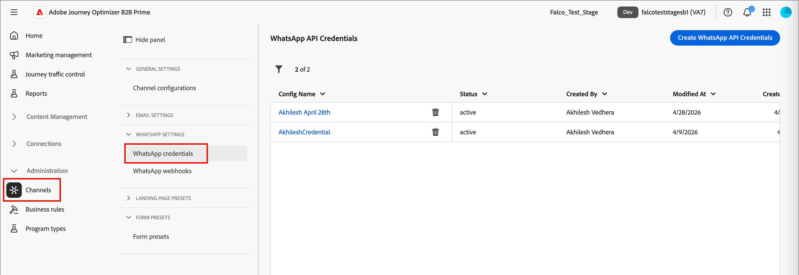
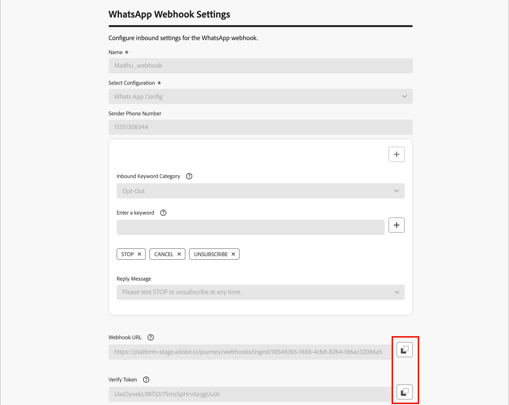
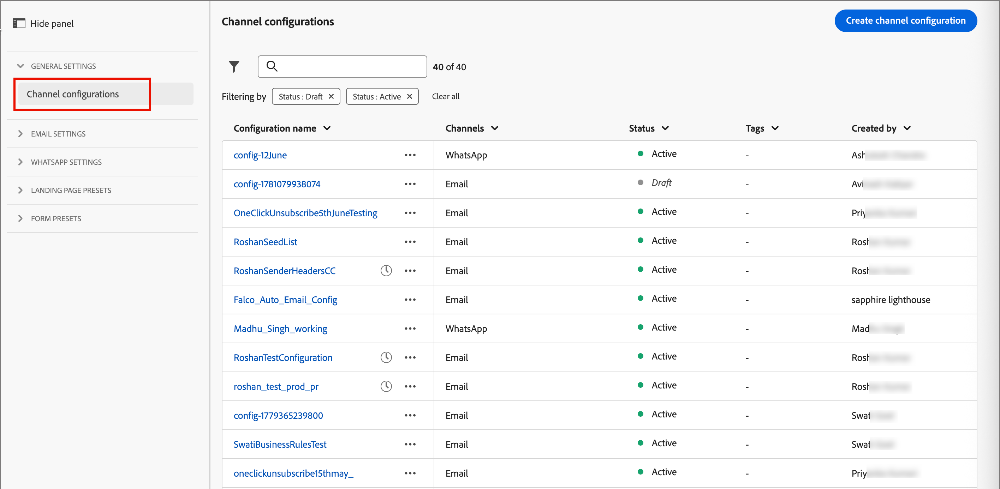

# Configuración del canal de WhatsApp

Journey Optimizer B2B Prime envía mensajes de WhatsApp a través de la API de nube de Meta. Para que los especialistas en marketing puedan crear mensajes de WhatsApp para los recorridos de persona, un administrador de productos debe configurar un canal de WhatsApp.

## Requisitos previos {#prerequisites}

Antes de configurar el canal de WhatsApp, asegúrese de que dispone de lo siguiente:

* [Una cuenta de Meta Business Manager](https://business.facebook.com/)
* [Una cuenta comercial de WhatsApp con un nombre de remitente y un número de teléfono verificados](https://developers.facebook.com/docs/whatsapp/overview/business-accounts/)
* [Un token de autorización de usuario de Meta con los permisos adecuados](https://developers.facebook.com/blog/post/2022/12/05/auth-tokens/)
* [Plantillas de mensajes aprobadas en su cuenta comercial de WhatsApp](https://developers.facebook.com/docs/whatsapp/message-templates/guidelines/)

>[!IMPORTANT]
>
>El uso de los servicios de mensajería de WhatsApp está sujeto a los términos y condiciones de Meta. Al acceder a la mensajería de WhatsApp a través de Journey Optimizer B2B Prime, reconoce que ha revisado y acepta cumplir con [las políticas comerciales de Meta WhatsApp](https://www.whatsapp.com/legal/business-policy/).

## Limitaciones {#limitations}

Las siguientes limitaciones se aplican al canal de WhatsApp:

* Adobe Journey Optimizer B2B Prime **no es compatible con HIPAA y no está preparado para HIPAA**. Además, los proveedores de terceros no están cubiertos por la BAA de Adobe. Los clientes son responsables de su propia conformidad y validación del proveedor.

* Todavía no se admiten mensajes de respuesta automatizados o predefinidos.

* A partir de abril de 2025, Meta suspendió temporalmente la entrega de todos los mensajes de plantilla de marketing a los usuarios de WhatsApp que tengan un número de teléfono de Estados Unidos (un número compuesto por un código de marcado +1 y un código de área de Estados Unidos). [Obtenga más información en la documentación de Meta](https://developers.facebook.com/documentation/business-messaging/whatsapp/templates/marketing-templates/per-user-limits/)

* La funcionalidad de integración nativa no permite la integración con proveedores de servicios empresariales (BSP) de terceros.

## Completar la configuración del canal {#complete-channel-configuration}

Antes de enviar tu mensaje de WhatsApp, debes configurar tu entorno de Journey Optimizer B2B Prime y conectarlo con tu cuenta de WhatsApp.

Complete las siguientes tareas:

1. [Cree las credenciales de la API de WhatsApp](#create-whatsapp-api-credentials)
1. [Añadir los webhooks de WhatsApp](#configure-webhooks)
1. [Crear la configuración del canal de WhatsApp](#create-channel-configuration)

### Crear credenciales de API de WhatsApp {#create-whatsapp-api-credentials}

>[!NOTE]
>
>Las configuraciones descritas solo son accesibles para los usuarios con privilegios de administrador.

1. En el panel de navegación izquierdo, expanda la sección **[!UICONTROL Administración]** y haga clic en **[!UICONTROL Canales]**.

1. En el panel, expande **[!UICONTROL Configuración de WhatsApp]** y selecciona **[!UICONTROL Credenciales de API]**.

   {width="800" zoomable="yes"}

1. Haga clic en **[!UICONTROL Crear nuevas credenciales de API]** en la parte superior derecha.

1. Configure las credenciales de la API como se detalla a continuación:

   * **[!UICONTROL Nombre]** - Escriba un nombre único para las credenciales
   * **[!UICONTROL Token de API]**: introduzca su token de API. Para obtener más información, consulte la [Documentación de Meta](https://developers.facebook.com/blog/post/2022/12/05/auth-tokens/).
   * **[!UICONTROL Id. de cuenta empresarial]** - Escriba el número único relacionado con su portafolio empresarial. Para obtener más información, consulte la [Documentación de Meta](https://www.facebook.com/business/help/1181250022022158?id=180505742745347).

   {width="500" zoomable="yes"}

1. Haga clic en **[!UICONTROL Continuar]**.

1. Elige la **[!UICONTROL cuenta comercial de WhatsApp]** a la que deseas conectarte con tus credenciales de la API de WhatsApp.

   {width="500" zoomable="yes"}

1. Seleccione el **[!UICONTROL nombre del remitente]** que se usará para enviar mensajes de WhatsApp.

   La configuración del número de teléfono se rellena automáticamente:

   * **Clasificación de calidad**: refleja los comentarios de los clientes sobre los mensajes enviados en las últimas 24 horas.
      * Verde: alta calidad
      * Amarillo: calidad Medium
      * Rojo: baja calidad

     Para obtener más información, consulte [_Clasificación de calidad_](https://www.facebook.com/business/help/766346674749731#) en la documentación de Meta.

   * **Rendimiento** - indica la velocidad a la que su número de teléfono puede enviar mensajes.

1. Haga clic en **[!UICONTROL Enviar]** cuando termine de configurar las credenciales de la API.

Al hacer clic en _[!UICONTROL Enviar]_, las credenciales se validan y guardan inmediatamente, lo que le redirige a la página del listado de _[!UICONTROL credenciales de la API]_.

Si las credenciales enviadas no son válidas, el sistema muestra un mensaje de error HTTP 500. En este caso, puede optar por cancelar la configuración o actualizarla y enviarla de nuevo.

+++Solución de errores HTTP 500

Si se produce un error HTTP 500 al configurar las credenciales de la API de WhatsApp, siga estos pasos para solucionar problemas:

1. Compruebe sus derechos de Adobe: confirme que su organización tiene aprovisionados los derechos de _cjm_ whatsapp_. Sin este derecho, el canal de WhatsApp no se puede configurar.

1. Validar los campos de cuenta empresarial: asegúrese de que todos los campos obligatorios sean correctos:

   * Token de API: debe ser un [token de acceso de Meta válido con los permisos apropiados](https://developers.facebook.com/blog/post/2022/12/05/auth-tokens/).
   * ID de cuenta empresarial: debe coincidir exactamente con su [ID de cuenta empresarial de Meta](https://www.facebook.com/business/help/1181250022022158?id=180505742745347).

1. Probar las credenciales externamente: compruebe sus credenciales directamente con la API de Meta para confirmar si el problema es con las credenciales o con la gestión de credenciales de Journey Optimizer B2B Prime.

1. Póngase en contacto con Adobe: si el entorno y los derechos se confirman como válidos, pero el error HTTP 500 persiste, póngase en contacto con el representante de Adobe.

+++

### Añadir los webhooks de WhatsApp {#configure-webhooks}

>[!CONTEXTUALHELP]
>id="ajo-b2b-prime_admin-whatsapp-webhook-inbound-keyword-category"
>title="Categoría de palabra clave entrante"
>abstract="<b>Inclusión</b>: envía la respuesta automática definida cuando un usuario se suscribe.  <b>Exclusión</b>: envía la respuesta automática definida cuando un usuario cancela la suscripción.  <b>Ayuda</b>: envía la respuesta automática definida cuando un usuario solicita ayuda o soporte técnico.  <b>Predeterminado</b>: envía su respuesta automática de reserva cuando no coinciden las palabras clave."

>[!CONTEXTUALHELP]
>id="ajo-b2b-prime_admin_whatsapp-webhook-inbound-keyword"
>title="Introduzca sus palabras clave"
>abstract="Puede definir palabras clave para activar respuestas automáticas específicas en función del texto que escriban los usuarios. Las palabras clave no distinguen entre mayúsculas y minúsculas (stop y STOP se tratan igual)."

>[!CONTEXTUALHELP]
>id="ajo-b2b-prime_admin-whatsapp-webhook-webhook-url"
>title="URL de devolución de llamada"
>abstract="La solicitud de validación y las notificaciones del webhook para este objeto se envían a la dirección URL especificada."

>[!CONTEXTUALHELP]
>id="ajo-b2b-prime_admin-whatsapp-webhook-verify-token"
>title="Verificar token"
>abstract="El token que Meta devuelve para confirmar y verificar la URL de devolución de llamada durante el proceso de verificación."

Los webhooks permiten que Journey Optimizer B2B Prime reciba mensajes entrantes, respuestas de consentimiento y notificaciones de envío desde tu cuenta de WhatsApp Business. Configure los enlaces web para garantizar la administración de consentimiento y el seguimiento de mensajes adecuados.

>[!NOTE]
>
>Sin las palabras clave de inclusión u exclusión especificadas, no se habilitan los mensajes de consentimiento estándar.

Cuando las credenciales de la API de WhatsApp se crean correctamente, puede configurar los webhooks.

1. En el panel de navegación, seleccione **[!UICONTROL Webhooks de WhatsApp]**.

1. Haga clic en **[!UICONTROL Crear webhook]**.

1. Escriba un **[!UICONTROL Nombre]** para la configuración del gancho web.

1. Para **[!UICONTROL Configuración]**, seleccione las credenciales de la API (creadas en la tarea anterior) que se asociarán al webhook.

1. Para la **[!UICONTROL categoría de palabras clave entrantes]**, elija una categoría para definir palabras clave y el mensaje de respuesta:

   * **[!UICONTROL Inclusión]**: los usuarios deben aceptar activamente recibir mensajes de WhatsApp, que a menudo se administran mediante formularios en su sitio web o aplicación.
   * **[!UICONTROL Exclusión]** - Configure su webhook para que escuche frases como `Stop` o `No Message` para marcar automáticamente a los usuarios como excluidos.
   * **[!UICONTROL Ayuda]**: permite que los sistemas automatizados detecten cuándo un usuario envía `HELP` (o palabras clave similares como `Unknown`) y respondan automáticamente con información específica, como instrucciones de servicio.
   * **[!UICONTROL Predeterminado]**: administra mensajes entrantes que no coinciden con palabras clave definidas específicamente. Sirve como categoría de reserva para habilitar el seguimiento de eventos (como aperturas e informes de envío) en conjuntos de datos de Adobe Experience Platform.

   Al seleccionar la categoría de palabra clave, se rellenan las palabras clave predeterminadas.

1. Para **[!UICONTROL Escriba una palabra clave]**, puede escribir una palabra clave personalizada y hacer clic en _Agregar_ ( **+** ).

   Puede agregar varias palabras clave por categoría.

   >[!NOTE]
   >
   >Las palabras clave no distinguen entre mayúsculas y minúsculas (`stop` y `STOP` se tratan igual).

1. Escriba el **[!UICONTROL mensaje de respuesta]** que se enviará automáticamente cuando un mensaje recibido coincida con una palabra clave de esta categoría.

   {width="500" zoomable="yes"}

1. Para cada categoría de palabra clave adicional que desee configurar, haga clic en _Agregar_ (**+**) en la esquina superior derecha y repita los pasos 5-7.

1. Haga clic en **[!UICONTROL Enviar]** para guardar la configuración del gancho web.

### Copie el token y la URL {#copy-token-and-url}

Una vez enviado el webhook, puede recuperar los valores de token y URL y, a continuación, registrarlo en Meta.

1. En la lista **[!UICONTROL Webhooks de WhatsApp]**, haz clic en el nombre del webhook que has creado.

1. Copie los valores de **[!UICONTROL Verificar token]** y **[!UICONTROL URL de enlace web]**.

   {width="500" zoomable="yes"}

1. En el [portal de Meta para desarrolladores](https://developers.facebook.com/), vaya a la configuración de la aplicación WhatsApp y configure el webhook con los valores que ha copiado.

### Crear configuración de canal {#create-channel-configuration}

Una configuración de canal define la configuración de envío utilizada al enviar mensajes de WhatsApp desde un nodo de acción de recorrido.

1. En el panel de navegación, en _[!UICONTROL Configuración general]_, seleccione **[!UICONTROL Configuraciones de canal]**.

   {width="600" zoomable="yes"}

1. Haga clic en **[!UICONTROL Crear configuración de canal]** en la parte superior derecha.

1. Escriba un **[!UICONTROL Nombre]** y una **[!UICONTROL Descripción]** (opcional) para la configuración.

   >[!NOTE]
   >
   >El nombre debe comenzar por una letra (A-Z) y solo puede contener caracteres alfanuméricos, guiones bajos (`_`), puntos (`.`) y guiones (`-`).

1. Para **[!UICONTROL Seleccionar canal]**, elija `WhatsApp`.

   Todas las políticas de consentimiento asociadas con una acción de marketing seleccionada se aprovechan automáticamente para respetar las preferencias de los clientes. Por ejemplo, cualquier mensaje de WhatsApp que utilice esa configuración en un recorrido solo se envía a los perfiles que han aceptado recibir mensajes de WhatsApp de su parte. Se excluyen los perfiles que no hayan aceptado recibir estas comunicaciones.

1. En _[!UICONTROL Configuración de WhatsApp]_, selecciona la **[!UICONTROL configuración de WhatsApp]** (credenciales de la API) que creaste en la tarea anterior.

1. Escriba el **[!UICONTROL número de teléfono del remitente]** que se usará para la entrega de mensajes.

   {width="500" zoomable="yes"}

1. (Actualmente no se aplica a Journey Optimizer B2B Prime) Para el **[!UICONTROL Campo de ejecución de WhatsApp]**, selecciona el atributo de perfil que se usará como número de teléfono prioritario cuando haya varios números de teléfono disponibles para un destinatario.

1. Haga clic en **[!UICONTROL Enviar]** para guardar o en **[!UICONTROL Guardar como borrador]** para completar y enviar la configuración más tarde.

La configuración inicialmente se muestra con un estado _Procesando_ mientras se ejecutan las comprobaciones de validación. Cuando pasen todas las comprobaciones, el estado cambiará a **_Activo_** y la configuración estará lista para seleccionarse cuando los especialistas en marketing creen mensajes de WhatsApp en acciones de recorrido.