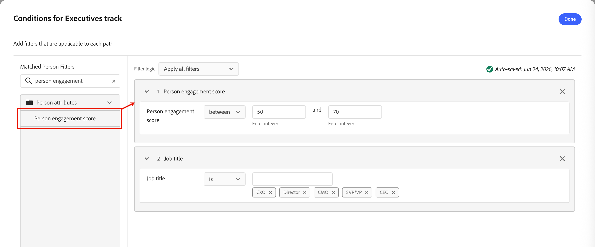
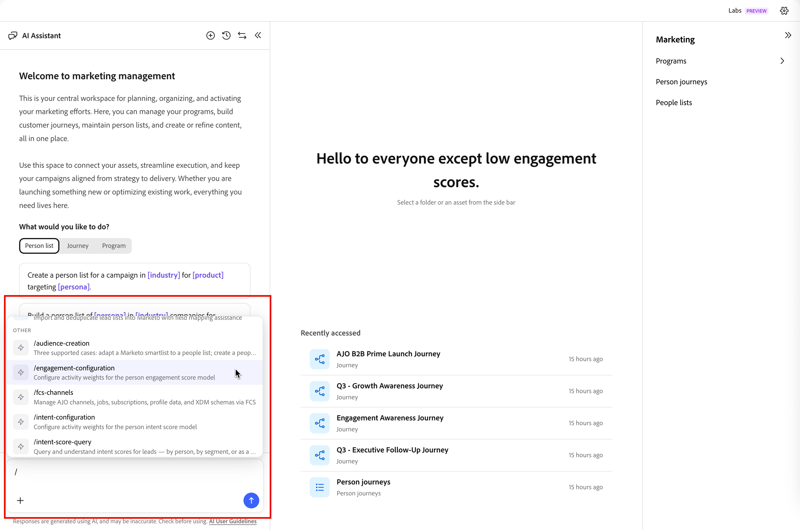

# Puntuaciones de participación de personas {#engagement-scores}

>[!CONTEXTUALHELP]
>id="ajo-b2b-prime_person_engagement_score"
>title="Puntuación de participación de persona"
>abstract="Las puntuaciones de participación de la persona reflejan el nivel de participación de los posibles clientes individuales en función de sus actividades recientes."

La puntuación de participación de una persona es un número que refleja el nivel de participación de un posible cliente individual. Las puntuaciones se basan en las actividades que realiza una persona, y cada tipo de actividad lleva un valor ponderado. Las puntuaciones se normalizan dentro de la instancia (inquilino) para permitir una comparación coherente y perspectivas procesables.

El cálculo de puntuación se ejecuta diariamente. Cualquier actividad ponderada por la participación realizada por la persona en los últimos 30 días contribuye a la puntuación. Con este periodo móvil de 30 días, las ocurrencias de actividad más antiguas caducan y las puntuaciones pueden disminuir con el tiempo (la puntuación disminuye). Las puntuaciones mostradas se redondean (por ejemplo, una puntuación de 75,89999 se muestra como 76).

Los datos de puntuación de participación están disponibles en **[!UICONTROL Informes]**.

{width="800" zoomable="yes"}

La puntuación de participación de personas es un atributo que se puede usar como [condición de filtro](#engagement-score-filter) en las listas de personas y en los nodos de ruta dividida dentro de los recorridos de persona.

## Actividades utilizadas para la puntuación de participación {#activities}

La puntuación de participación no está _basada en el déclencheur_. Es un proceso diario que evalúa la actividad de todos los posibles clientes y vuelve a calcular las puntuaciones. Las actividades usan _weights_ para informar la puntuación según el modelo de ponderación activo, que determina cuánto contribuye cada tipo de actividad a la puntuación general.

Hay un límite de frecuencia diario de 20 para cada tipo de actividad. Si una persona realiza la misma actividad más de 20 veces en un solo día, el recuento de esa actividad se limita a 20.

| Nombre de la actividad | Dirección | Descripción | Peso predeterminado |
|---|---|---|---|
| Asistir a la conferencia | Entrante | Señal de participación en persona de alta intención | 60 |
| Hacer clic en el correo electrónico | Entrante | Clic activo = participación significativa | 30 |
| Hacer clic en el email de ventas | Entrante | Clic activo en alcance de ventas | 30 |
| Haga clic en Marketo Email | Entrante | Clic activo = participación significativa | 30 |
| Comprometido con Concierge | Entrante | Participación en directo a través de la herramienta de concierge | 60 |
| Interactuado con chat en vivo en Concierge | Entrante | Chat en directo = intención de compra alta | 60 |
| Rellenar formulario de Marketo | Entrante | Relleno de formulario = intención explícita de posible cliente | 40 |
| Momento interesante | Entrante | Déclencheur de comportamiento de alto valor | 60 |
| Nuevo posible cliente | Entrante | Punto de entrada: puntuación de línea base | 30 |
| Abrir correo electrónico | Entrante | Participación pasiva; inferior a clic | 30 |
| Abrir correo electrónico de Marketo | Entrante | Participación pasiva; inferior a clic | 30 |
| Abrir correo electrónico de ventas | Entrante | Participación pasiva; inferior a clic | 30 |
| Leer mensaje de WhatsApp | Entrante | Lectura pasiva; canal de menor peso | 30 |
| Se recibió un email de Enviar a un amigo | Entrante | Señal viral leve positiva | 30 |
| Responder al correo electrónico de ventas | Entrante | Respuesta directa = fuerte señal de compra | 40 |
| Solicitar campaña | Entrante | Acción iniciada automáticamente: intención alta | 30 |
| Solicitar Marketo Campaign | Entrante | Acción iniciada automáticamente: intención alta | 30 |
| Reunión programada en Concierge | Entrante | Acción de conversión de mayor intención | 60 |

>[!NOTE]
>
>Las actividades de puntuación de participación se registran en el registro de actividades de Marketo Engage de una persona. Puede acceder a este registro en la instancia de Marketo Engage asociada. Para obtener más información, consulte [Buscar el registro de actividad de una persona](https://experienceleague.adobe.com/es/docs/marketo/using/product-docs/core-marketo-concepts/smart-lists-and-static-lists/managing-people-in-smart-lists/locate-the-activity-log-for-a-person){target="_blank"} en la documentación de Marketo Engage.

## Lógica de puntuación {#scoring-logic}

El sistema aplica un proceso de normalización de varios pasos para producir una puntuación coherente en todos los posibles clientes de la instancia.

1. Identifique todos los tipos de actividad _ponderados por participación_ que tengan una ponderación y una cuota diaria asociadas, como los clics en correos electrónicos, los rellenos de formularios y la asistencia a eventos.

1. Identifique todas las _acciones ponderadas por la participación_ realizadas por la persona dentro de la ventana retrospectiva, que actualmente es de 30 días.

1. Normalice los pesos de tipo de actividad en todos los _tipos de actividad con peso de participación_ identificados en el paso 1, ignorando los tipos que no ocurrieron dentro de la ventana retrospectiva.

   Este paso utiliza la normalización _Min-Max_ y reduce la dilución artificial del peso de tipo de actividad para las instancias que no usan la mayoría de los tipos de actividad.

1. Aplique el límite de frecuencia diario por persona y tipo de actividad.

   Este paso reduce la influencia de las actividades de alto volumen y menor valor en la puntuación general.

1. Calcule la puntuación de participación sin procesar sumando la actividad diaria por tipo de actividad, multiplicándola por el peso asociado y sumando los resultados de todos los días en la ventana retrospectiva.

1. Aplique una _Transformación de energía_ (Raíz cuadrada) para estabilizar la variación al reducir el impacto de periféricos.

   Esta transformación reduce la asimetría y hace que los patrones de los datos sean más lineales.

1. Aplique una transformación de _normalización escalada_ para asegurarse de que las puntuaciones utilicen el intervalo completo de 0 a 100.

## Filtrar por puntuación de participación {#engagement-score-filter}

Puede utilizar puntuaciones de participación de personas como filtro al definir la audiencia para una lista de personas o para segmentar un recorrido de personas.

El filtro _[!UICONTROL Puntuación de participación de persona]_ aparece en el panel de filtro bajo la categoría **[!UICONTROL Atributos de persona]**.

### Listas de personas {#people-lists}

Cuando agrega o quita miembros de una [lista de personas estáticas](./people-lists.md#static-list), o cuando define las reglas de pertenencia para una [lista de personas dinámicas](./people-lists.md#dynamic-lists), puede filtrar por puntuación de participación de persona para dirigirse a todas las personas cuyos atributos coincidan con sus criterios de puntuación.

{width="700" zoomable="yes"}

**Lista estática — Agregar miembros**

1. Abra la lista estática y haga clic en **[!UICONTROL Agregar personas]** en la parte superior derecha.

1. En el cuadro de diálogo de filtro, expanda **[!UICONTROL Atributos de persona]** y arrastre **[!UICONTROL Puntuación de participación de persona]** al lienzo.

1. En la condición de filtro, elija un operador e introduzca un valor que coincida con las puntuaciones que desee establecer como objetivo.

1. Haga clic en **[!UICONTROL Listo]** para aplicar el filtro y calificar a las personas coincidentes en la lista.

**Lista dinámica — Establecer reglas de pertenencia**

1. Abra la lista dinámica y seleccione la ficha **[!UICONTROL Reglas]**.

1. Haga clic en **[!UICONTROL Editar reglas]**.

1. En el cuadro de diálogo de filtro, expanda **[!UICONTROL Atributos de persona]** y arrastre **[!UICONTROL Puntuación de participación de persona]** al lienzo.

1. En la condición de filtro, elija un operador e introduzca un valor que coincida con las puntuaciones que desee establecer como objetivo.

1. Haga clic en **[!UICONTROL Listo]** para guardar la regla.

   La pertenencia se actualiza automáticamente a medida que se evalúan los registros de persona según la regla.

### Recorridos de persona {#person-journeys}

Al configurar la segmentación para un recorrido de persona en un nodo [_Split paths_](../marketing/split-merge-paths-nodes.md), puede usar la puntuación de participación de la persona como un filtro de perfil de persona para controlar qué personas ingresan a la ruta de recorrido.

{width="700" zoomable="yes"}

1. Haga clic en el nodo **[!UICONTROL Dividir rutas]** en el lienzo de recorrido.

1. En el panel de propiedades del nodo de la derecha, haga clic en **[!UICONTROL Aplicar condición]** o **[!UICONTROL Editar condición]** para una ruta.

1. En el cuadro de diálogo de filtro, expanda **[!UICONTROL Atributos de persona]** y arrastre **[!UICONTROL Puntuación de participación de persona]** al lienzo.

1. En la condición de filtro, elija un operador e introduzca un valor que coincida con las puntuaciones que desee establecer como objetivo.

1. Haga clic en **[!UICONTROL Listo]** para guardar el filtro de la ruta.

## Configurar la ponderación de puntuación de participación {#configure-weighting}

En [!DNL Journey Optimizer B2B Prime], puede configurar la ponderación de la puntuación de participación directamente desde la [interfaz de chat del Asistente de IA](../agents/chat-interface.md).

Para obtener información general sobre modelos de puntuación de participación, bandas de ponderación y pesos de actividad, consulte [Configurar la ponderación de puntuación de participación personalizada](https://experienceleague.adobe.com/en/docs/journey-optimizer-b2b/user/admin/configurations/engagement-score-weighting).

1. Abra el panel de chat **[!UICONTROL AI Assistant]** desde la parte izquierda de la pantalla (icono de chat).

1. En el campo de entrada de chat, escriba el comando de barra diagonal seguido de la intención. Por ejemplo:

   `/engagement-configuration Configure activity weights for the person engagement score model`

   A medida que escribe `/`, el Asistente para IA muestra una lista de comandos de barra diagonal y habilidades disponibles. El comando de configuración de participación enruta directamente a la página Ponderación de puntuación de participación.

   {width="700" zoomable="yes"}

1. Haga clic en el icono _Enviar_ (flecha arriba) o presione Intro.

   El Asistente de IA procesa la solicitud y abre una ficha **[!UICONTROL Configuración de participación]** en el área de contenido principal junto al panel de chat.

### Revise la lista de ponderación de puntuación de participación {#review-weighting-list}

Después de que se abra la pestaña, la página _Ponderación de la puntuación de participación_ muestra todos los modelos de puntuación existentes en una tabla con las siguientes columnas:

| Columna | Descripción |
|---|---|
| **Nombre** | El nombre del modelo (haga clic para abrir los detalles) |
| **Estado** | Activo, borrador o archivado |
| **Fecha de creación** | Cuando se creó el modelo |
| **Última actualización** | Marca de tiempo de guardado más reciente |
| **Última actualización** | Usuario que guardó los cambios por última vez |

{width="700" zoomable="yes"}

En cualquier momento dado, solo el modelo **one** puede estar Activo. El modelo activo actualmente se aplica a todos los cálculos de puntuación de participación.

### Abrir un modelo de puntuación {#open-scoring-model}

Haga clic en el nombre de cualquier modelo de la lista para abrir su página de detalles.

La página de detalles muestra:

* Nombre de modelo y distintivo de estado actual (_Activo_, _Borrador_ o _Archivado_)
* Un campo _Buscar_ para filtrar la lista de actividades
* La tabla de actividad completa con **[!UICONTROL Actividad de participación]**, **[!UICONTROL Ponderación]**, **[!UICONTROL Última actualización]** y **[!UICONTROL Última actualización por]** columnas

{width="700" zoomable="yes"}

Para los modelos archivados, **[!UICONTROL Eliminar]** y **[!UICONTROL Duplicar]** se muestran en la parte superior derecha. Para los modelos de borrador, **[!UICONTROL Activar]** también se muestra.

### Edición de las ponderaciones de actividad de un modelo de borrador {#edit-activity-weights}

Los modelos de borrador tienen _[!UICONTROL opciones de ponderación]_ editables para cada actividad de participación. Para cambiar un peso:

1. Haga clic en el nombre del modelo de borrador en la lista.

1. En la tabla de actividad, busque la actividad de participación que desee actualizar.

1. Haga clic en la flecha hacia abajo **[!UICONTROL Ponderación]** de esa actividad y seleccione la banda de ponderación adecuada (por ejemplo, `Important`, `Trivial`, `Minor`, `Normal` y `Vital`).

   Los cambios se guardan automáticamente: no se requiere ninguna acción explícita de Guardar.

>[!NOTE]
>
>Para editar un modelo activo o archivado, puede duplicarlo para crear un nuevo modelo de borrador y, a continuación, editar y activar el duplicado. No se puede editar un modelo activo local.

### Activación de un modelo de borrador {#activate-weighting-model}

Al activar un modelo de borrador, se archivará automáticamente el modelo activo anteriormente. A continuación, el modelo recién activado se aplica a todos los cálculos de puntuación de participación futuros. Cuando el modelo de borrador se configure con las ponderaciones de actividad correctas:

1. Haga clic en el nombre del modelo de borrador en la lista.

1. Haga clic en **[!UICONTROL Activar]** en la parte superior derecha.

1. Confirme en el cuadro de diálogo.
