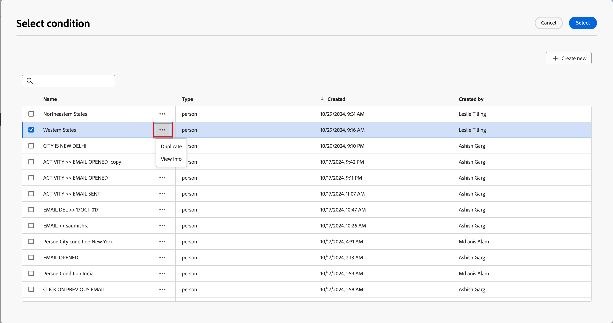
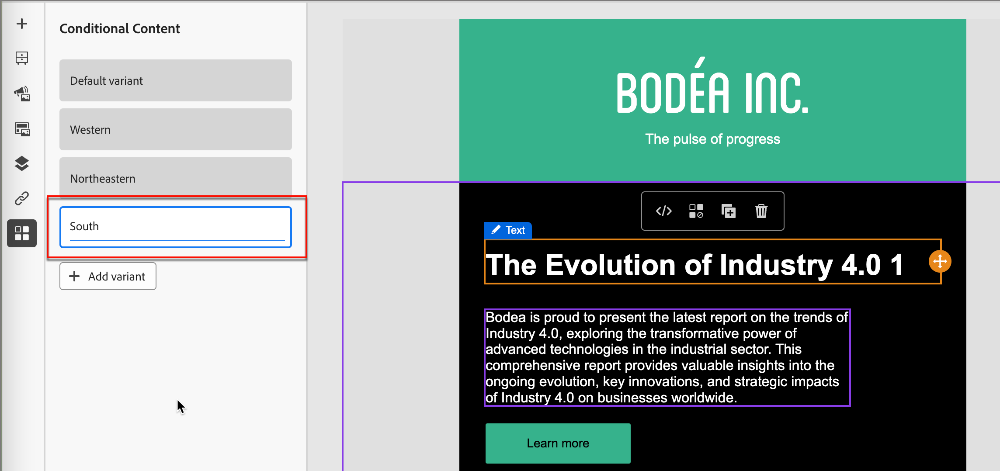
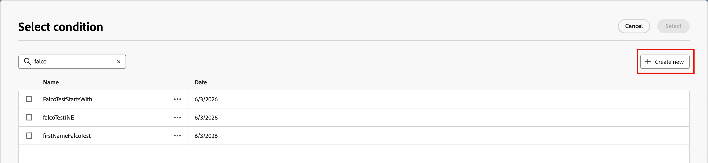

# Contenido condicional

El contenido condicional le permite adaptar el correo electrónico y el contenido del fragmento en función de reglas condicionales. Estas reglas se definen mediante atributos de perfil o eventos contextuales. Puede crear reglas condicionales en el generador de reglas y almacenarlas para su reutilización en los recorridos de persona.

Para agregar contenido condicional a los fragmentos y mensajes de correo electrónico, [!DNL Journey Optimizer B2B Prime] le permite aplicar reglas condicionales almacenadas en la biblioteca _Conditions_. Aplique reglas condicionales dentro del espacio de diseño visual a medida que crea [contenido de correo electrónico](./email-authoring.md) o un [fragmento](./fragment-authoring.md).

## Añadir contenido condicional {#add-conditional-content}

>[!CONTEXTUALHELP]
>id="ajo-b2b-prime_conditional_content"
>title="Contenido condicional"
>abstract="Utilice reglas condicionales para crear varias variantes de un componente de contenido. Si no se cumple ninguna de las condiciones al enviar el mensaje, se muestra el contenido de la variante predeterminada."

>[!CONTEXTUALHELP]
>id="ajo-b2b-prime_conditional_rule_select"
>title="Contenido condicional"
>abstract="Utilice una regla condicional guardada en la biblioteca o cree una nueva."

Cuando cree un [fragmento](./fragment-authoring.md) o un [correo electrónico](./email-authoring.md) en el espacio de diseño visual, utilice reglas condicionales para definir varias variantes para un componente de contenido.

1. Seleccione un componente de contenido y haga clic en el icono **[!UICONTROL Habilitar contenido condicional]** de la barra de herramientas de componentes.

   Consulte [Barras de herramientas de componentes de contenido](./content-components.md#content-component-toolbars).

   El componente se destaca en naranja para indicar que se activa como componente condicional. El panel **[!UICONTROL Contenido condicional]** se muestra a la izquierda con la _variante predeterminada_ y la _Variante - 1_.

   {width="700" zoomable="yes"}

   El contenido original que seleccionó y activó es el predeterminado y se aplica cuando ninguna de las reglas condicionales se cumple para ninguna de las variantes que defina.

   Desde este panel, puede definir varias variantes para el componente de contenido seleccionado mediante reglas condicionales.

1. Pase el ratón sobre la primera variante (_Variante - 1_) y haga clic en el icono _Seleccionar condición_ ( ).

   {width="700" zoomable="yes"}

   Se abre el cuadro de diálogo _[!UICONTROL Seleccionar condición]_ y muestra la biblioteca de condiciones.

   Si desea ver los detalles de una condición para asegurarse de que es lo que desea, haga clic en el icono _Más menú_ (**...**) y elija **[!UICONTROL Ver información]**.

   {width="600" zoomable="yes"}

   Si la condición que necesita no existe, [cree una regla condicional](#create-conditional-rule) haciendo clic en **[!UICONTROL Crear nuevo]**.

1. Seleccione la regla condicional y haga clic en **[!UICONTROL Seleccionar]** para asociarla con la variante.

<!-- 

   You can review the associated condition by clicking the _More menu_ icon (**...**) for the variant and choosing **[!UICONTROL View condition]**.

   {width="600" zoomable="yes"}

   Click X at the top right to close the popup.

   {width="500"}

   -->

1. Para facilitar la lectura, cambie el nombre de la variante haciendo clic en el icono _Más menú_ (**...**) para la variante y eligiendo **[!UICONTROL Rename]**.

   Introduzca un nombre significativo para la variante que le ayude a identificar la variante y su intención.

   {width="600" zoomable="yes"}

1. Con la variante seleccionada en el panel izquierdo, cambie el componente para modificar cómo aparece en el mensaje cuando la condición sea verdadera.

   En este ejemplo, la variante del componente de texto utiliza una descripción diferente en función de la región del destinatario.

   {width="600" zoomable="yes"}

1. Si es necesario, defina otra variante haciendo clic en **[!UICONTROL Agregar variante]**.

   Repita los pasos 2-5 para seleccionar una condición, cambiar el nombre de la variante y cambiar el componente de la variante.

   Puede agregar tantas variantes como sea necesario para el componente de contenido. Cambie la variante seleccionada en el panel izquierdo en cualquier momento para comprobar cómo aparece el componente de contenido para la condición.

   >[!IMPORTANT]
   >
   >El contenido condicional se evalúa según las reglas asociadas en el orden en que se enumeran las variantes. La primera variante con una condición que se evalúa como verdadera se utiliza para el componente.
   >
   >Si ninguna de las condiciones de variante definidas se evalúa como verdadera al enviar el mensaje, el componente de contenido aparece según la **[!UICONTROL variante predeterminada]**.

1. Para eliminar una variante, haga clic en el icono _Más menú_ (**...**) para la variante y elija **[!UICONTROL Eliminar]**.

   Haga clic en **[!UICONTROL Eliminar]** en el cuadro de diálogo de confirmación.

## Reglas condicionales {#conditional-rules}

Las reglas condicionales son un conjunto de expresiones condicionales que pueden evaluarse como verdaderas o falsas. Utilice estas reglas para determinar qué variante de contenido se mostrará en un mensaje en función de varios filtros, como atributos de perfil o eventos contextuales.

Las reglas se almacenan en la biblioteca de condiciones, donde están disponibles para su reutilización en el correo electrónico y en el contenido de fragmentos de su organización.

<!--
M1.5 info -- out of date?

### Condition filters {#condition-filters}

| Condition type | Filters | Description |
| -------------- | ------- | ----------- |
| **Account** | Account Attributes | Attributes from the account profile, including: <li>Annual revenue</li><li>City</li><li>Country</li><li>Employee size</li><li>Industry</li><li>Name</li><li>SIC code</li><li>State</li> |
| | [!UICONTROL Special filters] > [!UICONTROL Has Buying Group] | The account does or does not have members of buying groups. The filter can also be evaluated against one or more of the following criteria: <li>Solution Interest</li><li>Buying Group status</li><li>Completeness Score</li><li>Engagement Score</li> |
| **Person** | [!UICONTROL Activity history] > [!UICONTROL Email] | Email activities associated with the journey: <li>[!UICONTROL Clicked link in email]</li><li>Opened Email</li><li>Was delivered email</li><li>Was sent email</li> These conditions are evaluated using a selected email message from earlier in the journey. |
| | [!UICONTROL Person Attributes] | Attributes from the person profile, including: <li>City</li><li>Country</li><li>Date of birth</li><li>Email address</li><li>Email invalid</li><li>Email suspended</li><li>First name</li><li>Inferred state region</li><li>Job title</li><li>Last name</li><li>Mobile phone number</li><li>Phone number</li><li>Postal code</li><li>State</li><li>Unsubscribed</li><li>Unsubscribed reason</li> |
| | [!UICONTROL Special filters] > [!UICONTROL Member of Buying Group] | The person is or is not a buying group member evaluated against one or more of the following criteria: <li>Solution Interest</li><li>Buying Group status</li><li>Completeness Score</li><li>Engagement Score</li><li>Is Removed</li><li>Role</li> |
-->

### Creación de una regla condicional {#create-conditional-rule}

>[!CONTEXTUALHELP]
>id="ajo-b2b-prime_conditions_rule_editor"
>title="Crear condición"
>abstract="Combine atributos y eventos contextuales para crear reglas que determinen qué variante de contenido se mostrará en los mensajes de correo electrónico."

Acceda al generador de reglas condicionales desde el espacio de diseño al seleccionar una condición para una variante de componente.

1. En el cuadro de diálogo _[!UICONTROL Seleccionar condición]_, haga clic en **[!UICONTROL Crear nueva]**.

   {width="700" zoomable="yes"}

   Esta acción abre el diálogo _[!UICONTROL Crear condición]_. Utilice las herramientas del cuadro de diálogo para combinar atributos en el lienzo (similar a la experiencia de creación de segmentos en Experience Platform). Los atributos del filtro están organizados en tres pestañas:

   * **[!UICONTROL Perfil]** - El esquema XDM de perfil B2B enumera todos los atributos de perfil asociados al esquema XDM (Experience Data Model) definido en Adobe Experience Platform.

   * **[!UICONTROL Contextual]**: cuando el mensaje se utiliza en un recorrido, los campos de recorrido contextual están disponibles a través de esta pestaña.

   * **[!UICONTROL Audiencias]**: enumera todas las audiencias generadas a partir de las definiciones de segmento creadas en el servicio de segmentación de Adobe Experience Platform.

   {width="700" zoomable="yes"}

1. Genere la regla condicional según sus necesidades.

   Para cada filtro que desee incluir en la regla, arrastre y suelte el elemento en el lienzo de reglas. Expanda el filtro y complete la expresión.

   {width="700" zoomable="yes"}

   Arrastre y suelte los filtros adicionales que necesite.

   Si incluye más de un filtro, puede alternar la configuración de lógica de filtro según cómo desee aplicar los filtros:

   * **[!UICONTROL And]**: la regla se evalúa como verdadera si **todos** los filtros son verdaderos.
   * **[!UICONTROL O]**: la regla se evalúa como verdadera si **cualquiera** de los filtros es verdadero.

   {width="700" zoomable="yes"}

1. Haga clic en **[!UICONTROL Seleccionar]** para usar la regla personalizada para la condición.

   Si desea que la regla esté disponible para reutilizarla, puede agregarla a la biblioteca.

### Añadir una condición a la biblioteca {#add-to-library}

1. En el cuadro de diálogo Crear condición, haga clic en **[!UICONTROL Guardar condición]** en la parte inferior.

1. A la derecha, escriba **[!UICONTROL Name]** (obligatorio) y **[!UICONTROL Description]** (opcional) para la regla.

   Utilice un nombre significativo y una descripción útil para ayudar a otros miembros de su organización a reutilizarla en lugar de crear una condición duplicada.

   {width="700" zoomable="yes"}

1. Haga clic en **[!UICONTROL Agregar]**.

   La regla condicional se guarda en la biblioteca y puede seleccionarla para la variante actual. También se incluye en la biblioteca para que la utilice cualquier otra variante de contenido dinámico en los recorridos de las personas.

>[!NOTE]
>
>No se puede modificar una regla condicional guardada en la biblioteca. Sin embargo, puede utilizar una regla guardada para crear una nueva regla. Para ello, abra la regla condicional, realice los cambios deseados y, a continuación, guárdela en la biblioteca con un nuevo nombre.

<!--

### Duplicate a rule {#duplicate-rule}

Conditional rules saved to the library cannot be modified. However, you can duplicate an existing rule and change it to create a new rule.

1. Click the _More menu_ icon (**...**) for the variant and choose **[!UICONTROL Duplicate]**.

   A duplicate of the rule opens in the rule builder. Use the duplicate as a starting point for the rule that you want to build.

   {width="600" zoomable="yes"}

1. In the rule builder, change, add, or delete conditions according to what you need.

1. Change the name and description to match the purpose or items in the rule.

1. When your conditional rule is complete, click **[!UICONTROL Save]**.
-->
