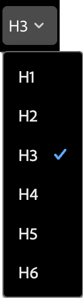
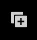
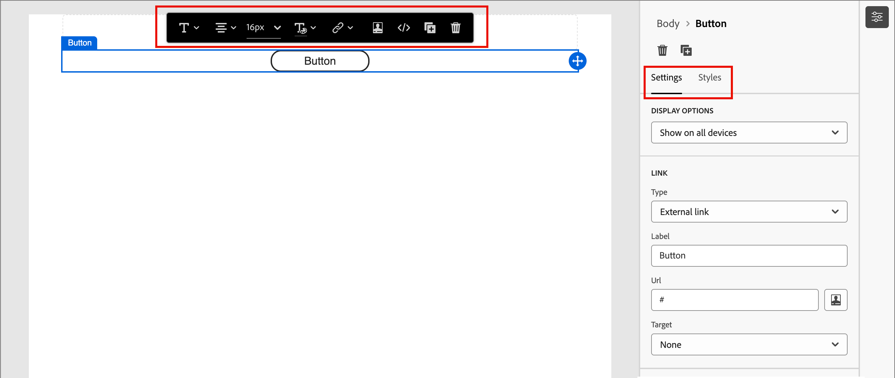
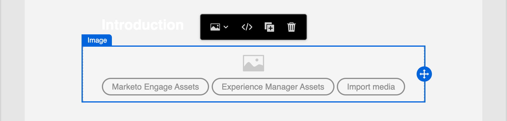
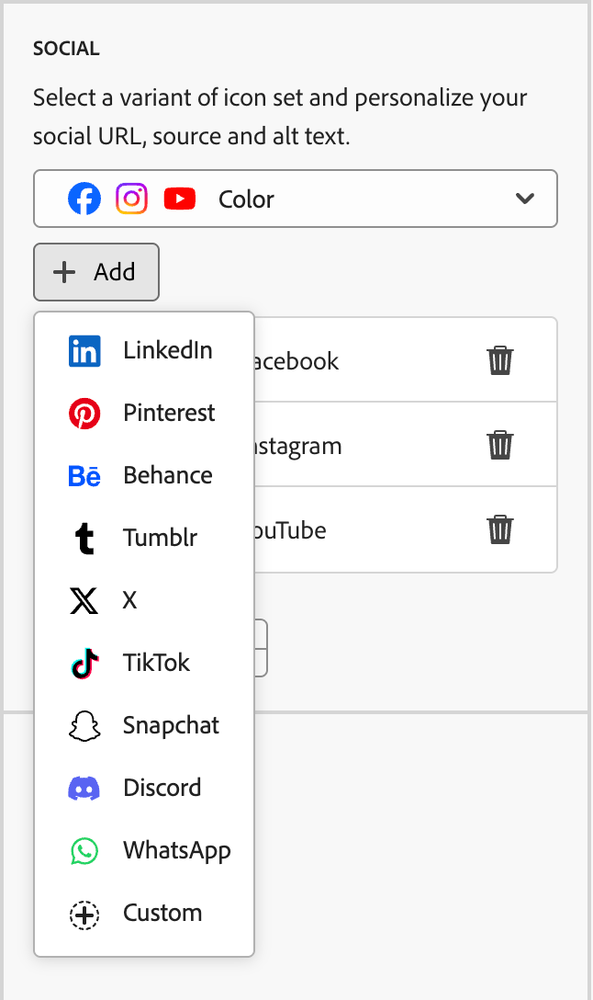

# Componentes de contenido {#content-components}

>[!CONTEXTUALHELP]
>id="ajo-b2b-prime_content_components_email"
>title="Acerca de los componentes de contenido"
>abstract="Los componentes de contenido son marcadores de posición de contenido vacíos que se pueden utilizar para diseñar un correo electrónico."

>[!CONTEXTUALHELP]
>id="ajo-b2b-prime_content_components_landing_page"
>title="Acerca de los componentes de contenido"
>abstract="Los componentes de contenido son marcadores de posición de contenido vacíos que se pueden utilizar para diseñar una página de aterrizaje."

>[!CONTEXTUALHELP]
>id="ajo-b2b-prime_content_components_fragment"
>title="Acerca de los componentes de contenido"
>abstract="Los componentes de contenido son marcadores de posición de contenido vacíos que se pueden utilizar para diseñar un fragmento."

>[!CONTEXTUALHELP]
>id="ajo-b2b-prime_content_components_template"
>title="Acerca de los componentes de contenido"
>abstract="Los componentes de contenido son marcadores de posición de contenido vacíos que se pueden utilizar para diseñar una plantilla."

Cuando diseñe contenido para correos electrónicos, páginas de aterrizaje, plantillas y fragmentos visuales, use [!UICONTROL Componentes de contenido] para agregar elementos de diseño visuales.

<!-- You can add as many content components as you need inside one or more [structure components](./structure-components.md), which define the layout. -->

## Biblioteca de contenidos

La sección **[!UICONTROL Contents]** de la biblioteca de componentes muestra los componentes de contenido disponibles:

| Ícono | Componente | Descripción |
| --------- | ---- | ----------- |
|  | [Contenedor](#container) | Añada este componente al diseño para incluir un contenedor rectangular que puede utilizar para agrupar componentes o aplicar un estilo de fondo o borde a un área. |
|  | [Botón](#button) | Añada este componente al diseño para incluir un elemento de botón en el que se puede hacer clic. |
|  | [Texto](#text) | Añada este componente al diseño para incluir un cuerpo de texto. |
|  | [Divisor](#divider) | Añada este componente al diseño para incluir una línea horizontal para separar las áreas de contenido. |
|  | [HTML](#html) | Añada este componente al diseño para copiar y pegar las diferentes partes del HTML existente. Utilice este componente para crear un bloque modular gratuito de HTML para reutilizar contenido externo. |
|  | [Imagen](#image) | Añada este componente al diseño para insertar un archivo de imagen. |
|  | [Social](#social) | Añada este componente al diseño para insertar vínculos a páginas de medios sociales. |
|  | [Formulario](#form) | **_Solo disponible para páginas de aterrizaje._** Agregue este componente al diseño para insertar un formulario creado. |

## Barras de herramientas de componentes de contenido

Cada tipo de componente de contenido muestra una barra de herramientas al seleccionarlo en el lienzo. Las herramientas disponibles, que varían según el tipo de componente, proporcionan una manera sencilla de trabajar con el componente directamente en el contenido procesado. La barra de herramientas incluye funciones funcionales y de formato aplicables al tipo de componente.

{width="450"}

### Herramientas de formato

+++Cambiar estilo de texto

<table>
    <tr>
        <th style="width: 30%;">Herramienta</th>
        <th style="width: 50%;">Uso</th>
        <th style="width: 20%;">Componentes</th>
    </tr>
    <tr>
        <td></td>
        <td>Aplique negrita, cursiva, subrayado o tachado, superíndice o subíndice a la cadena de texto seleccionada.</td>
        <td><li>Botón <li>Texto</td>
    </tr>
</table>

+++

+++Alineación horizontal

<table>
    <tr>
        <th style="width: 30%;">Herramienta</th>
        <th style="width: 50%;">Uso</th>
        <th style="width: 20%;">Componentes</th>
    </tr>
    <tr>
        <td></td>
        <td>Aplique un tipo de alineación horizontal al contenido del componente. Elija izquierda, centrado, derecho o justificado. </td>
        <td><li>Botón <li>Texto</td>
    </tr>
</table>

+++

+++Crear lista

<table>
    <tr>
        <th style="width: 30%;">Herramienta</th>
        <th style="width: 50%;">Uso</th>
        <th style="width: 20%;">Componentes</th>
    </tr>
    <tr>
        <td></td>
        <td>Aplicar formato de lista ordenado o sin ordenar al texto del componente.</td>
        <td><li>Texto</td>
    </tr>
</table>

+++

+++Definir encabezado

<table>
    <tr>
        <th style="width: 20%;">Herramienta</th>
        <th style="width: 60%;">Uso</th>
        <th style="width: 20%;">Componentes</th>
    </tr>
    <tr>
        <td></td>
        <td>Aplicar formato de nivel de encabezado al párrafo para la ubicación del cursor.</td>
        <td><li>Botón <li>Texto</td>
    </tr>
</table>

+++

+++Tamaño de fuente

<table>
    <tr>
        <th style="width: 20%;">Herramienta</th>
        <th style="width: 60%;">Uso</th>
        <th style="width: 20%;">Componentes</th>
    </tr>
    <tr>
        <td></td>
        <td>Aplicar tamaño de fuente al texto seleccionado. Haga clic en la herramienta y elija el tamaño o introduzca el valor px.</td>
        <td><li>Botón <li>Texto</td>
    </tr>
</table>

+++

+++Color de fuente

<table>
    <tr>
        <th style="width: 40%;">Herramienta</th>
        <th style="width: 40%;">Uso</th>
        <th style="width: 20%;">Componentes</th>
    </tr>
    <tr>
        <td></td>
        <td>Aplicar color de fuente al texto seleccionado. Elija un color del selector y utilice el regulador de color y el campo de color para seleccionar el color. O bien, puede introducir un valor RGB, HSL, HSB o hexadecimal conocido. </td>
        <td><li>Botón <li>Texto</td>
    </tr>
</table>

+++

+++Insertar vínculo

<table>
    <tr>
        <th style="width: 40%;">Herramienta</th>
        <th style="width: 40%;">Uso</th>
        <th style="width: 20%;">Componentes</th>
    </tr>
    <tr>
        <td></td>
        <td>Cree un vínculo en el que se pueda hacer clic para el texto o elemento seleccionado. <li>Contenido de correo electrónico: especifique una dirección URL externa o una página de aterrizaje.<li>Contenido de la página de aterrizaje: especifique un vínculo externo.</td>
        <td><li>Botón <li>Texto <li>Imagen </td>
    </tr>
</table>

+++

+++Quitar vínculo

<table>
    <tr>
        <th style="width: 15%;">Herramienta</th>
        <th style="width: 60%;">Uso</th>
        <th style="width: 25%;">Componentes</th>
    </tr>
    <tr>
        <td></td>
        <td> Quitar el vínculo en el que se puede hacer clic para el texto o elemento seleccionado.</td>
        <td><li>Botón <li>Texto <li>Imagen </td>
    </tr>
</table>

+++

### Herramientas funcionales

| Herramienta | Nombre | Uso |
| ---- | ---- | ----- |
| {width="40"} | Añadir personalización | Utilice el editor de personalización para insertar tokens de personalización en el contenido del componente. [Más información](./email-authoring.md#personalize-content) |
| {width="40"} | Mostrar el código fuente | Muestre el código fuente de HTML del componente en una ventana emergente de solo lectura.  {width="200"} |
| {width="40"} | Habilitar contenido condicional | (Correos electrónicos y fragmentos) Habilite variantes condicionales para el componente. |
| {width="40"} | Duplicado | Cree una copia del componente y agréguelo directamente debajo. |
| {width="40"} | Eliminar | Desmonte el componente. |

## Añadir un componente de contenido al diseño

1. En el espacio de diseño visual, utilice una plantilla existente o añada los componentes de estructura necesarios a un lienzo vacío para definir el diseño.

1. En la biblioteca **[!UICONTROL Componentes]**, agarre el _controlador de arrastre_  para el componente de contenido de su elección y arrástrelo y suéltelo en los componentes de la estructura.

   Puede añadir varios componentes en un único componente de estructura y en cada columna de un componente de estructura.

   {width="600" zoomable="yes"}

1. Ajuste la visualización del componente mediante las pestañas **[!UICONTROL Settings]** y **[!UICONTROL Styles]** de la derecha o la barra de herramientas contextual que se muestra en el lienzo.

   Por ejemplo, puede cambiar el estilo del texto, el relleno o el margen del componente.

   {width="600" zoomable="yes"}

Mientras trabaja con el diseño, también puede quitar o duplicar un componente con las herramientas **Eliminar** y **Duplicar** en la sección [Herramientas funcionales](#functional-tools).

## Configuración y estilos de componentes de contenido

Después de agregar un componente, se selecciona en el espacio de diseño visual y sus propiedades se muestran en el panel derecho. También puede seleccionar un componente en cualquier momento para cambiar la configuración y los estilos. Muchos ajustes y estilos son específicos del componente, pero hay algunos ajustes y estilos estándar que puede aplicar a cualquier componente de contenido seleccionado.

### Opciones de visualización

Si desea excluir el componente de la pantalla del escritorio o del dispositivo móvil, cambie la configuración de **[!UICONTROL Opciones de visualización]**. De forma predeterminada, _[!UICONTROL Mostrar en todos los dispositivos]_, habilita la visualización en todos los dispositivos. Elija otra configuración para que el componente sea exclusivo por tipo de dispositivo:

* _[!UICONTROL Mostrar solo en dispositivos de escritorio]_. Elige esta opción cuando quieras mostrar el componente en dispositivos de escritorio y excluirlo para dispositivos móviles.
* _[!UICONTROL Mostrar solo en dispositivos móviles]_: elija esta opción cuando quiera mostrar el componente en dispositivos móviles, como teléfonos y tabletas, y exclúyala en los dispositivos de escritorio.

{width="400" zoomable="yes"}

### Contenedor {#container}

Utilice un contenedor para aplicar un estilo específico a un grupo de componentes de contenido. Agregue un componente [!UICONTROL Contenedor] y, a continuación, agregue otros componentes de contenido dentro de él. Este componente es similar a cómo se podría usar un elemento `div` en HTML. Puede aplicar un estilo distinto al contenedor que difiera del estilo aplicado a los componentes de contenido que contiene.

Por ejemplo, agregue el componente _[!UICONTROL Contenedor]_ y el componente _[!UICONTROL Botón]_ dentro de ese contenedor. Puede utilizar un estilo de área específico para el contenedor y aplicar estilo al botón y su fondo según sea necesario.

{width="600" zoomable="yes"}

+++Contexto

{{styles-background}}

+++

+++Borde

{{styles-border}}

+++

+++Tamaño

{{styles-size}}

+++

+++Margen

{{styles-margin}}

+++

+++Relleno

{{styles-padding}}

+++

### Botón {#button}

Utilice el componente [!UICONTROL Button] para insertar uno o varios botones en los que se puede hacer clic en el contenido. Utilice los botones para redirigir a los visualizadores de página o a los destinatarios de correo electrónico al contenido de apoyo (página de aterrizaje publicada o un vínculo externo).

#### Agregar el texto del botón

Cuando el componente Botón se muestra en el lienzo, la barra de herramientas incluye opciones para el formato de texto, así como variantes de personalización y condicionales. Para obtener más información acerca de las opciones de la barra de herramientas del editor, vea [Barras de herramientas de componentes de contenido](#content-component-toolbars).

Al escribir el texto de la etiqueta del botón y establecer el formato, el botón cambia de tamaño para ajustarse al contenido.

{width="500" zoomable="yes"}

#### Definir opciones de vínculo {#button-set-link-options}

En la ficha _[!UICONTROL Configuración]_, use las opciones de **[!UICONTROL Vínculo]** para definir el texto del botón, el destino del vínculo y el comportamiento del explorador para cargar la página de destino.

1. Establezca **[!UICONTROL Type]** para el vínculo:

   * **[!UICONTROL Vínculo externo]**: elija este tipo para usar una dirección URL estándar como destino del vínculo.

     En **[!UICONTROL URL]**, escriba la dirección URL del destino del vínculo. Haga clic en el icono _Personalizar_ (  ) para usar un token de personalización como parámetro en la dirección URL.

     {width="200"}

   * **Página de aterrizaje**: elija este tipo para seleccionar una página de aterrizaje publicada en <!-- Journey Optimizer B2B Edition (_Beta_) or -->la instancia de Marketo Engage conectada.

     Para la opción **[!UICONTROL Página de aterrizaje]**, seleccione la página de aterrizaje publicada. Haga clic en el icono _Seleccionar página_ (  ) y [seleccione la página de aterrizaje publicada](./landing-pages.md#link-to-landing-page).

     {width="200"}

1. Para **[!UICONTROL Etiqueta]**, escriba el texto que desea mostrar dentro del botón.

   El tamaño del botón se ajusta según el texto y el estilo que establezca.

1. Para **[!UICONTROL Target]**, elija cómo se redirige el destino vinculado desde el correo electrónico o la página:

   * _[!UICONTROL Ninguno]_: abre el vínculo con el comportamiento predeterminado del explorador o del cliente (predeterminado).
   * _[!UICONTROL En blanco]_: abre el vínculo en una nueva ventana o ficha.
   * _[!UICONTROL Self]_: abre el vínculo en el mismo fotograma.
   * _[!UICONTROL Principal]_: abre el vínculo en el marco principal.
   * _[!UICONTROL Superior]_: abre el vínculo en todo el cuerpo de la ventana.

#### Definir estilos

Personalice el estilo del botón en la ficha **[!UICONTROL Estilos]**.

+++Contexto

{{styles-background}}

+++

+++Texto

{{styles-text}}

+++

+++Borde

{{styles-border}}

+++

+++Tamaño

{{styles-size}}

+++

+++Alineación

{{styles-alignment-h-v}}

+++

+++Margen del botón

{{styles-margin}}

+++

+++Margen del contenedor

{{styles-margin}}

+++

+++Relleno

{{styles-padding}}

+++

+++Avanzadas

{{styles-advanced}}

+++

### Texto {#text}

Utilice el componente Texto para insertar un bloque de texto en el contenido. Cuando el componente Texto esté seleccionado en el lienzo, introduzca el texto y utilice las opciones de la barra de herramientas para añadir formato y opciones en línea, incluidos tokens de personalización y variantes condicionales.

Personalice el estilo del componente de texto en la ficha **[!UICONTROL Estilos]**.

+++Contexto

{{styles-background}}

+++

+++Texto

Estos estilos se aplican a todo el bloque de texto. Puede aplicar estilos en línea a una cadena de texto seleccionada.

{{styles-text}}

+++

+++Borde

{{styles-border}}

+++

+++Tamaño

{{styles-size}}

+++

+++Margen

{{styles-margin}}

+++

+++Relleno

{{styles-padding}}

+++

+++Avanzadas

{{styles-advanced}}

+++

### Divisor {#divider}

Agregue un componente _Divider_ para incorporar una división lineal entre las secciones del contenido.

+++Contexto

{{styles-background}}

+++

+++Línea

En el panel derecho con la ficha _[!UICONTROL Estilos]_ seleccionada, expanda la sección **[!UICONTROL Línea]** y establezca las opciones para la altura y anchura del componente:

* **[!UICONTROL Color]**: haga clic en el cuadrado de color para elegir un color del selector. Puede elegir un color introduciendo un valor RGB, HSL, HSB o hexadecimal conocido. O bien, puede utilizar el regulador de color y el campo de color para seleccionar el color.

* **[!UICONTROL Altura]**: haga clic en los iconos de flecha arriba y abajo para aumentar o reducir el número de píxeles. Un valor vacío (Automático) es el valor predeterminado y ajusta el tamaño de la altura del elemento según su contenido.

* **[!UICONTROL Anchura]**: utilice la opción para establecer la anchura en píxeles o porcentaje.

   * Para una anchura porcentual, utilice el control deslizante para definir el valor porcentual. El porcentaje determina el tamaño del elemento en función del cuadro de contenido del bloque contenedor, que excluye el relleno y los bordes. Por ejemplo, un valor de 50 establece el ancho del elemento en el 50 % del ancho del contenido del bloque que lo contiene.

  {width="250"}

   * Para un ancho basado en píxeles, haga clic en los iconos de flecha arriba y abajo para aumentar o reducir el número de píxeles. Un valor vacío (Automático) es el valor predeterminado y ajusta el ancho del elemento según su contenido.

* **[!UICONTROL Style]**: elige un valor de la lista de valores CSS estándar `line-style`, como _Solid_, _Dotted_ y _Dashed_.

+++

+++Tamaño

{{styles-size}}

+++

+++Alineación

{{styles-alignment-h}}

+++

+++Margen

{{styles-margin}}

+++

+++Relleno

{{styles-padding}}

+++

+++Avanzadas

{{styles-advanced}}

+++

### HTML {#html}

Utilice el componente HTML para añadir partes de su HTML existente. Este componente ofrece una forma sencilla de crear elementos modulares de HTML que reutilicen el contenido externo.

1. Seleccione el componente en el lienzo y haga clic en el icono _Mostrar código fuente_ de la barra de herramientas.

   {width="450"}

1. Pegue el HTML en el cuadro de texto y haga clic en **[!UICONTROL Guardar]**.

   {width="600" zoomable="yes"}

   Si la HTML es válida, representa el elemento en el lienzo. Si es un elemento que se asigna a uno de los demás componentes de contenido, puede cambiar la configuración y los estilos en el panel derecho según el tipo de componente. Si no es así, se mantiene como componente de HTML.

Para un componente de HTML, puede establecer los siguientes estilos para todo el componente de HTML en el panel derecho:

+++Contexto

{{styles-background}}

+++

+++Borde

{{styles-border}}

+++

+++Tamaño

{{styles-size}}

+++

+++Alineación

{{styles-alignment-h-v}}

+++

+++Margen

{{styles-margin}}

+++

+++Relleno

{{styles-padding}}

+++

+++Avanzadas

{{styles-advanced}}

+++

### Imagen {#image}

Utilice el componente [!UICONTROL Image] para insertar un recurso de imagen en el contenido. Cuando el componente _Image_ está seleccionado en el lienzo, puede agregar o cambiar el archivo de recursos de imagen mostrado.

{width="400" zoomable="yes"}

#### Añadir el recurso de imagen {#add-image-asset}

Elija un método para añadir el recurso de imagen:

* **[!UICONTROL Seleccionar recurso]**: elija este tipo para examinar y seleccionar un recurso de imagen de la biblioteca de Assets [!DNL Journey Optimizer B2B Prime].

  {width="700" zoomable="yes"}

  En el cuadro de diálogo, puede elegir una imagen del repositorio seleccionado. Haga clic en **[!UICONTROL Seleccionar]** para agregar el recurso.

  Hay herramientas disponibles para ayudarle a localizar el recurso que necesita:

   * Haga clic en el icono _Filtrar_ en la parte superior izquierda para filtrar los elementos mostrados según sus criterios.

   * Escriba texto en el campo _Buscar_ para filtrar los elementos mostrados y buscar una coincidencia del nombre del recurso.

* **[!UICONTROL Importar medios]**: elija este tipo para seleccionar un archivo de su sistema e importarlo a la biblioteca de recursos [!DNL Journey Optimizer B2B Prime].

  En el cuadro de diálogo _[!UICONTROL Cargar imagen]_, arrastre y suelte un archivo de su sistema en el cuadro de archivo. El tamaño máximo de archivo es 100 MB.

  {width="450"}

  Los nombres de archivo de las imágenes seleccionadas se muestran en el cuadro de diálogo. Los nombres de los archivos de recursos deben ser únicos (en todas las carpetas) y, si ya existe un archivo con el nombre, se muestra un mensaje. Los nombres pueden tener un máximo de 100 caracteres y no pueden contener caracteres especiales (como `;`, `:`, `\` y `|`).

  Haga clic en **[!UICONTROL Importar]**.

Puede agregar un título de imagen y texto alternativo para la imagen en el panel derecho.

{width="250"}

#### Definir opciones de vínculo {#image-set-link-options}

En la ficha _[!UICONTROL Configuración]_, use las opciones de **[!UICONTROL Vínculo]** para vincular la imagen con un destino y el comportamiento del explorador para cargar la página de destino.

1. Establezca **[!UICONTROL Type]** para el vínculo:

   * **[!UICONTROL Vínculo externo]**: elija este tipo para usar una dirección URL estándar como destino del vínculo.

     En **[!UICONTROL URL]**, escriba la dirección URL del destino del vínculo. Haga clic en el icono _Personalizar_ (  ) para usar un token de personalización como parámetro en la dirección URL.

     {width="250"}

   * **Página de aterrizaje**: elija este tipo para seleccionar una página de aterrizaje publicada en <!-- Journey Optimizer B2B Edition (_Beta_) or -->la instancia de Marketo Engage conectada.

     Para la opción **[!UICONTROL Página de aterrizaje]**, seleccione la página de aterrizaje publicada. Haga clic en el icono _Seleccionar página_ (  ) y [seleccione la página de aterrizaje publicada](./landing-pages.md#link-to-landing-page).

     {width="250"}

1. Para **[!UICONTROL Label]**, si lo desea, escriba un texto descriptivo para el vínculo de imagen.

1. Para **[!UICONTROL Target]**, elija cómo se redirige el destino vinculado desde el correo electrónico o la página:

   * _[!UICONTROL Ninguno]_: abre el vínculo con el comportamiento predeterminado del explorador o del cliente (predeterminado).
   * _[!UICONTROL En blanco]_: abre el vínculo en una nueva ventana o ficha.
   * _[!UICONTROL Self]_: abre el vínculo en el mismo fotograma.
   * _[!UICONTROL Principal]_: abre el vínculo en el marco principal.
   * _[!UICONTROL Superior]_: abre el vínculo en todo el cuerpo de la ventana.

#### Definición de los estilos

Establezca los estilos del componente de imagen en el panel derecho.

+++Contexto

{{styles-background}}

+++

+++Borde

{{styles-border}}

+++

+++Tamaño

{{styles-size}}

+++

+++Alineación

{{styles-alignment-h}}

+++

+++Margen

{{styles-margin}}

+++

+++Relleno

{{styles-padding}}

+++

+++Avanzadas

{{styles-advanced}}

+++

### Social {#social}

Use el componente _Social_ para insertar vínculos a páginas de medios sociales en el contenido. Incluye tres tipos de medios sociales predeterminados, pero puede agregarlos o eliminarlos según sus necesidades.

{width="600" zoomable="yes"}

* Para agregar un tipo de medio social, haga clic en el icono _Agregar_ ( **+** ) y elija el tipo de medio social que desee agregar.

  {width="250"}

* Para quitar un tipo de medio social, haz clic en **X** al lado del icono de medio social.

Expanda la tarjeta para cada tipo de medio social y defina las opciones:

* **[!UICONTROL URL]**: escriba la URL de medios sociales que desea vincular al gráfico o icono de medios sociales.
* **[!UICONTROL Source]**: si desea utilizar su propia imagen en lugar de la predeterminada, elija un recurso de imagen. Puede seleccionar una imagen de la biblioteca Assets o importar un archivo de imagen desde el sistema. Consulte la [información del componente de imagen](#add-the-image-asset) para obtener detalles acerca de la selección e importación de recursos de imagen.
* **[!UICONTROL Texto alternativo]**: escriba el texto alternativo para la imagen mostrada.

{width="250"}

Para definir un tamaño de visualización uniforme para todos los gráficos de medios sociales, establezca el **[!UICONTROL Tamaño de las imágenes]**.

Puede establecer las siguientes opciones de estilo para el componente _Social_:

+++Contexto

{{styles-background}}

+++

+++Borde

{{styles-border}}

+++

+++Tamaño

{{styles-size}}

+++

+++Alineación

{{styles-alignment-h}}

+++

+++Margen

{{styles-margin}}

+++

+++Relleno

{{styles-padding}}

+++

+++Avanzadas

{{styles-advanced}}

+++

### Formulario (solo páginas de aterrizaje) {#form}

Utilice el componente _Formulario_ para agregar un formulario publicado a una página de aterrizaje o plantilla de página de aterrizaje. Para obtener más información sobre cómo crear y publicar formularios, consulte [Forms](./forms.md).

1. Haga clic en la herramienta _Formulario_ en la barra de herramientas de componentes, o use las propiedades de **[!UICONTROL Incrustar formulario]** a la derecha para seleccionar el formulario publicado.

   {width="600"}

1. Si desea anular el **[!UICONTROL tipo de seguimiento]** predeterminado del formulario, cambie la configuración según los requisitos de la página o plantilla.

   Esta página también se conoce como _página de agradecimiento_ por el formulario y esta configuración determina qué sucede cuando un visitante envía el formulario:

   * **[!UICONTROL Permanecer en la página]**: elija esta opción para mantener al visitante en la misma página cuando se envíe el formulario.

   * **[!UICONTROL Página de aterrizaje]**: elija esta opción para seleccionar cualquier [!DNL Journey Optimizer B2B Prime] o página de aterrizaje de Marketo Engage como seguimiento.

   * **[!UICONTROL Dirección URL externa]**: elija esta opción para especificar cualquier dirección URL como página de seguimiento. Una vez que el visitante envía el formulario, el explorador carga la dirección URL designada.

     >[!TIP]
     >
     >Si desea utilizar el formulario para descargar un archivo, puede especificar una dirección URL para el archivo alojado. Con esta configuración, el botón de envío funciona como un botón de descarga.

     {width="280"}

Si es necesario, seleccione la pestaña **[!UICONTROL Estilos]** en el panel derecho para establecer los márgenes del formulario dentro del componente de estructura.

{{styles-margin}}
