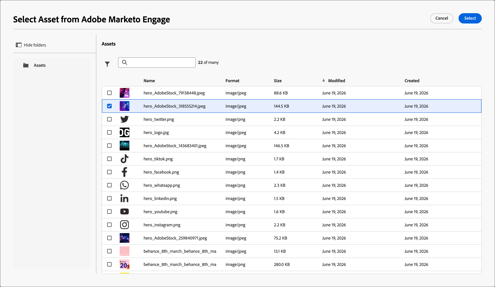

# Recursos

En [!DNL Adobe Journey Optimizer B2B Prime], los recursos suelen ser las imágenes utilizadas al diseñar contenido para admitir recorridos. Puede usar estas imágenes en sus [correos electrónicos](email-authoring.md), [plantillas de correo electrónico](templates.md) y [fragmentos visuales](email-authoring.md#visual-fragments) desde el selector de recursos o una sencilla interfaz de arrastrar y soltar dentro del espacio de diseño visual.

Formatos de archivo compatibles: JPG, JPEG, GIF, PNG, EPS, SVG y RGB

<!--
>[!NOTE]
>
>In this Beta release, you can choose images and assets from a one-time copy of your Marketo Engage asset library directly inside the email canvas. Modifying assets in Marketo Engage after the initial copy is **not** reflected in [!DNL Journey Optimizer B2B Prime].
-->

&#x200B;>>
Puede cargar recursos de imagen adicionales desde la biblioteca _[!UICONTROL Assets]_ o desde el espacio de diseño de contenido. Estos recursos cargados solo se pueden usar en la instancia [!DNL Journey Optimizer B2B Prime].
&#x200B;>>
La importación de recursos desde sistemas externos y el acceso a una biblioteca de recursos previamente completada aún no están disponibles. Se espera que las futuras versiones incluyan la importación de recursos desde sistemas existentes, compatibilidad con carpetas y capacidades ampliadas de administración de recursos.

<!-- You can [edit these assets using Adobe Express](./image-edit-adobe-express.md), and move them into folders to organize them for use across your emails, templates, and fragments. -->

La biblioteca **Assets** proporciona acceso al repositorio centralizado para almacenar y administrar imágenes y otros recursos creativos. Incluye funciones impulsadas por IA que generan metadatos automáticamente y habilitan la búsqueda en lenguaje natural.

En el panel de navegación izquierdo, expanda **[!UICONTROL Administración de contenido]** y seleccione **[!UICONTROL Assets]**.

{width="800" zoomable="yes"}

>[!BEGINSHADEBOX]

La primera vez que accedas a la biblioteca _[!UICONTROL Assets]_, revisa las [_[!UICONTROL Condiciones de uso generativas de IA &#x200B;]_](https://www.adobe.com/es/legal/licenses-terms/adobe-gen-ai-user-guidelines.html) y confirma tu aceptación.

{width="500"}

>[!ENDSHADEBOX]

La biblioteca admite dos opciones de diseño:

* **[!UICONTROL Lista]** — Haga clic en el icono _Vista de lista_ (  ) para mostrar los recursos en una tabla ordenable con columnas de metadatos.
* **[!UICONTROL Galería]**: haga clic en el icono _Vista de galería_ (  ) para mostrar los recursos como una cuadrícula de miniaturas visual.

## Buscar recursos {#find-assets}

Utilice el campo _[!UICONTROL Buscar]_ para buscar recursos, describiendo lo que necesita en lenguaje natural. Los resultados de la búsqueda se basan en metadatos generados por IA, por lo que no se limita a buscar por nombre de archivo.

**Ejemplos:**

* `team members`
* `nature`
* `exercise`

{width="700" zoomable="yes"}

## Ver detalles del recurso {#view-details}

Seleccione cualquier recurso de la vista de lista o de galería para abrir su vista de detalles a la derecha, que muestra una descripción, etiquetas, palabras clave y campos de metadatos adicionales generados por IA. Esta información se genera automáticamente cuando se carga el recurso. Seleccione la pestaña **[!UICONTROL Metadatos de IA]** para revisar la descripción, las etiquetas y los metadatos generados.

{width="700" zoomable="yes"}

## Cargar un recurso {#upload}

1. Haga clic en **[!UICONTROL Cargar]** en la parte superior derecha.

1. En el cuadro de diálogo, arrastre y suelte un archivo desde el sistema local.

   {width="450"}

   También puede hacer clic en **[!UICONTROL Seleccionar archivo del equipo]** para usar el sistema de archivos local y buscar y seleccionar el archivo.

1. Haga clic en **[!UICONTROL Cargar archivo]** para confirmar y cargar el archivo en el repositorio.

Una vez finalizada la carga, el sistema genera automáticamente una descripción, asigna etiquetas y palabras clave y extrae atributos visuales como asunto y configuración. No se requiere etiquetado manual. La nueva imagen se mostrará con un estado _[!UICONTROL PROCESANDO]_ hasta que finalice este proceso.

{width="700" zoomable="yes"}

## Uso de recursos para la creación de contenido {#assets-authoring}

Utilice recursos a medida que crea sus correos electrónicos, plantillas de correo electrónico y fragmentos visuales. El editor de contenido visual proporciona acceso a las imágenes de la biblioteca _Assets_. También puede cargar un recurso de imagen, que lo coloca en el repositorio de recursos interno.

Puede elegir el recurso de imagen al editar la configuración de un componente de imagen o directamente en el lienzo:

* **_Componente vacío_**: cuando se agrega un componente de imagen al lienzo, está vacío y proporciona acceso fácil para elegir, seleccionar o importar un archivo de imagen.

  {width="500"}

* **_Barra de herramientas del componente de imagen_**: cuando tiene un componente de imagen seleccionado en el lienzo, la barra de herramientas proporciona fácil acceso para elegir un origen y seleccionar el archivo de imagen.

  {width="500"}

* **_Configuración del componente de imagen_**: cuando tenga un componente de imagen seleccionado en el lienzo, puede ver y editar la configuración en el panel derecho. Para añadir o cambiar el archivo de imagen que se muestra en el componente, elija el tipo de origen y seleccione un archivo de imagen.

  {width="350"}

Haga clic en **[!UICONTROL Seleccionar recurso]** para abrir el selector de recursos, donde podrá elegir una imagen del repositorio de recursos [!DNL Journey Optimizer B2B Prime].

{width="700" zoomable="yes"}

Puede utilizar la búsqueda y los filtros para localizar el recurso de imagen deseado. Seleccione el recurso y haga clic en **[!UICONTROL Seleccionar]** para utilizarlo en el componente de imagen.

También puede elegir un recurso de imagen en la configuración de fondo para un componente de estructura.
