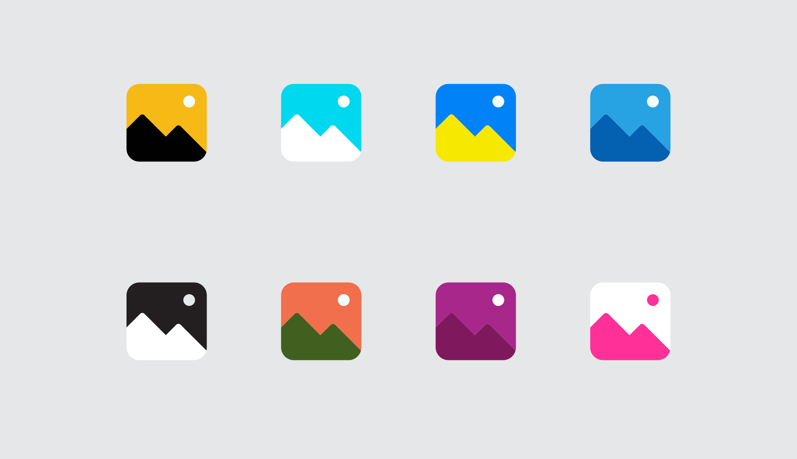

# Modo oscuro para el contenido de correo electrónico {#dark-mode}

>[!CONTEXTUALHELP]
>id="ajo-b2b_dark_mode"
>title="Cambiar a modo oscuro"
>abstract="Cambie al modo oscuro para previsualizar el renderizado y definir la configuración personalizada.  El renderizado depende del cliente de correo electrónico del destinatario. No todos los clientes de correo electrónico admiten el modo oscuro personalizado."

>[!CONTEXTUALHELP]
>id="ajo-b2b_dark_mode_preview"
>title="Cambiar a modo oscuro"
>abstract="Cambie a modo oscuro para previsualizar el renderizado en los clientes de correo electrónico compatibles.  El renderizado final depende del cliente de correo electrónico del destinatario. Tenga en cuenta que no todos los clientes de correo electrónico admiten el modo oscuro."

_El modo oscuro_ permite que un cliente de correo electrónico o aplicación compatible muestre correos electrónicos con fondos más oscuros y colores más claros para texto, botones y otros elementos visuales. Este tipo de pantalla puede reducir la fatiga visual, ahorrar batería y mejorar la legibilidad en entornos con poca luz para una experiencia de visualización más cómoda. Como tendencia creciente en los principales sistemas operativos y aplicaciones, ahora es una consideración importante en el diseño moderno del correo electrónico garantizar que el contenido sea legible y visualmente atractivo para todos los usuarios.

A medida que [crea su contenido de correo electrónico](./email-authoring.md) en el espacio de diseño visual de [!DNL Journey Optimizer B2B Prime], puede cambiar a la vista de _**[!UICONTROL modo oscuro]**_. En esta vista, también puede definir la configuración personalizada específica para admitir clientes de correo electrónico cuando su modo oscuro esté habilitado.

## Consideraciones del cliente de correo electrónico {#email-client-considerations}

Hay una variación significativa en la forma en que diferentes clientes de correo electrónico y aplicaciones aplican el modo oscuro. Por este motivo, tenga en cuenta las expectativas de procesamiento en modo oscuro con precaución. Antes de utilizar el modo oscuro en el espacio de diseño del correo electrónico, tenga en cuenta los siguientes casos de uso del cliente de correo electrónico:

+++Clientes que no admiten el modo oscuro

Algunos clientes de correo electrónico no admiten esta función en absoluto, como:

* [!DNL Yahoo! Mail]
* [!DNL AOL]

Si define la configuración personalizada de modo oscuro en el diseño de correo electrónico, estos clientes no pueden mostrar ningún procesamiento de modo oscuro.

+++

+++Clientes que aplican su propio modo oscuro {#default-support}

Algunos clientes de correo electrónico aplican sistemáticamente su propio modo oscuro predeterminado a todos los correos electrónicos recibidos. Ajustan automáticamente los colores, fondos, imágenes y otros elementos según su configuración de modo oscuro y no es posible realizar ajustes externos. Estos clientes incluyen:

* Gmail (Desktop Webmail, iOS, Android™, Mobile Webmail)
* Outlook Windows
* Outlook Windows Mail

En este caso, la configuración del modo oscuro del cliente anula la configuración del modo oscuro personalizado que se define en [!DNL Journey Optimizer B2B Prime].

+++

+++Clientes que admiten el modo oscuro personalizado

Muchos de los clientes de correo electrónico más populares admiten el procesamiento personalizado en modo oscuro con la consulta `@media (prefers-color-scheme: dark)`, que es el método utilizado por los estilos de correo electrónico [!DNL Journey Optimizer B2B Prime]. Esta lista de clientes incluye:

* Apple Mail macOS
* Apple Mail iOS
* Outlook macOS
* Outlook.com
* Outlook iOS
* Outlook Android™

En este caso, se procesa la configuración específica que defina en [!DNL Journey Optimizer B2B Prime]. Sin embargo, algunas restricciones se pueden aplicar según cada cliente de correo electrónico. Por ejemplo, algunos clientes (como Apple Mail 16 (macOS 13)) no generan el modo oscuro si las imágenes están presentes en el contenido del correo electrónico.

Para obtener resultados óptimos, pruebe el contenido con los clientes de correo electrónico a los que está dirigiendo.

+++

## Diseño para el modo oscuro

El espacio de diseño visual [!DNL Journey Optimizer B2B Prime] proporciona dos tipos de herramientas para aplicar estilo al contenido del correo electrónico en modo oscuro:

* Utilice la [función de vista previa](#preview-dark-mode) para revisar el procesamiento predeterminado del modo oscuro para la mayoría de los clientes de correo electrónico de soporte.

* Si desea anular la configuración predeterminada de los clientes de correo electrónico de soporte, defina y aplique la [configuración personalizada del modo oscuro](#custom-dark-mode) al contenido del correo electrónico.

### Previsualizar modo oscuro predeterminado {#preview-dark-mode}

1. Abra el contenido del correo electrónico en el espacio de diseño del correo electrónico.

   En la parte superior derecha del lienzo, hay un selector de claro a oscuro que alterna la visualización del contenido entre el modo claro (predeterminado) y el modo oscuro.

   {width="700" zoomable="yes"}

1. Cambie el selector a _Modo oscuro_ (  ).

   El lienzo muestra el contenido con la previsualización predeterminada en modo oscuro.

   De manera predeterminada, la vista previa en modo oscuro aplica el esquema de colores `full color invert` a todos los elementos, excepto a las imágenes y los iconos. Esta combinación de colores detecta las áreas con elementos claros y oscuros y las invierte. Los fondos claros se vuelven oscuros y el texto oscuro se vuelve claro, o los fondos oscuros se vuelven claros y el texto claro se vuelve oscuro.

   {width="700" zoomable="yes"}

>[!CAUTION]
>
>La renderización final puede variar según el cliente de correo electrónico del destinatario. Para ver una simulación que se aproxime lo más posible al resultado final de cada cliente de correo electrónico, utilice la integración de procesamiento de correo electrónico Litmus disponible a través de **[!UICONTROL Simular contenido]** en el espacio de diseño de correo electrónico.

### Definir configuración del modo oscuro personalizado {#custom-dark-mode}

>[!CONTEXTUALHELP]
>id="ajo-b2b_dark_mode_image"
>title="Utilizar una imagen específica para el modo oscuro"
>abstract="Seleccione otra imagen para el modo oscuro.  Añadir una imagen específica no garantiza un renderizado correcto en todos los clientes de correo electrónico. No todos los clientes de correo electrónico admiten el modo oscuro personalizado."

Después de cambiar al modo oscuro, puede editar elementos de estilo específicos del contenido que se muestran solo cuando el modo oscuro está habilitado en el cliente de correo electrónico del destinatario (siempre que admita esa función).

>[!NOTE]
>
>El procesamiento final del modo oscuro depende de cada cliente de correo electrónico, por lo que los resultados pueden variar de uno a otro. Revise las [consideraciones del cliente de correo electrónico](#email-client-considerations) para obtener más información.

El estilo de modo oscuro personalizado utiliza la consulta CSS `@media (prefers-color-scheme: dark)` para detectar si el cliente de correo electrónico está configurado en modo oscuro y aplicar el diseño de tema oscuro definido.

_Para definir la configuración personalizada del modo oscuro :_

1. Si es necesario, mueva el selector a _Modo oscuro_ (  ) en la parte superior derecha del lienzo de diseño.

1. Edite cualquier atributo de color de estilo, como texto, fondos o botones.

{width="700" zoomable="yes"}

1. Para imágenes e iconos, defina recursos específicos solo para el modo oscuro.

   No puede cambiar los colores de las imágenes y los iconos, pero puede definir recursos alternativos para utilizarlos en el modo oscuro. Puede experimentar con diferentes combinaciones de colores para sus iconos o realizar ajustes de color y saturación para imágenes fotográficas.

   {width="80%"}

   Seleccione cualquier imagen y cambie a **[!UICONTROL Modo oscuro]** con el conmutador específico del panel **[!UICONTROL Configuración]**. A continuación, seleccione un recurso de imagen diferente del selector de recursos de Marketo Design Studio.

   Consulte [Insertar una imagen de Marketo Design Studio](./email-authoring.md#insert-image) para obtener más información sobre cómo seleccionar un recurso de imagen.

1. En cualquier momento durante los cambios de diseño, selecciona **[!UICONTROL Cambiar a la vista en vivo]** para comprobar cómo puede representarse el contenido en varios tamaños de dispositivo.

   Desde esta vista, cambie el selector a _Modo oscuro_ (  ) para previsualizar la versión en modo oscuro del contenido en diferentes dispositivos.

   {width="800" zoomable="yes"}

   >[!CAUTION]
   >
   >La vista en directo es una previsualización genérica diseñada para comparar el aspecto que podría tener la renderización en varios tamaños de dispositivo. La renderización final puede variar según el cliente de correo electrónico del destinatario.

1. Cuando se hayan completado los cambios del modo oscuro, haga clic en **[!UICONTROL Simular contenido]** para usar las herramientas de vista previa y corrección para probar el diseño del correo electrónico.

1. Si tiene una cuenta de Litmus Enterprise, seleccione **[!UICONTROL Procesar correo electrónico]** para ver el procesamiento final en modo oscuro para varios clientes de correo electrónico en la integración de Litmus.

   >[!CAUTION]
   >
   >Aunque la simulación se aproxima mucho al modo oscuro en que aparecen los correos electrónicos, el procesamiento real podría diferir debido a variaciones en los proveedores de servicios de correo electrónico o en la configuración del nivel de dispositivo.

## Prácticas recomendadas {#best-practices}

A medida que la adopción del modo oscuro aumenta en los principales clientes de correo electrónico, es esencial tener en cuenta cómo se procesan los mensajes de correo electrónico en los entornos claro y oscuro, tanto si utiliza [modo oscuro personalizado](#custom-dark-mode) como si no.

El modo oscuro puede alterar colores, fondos e imágenes, a veces anulando las opciones de diseño. Para garantizar la coherencia visual, la accesibilidad y la integridad de la marca, siga estas prácticas recomendadas:

| Práctica |            |
| -------- | ---------- |
| Optimizar imágenes y logotipos | Lista de comprobación:<ul><li>Guarde los logotipos e iconos como archivos PNG con fondos transparentes para evitar cuadros blancos visibles en modo oscuro. <li>Evite imágenes con fondos blancos o claros codificados. <li>Si la transparencia no es una opción, coloque las imágenes sobre un fondo sólido en el diseño para evitar incómodas inversiones de color. |
| Cuida tus fondos | Lista de comprobación:<ul><li>Asegúrese de que haya suficiente contraste entre los colores del texto y del fondo para facilitar la lectura tanto en los modos claro como oscuro. <li>Evite depender únicamente de los colores de fondo para el contenido crítico. Algunos clientes omiten los colores de fondo en el modo oscuro, por lo que debe asegurarse de que la información clave sigue siendo visible. |
| Diseño de contenido accesible en modo oscuro | Lista de comprobación:<ul><li>Utilice combinaciones de colores fáciles de distinguir para las personas con daltonismo. <li>Utilice una paleta de medios tonos para garantizar el contraste con fondos claros y oscuros. <li>Utilice combinaciones de colores accesibles con alto contraste para mejorar la legibilidad y cumplir con los estándares de [!DNL Web Content Accessibility Guidelines (WCAG)]. Use herramientas como [!DNL WebAIM Contrast Checker] para comprobar el contraste de color. <li>Evite las fuentes delgadas, ya que pueden afectar a la legibilidad. Si su marca requiere una fuente fina, atíguela en modo oscuro. <li>Omitir blanco puro sobre negro puro, que puede causar fatiga ocular y podría invertirse automáticamente en algunos clientes de correo electrónico. <li>Proporcionar un estilo de reserva accesible si no se admite el modo oscuro. |
| Prueba de correos electrónicos en un entorno de modo oscuro | Lista de comprobación:<ul><li>Use la [vista previa en modo oscuro](#preview-dark-mode) en el espacio de diseño del correo electrónico, que usa combinaciones de colores invertidos para detectar los problemas de forma temprana. <li>Si tiene una cuenta de Litmus Enterprise, utilice la opción **[!UICONTROL Procesar correo electrónico]** para simular los diseños en los principales clientes de correo electrónico (como Apple Mail, Gmail y Outlook) y ver cómo se comportan los colores y las imágenes en el modo oscuro. |
