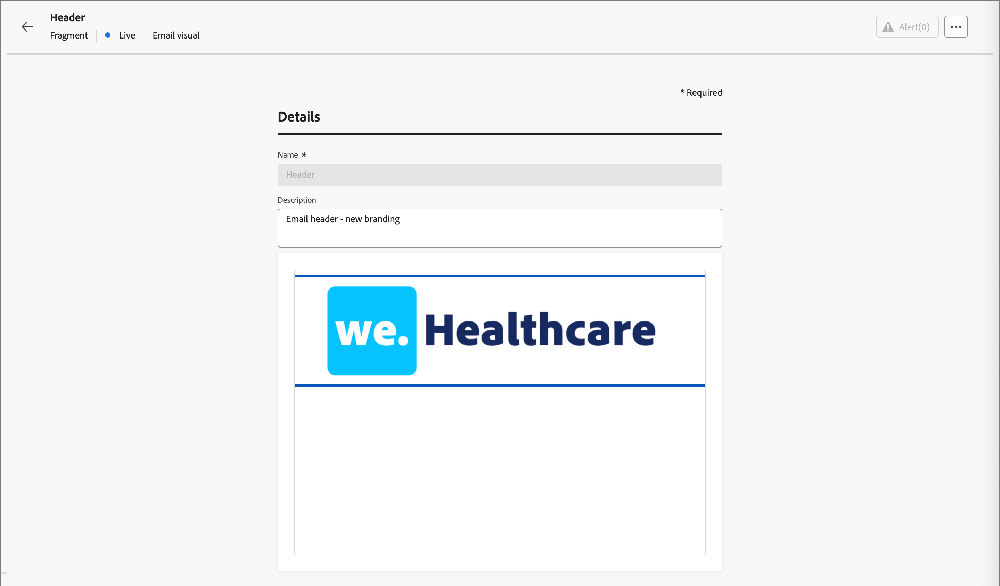

# Fragmentos

Un fragmento es un componente reutilizable al que se puede hacer referencia en uno o más correos electrónicos y plantillas de correo electrónico de [!DNL Journey Optimizer B2B Prime]. Normalmente es un bloque de contenido (texto, imagen o ambos) que se puede crear previamente e insertar rápidamente en un correo electrónico o plantilla de correo electrónico. Con esta funcionalidad, puede generar varios bloques de contenido personalizados para que los utilicen los integrantes del equipo de marketing a fin de combinar el contenido del correo electrónico para mejorar el proceso de diseño. Los casos de uso comunes incluyen bloques de contenido de encabezado/pie de página para correo electrónico, banners de invitación a eventos y saludos de temporada.

>[!BEGINSHADEBOX]

**Fragmentos visuales**

Los fragmentos visuales son bloques visuales predefinidos creados con las herramientas de diseño visual que se pueden reutilizar en varios correos electrónicos o plantillas de correo electrónico. El ámbito actual de [!DNL Journey Optimizer B2B Prime] y esta documentación incluye solo fragmentos visuales.

>[!NOTE]
>
>Los fragmentos basados en expresiones aún no son compatibles con [!DNL Journey Optimizer B2B Prime].

>[!ENDSHADEBOX]

Para aprovechar al máximo los fragmentos de sus flujos de trabajo:

* _Crear sus propios fragmentos_: cree fragmentos visuales desde cero o guarde contenido como un fragmento en el espacio de diseño de contenido visual.
* _Reutilizar fragmentos_: utilícelos tantas veces como sea necesario en el contenido de su correo electrónico o plantilla de correo electrónico.

## Acceso y administración de fragmentos {#access-manage-fragments}

Para acceder a los fragmentos visuales de [!DNL Journey Optimizer B2B Prime], vaya a la barra de navegación izquierda y expanda **[!UICONTROL Administración de contenido]**. A continuación, seleccione **[!UICONTROL Fragmentos]**. Esta acción abre una página de lista con todos los fragmentos creados en la instancia enumerados en una tabla.

{width="700" zoomable="yes"}

La tabla está ordenada por la columna _[!UICONTROL Modificado]_, con los fragmentos actualizados más recientemente en la parte superior de forma predeterminada. Haga clic en el título de la columna para cambiar entre ascendente y descendente.

La estructura de carpetas de la izquierda permite organizar fragmentos. De forma predeterminada, se muestran todos los fragmentos. Al seleccionar una carpeta, solo se muestran los fragmentos y subcarpetas incluidos en la carpeta seleccionada.

### Estado del fragmento {#fragment-status}

El estado del fragmento determina su disponibilidad para utilizarlo en un correo electrónico o plantilla de correo electrónico, y los cambios que puede realizar en él.

| Estado | Descripción |
| ------ | ----------- |
| Borrador | Cuando crea un fragmento, está en estado de borrador. Permanece en este estado mientras define o edita el espacio de diseño visual hasta que lo publica para utilizarlo en un correo electrónico o plantilla de correo electrónico. Acciones disponibles: <ul><li>Editar todos los detalles<li>Editar en el espacio de diseño visual<li>Publicación<li>Duplicado<li>Eliminar |
| En vivo | Al publicar un fragmento, pasa a estar disponible para su uso en un correo electrónico o plantilla de correo electrónico. El contenido de fragmento publicado no se puede modificar en el espacio de diseño visual. Acciones disponibles: <ul><li>Editar descripción<li>Añadir a un correo electrónico o plantilla<li>Crear versión de borrador<li>Duplicado<li>Eliminar (si no está en uso) |
| Activo (con borrador) | Cuando crea un borrador a partir de un fragmento activo, la versión activa permanece disponible para su uso en un correo electrónico o plantilla de correo electrónico, y el contenido del borrador se puede modificar en el espacio de diseño visual. Si publica la versión de borrador, reemplazará la versión activa actual y el contenido se actualizará en los correos electrónicos y las plantillas de correo electrónico en los que esté en uso. Acciones disponibles: <ul><li>Editar descripción<li>Añadir a un correo electrónico o plantilla<li>Editar versión de borrador en el espacio de diseño visual<li>Publicar versión de borrador<li>Duplicado<li>Eliminar (si no está en uso) |
| Archivado | El fragmento se archiva y no se muestra en la lista _Fragmentos_. |

### Filtrado de la lista de fragmentos {#filter-list}

Para buscar un fragmento por nombre, introduzca una cadena de texto en la barra de búsqueda para una coincidencia. Cuando se selecciona una [carpeta](#folders), la búsqueda se aplica a todos los fragmentos o carpetas del primer nivel de jerarquía de esa carpeta.

{width="500" zoomable="yes"}

Haga clic en el icono _Filtro_ (  ) para mostrar las opciones de filtro disponibles y cambiar la configuración para filtrar los elementos mostrados según los criterios especificados.

### Personalización de la visualización de columnas {#column-display}

Personalice las columnas que desee mostrar en la tabla haciendo clic en el icono _Personalizar tabla_ (  ) en la parte superior derecha.

En el cuadro de diálogo, seleccione las columnas que desea mostrar y haga clic en **[!UICONTROL Aplicar]**.

{width="300"}

### Acciones masivas {#bulk-actions}

Puede seleccionar varios fragmentos mediante las casillas de verificación y aplicar operaciones masivas a todos ellos. Las acciones disponibles se muestran en una barra de acciones masiva en la parte inferior de la página de la lista. Las siguientes operaciones son posibles:

* **[!UICONTROL Mover a carpeta]** - Mover los fragmentos seleccionados a una carpeta.
* **[!UICONTROL Archivar]** - Archivar fragmentos seleccionados.

También puede ordenar la lista de fragmentos haciendo clic en el encabezado de cualquier columna y cambiando el tamaño de las columnas arrastrando el borde de la columna para que se ajuste a los datos que necesite.

## Creación de fragmentos {#create-fragments}

Puede crear nuevos fragmentos visuales en [!DNL Journey Optimizer B2B Prime] haciendo clic en **[!UICONTROL Crear fragmento]** en la parte superior derecha.

1. En la página _[!UICONTROL Crear fragmento]_, escriba un **[!UICONTROL Nombre]** (obligatorio) y una **[!UICONTROL Descripción]** (opcional) útiles.

   * Nombre: máximo de 100 caracteres, debe ser único, sin distinción de mayúsculas y minúsculas

   * Descripción: máximo de 300 caracteres

   * Se permiten caracteres Alpha, numéricos y especiales

   * Los caracteres reservados **_no se permiten_**: `\ / : * ? " < > |`

   {width="700" zoomable="yes"}

1. Haga clic en **[!UICONTROL Crear]**.

   El espacio de diseño visual se abre con un lienzo vacío.

1. Utilice las herramientas de diseño de contenido para crear el contenido del fragmento visual:

   * [Añadir estructura y contenido](./fragment-authoring.md#design-fragment)
   * [Añadir recursos](./fragment-authoring.md#add-assets)
   * [Desplazamiento por las capas, la configuración y los estilos](./fragment-authoring.md#navigate-layers-settings-styles)
   * [Personalización del contenido](./fragment-authoring.md#personalize-content)
   * [Editar seguimiento de URL vinculadas](./fragment-authoring.md#edit-linked-url-tracking)

1. Haga clic en **[!UICONTROL Guardar]** en cualquier momento para guardar el fragmento de borrador.

1. Cuando esté listo para que el fragmento esté disponible para usarlo en un correo electrónico o plantilla de correo electrónico, haga clic en **[!UICONTROL Publicar]**.

## Ver detalles del fragmento {#view-details}

Haga clic en el nombre de cualquier fragmento de la página de lista para abrir la página de detalles del fragmento. Puede editar el fragmento, cambiarle el nombre o actualizar su descripción. Realice actualizaciones y haga clic fuera del nombre o del campo de descripción para guardar automáticamente los cambios.

>[!NOTE]
>
>Si un fragmento publicado está siendo utilizado por una plantilla de correo electrónico o de correo electrónico, no puede cambiar el nombre ni editar el contenido. Puede crear una versión de borrador si desea realizar cambios en el fragmento.

{width="700" zoomable="yes"}

Haga clic en **[!UICONTROL Editar fragmento]** para abrir el fragmento en el editor de contenido visual.

Salga de la vista en cualquier momento haciendo clic en la flecha _Atrás_ en la parte superior izquierda, que le devuelve a la página de lista _Fragmentos_.

## Ver referencias de fragmento {#references}

Para un fragmento _Live_, puede ver una lista de los recursos que actualmente hacen referencia (usan) al fragmento.

1. En la página de detalles del fragmento, haga clic en Más (**...**) en la parte superior derecha.

1. Seleccione **[!UICONTROL Explorar referencias]**.

   La página _[!UICONTROL Uso del fragmento]_ muestra una lista de recursos en los que el fragmento se está usando actualmente en [!DNL Journey Optimizer B2B Prime], en correos electrónicos y plantillas de correo electrónico.

   >[!IMPORTANT]
   >
   >No se puede eliminar ningún fragmento que esté en uso actualmente en ningún correo electrónico o plantilla de correo electrónico.

   Las referencias se muestran según la categoría: _Correo electrónico_ o _Plantilla de correo electrónico_. Cada correo electrónico de [!DNL Journey Optimizer B2B Prime] se define dentro de un nodo de acción _Enviar correo electrónico_ de un recorrido de persona, de modo que el recorrido principal del correo electrónico que utiliza el fragmento se muestra en las referencias.

1. Haga clic en el vínculo para abrir el correo electrónico o la plantilla de correo electrónico correspondiente donde se utiliza el fragmento.

## Uso de carpetas para administrar fragmentos {#folders}

Para desplazarse fácilmente por los fragmentos, puede utilizar carpetas para organizarlos de forma más eficaz en una jerarquía estructurada. Esto le permite clasificar y administrar los elementos según las necesidades de su organización.

Seleccione la carpeta _[!UICONTROL Root]_ para mostrar todos los fragmentos, incluidos los ubicados en todas las subcarpetas. Seleccione cualquier carpeta de la estructura para mostrar su contenido. Con una carpeta seleccionada, haga clic en Crear fragmento para crear un nuevo fragmento en esa carpeta.

### Creación de carpetas {#folders-create}

1. Con la carpeta principal seleccionada (raíz u otra carpeta), haz clic en **[!UICONTROL Crear carpeta]** en la parte superior derecha.

1. Escriba un **[!UICONTROL Nombre]** para la nueva carpeta y haga clic en **[!UICONTROL Guardar]**.

   La nueva carpeta aparece sobre la lista dentro de la carpeta principal seleccionada.

   Puede hacer clic en el icono del menú Más ( **...** ) para cambiar el nombre de la carpeta, moverla o eliminarla.

### Mover carpetas {#folders-move}

1. Haga clic en el _menú Más_ (**...**) junto al nombre del fragmento que desea mover.

1. Elija **[!UICONTROL Mover a la carpeta]**.

1. En el cuadro de diálogo, navegue por la estructura de carpetas y seleccione la carpeta a la que desee mover el fragmento.

1. Haga clic en **[!UICONTROL Mover]**.

### Eliminar carpetas {#folders-delete}

1. En la estructura de carpetas, seleccione el elemento principal de la carpeta que desea eliminar.

1. Haga clic en el _menú Más_ (**...**) junto al nombre de la subcarpeta mostrada que desea eliminar.

1. Elija **[!UICONTROL Eliminar carpeta]**.

## Editar fragmentos {#edit-fragments}

Las ediciones en un fragmento dependen de su estado actual:

* Cuando un fragmento tiene el estado _Borrador_, puede editar cualquiera de sus detalles y el contenido visual.
* Cuando un fragmento tiene el estado _Activo_, puede editar la descripción del fragmento, pero no el nombre. No puede editar el contenido visual a menos que cree un borrador.
* Cuando un fragmento tiene el estado _Activo_ con un borrador existente, la edición de los detalles se limita a la descripción. También puede editar el contenido visual de la versión de borrador.

>[!BEGINTABS]

>[!TAB Borrador]

1. En la página de lista _[!UICONTROL Fragmentos]_, haga clic en el nombre del fragmento para abrirlo.

   Se muestra una previsualización del contenido visual.

1. Modifique la descripción, si es necesario.

   {width="600" zoomable="yes"}

1. Para realizar cambios en el contenido en el espacio de diseño visual, haga clic en **[!UICONTROL Editar]** en la parte superior derecha.

   Utilice las herramientas de diseño visual según sea necesario:

   * [Añadir estructura y contenido](./fragment-authoring.md#design-fragment)
   * [Añadir recursos](./fragment-authoring.md#add-assets)
   * [Desplazamiento por las capas, la configuración y los estilos](./fragment-authoring.md#navigate-layers-settings-styles)
   * [Personalización del contenido](./fragment-authoring.md#personalize-content)
   * [Editar seguimiento de URL vinculadas](./fragment-authoring.md#edit-linked-url-tracking)

   Haga clic en **[!UICONTROL Guardar]** o **[!UICONTROL Guardar y cerrar]** para volver a los detalles del fragmento.

1. Cuando el fragmento cumpla sus criterios y desee que esté disponible para utilizarlo en un correo electrónico o plantilla de correo electrónico, haga clic en **[!UICONTROL Publicar]**.

>[!TAB Activo]

1. En la página de lista _[!UICONTROL Fragmentos]_, haga clic en el nombre del fragmento para abrirlo.

   Se muestra una previsualización del contenido visual, con los detalles del fragmento a la derecha.

1. Modifique la descripción, si es necesario.

1. Si desea actualizar el contenido, haga clic en **[!UICONTROL Modificar]** en la parte superior derecha.

1. En el cuadro de diálogo, haga clic en **[!UICONTROL Confirmar]** para crear una versión de borrador del fragmento.

   {width="300"}

1. Haga clic en **[!UICONTROL Editar]** en la parte superior derecha.

1. Utilice las herramientas de diseño visual que sean necesarias para actualizar el contenido del borrador:

* [Añadir estructura y contenido](./fragment-authoring.md#design-fragment)
* [Añadir recursos](./fragment-authoring.md#add-assets)
* [Desplazamiento por las capas, la configuración y los estilos](./fragment-authoring.md#navigate-layers-settings-styles)
* [Personalización del contenido](./fragment-authoring.md#personalize-content)
* [Editar seguimiento de URL vinculadas](./fragment-authoring.md#edit-linked-url-tracking)

Haga clic en **[!UICONTROL Guardar]** o **[!UICONTROL Guardar y cerrar]** para volver a los detalles del fragmento.

1. Cuando el fragmento de borrador cumpla los criterios y desee que los cambios estén disponibles para usarlos en un correo electrónico o una plantilla de correo electrónico, haga clic en **[!UICONTROL Publicar]**.

   Cuando publica la versión de borrador, reemplaza la versión activa actual y el contenido se actualiza en los correos electrónicos y las plantillas de correo electrónico donde ya se utiliza.

>[!TAB Activo (con borrador)]

Hay dos formas de abrir la versión de borrador para editarla desde la página de listado _[!UICONTROL Fragmentos]_:

* Haga clic en el icono _Borrador_ ( ) junto al nombre del fragmento.

* Haga clic en el nombre del fragmento para abrirlo. A continuación, haga clic en el icono _Menú más_ (***...***) en la parte superior derecha y elija **[!UICONTROL Abrir versión de borrador]**.

Se mostrará una previsualización del contenido visual de la versión de borrador.

_Para actualizar el contenido del borrador :_

1. Haga clic en **[!UICONTROL Editar]** en la parte superior derecha.

1. Utilice las herramientas de diseño visual según sea necesario:

   * [Añadir estructura y contenido](./fragment-authoring.md#design-fragment)
   * [Añadir recursos](./fragment-authoring.md#add-assets)
   * [Desplazamiento por las capas, la configuración y los estilos](./fragment-authoring.md#navigate-layers-settings-styles)
   * [Personalización del contenido](./fragment-authoring.md#personalize-content)
   * [Editar seguimiento de URL vinculadas](./fragment-authoring.md#edit-linked-url-tracking)

   Haga clic en **[!UICONTROL Guardar]** o **[!UICONTROL Guardar y cerrar]** para volver a los detalles del fragmento.

1. Cuando el fragmento de borrador cumpla los criterios y desee que los cambios estén disponibles para usarlos en un correo electrónico o una plantilla de correo electrónico, haga clic en **[!UICONTROL Publicar]**.

   Cuando publica la versión de borrador, reemplaza la versión publicada actual y el contenido se actualiza en los correos electrónicos y las plantillas de correo electrónico donde ya se utiliza.

>[!ENDTABS]

## Duplicar fragmentos {#duplicate-fragments}

Puede duplicar un fragmento mediante cualquiera de los siguientes métodos:

* En la página del listado de _[!UICONTROL Fragmentos]_, haga clic en el icono _Más_ (**...**) junto al nombre del fragmento y elija **[!UICONTROL Duplicar]**.
* En la parte superior derecha de la página de detalles del fragmento, haga clic en _Más_ (**...**) y elija **[!UICONTROL Duplicar]**.

En el cuadro de diálogo, introduzca un nombre útil (único) y una descripción. Haga clic en **[!UICONTROL Duplicar]** para completar la acción.

A continuación, el fragmento duplicado (nuevo) aparece en la lista _Fragmentos_, ubicada en la misma carpeta.

<!-- 

## Save a new fragment from email or template content {#save-as-fragment}

When you are creating/editing an email or email template in the visual content editor, you can choose to save all or parts of the content as a fragment so that it is available for reuse.

1. When you have some content to be saved as a fragment, click **[!UICONTROL More]** and choose **[!UICONTROL Save as Fragment]**.

1. Select the different elements to be included in the fragment.

   Select multiple structures by holding the Shift or Control button.

   You can only select structures that are adjacent to each other and the interface does not allow you to select non-adjacent elements.

1. With the content selected, click **[!UICONTROL Create]** at the top right.

1. In the dialog, enter a useful name and description for the fragment. Then click **[!UICONTROL Create]**.

   The new fragment is then displayed in the _Fragments_ listing page and is also available for use within emails and email templates.

-->

## Añadir fragmentos visuales al contenido del correo electrónico o de la plantilla {#add-to-content}

Los fragmentos están diseñados para su reutilización y se pueden insertar para la creación de plantillas de correo electrónico y correo electrónico. Puede añadir hasta 30 fragmentos en un correo electrónico o plantilla. Los fragmentos se pueden anidar hasta un solo nivel.

>[!BEGINTABS]

>[!TAB Agregar fragmentos a un correo electrónico]

1. Vaya al recorrido de una persona y abra un nodo de acción _[!UICONTROL Enviar correo electrónico]_ existente o [agregue uno nuevo](../marketing/action-nodes.md#add-an-action-node).

1. Haga clic en **[!UICONTROL Editar cuerpo del correo electrónico]** para abrir o continuar [creando el contenido del correo electrónico](./email-authoring.md).

1. Arrastre y suelte un elemento del menú **[!UICONTROL Estructuras]** para proporcionar una _estructura_ para el fragmento.

1. Para abrir la lista de fragmentos publicados, haga clic en el icono _Fragmentos_.

   Puede hacer lo siguiente:
   * Ordenar el listado.
   * Examine, busque y filtre la lista.
   * Cambiar entre las vistas de tarjeta (miniatura) y de lista.
   * Actualice la lista para reflejar cualquiera de los fragmentos creados recientemente.

   {width="600"}

1. Arrastre y suelte cualquier fragmento en el marcador de posición del componente de estructura.

   El editor procesa el fragmento dentro de la sección o el elemento de la estructura de correo electrónico.

El contenido del fragmento se actualiza dinámicamente dentro de la estructura para procesar una representación visual de cómo aparece el contenido en el correo electrónico.

>[!TIP]
>
>Si desea que el fragmento ocupe todo el diseño horizontal del correo electrónico, agregue una estructura de [!UICONTROL 1:1 columna] y, a continuación, arrastre y suelte el fragmento en ella.

Una vez guardado el correo electrónico, aparecerá en la página de detalles del fragmento cuando la pestaña _[!UICONTROL Utilizado por]_ esté seleccionada. Los fragmentos agregados a un correo electrónico no se pueden editar dentro del correo electrónico o la plantilla: el fragmento de origen publicado define el contenido.

>[!TAB Agregar fragmentos a una plantilla de correo electrónico]

1. En el panel de navegación izquierdo, expanda **[!UICONTROL Administración de contenido]** y seleccione **[!UICONTROL Plantillas]**.

1. [Cree una nueva plantilla](./templates-create.md) o abra una plantilla de correo electrónico existente.

1. En el panel de propiedades de la plantilla de la derecha, haga clic en **[!UICONTROL Editar cuerpo del correo electrónico]**.

1. Arrastre y suelte un elemento del menú **[!UICONTROL Estructuras]** para proporcionar una _estructura_ contenedora para el fragmento.

1. Para abrir la lista de fragmentos, haga clic en el icono _Fragmentos_ de la izquierda.

   Puede hacer lo siguiente:
   * Ordenar el listado.
   * Examine, busque y filtre la lista.
   * Cambiar entre las vistas de tarjeta (miniatura) y de lista.
   * Actualice la lista para reflejar cualquiera de los fragmentos creados recientemente.

   {width="600"}

1. Arrastre y suelte un fragmento en el componente de estructura.

   El editor procesa el fragmento dentro de la sección o el elemento de la estructura de la plantilla de correo electrónico.

>[!TIP]
>
>Si desea que el fragmento ocupe todo el diseño horizontal de la plantilla de correo electrónico, agregue una estructura de _[!UICONTROL 1:1 columna]_ y, a continuación, arrastre y suelte el fragmento en ella.

Una vez guardada la plantilla de correo electrónico, aparece en la página de detalles del fragmento cuando se selecciona la pestaña _[!UICONTROL Utilizado por]_. Los fragmentos agregados a una plantilla de correo electrónico no se pueden editar dentro de la plantilla: el fragmento de origen publicado define el contenido.

>[!ENDTABS]

## Acciones de fragmento durante la creación de correos electrónicos y plantillas {#fragment-actions}

Cuando se agrega un fragmento a un correo electrónico o a una plantilla de correo electrónico, el contenido del fragmento no se puede editar dentro del correo electrónico o la plantilla. Sin embargo, puede aplicar las siguientes acciones:

* **[!UICONTROL Eliminar]**: esta acción elimina el fragmento del contenido actual del correo electrónico o de la plantilla de correo electrónico (el origen del fragmento no se ve afectado).
* **[!UICONTROL Actualizar]**: esta acción actualiza el contenido del fragmento en el correo electrónico o la plantilla de correo electrónico actual. La actualización es útil cuando desea reflejar cualquier edición reciente en el fragmento después de la adición al correo electrónico o a la plantilla de correo electrónico.
* **[!UICONTROL Duplicado]**: esta acción duplica el fragmento dentro del mismo correo electrónico o plantilla de correo electrónico dentro del editor, con las mismas dimensiones y se agrega justo debajo de él.
* **[!UICONTROL Abrir fragmento]**: esta acción abre una nueva pestaña del explorador con la página del editor de fragmentos y los detalles.
* **[!UICONTROL Explorar referencias]**: esta acción abre la página Uso de fragmentos, donde puede ver el uso del fragmento por tipo.
* **[!UICONTROL Romper herencia]**: esta acción interrumpe la herencia del fragmento (y sus cambios) del origen. Utilice esta acción para que el contenido del fragmento esté disponible como contenido independiente y editable dentro del correo electrónico o la plantilla de correo electrónico. Esta acción también quita el correo electrónico o la plantilla de correo electrónico de la referencia _Utilizada por_ para el fragmento original.

Al seleccionar el fragmento en la página del editor, estas acciones están disponibles en la barra de herramientas contextual y en el panel de propiedades de la derecha.

{width="600" zoomable="yes"}
