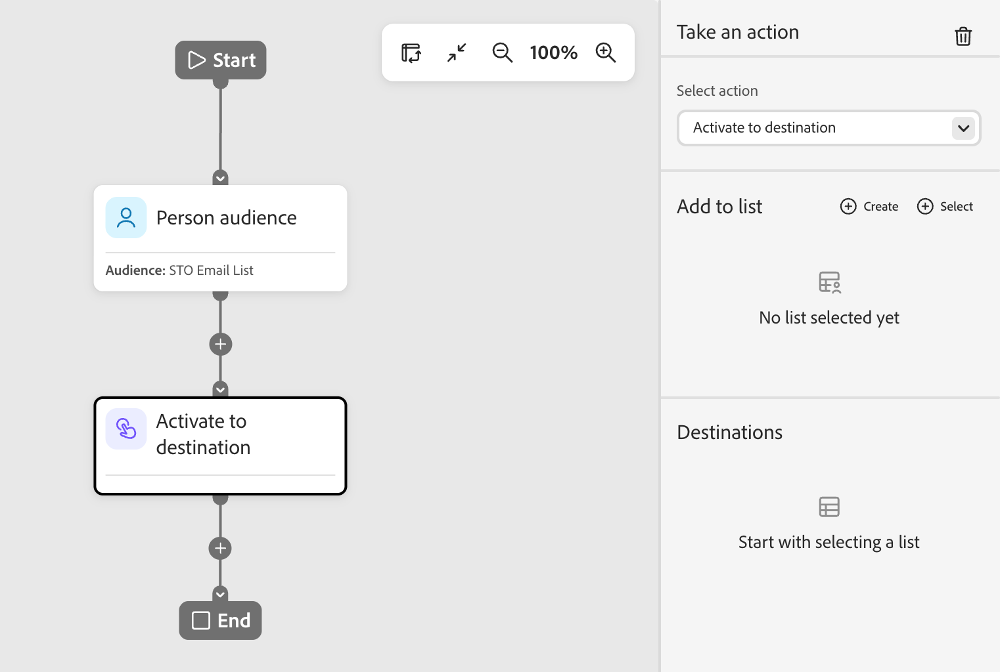
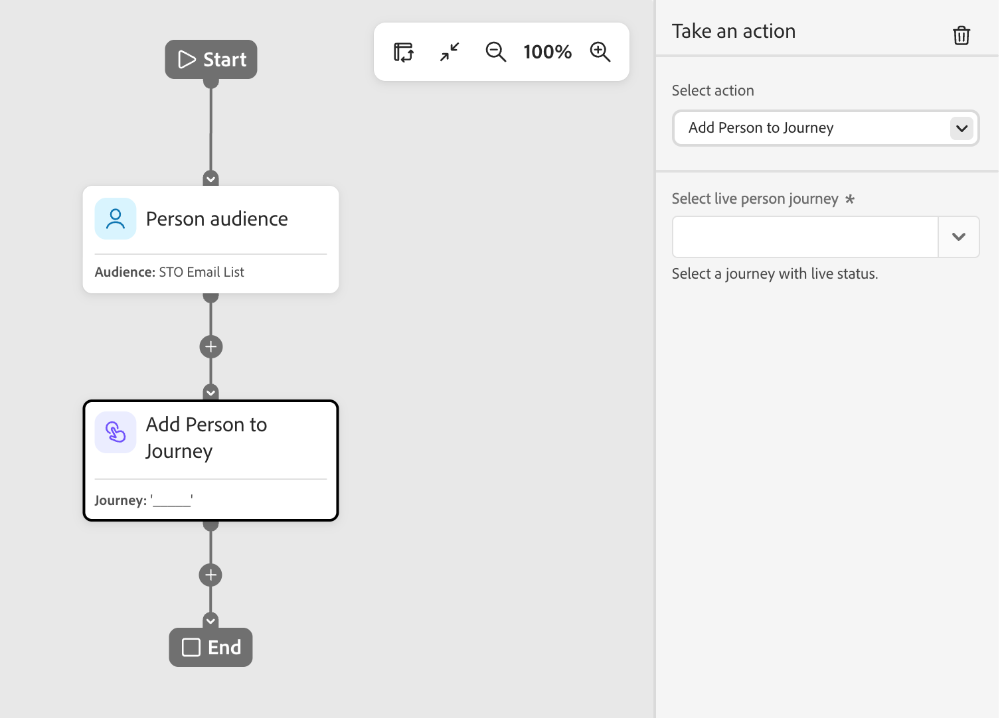
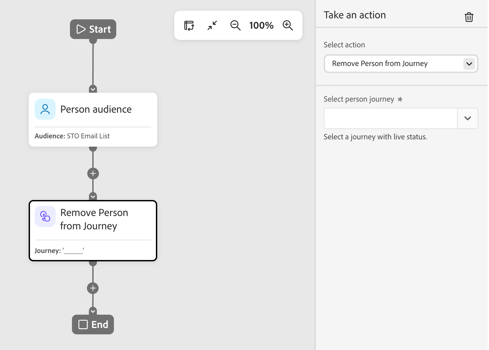

# Realizar un nodo de acción

En el recorrido de una persona, utilice una acción para las personas cuando desee aplicar un cambio a todas las personas de la ruta del nodo.

## Acciones y restricciones {#actions}

| Acción | Restricciones |
| ------ | ----------- |
| **[!UICONTROL Activar en destino]** | <li>Seleccionar o crear una lista estática <li>Si la lista no tiene un destino activado, active la lista |
| **[!UICONTROL Agregar persona al Recorrido]** | <li>Seleccionar un recorrido programado o activo <li>No se aplican los criterios de audiencia del recorrido de destinatario |
| **[!UICONTROL Agregar A La Lista]** | <li>Cree una nueva lista estática o seleccione una existente |
| **[!UICONTROL Agregar a la lista de Marketo]** | <li>Seleccione una lista estática en Marketo Engage |
| **[!UICONTROL Cambiar valor de datos]** | <li>Seleccionar atributo de persona <li>Establecer nuevo valor |
| **[!UICONTROL Cambiar datos de programa]** | <li>Seleccionar atributo de programa <li>Establecer nuevo valor |
| **[!UICONTROL Cambiar estado del programa]** | <li>Seleccionar programa<li>Seleccionar nuevo estado |
| **[!UICONTROL Quitar De La Lista]** | <li>Seleccionar lista estática <li>Omite la persona si actualmente no es miembro |
| **[!UICONTROL Quitar de la lista de Marketo]** | <li>Seleccione una lista estática en Marketo Engage <li>Omite la persona si actualmente no es miembro |
| **[!UICONTROL Quitar persona del Recorrido]** | <li>Seleccionar un recorrido activo <li>Omite la persona si actualmente no es miembro del recorrido de destinatario |
| **[!UICONTROL Solicitar Marketo Campaign]** | <li>Seleccione una campaña de Marketo Engage |
| **[!UICONTROL Enviar correo electrónico]** | <li>Crear, editar o utilizar un correo electrónico personalizado con IA <li>Optimización del tiempo de envío (opcional) |
| **[!UICONTROL Enviar WhatsApp]** | <li>Seleccione un mensaje de WhatsApp |

## Añadir un nodo de acción {#add-an-action-node}

1. Navegue hasta el lienzo de recorrido.

1. Haga clic en el icono de signo más ( **+** ) en una ruta y elija **[!UICONTROL Realizar una acción]**.

   {width="200"}

1. En las propiedades del nodo, a la derecha, seleccione una acción de la lista y establezca los valores para la acción.

+++Activar en destino

Utilice esta acción para activar personas en destinos de Experience Platform directamente desde el recorrido. Seleccione el destino e introduzca un nombre de audiencia para identificar la audiencia activada en el destino.

{width="450"}

+++

+++[!UICONTROL Agregar persona al Recorrido]

Utilice esta acción para agregar personas a otros recorridos programados o en directo. Las personas añadidas a través de esta acción se añaden inmediatamente a la audiencia del recorrido objetivo; no se aplican los criterios de audiencia del recorrido.

{width="450"}

+++

+++[!UICONTROL Agregar A La Lista]

Utilice esta acción para añadir personas a una lista estática en Journey Optimizer B2B Prime.

{width="450"}

Elija una de las siguientes opciones:

* **[!UICONTROL Crear]**: cree un nuevo recurso de lista estática y agréguele personas. La lista está disponible inmediatamente para que otros recursos la utilicen en Journey Optimizer B2B Prime.
* **[!UICONTROL Seleccionar]**: selecciona un recurso de lista estática existente en el que desea agregar personas que lleguen al nodo.

+++

+++[!UICONTROL Agregar a la lista de Marketo]

Utilice esta acción para agregar personas a una lista estática en Marketo Engage.

{width="450"}

+++

+++[!UICONTROL Cambiar valor de datos]

Utilice esta acción para actualizar el valor de un atributo en un registro de persona. Seleccione el atributo y defina el nuevo valor.

>[!TIP]
>
>Para borrar el valor de un atributo, establezca el valor en `NULL`.

{width="450"}

+++

+++[!UICONTROL Cambiar datos de programa]

Utilice esta acción para actualizar el valor de un atributo de programa. Seleccione el atributo del programa y defina el nuevo valor.

{width="450"}

+++

+++[!UICONTROL Cambiar estado del programa]

Utilice esta acción para cambiar el estado de una persona en un programa de Marketo Engage. Seleccione el programa y, a continuación, seleccione el nuevo estado.

{width="450"}

+++

+++[!UICONTROL Quitar De La Lista]

Utilice esta acción para eliminar personas de una lista estática en Journey Optimizer B2B Prime. Si una persona no es miembro de la lista, la acción se omitirá para esa persona.

{width="450"}

+++

+++[!UICONTROL Quitar de la lista de Marketo]

Utilice esta acción para eliminar personas de una lista estática en Marketo Engage. Si una persona no es miembro de la lista, la acción se omitirá para esa persona.

{width="450"}

+++

+++[!UICONTROL Quitar persona del Recorrido]

Utilice esta acción para eliminar personas de otros recorridos de personas activas. La persona se elimina inmediatamente del recorrido de destino y no se realizan más acciones al respecto. Si una persona no es actualmente miembro del recorrido de destino, la acción se omitirá para esa persona.

{width="450"}

+++

+++[!UICONTROL Solicitar Marketo Campaign]

Utilice esta acción para añadir personas a una campaña de solicitud en una instancia de Marketo Engage conectada. Seleccione la campaña de Marketo Engage que desea solicitar.

{width="450"}

+++

+++[!UICONTROL Enviar correo electrónico]

Utilice esta acción para enviar un correo electrónico a las personas incluidas en la opción. Las personas que han cancelado la suscripción, están en la lista de bloqueados, están suspendidas por correo electrónico o están suspendidas por marketing omiten esta acción.

{width="450"}

Puede crear un correo electrónico, editar uno existente o utilizar un correo electrónico personalizado con IA. Para obtener información sobre cómo crear y editar correos electrónicos, consulte [Canal de correo electrónico](../marketing/email-channel.md).

Puede usar [Optimización del tiempo de envío](../marketing/email-send-time-optimization.md) para personalizar el tiempo de envío del correo electrónico mediante la predicción de cuándo es más probable que se involucre cada perfil.

+++

+++[!UICONTROL Enviar WhatsApp]

Utiliza esta acción para enviar un mensaje de WhatsApp. Puede crear, personalizar y previsualizar mensajes de WhatsApp en el espacio de diseño visual (consulte [Creación de WhatsApp](../content/whatsapp-authoring.md)).

{width="450"}

+++
