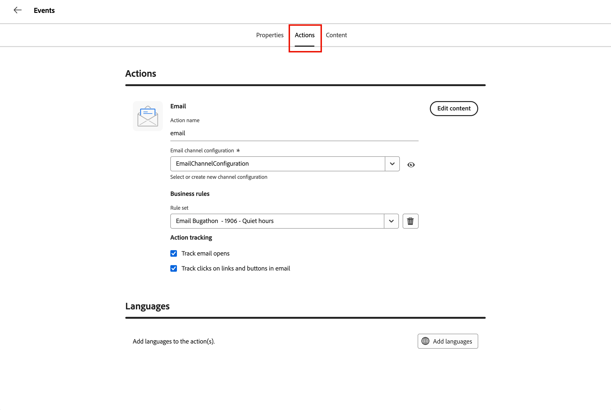

# Adición de correos electrónicos a recorrido

[!DNL Adobe Journey Optimizer B2B Prime] ofrece a los especialistas en marketing B2B una experiencia moderna de creación y envío de correo electrónico de nivel empresarial.

>[!NOTE]
>
>Si envía un correo electrónico por primera vez, asegúrese de que [capacidad de entrega de correo electrónico](../start/email-deliverability.md) y el [canal de correo electrónico](../admin/email-channel-configuration.md) necesario estén configurados.

<!-- 
* **Email channel configurations** - Manage the sender identity, reply behavior, marketing vs. transactional message types, and tracking.
* **Email deliverability controls** - Set up your email deliverability channel, including subdomain delegation (Fully Delegated and CNAME methods), DMARC, SPF/DKIM auto-configuration, and shared IP pool support.
* **Send Email action** - From a journey, add a _Send email_ action node, including personalization using profile attributes (Handlebars syntax).
* **Visual drag-and-drop email design tools** -  Design your email content with structures, content components, themes, dark-mode support, and reusable visual fragments.
* **Marketo Design Studio assets** — Choose images and assets from a one-time copy of your Marketo Engage asset library directly inside the email canvas.
* **Reusable templates and fragments** — Save common headers, footers, CTAs, and full email layouts and reuse them across journeys.
* **Role-Based Access Control (RBAC)** — Apply granular permissions for creating, editing, approving, and sending email. 
-->

## Limitaciones actuales {#limitations}

* **Los perfiles de prueba, Simular contenido y Enviar prueba** no están disponibles en esta versión. Los informes de spam basados en Litmus rendering y SpamAssassin están en la hoja de ruta de GA.
* La personalización de nivel de cuenta y los datos de objeto personalizado **1 no están disponibles en esta versión.** Utilice atributos de perfil.
* La **migración automatizada de Velocity-to-Handlebars** de las plantillas de Marketo Engage existentes se enviará en GA.
* **Los comentarios y la colaboración en los correos electrónicos** (comentarios en línea, @mentions, flujo de trabajo de solicitud y revisión) se publicarán en una próxima versión.
* Las integraciones de **AEM Assets, fragmentos de contenido de AEM y Adobe Express** se encuentran en la hoja de ruta de _Seguimiento rápido_.

## Conceptos clave {#key-concepts}

Antes de crear correos electrónicos para recorridos de personas y contenido de correo electrónico, revise estos conceptos:

| Concepto | En [!DNL Adobe Journey Optimizer B2B Prime] |
| ------- | ---------------------- |
| **_Espacio de diseño de correo electrónico_** | El lienzo visual y las herramientas de diseño utilizadas para componer el contenido del correo electrónico. Incluye componentes de diseño de arrastrar y soltar, plantillas, fragmentos, temáticas y un editor de personalización. |
| **_Plantilla_** | Diseño de correo electrónico reutilizable disponible para crear un nuevo correo electrónico. Puede ser una plantilla de ejemplo integrada proporcionada por Adobe o una plantilla personalizada creada por su equipo. |
| **_Fragmento visual_** | Bloque de contenido reutilizable (como encabezado, pie de página, CTA, exención de responsabilidad legal) que se puede insertar en varios correos electrónicos. La actualización de un fragmento propaga el cambio a cada correo electrónico que lo utiliza. |
| **_Tema_** | Un ajuste preestablecido de estilo reutilizable (colores, tipografía, espaciado, estilos de botón) aplicado en un correo electrónico. |
| **_Token de Personalization_** | Una expresión Handlebars, por ejemplo, `{{profile.firstName}}`, se resuelve en el momento del envío con los datos de perfil de cada destinatario. |
| **_Enviar acción por correo electrónico_** | Nodo de acción de recorrido que utiliza una configuración de canal y contenido de correo electrónico para enviar un correo electrónico. |

## Adición de un correo electrónico desde un recorrido

Para enviar correo electrónico desde un recorrido, [agregue un nodo _Realice una acción_](action-nodes.md#add-an-action-node) y configúrelo para enviar correo electrónico.

1. En el lienzo del recorrido, haga clic en el icono **+** y seleccione **[!UICONTROL Realizar una acción]**.

1. En las propiedades del nodo a la derecha, establezca la acción en **[!UICONTROL Enviar correo electrónico]**.

   {width="500"}

1. Elija la fuente de correo electrónico:

   * **Crear/editar correo electrónico**: elija esta opción para definir el contenido del correo electrónico, incluida la línea de asunto, la información del remitente y el cuerpo del correo electrónico en el espacio de diseño del correo electrónico.

   * **[!UICONTROL Usar un correo electrónico personalizado con IA]** - (_No disponible para Beta_) Elija esta opción para restringir un correo electrónico generado por IA en el espacio de diseño de correo electrónico. Estos correos electrónicos están optimizados para que los clientes de la bandeja de entrada asistida por IA fundamenten sus resúmenes y respuestas en sus ofertas y llamadas a la acción.

1. Haga clic en **[!UICONTROL Crear correo electrónico]**.

1. En el cuadro de diálogo _[!UICONTROL Crear correo electrónico]_, escriba un **[!UICONTROL Nombre]** único (obligatorio) y una **[!UICONTROL Descripción]** (opcional).

   {width="400"}

1. Haga clic en **[!UICONTROL Crear]**.

Para la [optimización del tiempo de envío](email-send-time-optimization.md) opcional, configure el nodo de acción de recorrido después de crear el correo electrónico.

## Definir las propiedades y acciones del correo electrónico {#define-email-properties}

La página de correo electrónico se abre al crear un correo electrónico para un nodo _[!UICONTROL Enviar correo electrónico]_. También puede acceder a esta página una vez creado el correo electrónico haciendo clic en **[!UICONTROL Editar correo electrónico]** en las propiedades del nodo a la derecha.

1. (Opcional) En la pestaña **[!UICONTROL Propiedades]**, escriba la información descriptiva que desee capturar para el correo electrónico.

1. Seleccione la ficha **[!UICONTROL Acciones]** y complete la configuración funcional del correo electrónico:

   * **[!UICONTROL Correo electrónico]** - Seleccione o cree una **[!UICONTROL configuración de canal de correo electrónico]** para usar.

     Este es el conjunto reutilizable de configuraciones de envío de correo electrónico que define la identidad del remitente, la dirección de respuesta, el subdominio, el grupo de IP, el tipo de correo electrónico (de marketing o transaccional) y el seguimiento. Haga clic en el icono _Ver_ para revisar la configuración seleccionada.

     Los administradores crean configuraciones en [Configuración del canal de correo electrónico](../admin/email-channel-configuration.md).

   * **[!UICONTROL Reglas de negocio]**: (Opcional) aplique reglas de límite a su acción de correo electrónico seleccionando un conjunto de reglas.

   * **[!UICONTROL Seguimiento de acciones]**: seleccione las casillas de verificación de las acciones que desee rastrear para el correo electrónico.

   {width="600" zoomable="yes"}

1. Haga clic en **[!UICONTROL Editar contenido]** o seleccione la pestaña **[!UICONTROL Contenido]**.

1. Escriba el texto de **[!UICONTROL Línea de asunto]** que desee mostrar en el campo de asunto del correo electrónico.

   Haga clic en el icono _Personalizar_ (  ) para usar un token de personalización en el campo.

1. (Opcional) Seleccione la casilla de verificación **[!UICONTROL Optimizar tamaño de HTML]** para reducir el tamaño de su HTML de correo electrónico durante el proceso de publicación.

   Esto ayuda a evitar el recorte del correo electrónico en clientes como Gmail, que trunca los mensajes que exceden los 100 KB. Consulte [_Optimizar el tamaño de HTML del correo electrónico_](#optimize-html-size) para obtener más información.

1. Haga clic en **[!UICONTROL Editar cuerpo del correo electrónico]** para acceder a las herramientas de diseño visual y comenzar a [crear su contenido](../content/email-authoring.md).

   También puede hacer clic en **[!UICONTROL Editor de código]** para codificar su propio contenido en HTML sin formato. Si tiene HTML existente para reutilizarlo en su diseño de correo electrónico, puede copiarlo y pegarlo en el editor.

### Comprobación de alertas {#alerts}

[!DNL Adobe Journey Optimizer B2B Prime] muestra los problemas en la esquina superior derecha de la página de correo electrónico. Resuelva todos los errores antes de activar el recorrido. Las advertencias solo son recomendaciones.

**Errores** (evitar la activación del recorrido):

* El nombre de remitente está vacío
* Falta la línea de asunto
* El contenido del correo electrónico está vacío

**Advertencias** (recomendaciones):

* El vínculo de no participación no está presente en el cuerpo del correo electrónico
* La versión de texto de HTML está vacía
* Vínculos vacíos detectados
* El correo electrónico supera los 100 K

## Optimizar tamaño de HTML de correo electrónico {#optimize-html-size}

>[!CONTEXTUALHELP]
>id="ajo-b2b-prime_email_minification"
>title="Reducir tamaño de HTML"
>abstract="Habilite esta opción para comprimir el HTML de correo electrónico durante la publicación eliminando los espacios en blanco innecesarios, la sangría y los comentarios no esenciales. Esto ayuda a evitar el recorte del correo electrónico en clientes como Gmail, que trunca los mensajes que exceden los 100 KB."

[!DNL Journey Optimizer B2B Prime] le permite comprimir su versión de HTML de correo electrónico durante el proceso de publicación al eliminar espacios en blanco, sangrías y comentarios no esenciales innecesarios. Mantener el tamaño pequeño de HTML le ayuda a lo siguiente:

* Evite **recortes de correo electrónico**: algunos clientes, como Gmail, truncan mensajes de más de ~100 KB, lo que impide que los destinatarios vean todo el contenido.
* Mejorar **tiempo de carga del correo electrónico** en la bandeja de entrada del destinatario.
* Mejore la capacidad de **entrega** y reduzca el uso del ancho de banda.

Esta optimización no se aplica automáticamente; debe habilitarla en la ficha _[!UICONTROL Contenido]_.

<!--  -->

>[!IMPORTANT]
>
> La reducción del tamaño de la HTML solo se aplica en el momento de la publicación.

La optimización es segura para el cliente de correo electrónico:

* Conserva los comentarios condicionales de MSO/Outlook.
* No altera el contenido, las imágenes ni los vídeos reales.

>[!NOTE]
>
>La reducción del tamaño del correo electrónico depende de la estructura original de HTML del correo electrónico. Si el contenido ya es compacto o la carga útil del correo electrónico es muy grande, la reducción puede ser mínima y puede que no impida completamente el recorte en todos los casos.

<!-- 
Proof and simulate workflows are not available in this release. See [Current limitations](#limitations).

### Test HTML size optimization {#optimize-html-proof}

If you have enabled the [HTML size optimization](#optimize-html-size) option, you can evaluate its impact before publishing when sending proofs. Follow the following steps.

1. In the email design space, click the _Issues_ icon on the top right. If the rendered email size exceeds 100 KB, a message is displayed to warn you that this may cause truncation in some email clients.

1. Click **[!UICONTROL Simulate content]**.

1. To test the optimized version, click the **[!UICONTROL Send proof]** button and select the **[!UICONTROL Optimize HTML size]** option. This will send a proof with the reduced HTML size to your test recipients.

    >[!NOTE]
    >
    >This setting is independent from the email editor — the proof reflects what you select in the proof, regardless of whether the option is enabled or disabled in the email itself.

1. Select the test recipients and click **[!UICONTROL Send proof]**.

1. Back in the **[!UICONTROL Simulate]** screen, click the **[!UICONTROL View Proof]** button.

1. Click the _Information_ icon next to the status of the proof.

   The optimization details are displayed in a pop-up window, including the original HTML size, the optimized HTML size, and the size reduction percentage.
    
    Use this information to validate the optimized output and confirm the email stays within the recommended 100 KB threshold before publishing.

-->
