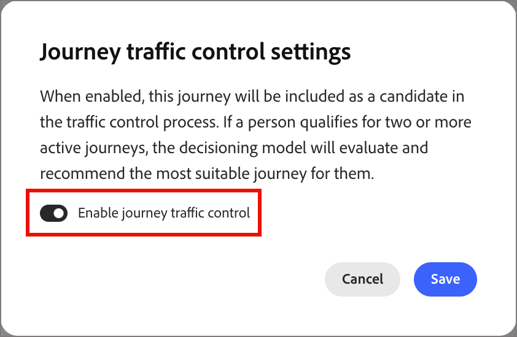
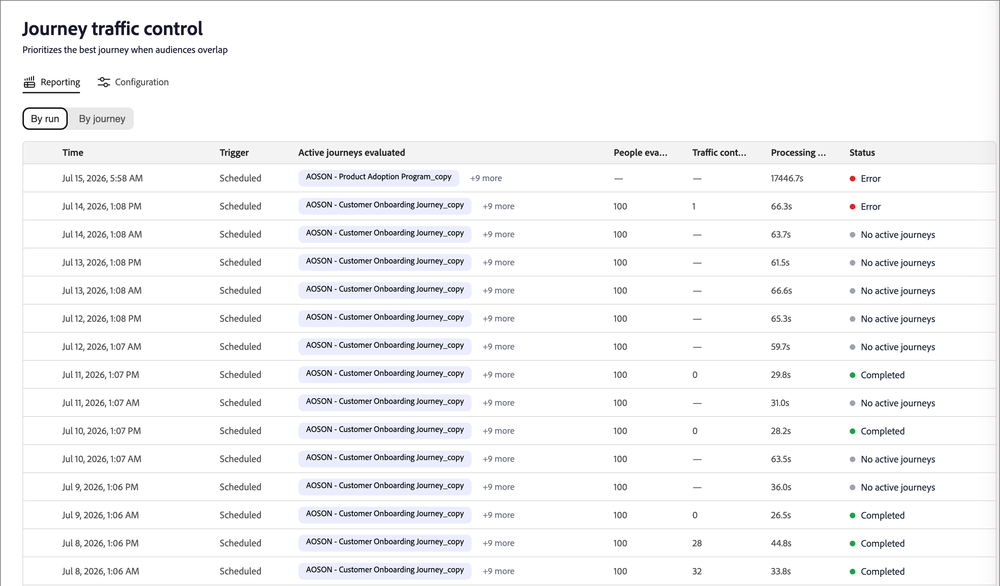

# control de tráfico de recorrido

El control de tráfico de recorrido (JTC) prioriza el mejor recorrido para una persona cuando las audiencias se superponen. Cuando una persona cumple los requisitos para varios recorridos habilitados para JTC, un modelo de IA los evalúa frente a cada candidato y los agrega al recorrido que mejor se ajuste, excluyéndolos de los demás.

>[!NOTE]
>
>El control de tráfico de recorrido funciona del mismo modo para [!DNL Journey Optimizer B2B Ultimate] y [!DNL Journey Optimizer B2B Prime]. La capacidad y la lógica son idénticas; solo existen diferencias menores en la interfaz de usuario entre los niveles. La información de esta página refleja la experiencia [!DNL Journey Optimizer B2B Prime].

Una vez que la persona completa el recorrido, se le reevalúan los recorridos restantes para los que sigue siendo calificado. A continuación, JTC los agrega al siguiente recorrido con mejor ajuste, y así sucesivamente. Esto evita que la misma persona se asigne a varios recorridos superpuestos simultáneamente y garantiza que cada contacto reciba primero la experiencia más relevante.

>[!NOTE]
>
>Actualmente, una persona solo puede colocarse en un recorrido seleccionado por JTC a la vez. En una versión futura se ha planificado una opción de configuración de administrador para permitir que una persona se inscriba en más de un recorrido simultáneamente.

## Dimensiones de puntuación {#scoring-dimensions}

El modelo evalúa la combinación de recorridos de cada persona en siete dimensiones de puntuación. Cada dimensión se puntúa de forma independiente y, a continuación, se combina, según los pesos que configure, para producir una probabilidad de coincidencia final para esa persona y recorrido. Se selecciona el recorrido con la coincidencia más sólida.

| Dimensión | Qué evalúa |
|---|---|
| Alineación por intención | Señales de intención de comportamiento: búsquedas de palabras clave, visitas a la página del producto, descargas de contenido, aperturas/clics por correo electrónico y actividad de página de precios. |
| Ajuste de audiencia | La cantidad de coincidencias de la persona con la [audiencia de destino](./person-audience-node.md) para el recorrido. |
| Ajuste personal | Alineación entre la función/[persona](../audiences/personas.md) de la persona y el recorrido. |
| Ajuste firmográfico | Atributos de nivel de compañía (como industria, tamaño e ingresos). |
| Coincidencia demográfica | Atributos demográficos por persona. |
| Alineación psicográfica | Alineación basada en actitudes/preferencias. |
| Ajuste de compromiso | Actualización y profundidad del [compromiso](../audiences/engagement-scores.md) de la persona. |

Las dimensiones para las que una persona no tiene datos se omiten automáticamente, por lo que la puntuación nunca se penaliza por la falta de atributos.

>[!IMPORTANT]
>
>Al menos dos recorridos deben tener JTC habilitado para poder hacer cualquier cosa significativa. No es eficaz permitirlo en un solo recorrido, ya que no existe ningún recorrido contrario de arbitraje. Solo cuando dos o más recorridos están habilitados para JTC el modelo comienza a resolver conflictos.

## Prerrequisitos {#prerequisites}

Antes de que el control de tráfico de recorrido pueda producir resultados, tenga en cuenta lo siguiente:

* **Los informes requieren un recorrido publicado y habilitado para JTC.** La ficha _[!UICONTROL Informes]_ no muestra ningún dato hasta que se publique al menos un recorrido con el control de tráfico de recorrido habilitado.
* **La simulación requiere al menos un recorrido publicado en la instancia.** La simulación evalúa [perfiles](../audiences/people-lists.md) que ya están en recorridos activos, por lo que se requiere al menos un recorrido publicado en la instancia para poder dibujar perfiles de. La simulación en sí no requiere que JTC esté habilitado (consulte [_Simular puntuación_](#simulate-scoring)).

## Empezar {#get-started}

Seleccione **[!UICONTROL control de tráfico de Recorrido]** en el panel de navegación izquierdo. La página mostrada tiene dos pestañas:

* **[!UICONTROL Informes]**: vea los resultados de las ejecuciones de control de tráfico (que se rellenan solamente después de que JTC se haya ejecutado en recorridos activos).
* **[!UICONTROL Configuración]**: ajuste las dimensiones de puntuación, simule los resultados y elija los recorridos que participarán.

>[!IMPORTANT]
>
>Para un cliente nuevo que nunca ha usado el control de tráfico de recorrido, la ficha _[!UICONTROL Informes]_ está vacía. Los informes solo reflejan los recorridos a los que se ha aplicado y ejecutado control de tráfico. Comience en la ficha _[!UICONTROL Configuración]_.

## Pestaña Configuración {#configuration-tab}

La ficha _[!UICONTROL Configuración]_ tiene dos secciones: **[!UICONTROL Ajustar puntuación de dimensión]** y **[!UICONTROL Seleccionar recorridos]**.

### Ajustar puntuación de dimensión {#adjust-dimension-scoring}

En esta sección se establece la contribución de cada una de las siete dimensiones al resultado final de la coincidencia. Cada dimensión se puede establecer con una importancia de **[!UICONTROL Off]**, **[!UICONTROL Low]**, **[!UICONTROL Medium]** o **[!UICONTROL High]**. El porcentaje que se muestra en cada tarjeta es la contribución normalizada de esa dimensión después de combinar todas sus selecciones: las siete ponderaciones siempre suman el 100%. Al aumentar una dimensión, se vuelven a normalizar automáticamente las demás para que el total se mantenga en el 100 %.

Haga clic en **[!UICONTROL Restablecer a igual]** para que todas las dimensiones vuelvan a una ponderación par.

{width="800" zoomable="yes"}

### Simular puntuación {#simulate-scoring}

Antes de comprometer pesos en la producción, puede simular cómo se comportaría el control de tráfico con esos cambios. La simulación no requiere que esté activado el control de tráfico de recorrido. Evalúa perfiles que ya están en sus recorridos activos y les aplica la lógica de control de tráfico, para que pueda juzgar si los resultados se ven correctos para los pesos que ha elegido.

1. Elija cuántos perfiles simular.

1. Haga clic en **[!UICONTROL Simular puntuación]**.

El encabezado de resultados resume la ejecución:

* **Perfiles evaluados**: cuántos perfiles se puntuaron y en cuántos recorridos.
* **Promedio de conflictos/perfil**: el promedio de recorridos en competencia por perfil.
* **Puntuación media de coincidencia**: la confianza media de los recorridos seleccionados.

{width="700" zoomable="yes"}

Debajo del resumen, cada perfil evaluado aparece como una tarjeta que muestra el recorrido seleccionado, la justificación clave, las señales de intención y la puntuación de la coincidencia. Seleccione un perfil con el que abrir una vista de detalles:

* **Puntuación de coincidencia** — La coincidencia general, con un desglose por dimensión codificado por color.
* **Decisión**: los recorridos para los que esta persona cumple los requisitos, cuál se seleccionó y por qué.
* **Puntuaciones de Dimension por peso**: puntuaciones por dimensión que condujeron la decisión, ampliables para mostrar las señales subyacentes.

{width="450" zoomable="yes"}

Cuando esté satisfecho con el resultado, puede:

* Ajuste los pesos de dimensión y haga clic en **[!UICONTROL Ejecutar de nuevo]** para volver a ejecutar la simulación.

* Haga clic en **[!UICONTROL Aplicar a la producción]** para confirmar los pesos.

  Las nuevas decisiones de control de tráfico utilizan la nueva configuración inmediatamente; las decisiones anteriores no se ven afectadas. Los pesos que ha probado aparecen en la pestaña principal _[!UICONTROL Configuración]_ y se usan para cualquier recorrido que el control de tráfico esté evaluando en su entorno activo.

También puede salir de la página sin aplicar las ponderaciones.

<!--

This section does not appear in the staging environment

### Select journeys {#select-journeys}

The _[!UICONTROL Select journeys]_ section is where you choose which journeys participate in traffic control.

>[!IMPORTANT]
>
>Only draft journeys are available for selection. Traffic control cannot be enabled for a journey that is already live. When JTC is enabled for a journey and then that journey is published, it cannot be disabled.

-->

## Habilitar el control de tráfico para los recorridos {#enable-traffic-control-journey}

Cuando dos o más recorridos tienen habilitado el control de tráfico de recorrido y se publican:

* Cualquier persona que cumpla los requisitos de uno o más de estos recorridos se evalúa en función de su perfil y de los metadatos del recorrido.
* Si una persona cumple los requisitos para varios recorridos habilitados para JTC a la vez (por ejemplo, cinco), el modelo determina cuál es el mejor recorrido en ese momento e inscribe a la persona en ese único recorrido. Se mantienen fuera de los otros.
* La persona pasa por ese recorrido hasta que se completa.
* Una vez finalizados, se vuelven a evaluar frente a los recorridos restantes para los que aún están calificados y se añaden al siguiente mejor, repitiendo hasta que no queden recorridos calificados.

### Habilitar JTC para un recorrido de borrador {#enable-traffic-control-draft-journey}

El control de tráfico de recorrido se puede habilitar directamente en un recorrido individual cuando está en estado _Borrador_. <!-- This is the same setting surfaced from the admin/configuration flow — enabling it in either place keeps the two in sync. -->

1. En el panel de navegación izquierdo, expanda **[!UICONTROL Administración de mercadotecnia]**.

1. A la derecha de la lista de recursos de **[!UICONTROL Marketing]**, seleccione **[!UICONTROL recorridos de persona]**.

1. Haga clic en el nombre del recorrido de la persona del borrador para abrirlo.

1. Haga clic en **[!UICONTROL ... Más]** en la parte superior derecha y elige **[!UICONTROL Recorrido de la configuración de control de tráfico]**.

   {width="700" zoomable="yes"}

1. En el cuadro de diálogo, habilite la opción **[!UICONTROL Habilitar el control de tráfico de recorrido]**.

   El cuadro de diálogo de configuración explica el comportamiento: cuando está habilitado, el recorrido se convierte en candidato y el modelo evalúa y recomienda el recorrido más adecuado para una persona que cumple los requisitos para varios recorridos activos.

   {width="380"}

1. Haga clic en **[!UICONTROL Guardar]**.

>[!IMPORTANT]
>
>La opción se puede cambiar en cualquier momento mientras el recorrido permanezca en el estado _Borrador_. <!-- If it was already enabled from the admin section (or previously enabled by someone else), the toggle appears on. --> Después de publicar el recorrido con JTC habilitado, el control de tráfico evalúa la entrada en ese recorrido y ya no puede deshabilitar la configuración.

### Optimización de la descripción del recorrido {#optimize-journey-description}

El agente de control de tráfico puede utilizar de forma eficaz los metadatos de un recorrido (los nodos del recorrido, el nombre de la audiencia y señales estructurales similares) para informar su decisión. Sin embargo, se beneficia en gran medida de una descripción detallada del recorrido que establece claramente el propósito y los objetivos del recorrido.

Una descripción sólida le da al modelo el contexto que necesita para tomar una decisión mejor informada sobre si una persona pertenece a ese recorrido en comparación con otra competidora. Esto es más importante cuando un recorrido es muy básico. Por ejemplo, un recorrido con pocos nodos ofrece un contexto limitado, por lo que una descripción clara de su objetivo y de la audiencia de destino ayuda al modelo a elegir correctamente.

>[!TIP]
>
>Trate la descripción del recorrido como una entrada al modelo de toma de decisiones, no solo a la documentación interna. Describa el propósito del recorrido (lo que intenta lograr), sus objetivos y la audiencia a la que está destinado. Cuanto más explícita sea la descripción, con mayor precisión el control de tráfico puede arbitrar cuando una persona cumple los requisitos para varios recorridos superpuestos, especialmente para recorridos ligeros con pocos nodos.

## Pestaña Informes {#reporting-tab}

Una vez habilitado el control de tráfico para dos o más recorridos con ejecuciones completadas, la ficha _[!UICONTROL Informes]_ muestra los resultados. Hay dos vistas: **[!UICONTROL Por ejecución]** y **[!UICONTROL Por recorrido]**.

### Por ejecución {#by-run}

La vista _[!UICONTROL By run]_ enumera todos los controles de tráfico ejecutados. En cada ejecución, puede ver la hora, el déclencheur (programado o manual), los recorridos activos evaluados, las personas evaluadas, las decisiones de control de tráfico, el tiempo de procesamiento y el estado. Seleccione una ejecución para abrir un panel de detalles con estas métricas clave para la ejecución, junto con la lista de recorridos evaluados en esa ejecución.

{width="700" zoomable="yes"}

### Por recorrido {#by-journey}

Use la vista _Por recorrido_ para inspeccionar cómo el control de tráfico afectó a un recorrido determinado. La tabla muestra, por recorrido, el número de personas evaluadas, inscritas en este recorrido, trasladadas a otros recorridos y ya activas.

{width="700" zoomable="yes"}

<!--
Selecting a journey opens a detail panel:

* **Summary** — Total people evaluated, broken down into _Enrolled in this journey_, _Moved to other journeys_, and _Already active_.
* **Competing journeys** — Every journey that had people competing with this one, and how many were enrolled in each.
* **People evaluated** — The individual people, each with an outcome (_Enrolled_, _Moved_, or _Already active_), competing journeys, and match score.

>[!TIP]
>
>The sum of enrolled people across all competing journeys always equals the _Moved to other journeys_ count in the summary. _Already active_ means the person was already in the journey when the evaluation occurred.

Selecting an individual person shows the same detail view as in simulation: the match score, the decision (competing journeys and which journey was selected and why), and the full dimension breakdown behind the selection.
-->
