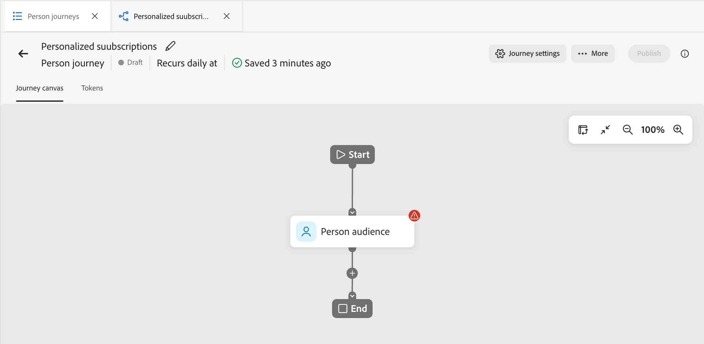

# Recorridos de la persona

En [!DNL Adobe Journey Optimizer B2B Edition Prime], los recorridos de personas son planes de marketing automatizados y basados en posibles clientes en varios pasos que organizan experiencias personalizadas en varios canales. Estos recorridos utilizan los datos de Marketo Engage para ejecutar estos planes de marketing en respuesta a la participación, los eventos comerciales o las campañas programadas.

>[!NOTE]
>
>Cada recorrido reside dentro de un [programa](./programs.md) definido. Debe tener al menos un programa para utilizarlo como elemento principal antes de crear un recorrido.

_Para generar un nuevo recorrido de persona :_

1. Cree el recorrido de persona.
1. Añada los nodos y defina el flujo de recorrido en el lienzo de recorrido.
1. [Publicación del recorrido](#publish-a-journey).

## Acceso y exploración de recorridos de persona {#access-and-browse-person-journeys}

1. En el panel de navegación izquierdo, expanda **[!UICONTROL Administración de mercadotecnia]**.

1. A la derecha de la lista de recursos de **[!UICONTROL Marketing]**, seleccione **[!UICONTROL recorridos de persona]**.

   La lista _recorridos de personas_ se muestra como una página con fichas en el área de trabajo principal.

   Puede escribir texto en la herramienta _Buscar_ situada en la parte superior de la lista para filtrar la lista mostrada por nombre.

   {width="800" zoomable="yes"}

1. Utilice las herramientas de lista para personalizar la lista mostrada:

   * Haga clic en el icono _Filtro_ (  ) para filtrar la lista por estado.
   * Haga clic en el icono _Personalizar tabla_ (  ) para controlar las columnas mostradas.
   * Haga clic en el icono _Restablecer columnas_ (  ) para restablecer los anchos de columna.

### Columnas de lista de recorrido {#journey-list-columns}

La página de lista recorridos incluye las siguientes columnas:

* [!UICONTROL Nombre] (haga clic en el nombre para abrir el lienzo de recorrido y editarlo)
* [!UICONTROL Estado]
* [!UICONTROL Fecha de creación]
* [!UICONTROL Creado por]
* [!UICONTROL Última actualización]
* [!UICONTROL Última actualización]
* [!UICONTROL Publicado el]
* [!UICONTROL Publicado por]
* [!UICONTROL Fecha de inicio]
* [!UICONTROL Fecha de finalización]

Puede ordenar la lista por _[!UICONTROL Estado]_, _[!UICONTROL Fecha de creación]_ o _[!UICONTROL Última actualización]_ al hacer clic en el encabezado de la columna. Puede capturar y arrastrar los bordes del encabezado para cambiar los anchos de columna mostrados. En el diálogo _Personalizar tabla_, active o desactive las casillas de verificación y haga clic en **[!UICONTROL Aplicar]**.

### Estado del recorrido {#journey-status}

El estado de un recorrido puede cambiar según las acciones que se apliquen. En función del estado de un recorrido, ciertas acciones están disponibles en el lado derecho del encabezado.

| Estado | Descripción | Acciones disponibles |
| ------ | ----------- | ----------------- |
| _&#x200B;**Borrador**&#x200B;_ | Un recorrido sin publicar que se puede editar. | [Publicar](#publish-a-journey), [Duplicar](#duplicate-a-journey), [Eliminar](#delete-a-journey) |
| _&#x200B;**Activo**&#x200B;_ | El estado del recorrido cambia de _Borrador_ a _Activo_ al publicar un recorrido. En este estado, ya no se puede editar. | [Duplicado](#duplicate-a-journey), [Cerca de nuevas entradas](#close-to-new-entries), [Anular](#abort-a-journey) |
| _&#x200B;**Cerrado a nuevas entradas**&#x200B;_ | El estado del recorrido cambia de _Activo_ a _Cerrado a nuevas entradas_ al hacer clic en **[!UICONTROL Cerca de nuevas entradas]** en el encabezado del recorrido. | [Duplicado](#duplicate-a-journey), [Anular](#abort-a-journey) |
| _&#x200B;**Anulado**&#x200B;_ | El estado del recorrido cambia de _Activo_ o _Cerrado a nuevas entradas_ cuando se anula un recorrido. No se puede reiniciar un recorrido anulado. | [Duplicado](#duplicate-a-journey), [Eliminar](#delete-a-journey) |
| _&#x200B;**Finalizado**&#x200B;_ | Cuando todos los miembros de la audiencia de una persona en un recorrido completan el recorrido, el estado cambia de _Activo_ o _Cerrado a nuevas entradas_ a _Finalizado_. | [Duplicado](#duplicate-a-journey), [Eliminar](#delete-a-journey) |

## Crear un recorrido de persona {#create-a-person-journey}

1. Haga clic en **[!UICONTROL Crear Recorrido]** en la parte superior derecha de la lista de recorrido.

1. En el cuadro de diálogo, seleccione el programa **[!UICONTROL Parent]** para el recorrido de persona.

1. Escriba un **[!UICONTROL Nombre]** único (obligatorio) y una **[!UICONTROL Descripción]** (opcional).

   {width="400"}

1. Haga clic en **[!UICONTROL Crear]**.

   El lienzo de recorrido se abre con el nodo de audiencia de persona de inicio.

   {width="600" zoomable="yes"}

### encabezado de recorrido {#journey-header}

El encabezado de cada lienzo de recorrido incluye el nombre, el estado y la programación del recorrido.

{width="600" zoomable="yes"}

* Haga clic en el icono _Editar_ ( ) para cambiar el nombre del recorrido o la información de la descripción.
* Haga clic en **[!UICONTROL Configuración del Recorrido]** para cambiar el inicio y la periodicidad del recorrido.
* Haga clic en **[!UICONTROL ... Más]** para aplicar una acción de recorrido o para habilitar o deshabilitar el control de tráfico y la reentrada.
* Si se resuelven todos los errores y desea activar el recorrido, haga clic en **[!UICONTROL Publicar]**.

### Diseño de recorrido {#journey-design}

El _lienzo de recorrido_ es la zona central del área de trabajo de recorrido. Es donde puede agregar nodos de recorrido y configurarlos. Haga clic en un nodo para abrir sus propiedades en el panel situado a la derecha del diseño y configúrelas según su diseño. El recorrido de personas siempre comienza con un nodo [_[!UICONTROL Audiencia de personas &#x200B;]_](./person-audience-node.md), donde puede definir la entrada del recorrido.

Después de crear un recorrido de persona y definir la audiencia de persona, genere el recorrido con nodos. El lienzo de recorrido proporciona un espacio de diseño visual en el que puede crear sus casos de uso de marketing B2B de varios pasos utilizando los siguientes tipos de nodos para construir el recorrido:

* [Iniciar una acción](./action-nodes.md)
* [Escuchar un evento](./listen-for-event-nodes.md)
* [Espera](./wait-nodes.md)
* [Dividir rutas](./split-merge-paths-nodes.md)
* [Siguiente mejor ruta](./next-best-path.md)
* [Combinar rutas](./split-merge-paths-nodes.md)

## administración de recorrido {#journey-management}

Abra la lista recorridos para revisar el estado del recorrido, realizar cambios y realizar acciones.

### acciones de recorrido {#journey-actions}

La página de lista recorridos incluye todos los recorridos de persona de la instancia de Journey Optimizer B2B Prime. Desde la página de lista, puede aplicar una serie de acciones a un recorrido.

#### Publicación de un recorrido {#publish}

Puede publicar un recorrido si no hay errores de bloqueador. Cuando se publique, el estado del recorrido cambiará a _Activo_. Si el recorrido tiene errores, el botón **[!UICONTROL Publicar]** aparece atenuado con el mensaje `Resolve errors before publishing`.

1. Abra el recorrido de borrador desde la lista _[!UICONTROL recorridos de persona]_.

1. En la parte superior derecha del lienzo de recorrido, haga clic en **[!UICONTROL Publicar]**.

1. En el cuadro de diálogo _[!UICONTROL Revisar configuración de recorrido]_, establezca las opciones de inicio de recorrido.

   Si ya definió una programación en **[!UICONTROL configuración de Recorrido]**, revise la configuración.

   Si necesita configurar la activación del recorrido, elija un tipo de programación:

   * Para activar el recorrido en el momento de la publicación, elija **[!UICONTROL Inmediatamente]**.
   * Para activar el recorrido en una fecha futura, elige **[!UICONTROL En una fecha específica]** y haz clic en el icono _Calendario_ para seleccionar la fecha.

1. Si es necesario, especifique la **[!UICONTROL fecha de finalización]** del recorrido.

   {width="400" zoomable="no"}

   Puede ser un máximo de tres años desde la fecha de inicio. Este campo es necesario para publicar.

1. Haga clic en **[!UICONTROL Next]**.

1. En el diálogo de confirmación, haga clic en **[!UICONTROL Publicar]**.

#### Anular un recorrido {#abort-a-journey}

Si anula (detiene) un recorrido activo o un recorrido programado para una fecha de inicio futura, las personas en el recorrido detienen inmediatamente su progreso y no se puede producir ninguna otra entrada al recorrido. No se puede reiniciar un recorrido anulado.

1. Abra el recorrido de la lista _[!UICONTROL recorridos de personas]_.

1. Haga clic en **[!UICONTROL ... Más]** en la parte superior derecha y elige **[!UICONTROL Anular]**.

   {width="600" zoomable="yes"}

1. En el cuadro de diálogo de confirmación, haga clic en **[!UICONTROL Anular]**.

#### Cerrar nuevas entradas {#close-to-new-entries}

Si cierra un recorrido activo a nuevas entradas, las personas que se encuentran actualmente en el recorrido continúan su ruta en ese recorrido y no puede producirse ninguna otra entrada al recorrido. No se puede reiniciar un recorrido cerrado. Puede duplicar un recorrido cerrado.

1. Abra el recorrido de la lista _[!UICONTROL recorridos de personas]_.

1. Haga clic en **[!UICONTROL ... Más]** en la parte superior derecha y elige **[!UICONTROL Cerca de nuevas entradas]**.

1. En el cuadro de diálogo de confirmación, haga clic en **[!UICONTROL Cerrar nuevas entradas]**.

#### Duplicación de un recorrido {#duplicate-a-journey}

Una acción de duplicado es similar a una función de clonado, pero el recorrido duplicado no incluye ningún recurso de contenido de recorrido creado. Puede duplicar los detalles del recorrido o simplemente un esqueleto de la estructura de flujo y ruta.

1. En la lista _[!UICONTROL recorridos de personas]_, haga clic en el icono _Más_ ( **...** ) junto al nombre del recorrido y elija **[!UICONTROL Duplicado]**.

   {width="400"}

   Según el estado del recorrido, también puede acceder a la acción de duplicado desde los detalles del recorrido o el lienzo del recorrido:

   * Para un recorrido de borrador, haga clic en **[!UICONTROL ... Más]** en la parte superior derecha y elige **[!UICONTROL Duplicar]**.
   * Para todos los demás estados de recorrido, haga clic en **[!UICONTROL Duplicar]** en la parte superior derecha.

1. En el cuadro de diálogo, seleccione el programa **[!UICONTROL Parent]** para el recorrido duplicado.

1. Escriba un **[!UICONTROL Nombre]** único (obligatorio) y una **[!UICONTROL Descripción]** (opcional).

   De manera predeterminada, el cuadro de diálogo utiliza el nombre del recorrido de origen anexado a `_copy`. Introduzca un nombre único diferente para el recorrido, según sea necesario.

   {width="370"}

1. Elija el **[!UICONTROL Tipo]** de duplicación:

   * **[!UICONTROL Duplicación parcial del contenido]**: use este tipo para copiar todo el contenido del recorrido, sin incluir los mensajes de correo electrónico o SMS creados. Los nodos que hacen referencia a un mensaje de correo electrónico o SMS de Marketo Engage están totalmente intactos.

   * **[!UICONTROL Duplicado sin detalles]**: use este tipo para copiar solo la estructura y las rutas de acceso del nodo. Todos los ajustes de nodo y las condiciones de la ruta están sin definir (valor predeterminado), de modo que puede reutilizar el flujo básico con diferentes públicos, acciones y configuraciones de segmentación de la ruta. Todos los nodos de espera utilizan el valor predeterminado de cinco días.

1. Haga clic en **[!UICONTROL Duplicar]**.

   El recorrido duplicado se abre en el lienzo de recorrido, donde puede establecer los detalles y crear contenido de recorrido según sea necesario.

#### Eliminación de un recorrido {#delete-a-journey}

Utilice una acción de eliminación para eliminar un recorrido de forma permanente. No se puede eliminar un recorrido activo o un recorrido programado para una fecha de inicio futura.

>[!WARNING]
>
>La eliminación de un recorrido es permanente y no se puede deshacer.

1. En la lista _[!UICONTROL recorridos de personas]_, haga clic en el icono _Más_ ( **...** ) junto al nombre del recorrido y elija **[!UICONTROL Eliminar]**.

   Según el estado del recorrido, también puede acceder a la acción de eliminación desde el encabezado del recorrido:

   * Para un recorrido de borrador, haga clic en **[!UICONTROL ... Más]** en la parte superior derecha y elige **[!UICONTROL Eliminar]**.
   * Para otros estados de recorrido, como _Finalizado_ o _Anulado_, haga clic en **[!UICONTROL Eliminar]** en la parte superior derecha.

1. En el cuadro de diálogo de confirmación, haga clic en **[!UICONTROL Eliminar]**.
