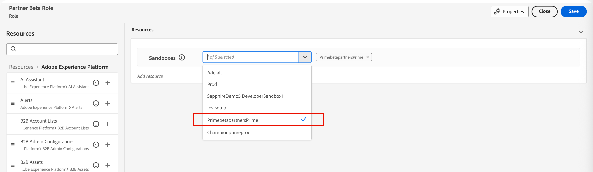
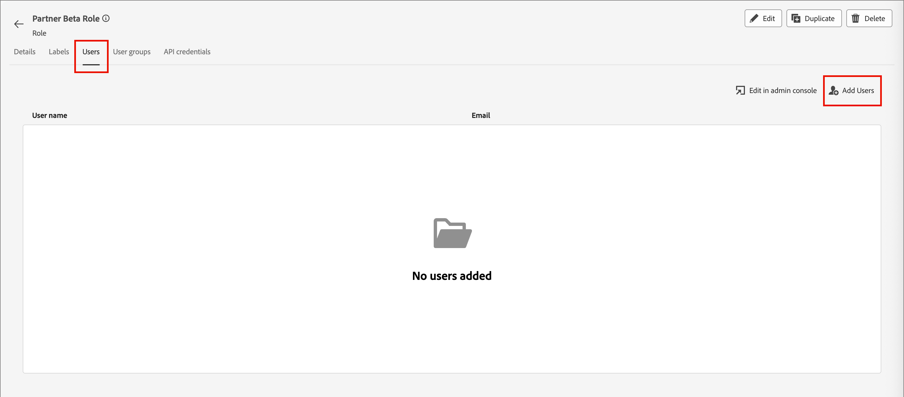
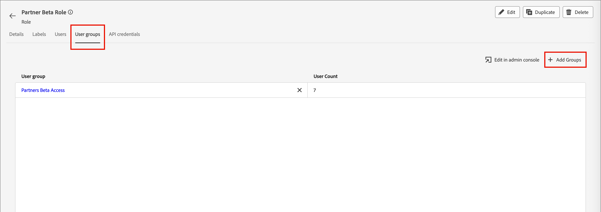

# Acceso y permisos de usuario

Una vez completado el aprovisionamiento y enlazados los entornos limitados, complete los siguientes pasos para proporcionar acceso de [!DNL Journey Optimizer B2B Prime] a su equipo y a los usuarios.

1. [Crear un [!DNL Journey Optimizer B2B Edition] perfil de producto](#create-profile) en Admin Console (solo configuración inicial/única).
1. [Agregar un grupo de usuarios](#add-user-group) en Admin Console.
1. [Asigne el perfil de producto](#assign-profile) al grupo de usuarios en Admin Console.
1. [Agregar usuarios al nuevo grupo](#add-users) en Admin Console.
1. [Editar funciones integradas](#edit-role-permissions) o [crear una función personalizada](#create-a-custom-role) con [!DNL Journey Optimizer B2B Edition] permisos en Adobe Experience Platform.
1. [Agregar usuarios](#add-users-to-a-role) o [grupos](#add-user-groups-to-a-role) a los roles de Adobe Experience Platform.

## Configuración del perfil del producto {#config-profile}

Como administrador, puede completar estas tareas en Adobe Admin Console, que es un lugar central para administrar las licencias y los usuarios de productos de Adobe. En Admin Console, puede crear y administrar usuarios en una sola ubicación en lugar de en las distintas soluciones individuales. Para obtener más información sobre sus funciones y capacidades, consulte la página [Información general de Admin Console](https://helpx.adobe.com/es/enterprise/using/admin-console.html).

### Acceso a Admin Console {#admin-console}

Antes de poder usar Admin Console para administrar usuarios dentro de su equipo, debe asegurarse de que puede acceder a Admin Console y de que dispone de los permisos adecuados.

1. Como administrador del sistema, debe recibir varios correos electrónicos de Adobe como parte del proceso de incorporación.

   Busque el correo electrónico de bienvenida que proporciona la información acerca del nombre de la organización a la que se le ha concedido acceso.

1. Haga clic en el vínculo **[!UICONTROL Introducción]** del correo electrónico de bienvenida para ir a Admin Console.

   Si no encuentra el correo electrónico, abra un explorador directamente en Admin Console en [https://adminconsole.adobe.com](https://adminconsole.adobe.com).

1. Inicie sesión con su Adobe ID.

   Una vez que inicie sesión correctamente, verá la página _Información general_ de Adobe Admin Console.

1. Si tiene acceso a varias organizaciones, asegúrese de haber iniciado sesión en la organización correcta.

   Para cambiar su organización, haga clic en el nombre de la organización en la esquina superior derecha y seleccione la organización a la que necesita acceder.

1. Seleccione **[!UICONTROL Administradores]** de la tarjeta _[!UICONTROL Usuarios]_ para comprobar que es administrador del sistema.

   {width="800" zoomable="yes"}

1. Busque introduciendo su correo electrónico, nombre de usuario, nombre o apellidos de Adobe ID.

   * Si el acceso está configurado correctamente, la búsqueda devolverá el registro.

   * Si el valor de la columna **[!UICONTROL ROL DE ADMINISTRADOR]** muestra `System`, sabrá que usted (o el usuario mostrado) es administrador del sistema.

### Crear el perfil de producto [!DNL Journey Optimizer B2B Edition] {#create-profile}

Al conceder a los usuarios acceso a una solución de Adobe, no necesariamente desea darles acceso completo. Los perfiles de producto permiten que cada solución tenga su propio conjunto de permisos de usuario. Utilice Admin Console para asignar perfiles de producto.

Para obtener más información sobre el uso de perfiles de producto para las autorizaciones de usuario, consulte [_Administrar perfiles de producto para usuarios empresariales_](https://helpx.adobe.com/es/enterprise/using/manage-product-profiles.html){target="_blank"} en la documentación de Admin Console.

{width="30"} Un administrador del sistema o [!DNL Experience Platform] administrador de productos puede realizar los siguientes pasos desde [https://adminconsole.adobe.com](https://adminconsole.adobe.com).

1. Seleccione la ficha **[!UICONTROL Productos]**.

1. Abra la instancia [!DNL Journey Optimizer B2B Edition] en la que desee agregar el perfil y haga clic en **[!UICONTROL Nuevo perfil]**.

   {width="600" zoomable="yes"}

1. Escriba un nombre de perfil de producto, como _Usuarios B2B_.

1. Haz clic en **[!UICONTROL Siguiente]** y luego en **[!UICONTROL Guardar]**.

### Agregar un grupo de usuarios {#add-user-group}

Un grupo de usuarios es una colección de usuarios a los que se concede un conjunto compartido de permisos. Puede agregar o quitar usuarios de su grupo de usuarios. Los permisos del grupo siguen siendo los mismos mientras cambian los usuarios dentro del grupo.

Para obtener más información sobre cómo se usan los grupos de usuarios para administrar permisos, consulte [Administrar grupos de usuarios](https://helpx.adobe.com/es/enterprise/using/user-groups.html){target="_blank"} en la documentación de Admin Console.

{width="30"} Un administrador del sistema puede realizar los siguientes pasos desde [https://adminconsole.adobe.com](https://adminconsole.adobe.com).

1. Seleccione la ficha **[!UICONTROL Usuarios]**.

1. Elija **[!UICONTROL grupos de usuarios]** en el panel de navegación izquierdo.

1. Haga clic en **[!UICONTROL Nuevo grupo de usuarios]** en la parte superior derecha.

1. Escriba un nombre para el grupo de usuarios, como _usuarios B2B_ y haga clic en **[!UICONTROL Guardar]**.

   {width="600" zoomable="yes"}

### Asignar el perfil de producto {#assign-profile}

{width="30"} Un administrador de producto puede realizar los siguientes pasos desde [https://adminconsole.adobe.com](https://adminconsole.adobe.com).

1. Haga clic en el grupo de usuarios que ha creado.

1. Seleccione la ficha **[!UICONTROL Perfiles de producto asignados]** y haga clic en **[!UICONTROL Asignar perfil]**.

1. Haga clic en **+** y agregue cada instancia de los siguientes productos:

   * [!UICONTROL Adobe Journey Optimizer B2B edition - Perfil de usuarios]
   * [!UICONTROL Adobe Experience Platform - AEP-Default-All-Users]
   * [!UICONTROL Recopilación de datos de Adobe Experience Platform - Acceso a todos los datos de recopilación predeterminada]
   * [!UICONTROL Adobe Experience Platform - Acceso a todos los equipos de producción predeterminado]

   {width="600" zoomable="yes"}

1. Haga clic en **[!UICONTROL Guardar]**.

### Agregar usuarios al nuevo grupo {#add-users}

Para obtener información acerca de la administración de usuarios, consulte [_Usuarios de Adobe Admin Console_](https://helpx.adobe.com/es/enterprise/using/users.html){target="_blank"} en la documentación de Admin Console.

{width="30"} Un administrador del sistema o de producto puede realizar los siguientes pasos desde [https://adminconsole.adobe.com](https://adminconsole.adobe.com). Un administrador de productos solo puede agregar usuarios que ya existen en su organización.

1. Si los usuarios aún no son miembros de su organización, agregue cada usuario:

   * En _[!UICONTROL Vínculos rápidos]_, haga clic en **[!UICONTROL Agregar usuarios]**.

   * Escriba la dirección de correo electrónico del usuario y haga clic en **[!UICONTROL Agregar como nuevo usuario]**.

     {width="600" zoomable="yes"}

   * Escriba el nombre y los apellidos y, a continuación, haga clic en **[!UICONTROL Guardar]**.

1. Añada cada usuario al grupo:

   * Haga clic en el nombre de usuario.

   * En la página de detalles del usuario, desplácese hasta **[!UICONTROL grupos de usuarios]**.

   * Haga clic en el icono _Más_ ( **...** ) de la izquierda y elija **[!UICONTROL Editar grupos de usuarios]**.

   * Haga clic en el icono _Agregar_ ( **+** ) debajo de **[!UICONTROL Grupos de usuarios]**.

     {width="600" zoomable="yes"}

   * Seleccione el grupo de usuarios que creó anteriormente y haga clic en **[!UICONTROL Aplicar]**.

   * Haga clic en **[!UICONTROL Guardar]** para ver los cambios del usuario.

## Asignar permisos de producto {#assign-product-permissions}

Los permisos son derechos unitarios que le permiten definir las autorizaciones asignadas a un perfil de producto. Cada permiso se agrupa en una funcionalidad, como recorridos o grupos de compra, que representa las funcionalidades de [!DNL Journey Optimizer B2B Prime].

El área _Permisos_ de Adobe Experience Platform es donde los administradores pueden definir roles de usuario y directivas de acceso para administrar permisos de acceso para características y objetos dentro de una aplicación de producto. En esta aplicación, puede crear y administrar funciones, así como asignar los permisos de recursos deseados para estas. Los permisos también le permiten administrar los entornos limitados y los usuarios asociados a una función específica.

Para obtener más información sobre los permisos de funciones en Experience Platform, consulte [Administrar permisos para una función](https://experienceleague.adobe.com/en/docs/experience-platform/access-control/abac/permissions-ui/permissions){target="_blank"} en la documentación de Experience Platform.

1. Vaya a [experience.adobe.com](https://experience.adobe.com/).

1. En el panel _[!UICONTROL Acceso rápido]_, seleccione **[!UICONTROL Permisos]**.

   >[!NOTE]
   >
   >Si no ve _[!UICONTROL Permisos]_, es posible que tenga que hacer clic en **[!UICONTROL Ver todos]** y seleccionarlo entre las aplicaciones disponibles.

   {width="700" zoomable="yes"}

<!--

### B2B product permissions {#b2b-product-permissions}

The following permissions govern access to [!DNL Journey Optimizer B2B Edition] capabilities:

| Category | Description | Permissions |
| -------- | ----------- | ---------- |
| B2B Account Lists | Configure, manage, view, and publish permissions for B2B account lists. These permissions include actions such as add, remove, import, and delete accounts from account lists. | <li>Manage B2B Account Lists |
| B2B Admin Configurations | Configure, manage, and view permissions for B2B administrative configurations. These permissions include digital asset management connections, asset repositories, and events. | <li>Manage B2B Admin Configurations |
| B2B Assets | Configure, manage, and view permissions for B2B assets. These permissions include emails, SMS, landing pages, fragments, templates, and images. | <li>Manage B2B Assets <li>Manage B2B Templates <li>Manage B2B Fragments <li>Manage B2B Emails |
| B2B Buying Groups | Configure, manage, and view permissions for B2B buying groups. These permissions include solution interests, roles templates, and buying group status. | <li>Manage B2B Buying Groups <li>Manage B2B Solution Interests <li>Manage B2B Role Templates <li>Manage B2B Stages <li>View B2B Buying Groups |
| B2B Channel Configurations | Configure, manage, and view permissions for B2B channel configurations. These permissions include settings for communication limits, API credentials, and security settings. | <li>Manage B2B Channels Configurations |
| B2B Dashboards | Configure and view permissions for B2B dashboards. These permissions include account engagement, buying group stages, surging accounts, and contact coverage. | <li>View B2B Engagement Dashboard |
| B2B Journeys | Configure, manage, view, and publish permissions for B2B journeys. These permissions include account and person actions, event listeners, and split paths. | <li>Manage B2B Account Journeys |
| Journey Optimizer Rules | Access and configure frequency rules (communication limits). These permissions should be limited to product administrators. | <li>View Frequency Rules <li>Manage Frequency Rules |

### B2B built-in roles {#b2b-built-in-roles}

When your organization has [!DNL Journey Optimizer B2B Edition] provisioned, Experience Platform includes a set of built-in (default) roles that you can use to manage access to the product capabilities:

| Role | Permissions |
| ---- | ----------- |
| B2B Journey Manager | <li>Manage B2B Journeys <li>Manage B2B Buying Groups <li>Manage B2B Account Lists <li>View B2B Engagement Dashboard <li>View B2B Insights Dashboard |
| B2B Channel Manager | <li>Manage B2B Assets <li>Manage B2B Templates <li>Manage B2B Fragments |
| B2B System Administrator | <li>Manage B2B Channels Configurations <li>Manage B2B Admin Configurations |
| B2B Sales User | <li>View B2B Engagement Dashboard <li>View B2B Buying Groups <li>Access In-CRM Insights |

-->

### Editar permisos de funciones {#edit-role-permissions}

Para las funciones integradas o personalizadas, puede decidir en cualquier momento agregar o eliminar permisos. Si modifica una función predeterminada o personalizada, afectará a todos los usuarios asignados a la función.

>[!IMPORTANT]
>
>El acceso a [!DNL Journey Optimizer B2B Prime] requiere que habilite una zona protegida específica que se aprovisione con la siguiente convención de nombres: Prefijo de suscripción de Marketo Engage + Prime. Por ejemplo, si el prefijo de suscripción a Marketo Engage vinculado es _AcmeAssoc_, la zona protegida necesaria para el acceso a [!DNL Journey Optimizer B2B Prime] es _AcmeAssocPrime_.

>[!NOTE]
>
>Un administrador del sistema de Admin Console puede realizar estos pasos.

_Para cambiar los permisos de un rol :_

1. Seleccione **[!UICONTROL Roles]** en el panel de navegación izquierdo.

1. Haga clic en el nombre de rol de **_Administrador de canales B2B_**.

1. En la página de detalles, haga clic en **[!UICONTROL Editar]** en la parte superior derecha.

   {width="800" zoomable="yes"}

   En el editor de funciones, el menú _[!UICONTROL Recursos]_ muestra la lista de recursos que se aplican a las aplicaciones de Experience Cloud con tecnología de plataforma.

1. Seleccione la zona protegida aprovisionada para el acceso de [!DNL Journey Optimizer B2B Prime] (`<Marketo subscription prefix>Prime`).

   {width="800" zoomable="yes"}

1. Haga clic en el icono _Agregar_ (**+**) para cada uno de los recursos B2B.

   {width="700" zoomable="yes"}

1. Agregue los permisos específicos para cada uno de los recursos o seleccione **[!UICONTROL Agregar todos]**.

1. Haga clic en **[!UICONTROL Guardar]**.

   <!-- {width="700" zoomable="yes"} -->

1. Haga clic en **[!UICONTROL Cerrar]** para volver a la página de detalles.

### Adición de usuarios a una función {#add-users-to-a-role}

{width="30"} Un administrador del sistema o de Experience Platform puede realizar los siguientes pasos.

1. Abra los detalles de la función y seleccione la ficha **[!UICONTROL Usuarios]**.

   Esta pestaña muestra una lista de todos los usuarios asignados a la función.

1. Haga clic en **[!UICONTROL Agregar usuarios]**.

   {width="800" zoomable="yes"}

1. En el cuadro de diálogo _[!UICONTROL Agregar usuarios]_, busque y seleccione los usuarios que desee agregar al rol.

   * Puede utilizar la herramienta Buscar para filtrar la lista de usuarios.

   * Seleccione la casilla de verificación de cada usuario.

   {width="600" zoomable="yes"}

1. Haga clic en **[!UICONTROL Guardar]** cuando haya seleccionado todos los usuarios que desea agregar.

### Agregar grupos de usuarios a un rol {#add-user-groups-to-a-role}

Para obtener información acerca de la administración de usuarios, consulte [_Usuarios de Adobe Admin Console_](https://helpx.adobe.com/es/enterprise/using/users.html){target="_blank"} en la documentación de Admin Console.

{width="30"} Un administrador del sistema o de Experience Platform puede realizar los siguientes pasos.

1. Abra los detalles de la función y seleccione la ficha **[!UICONTROL Grupos de usuarios]**.

   Esta pestaña muestra una lista de todos los grupos de usuarios asignados a la función.

1. Haga clic en **[!UICONTROL Agregar grupos]**.

   {width="800" zoomable="yes"}

1. En el cuadro de diálogo _[!UICONTROL Agregar grupos]_, busque y seleccione los grupos que desee agregar al rol.

   * Puede utilizar la herramienta Buscar para filtrar la lista de grupos de usuarios.

   * Seleccione la casilla de verificación de cada grupo de usuarios.

   {width="600" zoomable="yes"}

1. Haga clic en **[!UICONTROL Guardar]** cuando haya seleccionado todos los grupos que desee agregar.

### Crear una función personalizada {#create-a-custom-role}

{width="30"} Un administrador del sistema o de Experience Platform puede realizar los siguientes pasos.

1. Seleccione **[!UICONTROL Roles]** en el panel de navegación izquierdo y seleccione **[!UICONTROL Crear rol]**.

1. En el cuadro de diálogo _[!UICONTROL Crear nuevo rol]_, escriba un nombre para el rol, como _Especialistas en marketing B2B_, y una descripción (opcional).

1. Haga clic en **[!UICONTROL Confirmar]**.

1. Seleccione la zona protegida aprovisionada para el acceso de [!DNL Journey Optimizer B2B Prime] (`<Marketo subscription prefix>Prime`).

   {width="800" zoomable="yes"}

1. Añadir permisos de productos B2B:

   <!-- To determine which product capabilities that you want for the role, refer to the list of [B2B product permissions](#b2b-product-permissions). -->

   En la lista _[!UICONTROL Recursos]_ de la izquierda, busque los elementos B2B y haga clic en el icono _Agregar_ (**+**) para agregar cada atributo que desee habilitar para el rol.

   Puede introducir _B2B_ en la herramienta de búsqueda para filtrar la lista de permisos de productos B2B.

   {width="700" zoomable="yes"}

1. Haga clic en **[!UICONTROL Guardar]** en la parte superior derecha.

1. Vaya a los detalles de la función y seleccione la pestaña **[!UICONTROL Grupos de usuarios]**.

1. Haga clic en **[!UICONTROL Agregar grupos]**.

1. Seleccione la casilla de verificación situada junto al grupo de usuarios que creó anteriormente en Admin Console.

1. Haga clic en **[!UICONTROL Guardar]**.

Su función personalizada está configurada y los usuarios del grupo asignado ahora pueden tener acceso a las capacidades de [!DNL Journey Optimizer B2B Prime] que seleccionó.
