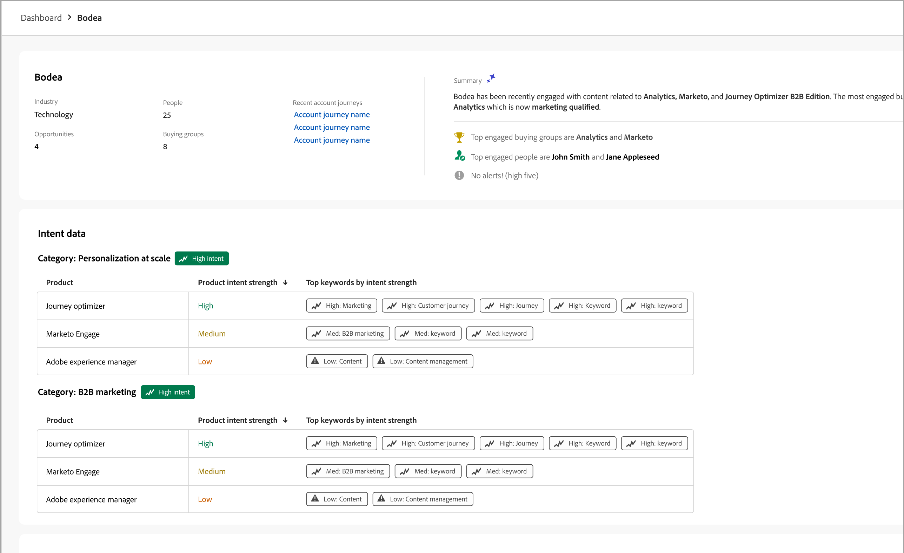

# Detalles de la cuenta

Al hacer clic en un nombre de cuenta desde cualquier lugar de Journey Optimizer B2B edition, se muestran los detalles de la cuenta. Esta información proporciona información útil sobre la cuenta de, incluidos resúmenes generativos de IA.

{width="700" zoomable="yes"}

{{intent-data-note}}

La página de detalles de la cuenta consta de tres secciones principales:

## Resumen de cuenta

{zoomable="yes"}

La sección de descripción general de la cuenta incluye la siguiente información de la cuenta:

* Nombre de la cuenta
* Número de personas en la cuenta
* Industria
* Abrir oportunidades
* Los tres recorridos de cuenta más recientes en los que la cuenta está actualmente en uso (haga clic en el nombre para abrir los detalles del recorrido)
* Resumen de IA generativo de la cuenta, que incluye información sobre los grupos de compra más comprometidos.

## Cobertura de contactos

{width="800" zoomable="yes"}

La sección _[!UICONTROL Cobertura de contactos]_ muestra el número de contactos de la cuenta con un rol específico asociado a un interés de solución. La asignación de la función y el interés de la solución se basan en la plantilla de funciones de grupo de compra. Haga clic en una celda para mostrar información detallada:

* Descripción, en el siguiente formato: _x personas tienen mi rol para z interés de solución_
* Columnas
* Nombre
* Cuenta
* Cargo
* Grupo de compras
* Puntuación de participación de persona
* Última actividad
* Detalles

Haga clic en el icono _Filtro_ (  ) en la parte superior izquierda para filtrar la visualización de datos con cualquiera de estos atributos:

* Interés de la solución
* Período de tiempo

## Solapamiento de contactos

{width="800" zoomable="yes"}

La sección _[!UICONTROL Superposición de contactos]_ muestra los contactos de la cuenta que forman parte de más de un grupo comprador como resultado de estar asociados con varios intereses de soluciones. Esta información se presenta en forma de tabla con las siguientes columnas:

* Nombre
* Cargo
* Cuenta
* Interés de la solución

Haga clic en _Información_ (  ) junto al nombre del contacto para mostrar una tabla con los siguientes detalles:

* Grupo comprador (pulsa el nombre para abrir los detalles del grupo comprador)
* Función
* Interés de la solución
* Intento del producto (si está configurado)
* Producto

Haga clic en el icono _Filtro_ (  ) en la parte superior izquierda para filtrar la visualización de datos con cualquiera de estos atributos:

* Interés de la solución
* Funciones
