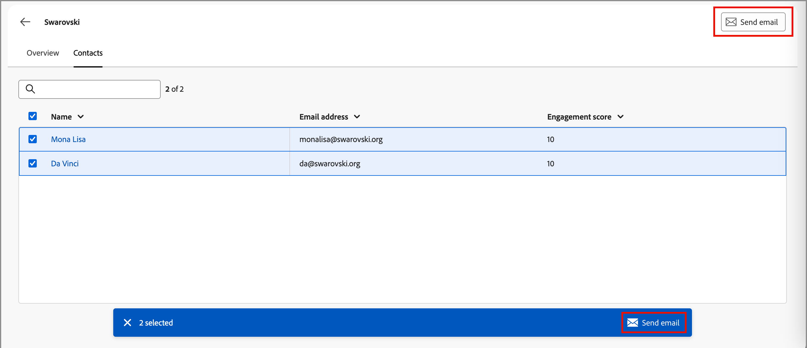

# Detalles de la cuenta

Al hacer clic en un nombre de cuenta desde cualquier lugar de Journey Optimizer B2B edition, se muestra la página _Detalles de la cuenta_. Esta página proporciona información útil sobre la cuenta de, incluidos resúmenes generativos de IA. También hay [acciones](#account-actions) que puedes ejecutar para los contactos asociados con la cuenta.

{width="700" zoomable="yes"}

Use la ficha **[!UICONTROL Información general]** para revisar la información de la cuenta y la ficha **[!UICONTROL Contactos]** para obtener acceso a una lista de contactos de la cuenta.

## [!UICONTROL Ficha Información general]

La página de detalles de la cuenta consta de tres secciones principales:

### Resumen de cuenta

{zoomable="yes"}

La sección de descripción general de la cuenta incluye la siguiente información de la cuenta:

* Nombre de cuenta
* Número de personas en la cuenta
* Industria
* Abrir oportunidades
* Los tres recorridos de cuenta más recientes en los que la cuenta está actualmente en uso (haga clic en el nombre del recorrido para abrir la [descripción general del recorrido](../journeys/journeys-overview.md))
* Resumen de IA generativo de la cuenta, que incluye información sobre los grupos de compra más comprometidos.

### Datos de intención

En Journey Optimizer B2B edition, el modelo de detección de intención predice una solución o producto de interés con una confianza lo suficientemente alta según la actividad de contacto de la cuenta. La intención de los contactos de cuenta puede interpretarse como la probabilidad de tener interés en un producto.

{{intent-data-note}}

{width="700" zoomable="yes"}

* Niveles de intención
* Tipos de señal de intención: palabras clave, producto y solución

### Cobertura de contactos

{width="800" zoomable="yes"}

La sección _[!UICONTROL Cobertura de contactos]_ muestra el número de contactos de la cuenta con un rol específico asociado con un interés de solución. La asignación de la función y el interés de la solución se basan en la plantilla de funciones de grupo de compra. Haga clic en una celda para mostrar los siguientes detalles:

* Descripción, en el siguiente formato: _x personas tienen mi rol para z interés de solución_
* Columnas
* Nombre
* Cuenta
* Cargo
* Grupo de compras
* Puntuación de participación de persona
* Última actividad
* Detalles

Haga clic en el icono _Filtro_ (  ) en la parte superior izquierda para filtrar la visualización de datos con cualquiera de estos atributos:

* Interés de la solución
* Período de tiempo

### Solapamiento de contactos

{width="800" zoomable="yes"}

La sección _[!UICONTROL Superposición de contactos]_ muestra los contactos de la cuenta que forman parte de más de un grupo comprador como resultado de estar asociados con varios intereses de soluciones. Esta información se presenta en forma de tabla con las siguientes columnas:

* Nombre
* Cargo
* Cuenta
* Interés de la solución

Haga clic en _Información_ (  ) junto al nombre del contacto para mostrar una tabla con los siguientes detalles:

* Grupo comprador (haz clic en el nombre para abrir los [detalles del grupo comprador](../buying-groups/buying-group-details.md))
* Función
* Interés de la solución
* Intento del producto (si [está configurado](../admin/intent-data.md))
* Producto

Haga clic en el icono _Filtro_ (  ) en la parte superior izquierda para filtrar la visualización de datos con cualquiera de estos atributos:

* Interés de la solución
* Funciones

## Ficha [!UICONTROL Contactos]

Seleccione la ficha **[!UICONTROL Contactos]** para ver una lista de todas las personas asociadas con la cuenta, que se sincroniza con Experience Platform. Cada contacto enumerado incluye el nombre, la dirección de correo electrónico y la puntuación de participación.

{width="700" zoomable="yes"}

## Enviar correo electrónico

Puede enviar un correo electrónico aprobado por el especialista en marketing a uno o varios contactos seleccionados (hasta 50 a la vez) o a todos los contactos de la cuenta. La lista de correos electrónicos disponibles se limita a los correos electrónicos aprobados de la instancia de Marketo Engage conectada.

>[!BEGINTABS]

>[!TAB Todos los contactos de la cuenta]

1. En la ficha _[!UICONTROL Información general]_, haga clic en **[!UICONTROL Enviar correo electrónico]** en la parte superior derecha.

   {width="700" zoomable="yes"}

1. En el cuadro de diálogo _[!UICONTROL Enviar correo electrónico]_, seleccione el espacio de trabajo de Marketo Engage y, a continuación, active la casilla de verificación del correo electrónico que desee enviar.

   {width="700" zoomable="yes"}

1. Haga clic en **[!UICONTROL Enviar]**.

>[!TAB Contactos seleccionados]

1. En la ficha _[!UICONTROL Contactos]_, active las casillas de verificación de los contactos que desee que reciban el correo electrónico.

1. En la parte superior derecha o en la barra de selección de la parte inferior, haz clic en **[!UICONTROL Enviar correo electrónico]**.

   {width="700" zoomable="yes"}

1. En el cuadro de diálogo _[!UICONTROL Enviar correo electrónico]_, seleccione el espacio de trabajo de Marketo Engage y, a continuación, active la casilla de verificación del correo electrónico que desee enviar.

   {width="700" zoomable="yes"}

1. Haga clic en **[!UICONTROL Enviar]**.

>[!ENDTABS]
