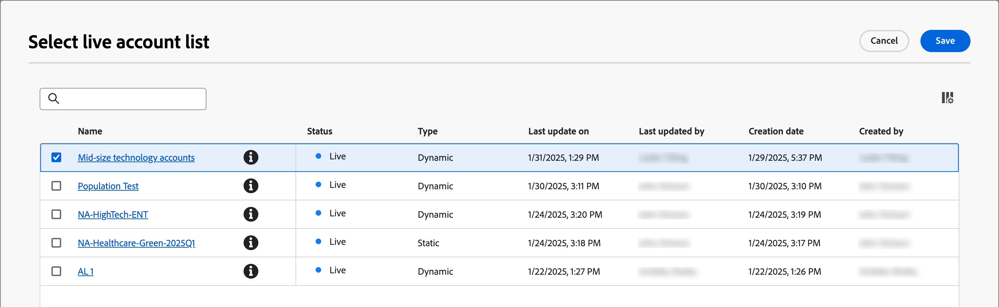

# Usar listas de cuentas en recorridos y programas

Existen varias formas de incorporar listas de cuentas activas (publicadas) en los recorridos de cuenta.

## Nodo de audiencia de cuenta

Todos los recorridos de la cuenta comienzan con un [_nodo de audiencia de la cuenta_](../journeys/account-audience-nodes.md). Cuando configura este nodo para que utilice una lista de cuentas, las cuentas de miembro se mueven a través del recorrido cuando se activa (publica).

1. Seleccione la opción **[!UICONTROL Lista de cuentas]** para el nodo de inicio _Audiencia de cuentas_.

   {width="500"}

1. Haga clic en **[!UICONTROL Agregar lista de cuentas]**.

1. Seleccione la casilla de la lista de cuentas y haga clic en **[!UICONTROL Guardar]**.

   {width="600" zoomable="yes"}

## Tomar un nodo de acción: agregar a la cuenta

**_Solo listas de cuentas estáticas_**

Dentro de un recorrido de cuentas, agregue cuentas a una lista de cuentas estáticas usando [un nodo _Realizar una acción_](../journeys/action-nodes.md).

Por ejemplo, puede tener una ruta de recorrido por la que enviar un correo electrónico y alguna cuenta realizar varias acciones como respuesta. Considera esta actividad como un punto de cualificación en el recorrido. Con la calificación, desea agregarlos a una lista de cuentas que se utiliza como audiencia para otro recorrido con un flujo diferente para cuentas calificadas.

>[!NOTE]
>
>Si una cuenta ya está en la lista cuando se ejecuta el nodo, la acción se ignora.

1. Seleccione la opción _[!UICONTROL Acción en]_ **[!UICONTROL Cuentas]**.

1. Para _[!UICONTROL Acción en las cuentas]_, elija **[!UICONTROL Agregar a la lista de cuentas]**.

   {width="500"}

1. Para **[!UICONTROL Seleccionar lista de cuentas estáticas activas]**, elija la lista de cuentas a la que desea agregar cuentas.

   {width="500"}

## Tomar un nodo de acción: eliminar de la cuenta

**_Solo listas de cuentas estáticas_**

Dentro de un recorrido de cuentas, quita cuentas de una lista de cuentas estáticas usando [un nodo _Realizar una acción_](../journeys/action-nodes.md).

Por ejemplo, puede tener una ruta de recorrido por la que enviar un correo electrónico y alguna cuenta realizar varias acciones como respuesta. Considera esta actividad como un punto de cualificación en el recorrido. Con esta calificación, desea eliminarlos de una lista de cuentas que se utiliza como audiencia para otro recorrido que envía correos electrónicos adicionales para que no duplique sus comunicaciones de calificación.

>[!NOTE]
>
>Si una cuenta no está en la lista donde está programada para su eliminación, se omite la acción.

1. Seleccione la opción _[!UICONTROL Acción en]_ **[!UICONTROL Cuentas]**.

1. Para _[!UICONTROL Acción en cuentas]_, elija **[!UICONTROL Quitar de la lista de cuentas]**.

   {width="500"}

1. Para **[!UICONTROL Seleccionar lista de cuentas estáticas activas]**, elija la lista de cuentas a la que desea quitar cuentas.

   {width="500"}

## Programa Marketo Engage: miembro de la lista de cuentas

Como especialista en marketing, es posible que desee suprimir programas en Marketo Engage para personas que forman parte de listas de cuentas en Journey Optimizer B2B edition.

En la instancia de Marketo Engage que está conectada a Journey Optimizer B2B edition, puede usar el filtro _[!UICONTROL Lista de miembros de la cuenta]_ de sus listas inteligentes para identificar estos posibles clientes según su estrategia de campaña. Para obtener más información sobre listas inteligentes, consulte la [documentación de Marketo Engage](https://experienceleague.adobe.com/en/docs/marketo/using/product-docs/core-marketo-concepts/smart-lists-and-static-lists/understanding-smart-lists){target="_blank"}.

### Agregar el filtro a una lista inteligente

1. En Marketo Engage, seleccione una campaña y haga clic en la ficha **[!UICONTROL Lista inteligente]**.

1. En la lista de filtros que aparece a la derecha, escriba `Member` y busque el filtro **[!UICONTROL Miembro de la lista de cuentas]**.

1. Arrastre el filtro al lienzo de la lista inteligente.

1. En el lienzo de la lista inteligente, establezca el valor de lista **[!UICONTROL Miembro de cuenta]**.

   Haga clic en la flecha hacia abajo para mostrar todas las listas de cuentas o escriba parte del nombre de la lista de cuentas para ayudar a encontrar la lista de cuentas que necesita.

   {width="800" zoomable="yes"}

1. En el flujo de campaña, agregue el paso **[!UICONTROL Agregar a la lista]** y elija la lista en la que desea rellenar las personas de la lista de cuentas de Journey Optimizer B2B edition.

   Consulte _[Agregar un paso de flujo a una campaña inteligente](https://experienceleague.adobe.com/en/docs/marketo/using/product-docs/core-marketo-concepts/smart-campaigns/flow-actions/add-a-flow-step-to-a-smart-campaign){target="_blank"}_ en la documentación de Marketo Engage para obtener información detallada sobre cómo agregar pasos a un flujo.

### Revisar los miembros

Una vez ejecutado el flujo, puede ver la lista de personas rellenadas en la lista. Abra la lista y seleccione la pestaña Personas.

{width="800" zoomable="yes"}
