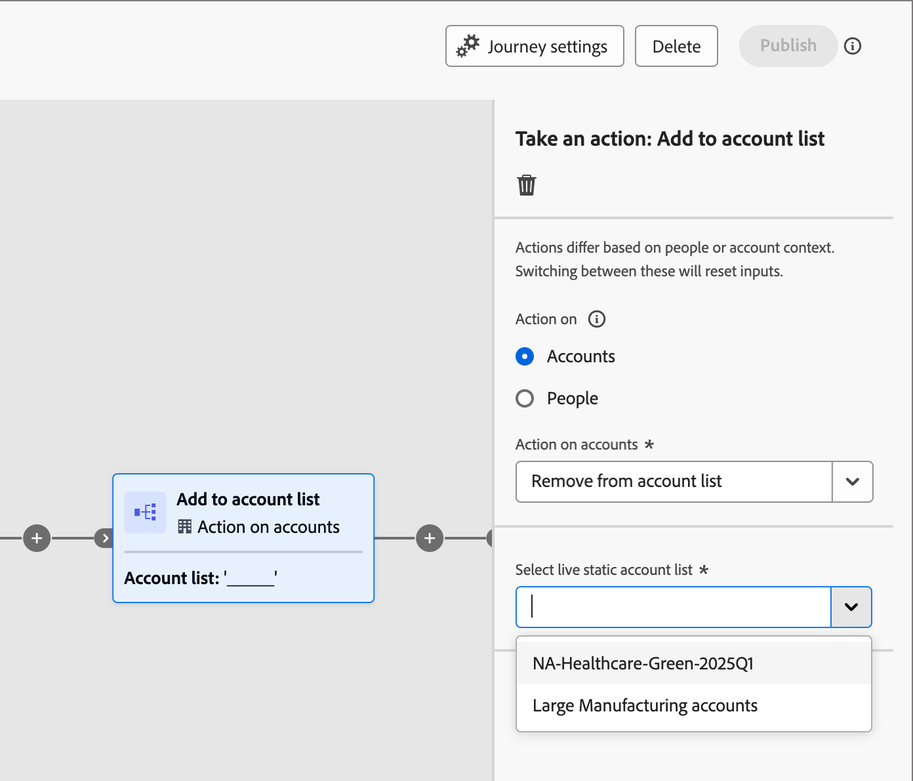

# Listas de cuentas

Una lista de cuentas es una colección de cuentas con nombre que los especialistas en marketing pueden utilizar para la orquestación de recorridos de destino. Una lista de cuentas puede segmentar las cuentas con nombre según los criterios definidos, como el sector, la ubicación o el tamaño de la compañía. Existen dos tipos de listas de cuentas:

* **Estática**: con una lista de cuentas estáticas, la lista solo cambia cuando agrega las cuentas. Puede agregar cuentas manualmente aplicando un conjunto de filtros para rellenar la lista basada en los datos de la cuenta actual, o agregar y quitar cuentas mediante un recorrido de cuentas.
* **Dinámico**: con una lista de cuentas dinámicas, define un conjunto de filtros para depurar automáticamente la lista. El sistema utiliza este conjunto de filtros para agregar y quitar cuentas según los cambios en la información de las cuentas. Esta administración de lista es similar a la [segmentación de audiencia en Real-time Customer Data Platform](https://experienceleague.adobe.com/en/docs/experience-platform/rtcdp/segmentation/b2b).

Cuando una lista de cuentas se encuentra en estado _Activo_ (publicado), está disponible para usarla en recorridos de cuentas.

## Acceso y exploración de listas de cuentas

1. En la página de inicio de Adobe Experience Platform, haga clic en Adobe Journey Optimizer B2B edition.

1. En el panel de navegación izquierdo, expanda **[!UICONTROL Cuentas]** y haga clic en **[!UICONTROL Listas de cuentas]**.

   {width="800" zoomable="yes"}

   La página _[!UICONTROL Listas de cuentas]_ mostrada incluye las siguientes columnas:

   * [!UICONTROL Nombre] (haga clic en el nombre de la lista de cuentas para ver los detalles)
   * [!UICONTROL Estado]
   * [!UICONTROL Tipo]
   * [!UICONTROL Última actualización el]
   * [!UICONTROL Última actualización por]
   * [!UICONTROL Fecha de creación]
   * [!UICONTROL Creado por]

Esta tabla incluye la capacidad de buscar por nombre. La función de ordenación no está disponible en este momento.

Puede personalizar la tabla mostrada si hace clic en el icono _Configuración de columna_ (  ) en la esquina superior derecha y activa o desactiva las casillas de verificación.

{width="300"}

Para ver la descripción de una lista de cuentas, haga clic en el icono _Información_ junto al nombre.

## Crear una lista de cuentas

Cuando crea una lista de cuentas, define un conjunto de filtros para generar la lista. Por ejemplo, puede utilizarlo para generar una lista de cuentas en las que el sector sea Sanidad y los ingresos sean superiores a 100 millones de dólares.

1. En la página _[!UICONTROL Listas de cuentas]_, haga clic en **[!UICONTROL Crear lista de cuentas]** en la parte superior derecha de la página.

   {width="700" zoomable="yes"}

1. En el cuadro de diálogo _[!UICONTROL Crear lista de cuentas]_, escriba un **[!UICONTROL Nombre]** único (obligatorio) y una **[!UICONTROL Descripción]** (opcional).

1. Elija _[!UICONTROL Type]_ para la lista de cuentas, **[!UICONTROL Static]** o **[!UICONTROL Dynamic]**.

   {width="380"}

1. Haga clic en **[!UICONTROL Crear]**.

   Se abre una nueva lista de cuentas estáticas con una lista vacía de cuentas. Se abre una nueva lista de cuentas dinámicas con el panel _[!UICONTROL Agregar cuentas por filtro]_ en la página.

## Agregar cuentas a la lista de cuentas

Para una lista estática, puede publicar la lista de cuentas vacía y agregar cuentas mediante un recorrido de cuentas. También puede agregar cuentas manualmente aplicando un conjunto de filtros antes de publicarlas.

Para una lista de cuentas dinámicas, debe agregar el conjunto de filtros que desee utilizar para administrar la lista automáticamente antes de publicarla.

>[!BEGINTABS]

>[!TAB Lista de cuentas estáticas]

Después de crear la lista de cuentas estáticas, puede rellenar la lista aplicando un conjunto de filtros. También puede aplicar un conjunto de filtros para agregar cuentas a una lista de cuentas estáticas después de publicarla (_Live_).

>[!NOTE]
>
>Si desea que la lista de cuentas comience como vacía, no seleccione ningún filtro y simplemente publique la lista de cuentas. Es útil comenzar con una lista vacía cuando planea agregar miembros mediante una acción de recorrido de cuentas (vea [Realizar una acción en el nodo - Agregar a la cuenta](#take-an-action-node---add-to-account)).

1. Seleccionar **[!UICONTROL Agregar cuentas]**.

   {width="700" zoomable="yes"}

   Puede acceder a esta función en la página de lista vacía o en la parte superior derecha.

1. En el cuadro de diálogo _[!UICONTROL Agregar cuentas por filtro]_, use el menú **[!UICONTROL Filtros de cuenta]** para agregar los atributos y las actividades que desee usar para construir el conjunto de filtros:

   Los filtros están anidados en carpetas de categoría. Puede expandir cada carpeta y desplazarse por las listas de filtros disponibles. O bien, use la herramienta _Buscar_ de la parte superior para encontrar el filtro que necesita.

   * Arrastre y suelte el filtro desde el menú de la izquierda al espacio de definición del filtro.
   * Complete la definición de evaluación de coincidencias.
   * Repita estas acciones para cada filtro que desee incluir.

     {width="700" zoomable="yes"}

   * Puede ajustar las condiciones aplicando la **[!UICONTROL lógica de filtro]** en la parte superior. Puede elegir hacer coincidir todas las condiciones de atributo o cualquier condición.

     {width="450"}

1. Una vez completados el conjunto de filtros y la lógica, haga clic en **[!UICONTROL Rellenar cuentas]**.

   El proceso de población puede tardar algún tiempo, según la cantidad de cuentas que se evalúen y rellenen (el tamaño de la base de datos y los criterios de filtro seleccionados). Las cuentas pueden tardar hasta dos horas en rellenarse en la lista.

Puede continuar publicando la lista para que esté disponible para las acciones de agregar y quitar en un recorrido de cuentas.

>[!TAB Lista dinámica de cuentas]

Después de crear una lista de cuentas dinámicas, define el conjunto de filtros que se usa para administrar la lista (agregar o quitar cuentas) cuando está _activa_ (publicada). No puede agregar ni quitar cuentas a través de recorridos de cuenta, pero si hay una lista de cuentas dinámicas publicada disponible para el nodo de audiencia de cuenta de inicio.

1. Haga clic en **[!UICONTROL Seleccionar filtros]**.

   {width="700" zoomable="yes"}

1. En el cuadro de diálogo _[!UICONTROL Agregar cuentas por filtro]_, use el menú **[!UICONTROL Filtros de cuenta]** para agregar los atributos y filtros especiales que desee usar para construir el conjunto de filtros:

   Los filtros están anidados en carpetas de categoría. Puede expandir cada carpeta y desplazarse por las listas de filtros disponibles. O bien, use la herramienta _Buscar_ de la parte superior para encontrar el filtro que necesita.

   * Arrastre y suelte el filtro desde el menú de la izquierda al espacio de definición del filtro.
   * Complete la definición de evaluación de coincidencias.
   * Repita estas acciones para cada filtro que desee incluir.

     {width="700" zoomable="yes"}

   * Puede ajustar las condiciones aplicando la **[!UICONTROL lógica de filtro]** en la parte superior. Puede elegir hacer coincidir todas las condiciones de atributo o cualquier condición.

     {width="450"}

1. Una vez completados el conjunto de filtros y la lógica, haga clic en **[!UICONTROL Listo]**.

   Si está satisfecho con el conjunto de filtros, puede continuar con [publicar la lista](#publish-an-account-list) para que esté disponible para el [nodo de audiencia de cuenta](#account-audience-node) inicial en un recorrido de cuentas.

   >[!NOTE]
   >
   >Una vez publicada la lista, no se pueden actualizar los filtros de una lista de cuentas dinámicas.

   El proceso de población puede tardar algún tiempo, según la cantidad de cuentas que se evalúen y rellenen (el tamaño de la base de datos y los criterios de filtro seleccionados). Las cuentas pueden tardar hasta dos horas en rellenarse en la lista.

>[!ENDTABS]

## Publish y lista de cuentas

Puede continuar publicando una lista de cuentas tan pronto como se complete el conjunto de filtros.

>[!BEGINTABS]

>[!TAB Lista de cuentas estáticas]

1. Haga clic en **[!UICONTROL Publish]** en la parte superior derecha.

   {width="700" zoomable="yes"}

1. En el cuadro de diálogo _[!UICONTROL lista de cuentas estáticas de Publish]_, haga clic en **[!UICONTROL Publish]** para confirmar.

   {width="400"}

El estado de la lista de cuentas estáticas cambia a _[!UICONTROL Live]_ y está disponible para [usar en un recorrido de cuentas](#account-list-usage-in-account-journeys).

>[!TAB Lista dinámica de cuentas]

Puede continuar publicando una lista de cuentas dinámicas tan pronto como se complete el conjunto de filtros. Una vez que la lista de cuentas se encuentra en estado Activo, está disponible para seleccionarla en un nodo de recorrido de audiencia de cuenta.

1. Haga clic en **[!UICONTROL Publish]** en la parte superior derecha.

   {width="700" zoomable="yes"}

1. En el cuadro de diálogo _[!UICONTROL lista dinámica de cuentas de Publish]_, haga clic en **[!UICONTROL Publish]** para confirmar.

   {width="400"}

El estado de la lista de cuentas dinámicas cambia a _[!UICONTROL Live]_ y está disponible para [usar en un recorrido de cuentas](#account-list-usage-in-account-journeys).

>[!ENDTABS]

## Uso de la lista de cuentas en recorridos de cuenta

Existen tres formas de incorporar listas de cuentas activas (publicadas) en los recorridos de cuenta:

### Nodo de audiencia de cuenta

1. Seleccione **[!UICONTROL Lista de cuentas]** para el nodo de inicio _Audiencia de cuentas_.

   {width="500"}

1. Haga clic en **[!UICONTROL Agregar lista de cuentas]**.

1. Seleccione la casilla de la lista de cuentas y haga clic en **[!UICONTROL Guardar]**.

   {width="600" zoomable="yes"}

Las cuentas de la lista se mueven por el recorrido cuando se activa (publica).

### Tomar un nodo de acción: agregar a la cuenta

**_Solo listas de cuentas estáticas_**

Agregar cuentas a una lista de cuentas estáticas usando [un nodo _Realizar una acción_](../journeys/action-nodes.md).

Por ejemplo, puede tener una ruta de recorrido por la que enviar un correo electrónico y alguna cuenta realizar varias acciones como respuesta. Considera que esta actividad es un punto de cualificación en el recorrido y desea añadirlas a una lista de cuentas que se utiliza como audiencia para otro recorrido con un flujo diferente para cuentas cualificadas.

>[!NOTE]
>
>Si una cuenta ya está en la lista cuando se ejecuta el nodo, la acción se ignora.

1. Seleccione la opción _[!UICONTROL Acción en]_ **[!UICONTROL Cuentas]**.

1. Para _[!UICONTROL Acción en las cuentas]_, elija **[!UICONTROL Agregar a la lista de cuentas]**.

   {width="500"}

1. Para **[!UICONTROL Seleccionar lista de cuentas estáticas activas]**, elija la lista de cuentas a la que desea agregar cuentas.

   {width="500"}

### Tomar un nodo de acción: eliminar de la cuenta

**_Solo listas de cuentas estáticas_**

Quitar cuentas de una lista de cuentas estáticas mediante [un nodo _Realizar una acción_](../journeys/action-nodes.md).

Por ejemplo, puede tener una ruta de recorrido por la que enviar un correo electrónico y alguna cuenta realizar varias acciones como respuesta. Considera que esta actividad es un punto de cualificación en el recorrido y desea eliminarlos de una lista de cuentas que se utiliza como audiencia para otro recorrido que envía correos electrónicos adicionales para que no duplique sus comunicaciones de cualificación.

>[!NOTE]
>
>Si una cuenta no está en la lista donde está programada para su eliminación, se omite la acción.

1. Seleccione la opción _[!UICONTROL Acción en]_ **[!UICONTROL Cuentas]**.

1. Para _[!UICONTROL Acción en cuentas]_, elija **[!UICONTROL Quitar de la lista de cuentas]**.

   {width="500"}

1. Para **[!UICONTROL Seleccionar lista de cuentas estáticas activas]**, elija la lista de cuentas a la que desea quitar cuentas.

   {width="500"}
