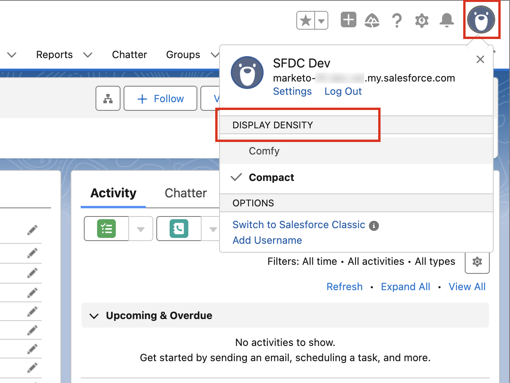
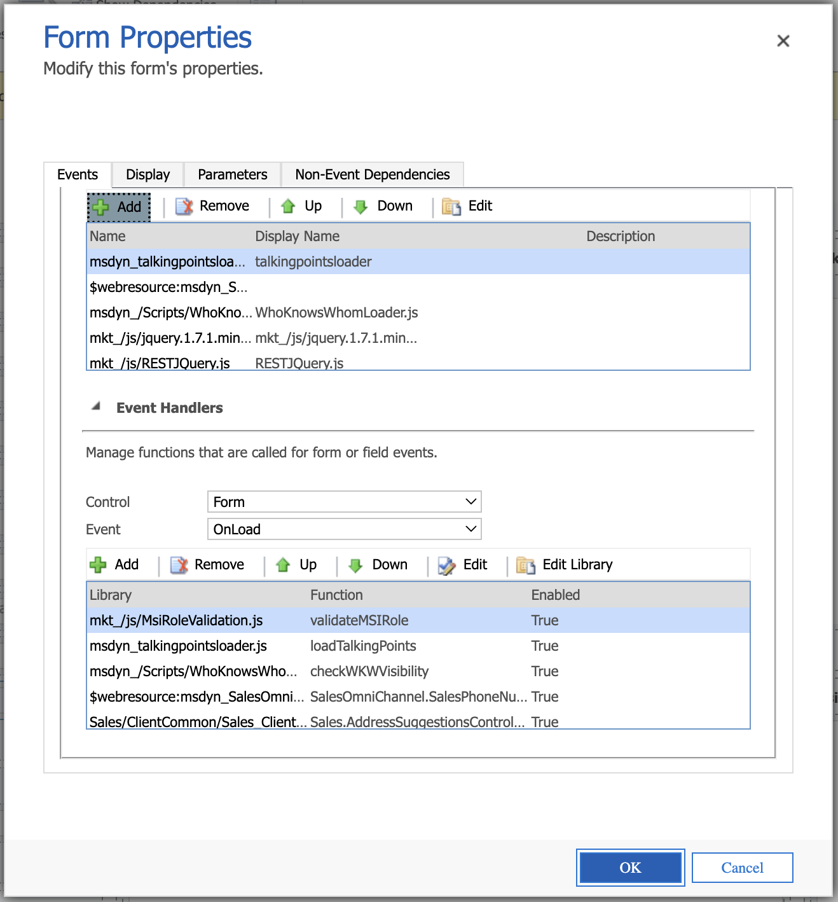
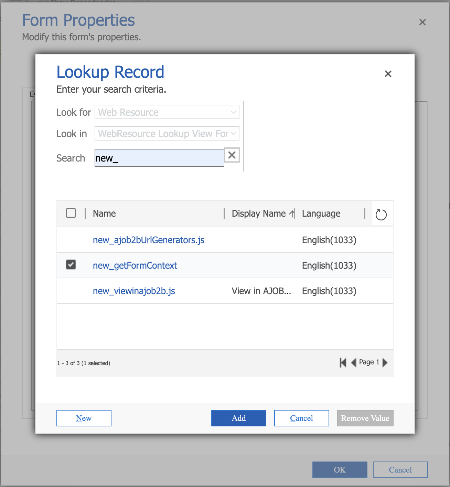
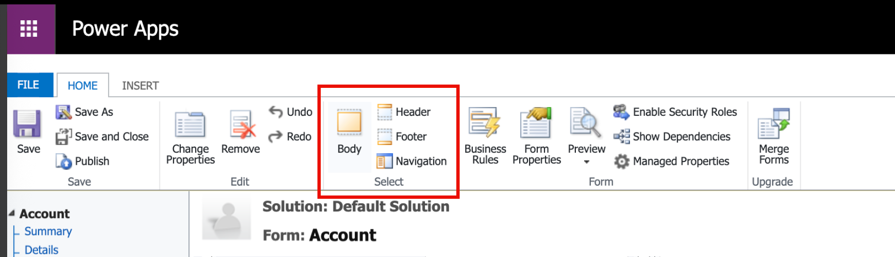

# Acceso en CRM a las páginas de detalles

Adobe Journey Optimizer B2B edition permite a los miembros de los equipos de ventas y cuentas acceder a las páginas detalladas de la información de la cuenta y del grupo de compras directamente desde su herramienta de administración de la relación con los clientes (CRM), como Salesforce o Microsoft Dynamics. Con esta integración, los representantes de ventas pueden acceder rápidamente a información de la cuenta en tiempo real y del grupo de compra, como el historial de participación, las señales de intención y las recomendaciones generadas por IA. Esta capacidad permite que el equipo de ventas tenga un alcance más rápido, una priorización más inteligente y una mejor alineación con el marketing.

Para permitir que los miembros de ventas y del equipo de cuentas vean las páginas de [detalles de cuenta](account-details.md) y [detalles de persona](person-details.md) en Journey Optimizer B2B edition desde CRM, el administrador de Salesforce o Dynamics puede agregar un vínculo desde la vista de cuenta, contacto o posible cliente.

Cuando un miembro del equipo de ventas utiliza el vínculo de la instancia de CRM, la zona protegida debe ser _Prod_ y la organización de IMS se determina según la siguiente lógica ordenada:

1. La organización más reciente a la que accedió el usuario
1. El primero de la lista con un orden alfabético
1. La organización seleccionada en sus preferencias

## Vínculos de Salesforce

Un administrador de Salesforce con el permiso _Personalizar aplicación_ puede configurar el vínculo en el diseño Cuenta, Contacto o Posible cliente. Los vínculos configurados permiten a los usuarios de ventas acceder a la página de detalles de la cuenta o de la persona correspondiente en Adobe Journey Optimizer B2B edition.

En Salesforce, agregue el vínculo personalizado como botón, hipervínculo o icono vinculado y personalícelo según las preferencias de su equipo.

{width="800" zoomable="yes"}

Para obtener información detallada sobre cómo agregar un vínculo personalizado en Salesforce, consulte [Definir botones y vínculos personalizados](https://help.salesforce.com/s/articleView?id=platform.defining_custom_links.htm&type=5) en la documentación de Salesforce.

Al definir la dirección URL de destino del vínculo, puede utilizar el diseño de la cuenta, el contacto o el posible cliente y vincularlo a la página de detalles correspondiente en Journey Optimizer B2B edition:

* **Cuenta** - `https://experience.adobe.com/#/journey-optimizer-b2b/accounts/crm/account/[18-character ID of account]`

* **Contacto** - `https://experience.adobe.com/#/journey-optimizer-b2b/accounts/crm/contact/[18-character ID of contact]`

* **Posible cliente** - `https://experience.adobe.com/#/journey-optimizer-b2b/accounts/crm/lead/[18-character ID of lead]`

Utilice el objeto `Account` para recuperar el identificador de 18 caracteres de la cuenta, como `CASESAFEID(Account.Id)` o `CASESAFEID(Id)`.

**_Ejemplos:_**

+++Vínculo de campo

1. En Salesforce, vaya a **[!UICONTROL Configuración]** > **[!UICONTROL Administrador de objetos]** > **[!UICONTROL Cuenta]**/**[!UICONTROL Contacto]**/**[!UICONTROL Posible cliente]** > **[!UICONTROL Campos y relaciones]**.
1. Haga clic en **[!UICONTROL Nuevo]** para crear un campo de fórmula (texto) y agréguelo a un diseño de _cuenta_, _contacto_ o _posible cliente_.

   Para la fórmula, utilice los siguientes ejemplos como guía.

   **_Hipervínculo de texto:_**

   * Cuenta - `HYPERLINK("https://experience.adobe.com/#/journey-optimizer-b2b/accounts/crm/account/" & CASESAFEID(Id), "View in AJO B2B")`
   * Contacto - `HYPERLINK("https://experience.adobe.com/#/journey-optimizer-b2b/accounts/crm/contact/" & CASESAFEID(Id), "View in AJO B2B")`
   * Posible cliente - `HYPERLINK("https://experience.adobe.com/#/journey-optimizer-b2b/accounts/crm/lead/" & CASESAFEID(Id), "View in AJO B2B")`

   **_Icono hipervínculo:_**

   * Cuenta - `HYPERLINK("https://experience.adobe.com/#/journey-optimizer-b2b/accounts/crm/account/" & CASESAFEID(Id), IMAGE("https://cdn.experience.adobe.net/assets/HeroIcons.6620f5dc.svg#AdobeExperienceSubCloud", "View in AJO B2B", 24, 24))`
   * Contacto - `HYPERLINK("https://experience.adobe.com/#/journey-optimizer-b2b/accounts/crm/contact/" & CASESAFEID(Id), IMAGE("https://cdn.experience.adobe.net/assets/HeroIcons.6620f5dc.svg#AdobeExperienceSubCloud", "View in AJO B2B", 24, 24))`
   * Contacto - `HYPERLINK("https://experience.adobe.com/#/journey-optimizer-b2b/accounts/crm/lead/" & CASESAFEID(Id), IMAGE("https://cdn.experience.adobe.net/assets/HeroIcons.6620f5dc.svg#AdobeExperienceSubCloud", "View in AJO B2B", 24, 24))`

   {width="800" zoomable="yes"}

1. Actualice la página para que se muestren los cambios de diseño. Vaya a **[!UICONTROL Perfil]** y seleccione una opción diferente en **[!UICONTROL DENSIDAD DE PANTALLA]**.

   {width="450" zoomable="yes"}

+++

+++Vínculo de página de detalles

1. En Salesforce, vaya a **[!UICONTROL Configuración]** > **[!UICONTROL Administrador de objetos]** > **[!UICONTROL Cuenta]**/**[!UICONTROL Contacto]**/**[!UICONTROL Posible cliente]** > **[!UICONTROL Botones, vínculos y acciones]**.
1. Haga clic en **[!UICONTROL Nuevo botón o en Vínculo]** en la esquina superior derecha y cree el vínculo a la página de detalles.

   Para la fórmula, utilice los siguientes ejemplos como guía.

   * Cuenta - `{!URLFOR("https://experience.adobe.com/#/journey-optimizer-b2b/accounts/crm/account/" & CASESAFEID(Account.Id), null)}`
   * Contacto - `{!URLFOR("https://experience.adobe.com/#/journey-optimizer-b2b/accounts/crm/contact/" & CASESAFEID(Contact.Id), null)}`
   * Posible cliente - `{!URLFOR("https://experience.adobe.com/#/journey-optimizer-b2b/accounts/crm/lead/" & CASESAFEID(Lead.Id), null)}`

   {width="800" zoomable="yes"}

1. Vaya a **[!UICONTROL Diseños de página]** en el panel de navegación izquierdo.

1. Arrastre el vínculo de **[!UICONTROL Vínculos personalizados]** y suéltelo en la sección _Vínculos personalizados_ del diseño.

+++

+++Botón de página de detalles

1. En Salesforce, vaya a **[!UICONTROL Configuración]** > **[!UICONTROL Administrador de objetos]** > **[!UICONTROL Cuenta]**/**[!UICONTROL Contacto]**/**[!UICONTROL Posible cliente]** > **[!UICONTROL Botones, vínculos y acciones]**.
1. Haga clic en **[!UICONTROL Nuevo botón o en Vínculo]** en la esquina superior derecha y cree el botón de página de detalles.

   Para el **[!UICONTROL Tipo de pantalla]**, elija **[!UICONTROL Vínculo de página de detalles]**.

   Para la fórmula, utilice los siguientes ejemplos como guía.

   * Cuenta - `{!URLFOR("https://experience.adobe.com/#/journey-optimizer-b2b/accounts/crm/account/" & CASESAFEID(Account.Id), null)}`
   * Contacto - `{!URLFOR("https://experience.adobe.com/#/journey-optimizer-b2b/accounts/crm/contact/" & CASESAFEID(Contact.Id), null)}`
   * Posible cliente - `{!URLFOR("https://experience.adobe.com/#/journey-optimizer-b2b/accounts/crm/lead/" & CASESAFEID(Lead.Id), null)}`

   {width="800" zoomable="yes"}

1. Vaya a **[!UICONTROL Diseños de página]** en el panel de navegación izquierdo.

1. Arrastre el botón de **[!UICONTROL Acciones móviles y de relámpago]** y suéltelo en la sección **[!UICONTROL Acciones de experiencias móviles y de relámpago de Salesforce]** del diseño.

   {width="800" zoomable="yes"}

+++

## Vínculos de Microsoft Dynamics

Un desarrollador de Dynamics puede ampliar la entidad Cuenta, Contacto o Posible cliente para agregar un campo de vínculo. Los vínculos configurados permiten a los usuarios de ventas acceder a la página de detalles de la cuenta o de la persona correspondiente en Adobe Journey Optimizer B2B edition.

Añada el vínculo personalizado como un botón, un hipervínculo o un vínculo de icono vinculado y personalícelo según las preferencias de su equipo.

{width="800" zoomable="yes"}

Utilice aplicaciones de energía para personalizar aplicaciones impulsadas por modelos de Microsoft, como los componentes de Dynamics. Para obtener información detallada sobre cómo usar Power Apps para agregar un vínculo personalizado en Dynamics, consulte la [documentación de PowerApps](https://learn.microsoft.com/en-us/power-apps/maker/model-driven-apps/create-edit-web-resources).

Al definir la dirección URL de destino del vínculo, puede utilizar la vista de cuenta, contacto o posible cliente y vincularla a la página de detalles correspondiente en Journey Optimizer B2B edition:

* **Cuenta** - `https://experience.adobe.com/#/journey-optimizer-b2b/accounts/crm/account/[Account ID]`

* **Contacto** - `https://experience.adobe.com/#/journey-optimizer-b2b/accounts/crm/contact/[Contact ID]`

* **Posible cliente** - `https://experience.adobe.com/#/journey-optimizer-b2b/accounts/crm/lead/[Lead ID]`

**_Ejemplos:_**

+++Campo de URL

Siga esta secuencia de tareas para agregar el vínculo personalizado como campo de URL:

**1 - Configurar el campo de solución**

1. Vaya a **[!UICONTROL Configuración avanzada]** > **[!UICONTROL Personalice el sistema]** y seleccione la ficha **[!UICONTROL Solución]**.
1. Seleccione **[!UICONTROL Entidades]** > **[!UICONTROL Cuenta]**/**[!UICONTROL Contacto]**/**[!UICONTROL Posible Cliente]** > **[!UICONTROL Campos]**.
1. Haga clic en **[!UICONTROL Nuevo]** y configure el nuevo campo.

   {width="800" zoomable="yes"}

1. Guarde la configuración del campo.
1. En la ficha _[!UICONTROL Solución]_, seleccione **[!UICONTROL Recursos web]**.
1. Haga clic en **[!UICONTROL Nuevo]** y configure el siguiente recurso web de Script (JScript):

   ```js
   function setViewInAjoB2b(executionContext) {
    var url = "https://experience.adobe.com/#/journey-optimizer-b2b/accounts/crm";
   
    var formContext = executionContext.getFormContext();
   
    // Get the entity ID (GUID)
    var id = formContext.data.entity.getId();
   
    // Get the entity type (account, lead, contact)
    var type = formContext.data.entity.getEntityName().toLowerCase();
   
    if (id && type) {
        // Remove curly braces
        id = id.replace(/[{}]/g, "").toLowerCase();
   
        // Set the value in the custom field (Ensure this field exists on the form)
        formContext.getAttribute("new_viewinajob2b").setValue(url + "/" + type + "/" + id);
       }
   }
   ```

   {width="800" zoomable="yes"}

1. En la parte superior de la página, haz clic en **[!UICONTROL GUARDAR]** y luego en **[!UICONTROL PUBLICAR]**.

**2 - Configurar el formulario**

1. En la ficha _Solución_, seleccione **[!UICONTROL Entidades]** > **[!UICONTROL Cuenta]**/**[!UICONTROL Contacto]**/**[!UICONTROL Posible cliente]** > **[!UICONTROL Forms]** > **[!UICONTROL Cuenta]**/**[!UICONTROL Contacto]**/**[!UICONTROL Posible cliente]**.
1. Arrastre el nuevo campo que creó en la primera tarea desde **[!UICONTROL Explorador de campos]** hasta la sección **[!UICONTROL Resumen]**.

   {width="800" zoomable="yes"}

1. Haga doble clic en el campo en la sección _Resumen_ y configure sus propiedades.

   {width="800" zoomable="yes"}

   Cuando finalice la configuración de la propiedad, haga clic en **[!UICONTROL Aceptar]**.

1. En la cinta de opciones de la parte superior de la página, haz clic en **[!UICONTROL Guardar]** y luego en **[!UICONTROL Publicar]**.

**3 - Agregar el recurso web JS a las bibliotecas de formularios**

1. En la ficha _[!UICONTROL Inicio]_ de la parte superior, haga clic en **[!UICONTROL Propiedades del formulario]**.
1. Haga clic en **[!UICONTROL Agregar]**.

   {width="500" zoomable="yes"}

1. Busque el recurso, selecciónelo y haga clic en **[!UICONTROL Agregar]**.

   {width="500" zoomable="yes"}

1. Con el recurso agregado seleccionado, haga clic en **[!UICONTROL Agregar]** en _[!UICONTROL Controladores de eventos]_.
1. Agregar la función `setViewInAjoB2b` a **[!UICONTROL Controladores de eventos]**.
1. Con la función seleccionada en la lista _[!UICONTROL Controladores de eventos]_, establezca **[!UICONTROL Control]** en `Form` y **[!UICONTROL Evento]** en `OnLoad`.

   {width="500" zoomable="yes"}

1. Haga clic en **[!UICONTROL Aceptar]**.

1. En la ficha _[!UICONTROL Página de inicio]_ de la parte superior, haz clic en **[!UICONTROL Guardar]** y luego en **[!UICONTROL Publicar]**.

**4 - Comprobar el vínculo**

Para verificar el vínculo, marque la vista Cuenta, Contacto o Posible cliente en Dynamics.

{width="500" zoomable="yes"}

Si no se muestra el vínculo, intente ir a Cuentas, Contactos o Posibles clientes en **[!UICONTROL Clientes]** en la página de inicio de Dynamics. A continuación, vuelva a la vista de cuenta, contacto o posible cliente específica. También puede cerrar la sesión y volver a iniciarla.

+++

+++recurso web de HTML

Siga esta secuencia de tareas para agregar el vínculo personalizado como recurso web de HTML:

>[!NOTE]
>
>Este ejemplo depende de cómo utilice Dynamics los recursos web de la página web.

**1 - Configurar los recursos web de la solución**

1. Vaya a **[!UICONTROL Configuración avanzada]** > **[!UICONTROL Personalice el sistema]** y seleccione la ficha **[!UICONTROL Solución]**.

1. En la ficha _[!UICONTROL Solución]_, seleccione **[!UICONTROL Recursos Web]**.

1. Haga clic en **[!UICONTROL Nuevo]** y configure el siguiente recurso web de Script (JScript) mediante la siguiente función:

   ```js
   function getFormContext(executionContext) {
       window.top["formContext"] = executionContext.getFormContext();
   }
   ```

   {width="800" zoomable="yes"}

1. Haga clic en **[!UICONTROL Nuevo]** para crear otro recurso web y configurar un recurso web de página web (HTML) mediante el siguiente HTML:

   ```html
   <html>
   <head>
       <script>
       function onLoad(){
           // Adobe URL
           var url = "https://experience.adobe.com/#/journey-optimizer-b2b/accounts/crm";
   
           // Get the entity ID (GUID)
           var id = window.top.formContext.data.entity.getId();
   
           // Get the entity type (account, lead, contact)
           var type = window.top.formContext.data.entity.getEntityName().toLowerCase();
   
           if (id && type) {
               // Remove curly braces
               id = id.replace(/[{}]/g, "").toLowerCase();
               var url = url + "/" + type + "/" + id;
   
               // Find the hyperlink and set the href value
               var link = document.getElementById("link");
               link.href = url;
           }
       }
       </script>
   </head>
   <body onload="onLoad()" style="margin-left: 0;">
       <a id="link" style="text-decoration: none; font-family: sans-serif; font-size: 13px;" target="_blank">
           
           <span style="vertical-align: middle;">View in AJOB2B</span>
       </a>
   </body>
   </html>
   ```

1. En la parte superior de la página, haz clic en **[!UICONTROL GUARDAR]** y luego en **[!UICONTROL PUBLICAR]**.

**2 - Agregar los recursos web JS a las bibliotecas de formularios**

1. En la ficha _Solución_, seleccione **[!UICONTROL Entidades]** > **[!UICONTROL Cuenta]**/**[!UICONTROL Contacto]**/**[!UICONTROL Posible cliente]** > **[!UICONTROL Forms]** > **[!UICONTROL Cuenta]**/**[!UICONTROL Contacto]**/**[!UICONTROL Posible cliente]**.

1. En la ficha _Inicio_ de la parte superior, haga clic en **[!UICONTROL Propiedades del formulario]**.

1. Haga clic en **[!UICONTROL Agregar]**.

1. Busque el recurso web de JScript (`new_getFormContext`) que creó, selecciónelo y haga clic en **[!UICONTROL Agregar]**.

   {width="500" zoomable="yes"}

1. Con el recurso agregado seleccionado, haga clic en **[!UICONTROL Agregar]** en _[!UICONTROL Controladores de eventos]_.
1. Agregar la función `getFormContext` a **[!UICONTROL Controladores de eventos]**.
1. Con la función seleccionada en la lista _[!UICONTROL Controladores de eventos]_, establezca **[!UICONTROL Control]** en `Form` y **[!UICONTROL Evento]** en `OnLoad`.

   {width="500" zoomable="yes"}

1. Haga clic en **[!UICONTROL Aceptar]**.

1. En la ficha _[!UICONTROL Página de inicio]_ de la parte superior, haz clic en **[!UICONTROL Guardar]** y luego en **[!UICONTROL Publicar]**.

**3 - Configurar el formulario**

1. En la ficha **[!UICONTROL INICIO]** del formulario Cuenta, Contacto o Posible cliente, seleccione **[!UICONTROL Cuerpo]** (para crear el recurso vinculado en la sección _Resumen_) o **[!UICONTROL Encabezado]** (para crearlo en el menú de encabezado).

   {width="500" zoomable="yes"}

1. Seleccione la ficha **[!UICONTROL INSERT]** en la parte superior y haga clic en **[!UICONTROL Recurso web]**.

1. Inserte el recurso web que ha creado y configure las propiedades.

   {width="500" zoomable="yes"}

   Para obtener información detallada sobre las propiedades y el formato de los recursos web, consulte la [documentación de Power Apps](https://learn.microsoft.com/en-us/power-apps/maker/model-driven-apps/web-resource-properties-legacy).

1. Haga clic en **[!UICONTROL Aceptar]**.

   Si elige una ubicación de cuerpo/resumen para el recurso web, se muestra en el diseño del formulario.

   Se agregó {width="800" zoomable="yes"}

1. En la ficha _[!UICONTROL Página de inicio]_ de la parte superior, haz clic en **[!UICONTROL Guardar]** y luego en **[!UICONTROL Publicar]**.

**4 - Comprobar el vínculo**

Para verificar el vínculo, marque la vista Cuenta, Contacto o Posible cliente en Dynamics.

{width="500" zoomable="yes"}

Si no se muestra el vínculo, intente ir a Cuentas, Contactos o Posibles clientes en **[!UICONTROL Clientes]** en la página de inicio de Dynamics. A continuación, vuelva a la vista de cuenta, contacto o posible cliente específica. También puede cerrar la sesión y volver a iniciarla.

+++
