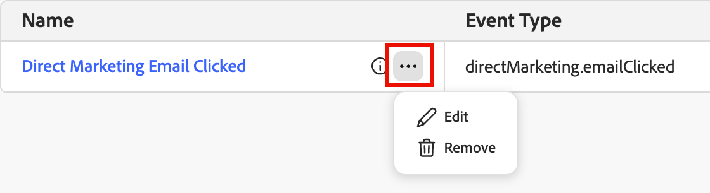

# Seleccionar eventos de experiencia y campos

Los administradores pueden seleccionar [eventos de experiencia](https://experienceleague.adobe.com/en/docs/experience-platform/xdm/classes/experienceevent){target="_blank"} específicos de Adobe Experience Platform (AEP) y sus campos asociados en el esquema de unión de eventos de experiencia. Después de la selección, los usuarios pueden configurar reglas de toma de decisiones para escuchar esos eventos de experiencia y habilitar acciones de campaña dinámicas y segmentadas basadas en datos de eventos casi en tiempo real.

<!-- {width="30"} [Watch the video overview](#overview-video) -->

>[!PREREQUISITES]
>
>El uso de eventos y campos de experiencia en Journey Optimizer B2B edition requiere esquemas de eventos de experiencia con perfil habilitado. Para obtener más información, consulte [Habilitar perfiles de clientes en tiempo real](https://experienceleague.adobe.com/en/docs/platform-learn/getting-started-for-data-architects-and-data-engineers/enable-profiles){target="_blank"} en los tutoriales de Experience Platform.

El uso de eventos de experiencia de AEP en recorrido es un proceso de dos pasos:

1. Un administrador [agrega eventos y campos de experiencia de AEP](#add-an-event) en las configuraciones de Journey Optimizer B2B edition.

1. En un recorrido, un experto en marketing utiliza los eventos configurados de una de las dos maneras siguientes:

   * Agrega un nodo _Listen for an event_ y [selecciona un evento de experiencia](../journeys/listen-for-event-nodes.md#listen-for-an-experience-event) para almacenar en déclencheur la progresión de recorrido basada en la actividad de evento en tiempo real durante el recorrido.
   * Agrega un nodo _Split paths by people_ y configura una ruta para [filtrar en un evento](../journeys/split-merge-paths-nodes.md#experience-event-history-filtering) desde la carpeta **[!UICONTROL Event history]**.

>[!BEGINSHADEBOX]

## Directrices y limitaciones {#guidelines-and-limitations}

A medida que seleccione eventos para satisfacer sus objetivos organizativos, tenga en cuenta lo siguiente:

* Puede seleccionar hasta 50 eventos y hasta 100 campos por evento.

* Los recorridos pueden escuchar los eventos de experiencia que se incorporan mediante las funciones de flujo continuo de Experience Platform, como Web SDK o la API HTTP.

* Los datos de evento de experiencia histórica comienzan a acumularse para una persona cuando el evento existe en la base de datos de Journey Optimizer B2B edition. Para las personas que ya existen cuando se configura un tipo de evento por primera vez, el relleno comienza en el momento de la configuración. Para las personas nuevas, la acumulación comienza cuando se añade la persona por primera vez (su historial anterior no está disponible de forma retroactiva).

* Actualmente no hay ningún mecanismo de eliminación para el historial de eventos acumulado. La política de retención a largo plazo está sujeta a cambios.

* Cuando se utiliza un evento de experiencia y se publica el recorrido, se pueden añadir más campos, pero no se pueden eliminar los seleccionados anteriormente.

* Puede hacer referencia a un evento de experiencia en varios recorridos o utilizarlo más de una vez en el mismo recorrido.

>[!ENDSHADEBOX]

## Administrar eventos de experiencia {#manage-experience-events}

>[!NOTE]
>
>Al seleccionar campos XDM para _[!UICONTROL Standard]_, [!UICONTROL Relational] o [!UICONTROL Events], solo se admiten tipos de datos básicos (cadena, entero, doble y booleano). No se permiten matrices y objetos.

1. En el panel de navegación izquierdo, elija **[!UICONTROL Administración]** > **[!UICONTROL Configuraciones]**.

1. Haga clic en **[!UICONTROL Configuraciones de XDM]** en el panel intermedio y, a continuación, haga clic en la pestaña **[!UICONTROL Eventos]** para mostrar la lista de los eventos disponibles.

   {width="800" zoomable="yes"}

   La lista se muestra de acuerdo con la columna _[!UICONTROL Última actualización]_, con los eventos actualizados más recientemente en la parte superior de forma predeterminada.

   Desde esta página, puede [seleccionar](#add-an-event) y [editar](#edit-an-event) eventos para usarlos en recorridos.

   Para acceder a los detalles de un evento seleccionado, haga clic en el nombre del evento.

### Filtrado de la lista de eventos {#filter-the-event-list}

Escriba texto en el campo _[!UICONTROL Buscar]_ para filtrar los eventos mostrados y buscar una coincidencia en el nombre del evento.

{width="600" zoomable="yes"}

### Añadir un evento {#add-an-event}

Para que un evento de experiencia esté disponible para un nodo _Escuchar un evento_ en un recorrido, seleccione el evento y los campos admitidos.

1. Haga clic en **[!UICONTROL Seleccionar evento de experiencia]** en la parte superior derecha.

   Se muestra la página de detalles del evento. Desde esta página, puede elegir el tipo de evento y los campos.

   {width="700" zoomable="yes"}

1. Elija el tipo de evento.

   * Haga clic en **[!UICONTROL Seleccionar tipo de evento]**.

   * En el cuadro de diálogo, elija el tipo de evento.

     Utilice el campo _[!UICONTROL Buscar]_ para filtrar la lista mostrada por nombre. Use el control deslizante **[!UICONTROL Mostrar solo los campos seleccionados]** para revisar las selecciones actuales.

     {width="450" zoomable="yes"}

   * Haga clic en **[!UICONTROL Seleccionar]**.

1. Elija uno o varios campos para el tipo de evento.

   * Haga clic en **[!UICONTROL Seleccionar campos]**.

   * En el cuadro de diálogo, seleccione los campos que desee utilizar como restricciones para eventos coincidentes.

     Utilice el campo _[!UICONTROL Buscar]_ para filtrar la lista mostrada por nombre. Use el control deslizante **[!UICONTROL Mostrar solo los campos seleccionados]** para revisar las selecciones actuales.

     {width="450" zoomable="yes"}

   * Haga clic en **[!UICONTROL Seleccionar]**.

1. En la página de detalles del evento, haga clic en **[!UICONTROL Guardar]**.

La lista de la ficha _[!UICONTROL Eventos]_ muestra el evento guardado.

### Edición de un evento {#edit-an-event}

Para cambiar los campos, edite los detalles del evento.

1. Haga clic en el nombre del evento o haga clic en el icono _Más menú_ ( **...** ) y elija **[!UICONTROL Editar]**.

   {width="500" zoomable="yes"}

1. Haga clic en **[!UICONTROL Editar campos]** para abrir el cuadro de diálogo _[!UICONTROL Seleccionar campos]_ y agregar más campos.

   No puede quitar campos seleccionados previamente después de publicar un recorrido que utilice este evento.

1. Haga clic en **[!UICONTROL Seleccionar]** para guardar las selecciones.

### Eliminar un evento {#remove-an-event}

Para evitar que se use un evento de experiencia en un nodo _Escuchar un evento_ dentro de un recorrido, quite el evento. No puede quitar un evento si lo usa un recorrido con los estados _Programado_, _Activo_ o _Finalizado_.

1. Haga clic en el icono _Más menú_ ( **...** ) junto al nombre del evento y elija **[!UICONTROL Quitar]**.

1. En el cuadro de diálogo de confirmación, haga clic en **[!UICONTROL Quitar]**.

   {width="500" zoomable="yes"}

## Eventos y campos {#events-and-fields}

Para [!DNL Journey Optimizer B2B Edition], ciertas actividades a nivel de personas se capturan como [!DNL Experience Platform] eventos de experiencia. Estos eventos se almacenan en un conjunto de datos del sistema que utiliza el esquema de evento de experiencia XDM e incluye grupos de campos específicos del recorrido. Puede usar estos eventos en [!UICONTROL Journey Optimizer B2B edition] como cualquier otro evento de experiencia.

Cada evento expone un conjunto definido de campos que se pueden utilizar en el recorrido _Escuchar un evento_ nodos (toma de decisiones basada en eventos). Para determinar qué evento y campos utilizar en estos nodos de recorrido, revise los tipos de evento disponibles y sus campos:

### Se envió el email {#email-sent}

Este evento rastrea cuándo se envió un correo electrónico de marketing a una persona.

Tipo de evento: `directMarketing.emailSent`

+++Campos

| Nombre para mostrar | Ruta |
| ------------ | ---- |
| Identificador | `_id` |
| Tipo de evento | `eventType` |
| Marca de tiempo | `timestamp` |
| ID de persona | `personID` |
| ID de origen de persona | `personKey.sourceID` |
| Tipo de origen de persona | `personKey.sourceType` |
| ID de instancia de origen de persona | `personKey.sourceInstanceID` |
| Clave de origen de persona | `personKey.sourceKey` |
| ID de origen de correo electrónico | `directMarketing.emailSent.mailingKey.sourceID` |
| Tipo de origen de correo electrónico | `directMarketing.emailSent.mailingKey.sourceType` |
| ID de instancia de correo electrónico | `directMarketing.emailSent.mailingKey.sourceInstanceID` |
| Clave de origen de correo electrónico | `directMarketing.emailSent.mailingKey.sourceKey` |
| Nombre de correo | `directMarketing.emailSent.mailingName` |
| ID de recorrido | `_experience.journeyOrchestration.stepEvents.journeyID` |
| ID de nodo | `_experience.journeyOrchestration.stepEvents.nodeID` |

+++

### Correo electrónico entregado {#email-delivered}

Este evento rastrea cuándo se entregó correctamente un correo electrónico al servicio de correo electrónico de una persona.

Tipo de evento: `directMarketing.emailDelivered`

+++Campos

| Nombre para mostrar | Ruta |
| ------------ | ---- |
| Identificador | `_id` |
| Tipo de evento | `eventType` |
| Marca de tiempo | `timestamp` |
| ID de persona | `personID` |
| ID de origen de persona | `personKey.sourceID` |
| Tipo de origen de persona | `personKey.sourceType` |
| ID de instancia de origen de persona | `personKey.sourceInstanceID` |
| Clave de origen de persona | `personKey.sourceKey` |
| ID de origen de correo | `directMarketing.mailingKey.sourceID` |
| Tipo de origen de correo | `directMarketing.mailingKey.sourceType` |
| ID de instancia de origen de correo | `directMarketing.mailingKey.sourceInstanceID` |
| Clave de origen de correo | `directMarketing.mailingKey.sourceKey` |
| Nombre de correo | `directMarketing.mailingName` |
| ID de recorrido | `_experience.journeyOrchestration.stepEvents.journeyID` |
| ID de nodo | `_experience.journeyOrchestration.stepEvents.nodeID` |

+++

### Se abrió el email {#email-opened}

Este evento rastrea cuándo una persona ha abierto un correo electrónico de marketing.

Tipo de evento: `directMarketing.emailOpened`

+++Campos

| Nombre para mostrar | Ruta |
| ------------ | ---- |
| Identificador | `_id` |
| Tipo de evento | `eventType` |
| Marca de tiempo | `timestamp` |
| ID de persona | `personID` |
| ID de origen de persona | `personKey.sourceID` |
| Tipo de origen de persona | `personKey.sourceType` |
| ID de instancia de origen de persona | `personKey.sourceInstanceID` |
| Clave de origen de persona | `personKey.sourceKey` |
| ID de origen de correo | `directMarketing.mailingKey.sourceID` |
| Tipo de origen de correo | `directMarketing.mailingKey.sourceType` |
| ID de instancia de origen de correo | `directMarketing.mailingKey.sourceInstanceID` |
| Clave de origen de correo | `directMarketing.mailingKey.sourceKey` |
| Nombre de correo | `directMarketing.mailingName` |
| Es un dispositivo móvil | `device.isMobileDevice` |
| Modelo de dispositivo | `device.model` |
| Agente de usuario | `environment.browserDetails.userAgent` |
| Sistema operativo | `environment.operatingSystem` |
| ID de recorrido | `_experience.journeyOrchestration.stepEvents.journeyID` |
| ID de nodo | `_experience.journeyOrchestration.stepEvents.nodeID` |

+++

### Correo electrónico clicado {#email-clicked}

Este evento rastrea cuándo una persona hizo clic en un vínculo en un correo electrónico de marketing.

Tipo de evento: `directMarketing.emailClicked`

+++Campos

| Nombre para mostrar | Ruta |
| ------------ | ---- |
| Identificador | `_id` |
| Tipo de evento | `eventType` |
| Marca de tiempo | `timestamp` |
| ID de persona | `personID` |
| ID de origen de persona | `personKey.sourceID` |
| Tipo de origen de persona | `personKey.sourceType` |
| ID de instancia de origen de persona | `personKey.sourceInstanceID` |
| Clave de origen de persona | `personKey.sourceKey` |
| ID de origen de correo | `directMarketing.mailingKey.sourceID` |
| Tipo de origen de correo | `directMarketing.mailingKey.sourceType` |
| ID de instancia de origen de correo | `directMarketing.mailingKey.sourceInstanceID` |
| Clave de origen de correo | `directMarketing.mailingKey.sourceKey` |
| Nombre de correo | `directMarketing.mailingName` |
| URL del vínculo | `directMarketing.linkURL` |
| Es un dispositivo móvil | `device.isMobileDevice` |
| Modelo | `device.model` |
| Agente de usuario | `environment.browserDetails.userAgent` |
| Sistema operativo | `environment.operatingSystem` |
| ID de recorrido | `_experience.journeyOrchestration.stepEvents.journeyID` |
| ID de nodo | `_experience.journeyOrchestration.stepEvents.nodeID` |

+++

### El email se rechazó {#email-bounced}

Este evento rastrea cuándo rebotó un correo electrónico a una persona.

Tipo de evento: `directMarketing.emailBounced`

+++Campos

| Nombre para mostrar | Ruta |
| ------------ | ---- |
| Identificador | `_id` |
| Tipo de evento | `eventType` |
| Marca de tiempo | `timestamp` |
| ID de persona | `personID` |
| ID de origen de persona | `personKey.sourceID` |
| Tipo de origen de persona | `personKey.sourceType` |
| ID de instancia de origen de persona | `personKey.sourceInstanceID` |
| Clave de origen de persona | `personKey.sourceKey` |
| ID de origen de correo | `directMarketing.mailingKey.sourceID` |
| Tipo de origen de correo | `directMarketing.mailingKey.sourceType` |
| ID de instancia de origen de correo | `directMarketing.mailingKey.sourceInstanceID` |
| Clave de origen de correo | `directMarketing.mailingKey.sourceKey` |
| Nombre de correo | `directMarketing.mailingName` |
| Correo electrónico | `directMarketing.email` |
| Código de correo electrónico rechazado | `directMarketing.emailBouncedCode` |
| Detalles de correos electrónicos rechazados | `directMarketing.emailBouncedDetails` |
| ID de recorrido | `_experience.journeyOrchestration.stepEvents.journeyID` |
| ID de nodo | `_experience.journeyOrchestration.stepEvents.nodeID` |

+++

### Se rechazó el email temporalmente {#email-bounced-soft}

Este evento rastrea cuándo ha rebotado suavemente un correo electrónico a una persona.

Tipo de evento: `directMarketing.emailBouncedSoft`

+++Campos

| Nombre para mostrar | Ruta |
| ------------ | ---- |
| Identificador | `_id` |
| Tipo de evento | `eventType` |
| Marca de tiempo | `timestamp` |
| ID de persona | `personID` |
| ID de origen de persona | `personKey.sourceID` |
| Tipo de origen de persona | `personKey.sourceType` |
| ID de instancia de origen de persona | `personKey.sourceInstanceID` |
| Clave de origen de persona | `personKey.sourceKey` |
| ID de origen de correo | `directMarketing.mailingKey.sourceID` |
| Tipo de origen de correo | `directMarketing.mailingKey.sourceType` |
| ID de instancia de origen de correo | `directMarketing.mailingKey.sourceInstanceID` |
| Clave de origen de correo | `directMarketing.mailingKey.sourceKey` |
| Nombre de correo | `directMarketing.mailingName` |
| Correo electrónico | `directMarketing.email` |
| Código de correo electrónico rechazado | `directMarketing.emailBouncedCode` |
| Detalles de correos electrónicos rechazados | `directMarketing.emailBouncedDetails` |
| ID de recorrido | `_experience.journeyOrchestration.stepEvents.journeyID` |
| ID de nodo | `_experience.journeyOrchestration.stepEvents.nodeID` |

+++

### Correo electrónico cancelado {#email-unsubscribed}

Este evento rastrea cuándo una persona canceló la suscripción a un correo electrónico de marketing.

Tipo de evento: `directMarketing.emailUnsubscribed`

+++Campos

| Nombre para mostrar | Ruta |
| ------------ | ---- |
| Identificador | `_id` |
| Tipo de evento | `eventType` |
| Marca de tiempo | `timestamp` |
| ID de persona | `personID` |
| ID de origen de persona | `personKey.sourceID` |
| Tipo de origen de persona | `personKey.sourceType` |
| ID de instancia de origen de persona | `personKey.sourceInstanceID` |
| Clave de origen de persona | `personKey.sourceKey` |
| ID de origen de correo | `directMarketing.mailingKey.sourceID` |
| Tipo de origen de correo | `directMarketing.mailingKey.sourceType` |
| ID de instancia de origen de correo | `directMarketing.mailingKey.sourceInstanceID` |
| Clave de origen de correo | `directMarketing.mailingKey.sourceKey` |
| Nombre de correo | `directMarketing.mailingName` |
| ID de recorrido | `_experience.journeyOrchestration.stepEvents.journeyID` |
| ID de nodo | `_experience.journeyOrchestration.stepEvents.nodeID` |

+++

### Visite la página web {#visit-web-page}

Este tipo de evento es el método estándar para marcar la visita como una vista de página.

Tipo de evento: `web.webpagedetails.pageViews`

+++Campos

| Nombre para mostrar | Ruta |
| ------------ | ---- |
| Identificador | `_id` |
| Tipo de evento | `eventType` |
| Marca de tiempo | `timestamp` |
| ID de persona | `personID` |
| ID de origen de persona | `personKey.sourceID` |
| Tipo de origen de persona | `personKey.sourceType` |
| ID de instancia de origen de persona | `personKey.sourceInstanceID` |
| Clave de origen de persona | `personKey.sourceKey` |
| ID de origen de página web | `web.webPageDetails.webPageKey.sourceID` |
| Tipo de origen de página web | `web.webPageDetails.webPageKey.sourceType` |
| ID de instancia de origen de página web | `web.webPageDetails.webPageKey.sourceInstanceID` |
| Clave de origen de página web | `web.webPageDetails.webPageKey.sourceKey` |
| Nombre de página web | `web.webPageDetails.name` |
| URL de página web | `web.webPageDetails.URL` |
| Parámetros de consulta de página web | `web.webPageDetails.queryParameters` |
| ID de página web | `web.webPageDetails.webPageID` |
| Agente de usuario | `environment.browserDetails.userAgent` |
| URL del remitente | `web.webReferrer.URL` |

+++

### Formulario rellenado {#form-filled-out}

Este evento rastrea cuándo una persona ha rellenado un formulario en una página web.

Tipo de evento: `web.formFilledOut`

+++Campos

| Nombre para mostrar | Ruta |
| ------------ | ---- |
| Identificador | `_id` |
| Tipo de evento | `eventType` |
| Marca de tiempo | `timestamp` |
| ID de persona | `personID` |
| ID de origen de persona | `personKey.sourceID` |
| Tipo de origen de persona | `personKey.sourceType` |
| ID de instancia de origen de persona | `personKey.sourceInstanceID` |
| Clave de origen de persona | `personKey.sourceKey` |
| ID de origen de formulario web | `web.fillOutForm.webFormKey.sourceID` |
| Tipo de origen de formulario web | `web.fillOutForm.webFormKey.sourceType` |
| ID de instancia de origen de formulario web | `web.fillOutForm.webFormKey.sourceInstanceID` |
| Clave de origen de formulario web | `web.fillOutForm.webFormKey.sourceKey` |
| ID del formulario web | `web.fillOutForm.webFormID` |
| Nombre del formulario web | `web.fillOutForm.webFormName` |
| Parámetros de consulta de página web | `web.webPageDetails.queryParameters` |
| ID de página web | `web.webPageDetails.webPageID` |
| Agente de usuario | `environment.browserDetails.userAgent` |
| URL del remitente | `web.webReferrer.URL` |

+++

### Vínculo web pulsado {#web-link-clicked}

El evento indica que Web SDK registró automáticamente un clic en vínculo.

Tipo de evento: `web.webinteraction.linkClicks`

+++Campos

| Nombre para mostrar | Ruta |
| ------------ | ---- |
| Identificador | `_id` |
| Tipo de evento | `eventType` |
| Marca de tiempo | `timestamp` |
| ID de persona | `personID` |
| ID de origen de persona | `personKey.sourceID` |
| Tipo de origen de persona | `personKey.sourceType` |
| ID de instancia de origen de persona | `personKey.sourceInstanceID` |
| Clave de origen de persona | `personKey.sourceKey` |
| ID de origen de interacción web | `web.webInteraction.webInteractionKey.sourceID` |
| Tipo de origen de interacción web | `web.webInteraction.webInteractionKey.sourceType` |
| ID de instancia de origen de interacción web | `web.webInteraction.webInteractionKey.sourceInstanceID` |
| Clave de origen de interacción web | `web.webInteraction.webInteractionKey.sourceKey` |
| ID del vínculo de interacción web | `web.webInteraction.linkID` |
| URL del vínculo de interacción web | `web.webInteraction.linkURL` |
| Parámetros de consulta de página web | `web.webPageDetails.queryParameters` |
| ID de página web | `web.webPageDetails.webPageID` |
| Agente de usuario | `environment.browserDetails.userAgent` |
| URL del remitente | `web.webReferrer.URL` |

+++

### Momento interesante {#interesting-moment}

Este evento rastrea cuándo se grabó un momento interesante para una persona.

Tipo de evento: `leadOperation.interestingMoment`

+++Campos

| Nombre para mostrar | Ruta |
| ------------ | ---- |
| Identificador | `_id` |
| Tipo de evento | `eventType` |
| Marca de tiempo | `timestamp` |
| ID de persona | `personID` |
| ID de origen de persona | `personKey.sourceID` |
| Tipo de origen de persona | `personKey.sourceType` |
| ID de instancia de origen de persona | `personKey.sourceInstanceID` |
| Clave de origen de persona | `personKey.sourceKey` |
| Fecha del momento | `leadOperation.interestingMoment.date` |
| Descripción del momento | `leadOperation.interestingMoment.description` |
| Origen del momento | `leadOperation.interestingMoment.source` |
| Tipo de momento | `leadOperation.interestingMoment.type` |
| ID de recorrido | `_experience.journeyOrchestration.stepEvents.journeyID` |
| ID de nodo | `_experience.journeyOrchestration.stepEvents.nodeID` |

+++

<!--
 ## Overview video

>[!VIDEO](https://video.tv.adobe.com/v/3448637/?learn=on) 
-->