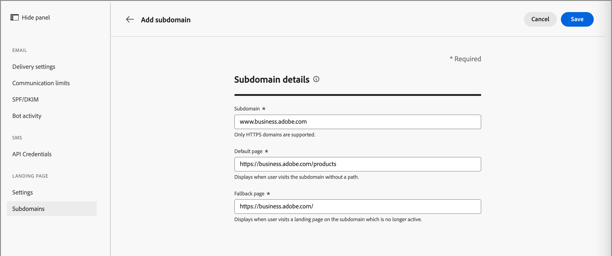
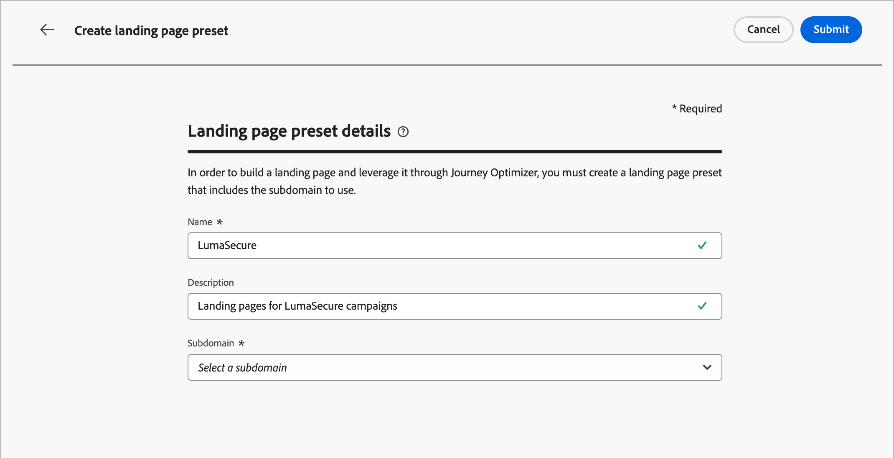

# Configuración de página de aterrizaje

Los administradores deben asegurarse de que las configuraciones de la página de aterrizaje estén establecidas para los especialistas en marketing que crean y publican estas páginas. Existen dos tipos de configuración necesarios para crear páginas de aterrizaje que reflejen una marca y rastreen la participación de forma eficaz:

* **_Subdominios_**: configure donde se hospedan las páginas de aterrizaje. Administre subdominios de página de aterrizaje para delegar, configurar o anular la delegación de configuraciones de dominio.
* **_Ajustes preestablecidos_**: defina configuraciones reutilizables (incluidas las configuraciones de subdominio y otros canales) para que los especialistas en marketing puedan crear y administrar páginas de aterrizaje de forma coherente.

## Subdominios {#lp-subdomains}

>[!CONTEXTUALHELP]
>id="ajo-b2b_admin_subdomain_lp_header"
>title="Delegar un subdominio de página de destino"
>abstract="Configure un subdominio para un uso de página de aterrizaje. Puede utilizar un subdominio que ya esté delegado en Adobe o configurar otro subdominio."

>[!CONTEXTUALHELP]
>id="ajo-b2b_admin_subdomain_lp"
>title="Delegar un subdominio de página de destino"
>abstract="Debe configurar un subdominio de página de aterrizaje antes de crear un ajuste preestablecido de página de aterrizaje. Puede utilizar un subdominio ya delegado a Adobe o configurar un nuevo subdominio."

>[!CONTEXTUALHELP]
>id="ajo-b2b_admin_config_lp_subdomain"
>title="Crear ajustes preestablecidos de la página de destino"
>abstract="Para crear un ajuste preestablecido de página de aterrizaje, asegúrese de que tiene al menos un subdominio de página de aterrizaje configurado para elegir de la lista Nombre de subdominio."

Para revisar los subdominios de página de aterrizaje configurados, ve a **[!UICONTROL Administración]** > **[!UICONTROL Canales]**. En _[!UICONTROL Páginas de aterrizaje]_ en el panel de navegación, seleccione **[!UICONTROL Subdominios de página de aterrizaje]**.

{width="800" zoomable="yes"}

La columna **Estado** proporciona información sobre el proceso de creación y delegación de subdominios:

* _[!UICONTROL Borrador]_: la delegación de subdominios se guardará como borrador. Haga clic en el nombre del subdominio para reanudar el proceso de creación.
* _[!UICONTROL Procesando]_: el subdominio está en curso a través de varias comprobaciones de configuración, que son necesarias para poder utilizarlo.
* _[!UICONTROL Éxito]_: el subdominio pasó correctamente las comprobaciones y se puede usar para enviar mensajes.
* _[!UICONTROL Error]_: una o varias comprobaciones fallaron después de enviar la delegación de subdominios.

>[!NOTE]
>
>Para poder [crear ajustes preestablecidos de página de aterrizaje](#lp-presets), debe configurar los subdominios que se utilizarán para las páginas de aterrizaje. Puede utilizar un subdominio que ya se haya delegado a Adobe o configurar otro.

Una configuración de subdominio de página de aterrizaje es **común a todos los entornos**. Por lo tanto:

* Para acceder y editar subdominios de página de aterrizaje, debe tener el permiso **[!UICONTROL Administrar subdominios de página de aterrizaje]** en la zona protegida de producción.

* Cualquier modificación en un subdominio de página de aterrizaje también afecta a las zonas protegidas de producción.

<!-- 
### Use an existing subdomain {#lp-existing-subdomain}

To use a subdomain that is already delegated to Adobe:

1. Click **[!UICONTROL Set up landing page subdomain]**.

    

1. For _[!UICONTROL Configuration type]_, choose **[!UICONTROL Use delegated domain]**.

    

1. Enter the prefix that you want to display in the landing page URL.

    Only alpha-numeric characters and hyphens are allowed.

    >[!CAUTION]
    >
    >Do not use `cdn` or `data` prefixes as these are reserved for internal use. You should also avoid other restricted or reserved prefixes, such as `dmarc` or `spf`.

1. Select a delegated subdomain from the list.

    You cannot select a subdomain that is already used as landing page subdomain.
    
    

    You cannot use multiple delegated subdomains of the same parent domain. For example, if 'marketing1.yourcompany.com' is already delegated to Adobe for your landing pages, you cannot use 'marketing2.yourcompany.com'. However, when multi-level subdomains are supported for landing pages, you may proceed using a subdomain of 'marketing1.yourcompany.com' (such as 'email.marketing1.yourcompany.com'), or a different parent domain.

    >[!CAUTION]
    >
    >If you select a domain that was delegated to Adobe using the [CNAME method](../configuration/delegate-subdomain.md#cname-subdomain-setup), you must create the DNS record on your hosting platform. To generate the DNS record, the process is the same as when you configure a new landing page subdomain.

1. Click **[!UICONTROL Submit]**.

   The subdomain is displayed in the list with the _[!UICONTROL Processing]_ status. For more on subdomains' statuses, see TBD.

    

   >[!IMPORTANT]
   >
   >The subdomain is not ready for use until Adobe performs the required checks, which can take **_up to 4 hours_**.

   When the checks are successful, the subdomain is listed with the _[!UICONTROL Success]_ status and it is ready to use for creating landing page presets.
-->

### Configuración de un nuevo subdominio {#lp-new-subdomain}

>[!CONTEXTUALHELP]
>id="ajo-b2b_admin_lp_subdomain_dns"
>title="Generar el registro DNS coincidente"
>abstract="Para configurar un nuevo subdominio de página de aterrizaje, debe copiar la información del servidor de nombres de Adobe que se muestra en la interfaz B2B de Journey Optimizer y pegarla en la solución de alojamiento de dominios para generar el registro DNS correspondiente. Cuando las comprobaciones son correctas, el subdominio está listo para utilizarse para crear ajustes preestablecidos de página de aterrizaje."

1. Haga clic en **[!UICONTROL Configurar subdominio de página de aterrizaje]**.

1. Para _[!UICONTROL tipo de configuración]_, elige **[!UICONTROL Agregar tu propio dominio]**.

1. Especifique el subdominio que desea delegar.

   >[!IMPORTANT]
   >
   >* No puede utilizar un subdominio de página de aterrizaje existente.
   >
   >* No se permiten mayúsculas en los subdominios.

   {width="500" zoomable="yes"}

   No se permite delegar un subdominio no válido a Adobe. Asegúrese de introducir un subdominio válido que sea propiedad de su organización, como marketing.yourcompany.com.

   Para las páginas de aterrizaje, se admiten subdominios de varios niveles. Por ejemplo, puede usar `email.marketing.yourcompany.com`.

1. Copie el registro mostrado o descargue un archivo CSV y, a continuación, vaya a la solución de alojamiento de dominios para generar el registro DNS correspondiente.

   Se muestra el registro que se va a colocar en los servidores DNS.

1. Asegúrese de que el registro DNS se generó en la solución de alojamiento de dominios.

   Si todo está configurado correctamente, seleccione la casilla de verificación de confirmación y haga clic en **[!UICONTROL Enviar]**.

   {width="500" zoomable="yes"}

   Al configurar un nuevo subdominio de página de aterrizaje, siempre apunta a un registro CNAME.

   Cuando se envía la delegación de subdominios, el subdominio se muestra en la lista con el estado _[!UICONTROL Procesando]_.

   >[!IMPORTANT]
   >
   >El subdominio no está listo para usarse hasta que Adobe realice las comprobaciones necesarias, que pueden tardar **_hasta 4 horas_**.

   Cuando las comprobaciones son correctas, el subdominio se enumera con el estado _[!UICONTROL Correcto]_ y está listo para usarse para crear ajustes preestablecidos de página de aterrizaje.

   El subdominio se marca como _[!UICONTROL Error]_ si no creó el registro de validación en su solución de alojamiento.

### Anular la delegación de un subdominio {#undelegate-subdomain}

1. En [!DNL Journey Optimizer], cancele la publicación de todas las páginas de aterrizaje asociadas con el subdominio.

1. Si el subdominio de página de aterrizaje señala a un registro CNAME, elimine el registro CNAME de la solución de alojamiento (no elimine el subdominio de correo electrónico original, si lo hay).

   <!--
    >[!NOTE]
    >
    >A landing page subdomain can point to a CNAME record because it was either an [existing subdomain](#lp-use-existing-subdomain) delegated to Adobe using the [CNAME method](../configuration/delegate-subdomain.md#cname-subdomain-setup), or a [new landing page subdomain](#lp-configure-new-subdomain) that you configured. 
    -->

1. Póngase en contacto con su representante de Adobe con el subdominio que desea desdelegar.

Una vez que Adobe administra la solicitud, la página de inventario de subdominios ya no muestra el dominio no delegado.

<!-- 
old marketo way for Prime?

A landing page subdomain should help to identify the content type, product name, or campaign, and reinforce the page authenticity. Before you configure the subdomains, define one or more CNAMEs to use for your landing pages. For example:

* **product**.[CompanyDomain].com
* **go**.[CompanyDomain].com
* **signup**.[CompanyDomain].com

In these examples, the first part (in bold) is the `LandingPageCNAME`.

Add a new subdomain for each unique brand URL that you want to host on Adobe Journey Optimizer B2B Edition. You can add a maximum number of 50 subdomains.

>[!IMPORTANT]
>
>Delegating an invalid subdomain to Adobe is not allowed. Make sure you enter a valid subdomain that your organization owns, such as _marketing.yourcompany.com_.

To review your subdomains and add new ones, go to **[!UICONTROL Administration]** > **[!UICONTROL Channels]**. Under _[!UICONTROL Landing Pages]_ in the navigation panel, select **[!UICONTROL Subdomains]**.

{width="800" zoomable="yes"}

_To add a landing page subdomain:_

1. Click **[!UICONTROL Add subdomain]** at the top right.

1. In the _[!UICONTROL Subdomain details]_, enter the subdomain information:

   * **[!UICONTROL Subdomain]** - The subdomain URL to use, such as `marketing.yourcompany.com`
   * **[!UICONTROL Default page]** - The URL for the default subdomain page, such as `marketing.yourcompany.com/products`
   * **[!UICONTROL Fallback page]** - The URL for the fallback page to be used if a landing page on the subdomain is not active, such as `marketing.yourcompany.com/expired`

   {width="700" zoomable="yes"}

1. Click **[!UICONTROL Save]**.

-->

## Ajustes preestablecidos {#lp-presets}

>[!CONTEXTUALHELP]
>id="ajo-b2b_admin_config_lp_subdomain_header"
>title="Crear ajustes preestablecidos de la página de destino"
>abstract="Para crear una página de aterrizaje y aprovecharla mediante Journey Optimizer B2B edition, debe crear un ajuste preestablecido de página de aterrizaje que incluya el subdominio que desea utilizar."

Cuando los especialistas en marketing [crean una página de aterrizaje](../content/landing-pages-create-publish.md#create-landing-page), deben seleccionar un ajuste preestablecido de página de aterrizaje para poder generar la página de aterrizaje y aprovecharla a través de [!DNL Journey Optimizer B2B Edition]. El ajuste preestablecido incluye el subdominio que se utilizará para la página de aterrizaje.

Antes de configurar un ajuste preestablecido, asegúrese de que haya al menos un subdominio de página de aterrizaje configurado con el estado _[!UICONTROL Correcto]_.

Para revisar los ajustes preestablecidos de la página de aterrizaje configurados, ve a **[!UICONTROL Administración]** > **[!UICONTROL Canales]**. En _[!UICONTROL Páginas de aterrizaje]_ en el panel de navegación, seleccione **[!UICONTROL Ajustes preestablecidos de página de aterrizaje]**.

{width="800" zoomable="yes"}

Haga clic en cualquier nombre de ajuste preestablecido para acceder a los detalles del ajuste preestablecido de la página de aterrizaje.

### Crear ajustes preestablecidos de la página de destino {#lp-create-preset}

1. Haga clic en **[!UICONTROL Crear ajuste preestablecido de página de aterrizaje]**.

1. Introduzca un nombre y una descripción para el ajuste preestablecido.

   Los nombres deben comenzar por una letra (A-Z) y solo contener caracteres alfanuméricos, guiones bajos `_`, puntos`.` y guiones `-`.

1. Seleccione un subdominio de página de aterrizaje.

   {width="500" zoomable="yes"}

   >[!NOTE]
   >
   >Para poder seleccionar un subdominio, asegúrese de que ha configurado previamente al menos un subdominio de página de aterrizaje.

   Se muestra la configuración correspondiente al subdominio seleccionado.

1. Puede seleccionar el subdominio de página de aterrizaje para la **[!UICONTROL URL de seguimiento]** marcando la opción **[!UICONTROL Igual que el subdominio de página de aterrizaje]**.<!-- [Learn more about tracking](../email/message-tracking.md) -->

   {width="500" zoomable="yes"}

   Por ejemplo, si la dirección URL de la página de aterrizaje es `pages.mail.luma.com` y la dirección URL de seguimiento es `data.mail.luma.com`, puede elegir `pages.mail.luma.com` para usar como subdominio de seguimiento.

   <!-- 
    >[!CAUTION]
    >
    >The selected landing page subdomain is used to specify the **[!UICONTROL Tracking URL]**and **[!UICONTROL Image Delivery URL]** if that subdomain was created using an [existing subdomain](#use-an-existing-subdomain).
    >
    >If the subdomain was created using the [Add your own domain](#configure-a-new-subdomain) option, the primary subdomain (such as the first delegated subdomain) is used instead. We don't have the existing option right now.
    -->

1. Haga clic en **[!UICONTROL Enviar]** para confirmar la creación del ajuste preestablecido de página de aterrizaje.

   <!--You can also save the preset as draft and resume its configuration later on.-->

   Cuando se crea el ajuste preestablecido de página de aterrizaje, se muestra en la lista con el estado _[!UICONTROL Activo]_ y está listo para usarse para [crear páginas de aterrizaje](../content/landing-pages-create-publish.md#create-landing-page).
