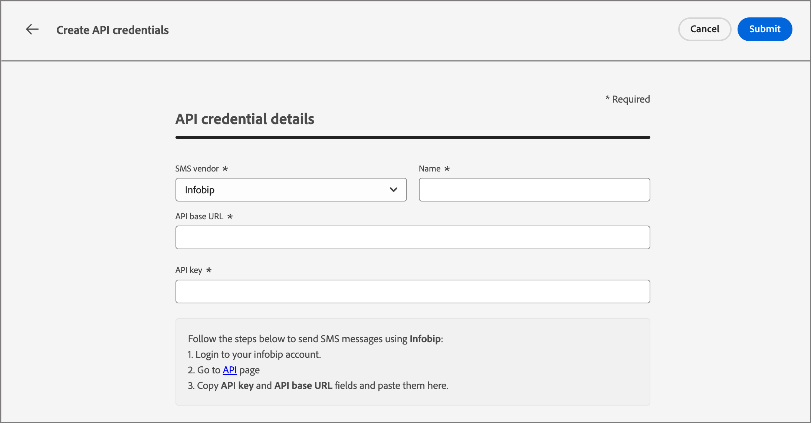

# Configuración de SMS

Adobe Journey Optimizer B2B edition envía mensajes de texto a través de proveedores de servicios de SMS (o proveedores de puertas de enlace de SMS). Antes de crear tu mensaje SMS, configura tu proveedor de servicios desde la configuración de _Administrador_.

## Proveedores de servicios de pasarela SMS

Adobe Journey Optimizer B2B edition se integra actualmente con proveedores de terceros que ofrecen servicios de mensajería de texto de forma independiente. Los proveedores admitidos para los mensajes de texto son Sinch, Twilio e Infobip.

Antes de configurar un canal SMS en Adobe Journey Optimizer B2B edition, debe crear una cuenta con uno de estos proveedores para obtener el token de API y el ID de servicio. Estas credenciales son necesarias para configurar la conexión entre Adobe Journey Optimizer B2B edition y el proveedor aplicable.

>[!IMPORTANT]
>
>El uso de los servicios de mensajería de texto está sujeto a términos y condiciones adicionales del proveedor correspondiente. Como soluciones de terceros, Sinch, Twilio e Infobip están disponibles para los usuarios de B2B edition de Adobe Journey Optimizer a través de una integración. Adobe no controla y no es responsable de los productos de terceros. Para cualquier problema o solicitud de asistencia relacionada con los servicios de mensajería de texto (SMS), póngase en contacto con su proveedor.

## Verificar una configuración de API de SMS existente

>[!NOTE]
>
>Los ajustes descritos solo son accesibles para los usuarios con privilegios de administrador de SMS.

1. En el panel de navegación izquierdo, expanda la sección **[!UICONTROL Administrador]** y haga clic en **[!UICONTROL Canales]**.

   {width="800" zoomable="yes"}

1. En el panel de navegación, seleccione **[!UICONTROL Credenciales de API]**.

   La página lista las configuraciones de API disponibles para su instancia.

1. Si es necesario, haga clic en el icono _Filtro_ (  ) y seleccione las opciones para mostrar la lista de credenciales de API configuradas por el proveedor de servicios SMS o el creador.

   {width="600" zoomable="yes"}

## Creación de nuevas credenciales de API para un proveedor de servicios SMS

>[!BEGINTABS]

>[!TAB Sinch]

_Para configurar Sinch como su proveedor de SMS con Adobe Journey Optimizer B2B edition :_

1. En el panel de navegación izquierdo, expanda la sección **[!UICONTROL Administrador]** y haga clic en **[!UICONTROL Configuración]**.

1. Haga clic en **[!UICONTROL Crear nuevas credenciales de API]** en la parte superior derecha de la lista _[!UICONTROL Credenciales de API]_.

1. Configure las credenciales de la API de SMS:

   {width="500"}

   * **[!UICONTROL Proveedor de SMS]**: elige `Sinch` como proveedor de SMS.

   * **[!UICONTROL Nombre]** - Escriba un nombre para su credencial de API.

   * **[!UICONTROL ID de servicio]** y **[!UICONTROL token de API]**: accede a la página de API desde tu cuenta de Sinch (puedes encontrar tus credenciales en la pestaña SMS).

   Para obtener más información sobre cómo encontrar esta información en tu cuenta de Sinch, consulta la [documentación para desarrolladores de Sinch](https://developers.sinch.com/docs/sms/getting-started/#2-get-credentials)

1. Haga clic en **[!UICONTROL Enviar]** cuando se hayan completado los detalles de configuración de las credenciales de la API.

>[!TAB Twilio]

_Para configurar Twilio como su proveedor de SMS con Adobe Journey Optimizer B2B edition :_

1. En el panel de navegación izquierdo, expanda la sección **[!UICONTROL Administrador]** y haga clic en **[!UICONTROL Configuración]**.

1. Haga clic en **[!UICONTROL Crear nuevas credenciales de API]** en la parte superior derecha de la lista _[!UICONTROL Credenciales de API]_.

1. Configure las credenciales de la API de SMS:

   {width="500"}

   * **[!UICONTROL Proveedor de SMS]**: elige `Twilio` como proveedor de SMS.

   * **[!UICONTROL Nombre]** - Escriba un nombre para su definición de credencial de API.

   * **[!UICONTROL SID de cuenta]** y **[!UICONTROL token de autenticación]**: acceda al panel _Información de cuenta_ de la página del panel de la consola de Twilio para encontrar sus credenciales.

   Para obtener más información acerca de cómo encontrar esta información para su cuenta de Twilio, consulte el [Centro de ayuda de Twilio](https://help.twilio.com/articles/14726256820123-What-is-a-Twilio-Account-SID-and-where-can-I-find-it-).

1. Haga clic en **[!UICONTROL Enviar]** en la parte superior derecha de la página cuando se hayan completado los detalles de configuración de las credenciales de la API.

>[!TAB Infobip]

_Para configurar Infobip como su proveedor de SMS con Adobe Journey Optimizer B2B edition :_

1. En el panel de navegación izquierdo, expanda la sección **[!UICONTROL Administrador]** y haga clic en **[!UICONTROL Configuración]**.

1. Haga clic en **[!UICONTROL Crear nuevas credenciales de API]** en la parte superior derecha de la lista _[!UICONTROL Credenciales de API]_.

1. Configure las credenciales de la API de SMS:

   {width="500"}

   * **[!UICONTROL Proveedor de SMS]**: elige `Infobip` como proveedor de SMS.

   * **[!UICONTROL Nombre]** - Escriba un nombre para su definición de credencial de API.

   * **[!UICONTROL URL base de API]** y **[!UICONTROL clave de API]**: accede a la página de inicio de la interfaz web o a la página de administración de claves de API de tu cuenta de Infobip para encontrar tus credenciales.

   Para obtener más información acerca de cómo encontrar esta información para su cuenta de Infobip, consulte la [documentación de Infobip](https://www.infobip.com/docs/api/_blank).

1. Haga clic en **[!UICONTROL Enviar]** en la parte superior derecha de la página cuando se hayan completado los detalles de configuración de las credenciales de la API.

>[!ENDTABS]

Al hacer clic en _[!UICONTROL Enviar]_, las credenciales se validan y guardan inmediatamente, lo que le redirige a la página del listado de _[!UICONTROL credenciales de la API]_. Si las credenciales enviadas no son válidas, el sistema muestra un mensaje de error en la página del listado. En este caso, puede optar por cancelar la configuración o actualizarla y enviarla de nuevo.
