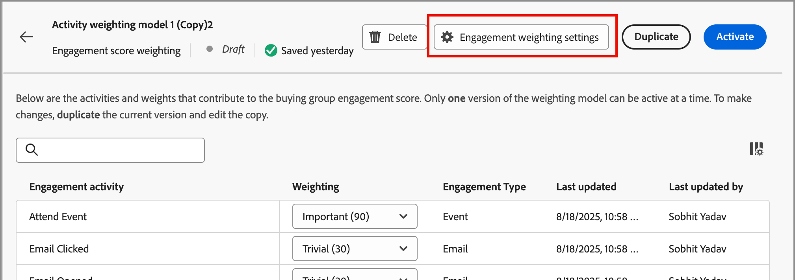

# Configurar la ponderación de puntuación de participación personalizada

Una [puntuación de participación del grupo comprador](../buying-groups/engagement-scores.md) refleja el nivel de participación mediante la evaluación de diversas actividades registradas para los miembros del grupo comprador. Con la ponderación de puntuación personalizada, los equipos de operaciones de marketing tienen la flexibilidad de definir sus propios modelos para ponderar las actividades. Un modelo de puntuación personalizado produce un reflejo más preciso de su canalización al priorizar los comportamientos que indican con mayor precisión la intención de compra en su proceso de ventas.

Como administrador, puede definir varios modelos de puntuación de participación para su organización, pero solo uno puede estar activo a la vez. Puede definir un modelo de puntuación de acuerdo con la ponderación aplicada a cada actividad de puntuación de participación.

>[!PREREQUISITES]
>
>Para definir y activar un modelo de ponderación de puntuación de participación, debe tener el _[!UICONTROL permiso de administración de B2B]_ [Administrar configuraciones del producto](./user-management.md#b2b-product-permissions).

## Acceso a los modelos de ponderación de puntuación de participación

Abra la lista _[!UICONTROL Ponderación de puntuación de participación]_ para ver los modelos activos, en borrador y archivados:

1. En el panel de navegación izquierdo, elija **[!UICONTROL Administración]** > **[!UICONTROL Configuraciones]**.

1. Haga clic en **[!UICONTROL Ponderación de puntuación de participación]** en el panel intermedio para mostrar la lista de modelos de puntuación.

   Desde esta página, puedes [crear (duplicar)](#create-an-engagement-score-model), [activar](#activate-a-score-model) y [editar](#change-the-engagement-weighting-settings) modelos de puntuación de participación.

   {width="800" zoomable="yes"}

   La lista muestra los modelos actualizados más recientemente en la parte superior (ordenados por _[!UICONTROL Última actualización]_) e incluye la capacidad de buscar por _[!UICONTROL Nombre]_.

   Puede personalizar la tabla mostrada si hace clic en el icono _Configuración de columna_ (  ) en la esquina superior derecha y activa o desactiva las casillas de verificación de la columna.

   {width="300"}

1. Para acceder a los detalles de un modelo de puntuación de participación, haga clic en el nombre.

### Modelo de puntuación predeterminado

El sistema crea un modelo de puntuación de participación inicial denominado _Modelo de ponderación de actividad 1_. El estado del modelo y las actividades de participación dependen de la arquitectura de datos de su entorno [!DNL Journey Optimizer B2B Edition]:

* **Arquitectura simplificada** (Beta): si su entorno utiliza la [arquitectura simplificada](../simplified-architecture.md), las actividades de participación se basan en eventos de Experience Platform estándar y personalizados. De forma predeterminada, las ponderaciones de todas las actividades son 0.

  {width="600" zoomable="yes"}

* **Arquitectura estándar**: si su entorno utiliza la arquitectura estándar, la instancia de [!DNL Marketo Engage] conectada es la fuente de los datos de la actividad de participación. El modelo predeterminado estará activo hasta que cree una versión personalizada y la active.

  {width="600" zoomable="yes"}

Cuando activa un modelo personalizado, el modelo activo cambia a un estado _Archivado_. Si decide volver al modelo de puntuación de participación predeterminado, puede duplicar el modelo predeterminado original y, a continuación, activarlo o utilizarlo como punto de partida para otro modelo personalizado.

### Eliminar un modelo de borrador

Puede eliminar un borrador de modelo de puntuación de participación si decide que no desea activarlo en el futuro. Haga clic en el icono _Más menú_ (***...***) junto al nombre del modelo de puntuación del borrador en la lista y elija **[!UICONTROL Eliminar]**.

{width="350"}

En el cuadro de diálogo de confirmación, haga clic en **[!UICONTROL Eliminar]**.

## Crear un modelo de puntuación de participación personalizado

Para crear un modelo de puntuación de participación personalizado, duplique el modelo predeterminado u otro modelo personalizado que ya se haya creado. Puede duplicar el modelo _Activo_ actual, un modelo _Borrador_ o un modelo _Archivado_. A continuación, edite el modelo duplicado según sus necesidades.

1. Haga clic en el nombre del modelo para abrir la página de detalles del modelo y haga clic en **[!UICONTROL Duplicar]** en la parte superior derecha.

   {width="600" zoomable="yes"}

   También puede hacer clic en el icono _Más menú_ (***...***) junto al nombre del modelo de puntuación en la lista y elegir **[!UICONTROL Duplicado]**.

   {width="325"}

1. En el cuadro de diálogo _Duplicar_, escriba un nombre único para el modelo duplicado y haga clic en **[!UICONTROL Duplicar]**.

   {width="500"}

   El modelo duplicado se muestra en la lista con un estado _Borrador_. Haga clic en el nombre para abrir los detalles del modelo de puntuación y realizar los cambios.

### Cambio de la configuración de ponderación de participación

La configuración de peso define las bandas que puede asignar a cada actividad del modelo. Puede cambiar las bandas para reflejar las estrategias de su organización para evaluar la participación. Por ejemplo, podría ajustar la banda de ponderación _Normal_ a un valor de 65 si desea asignar un valor más alto a las actividades normales. O bien, puede agregar una banda de ponderación diseñada para capturar actividades que se encuentren entre _Normal_ y _Importante_. En este caso, podría agregar una banda y etiquetarla como _Significant_ y asignar un valor de banda de peso de 75.

1. En la página de detalles del modelo de puntuación, haga clic en **[!UICONTROL Configuración del peso de la participación]** en la parte superior.

   {width="600" zoomable="yes"}

1. Para cada banda de peso, ajuste el nombre o los valores según sus necesidades:

   * Cambie el nombre en el campo _[!UICONTROL Banda de ponderación]_.
   * Introduzca un nuevo valor. También puede hacer clic en **&amp;plus;** o **−** para aumentar o disminuir el valor.

   {width="500"}

1. Si es necesario, añada otra banda de ponderación:

   Haga clic en **[!UICONTROL + Agregar banda de ponderación]** al final de la lista. Esta acción inserta una banda de ponderación en blanco en la parte inferior de la lista.

   Introduzca el nombre y defina el valor de la banda. Asegúrese de utilizar un nombre y un valor únicos.

1. Para quitar una banda de ponderación, haga clic en el icono _Eliminar_ (  ) de la fila de la banda de ponderación.

1. Una vez completados los cambios, haz clic en **[!UICONTROL Guardar]**.

### Cambio de la ponderación de actividad

Cada modelo de puntuación incluye la lista completa de actividades de puntuación de participación admitidas.

+++Actividades para la arquitectura simplificada

El modelo predeterminado para la arquitectura simplificada incluye las actividades rastreadas de Experience Platform. Cada actividad tiene una ponderación cero (0) (no se utiliza) hasta que se le asigna una ponderación. Todas las actividades tienen una frecuencia máxima diaria de 20, que no se puede cambiar.

<table style="table-layout: fixed; width: 100%; border: 0;">
<tbody>
<tr style="border: 0;">
<td>
<ul><li>Clics en Advertising </li><li>Advertising finaliza </li><li>Conversiones de Advertising </li><li>Advertising Federated </li><li>Primeros cuartiles de Advertising </li><li>Impresiones de Advertising </li><li>Puntos intermedios de Advertising </li><li>Advertising Starts </li><li>Tercer cuartil de Advertising </li><li>Tiempo de reproducción de Advertising </li><li>Cierre de aplicación </li><li>Inicio de aplicación </li><li>Cambiar cadencia de campaña de participación </li><li>Nota de crédito de gestiones internas de Commerce emitida </li><li>Pedido de back-office de Commerce cancelado </li><li>Pedido de Backoffice de Commerce realizado </li><li>Commerce Backoffice OrderItems Enviados </li><li>Envío de gestiones internas de Commerce completado </li><li>Cierres de Commerce </li><li>La lista de productos de Commerce (carrito) agrega </li><li>Se abre la lista de productos de Commerce (carrito) </li><li>Eliminaciones de la lista de productos de Commerce (carrito) </li><li>Reaperturas de la lista de productos de Commerce (carrito) </li><li>Vistas de la lista de productos de Commerce (carrito) </li><li>Vistas del producto de Commerce </li><li>Compras de Commerce </li><li>Guardar para más tarde de Commerce </li><li>Rechazo de propuesta de decisión </li><li>Visualización de propuesta de decisión </li><li>Interacción de propuesta de decisión </li></ul>
</td>
<td>
<ul><li>Envío de propuesta de decisión </li><li>Déclencheur de propuesta de decisión </li><li>Comentarios sobre envíos </li><li>Correo electrónico de marketing directo rechazado </li><li>Correo electrónico de marketing directo rechazado </li><li>Correo electrónico de marketing directo clicado </li><li>Correo electrónico de marketing directo entregado </li><li>Correo electrónico de marketing directo abierto </li><li>Correo electrónico de marketing directo enviado </li><li>Correo electrónico de marketing directo cancelado </li><li>Se descartó el mensaje de la aplicación </li><li>Se ha mostrado un mensaje en la aplicación </li><li>Se interactuó con el mensaje de la aplicación </li><li>Añadir operación de posible cliente a la campaña </li><li>Webhook de llamada de operación de posible cliente </li><li>Flujo de campaña de cambio de operación de posible cliente </li><li>Operación de posible cliente Convertir posible cliente </li><li>Operación de cliente potencial momento interesante </li><li>Posibles clientes de combinación de operación </li><li>Operación de posible cliente Nuevo posible cliente </li><li>Etapa de ingresos de operación de cliente potencial cambiada </li><li>Puntuación de operación de cliente potencial cambiada </li><li>Estado de operación del posible cliente en progresión de campaña cambiado </li></ul>
</td>
<td>
<ul><li>Añadir a lista de operación de posible cliente </li><li>Operación de posible cliente Quitar de la lista </li><li>Salida de ubicación </li><li>Media adBreakComplete </li><li>Media adBreakStart </li><li>Media adComplete </li><li>Media adSkip </li><li>Media adStart </li><li>Cambio de velocidad de bits de medios </li><li>Media bufferStart </li><li>Media chapterComplete </li><li>Media chapterSkip </li><li>Media chapterStart </li><li>Seguimiento personalizado de medios </li><li>Contenido multimedia descargado </li><li>Error de medios </li><li>Media pauseStart </li><li>Media ping </li><li>Media play </li><li>Media sessionComplete </li><li>Media sessionEnd </li><li>Media sessionStart </li><li>Media statesUpdate </li><li>Comentarios del mensaje </li><li>Datos de procesamiento de mensajes </li><li>Seguimiento de mensajes </li><li>Evento De Oportunidad Agregar A Oportunidad </li><li>Oportunidad de evento de oportunidad actualizada </li><li>Evento de oportunidad Quitar de oportunidad </li><li>Aplicación de seguimiento push abierta </li><li>Acción personalizada de seguimiento push </li><li>Formulario web rellenado </li><li>Clics en vínculos de Web Webinteraction </li><li>Vistas de página de detalles de página web</li></ul>
</td>
</tbody>
</table>

+++

+++Actividades para la arquitectura estándar

El modelo predeterminado para la arquitectura estándar incluye las actividades rastreadas [!DNL Marketo Engage] con un peso predeterminado asociado. Al duplicar este modelo, puede cambiar la ponderación según sus necesidades. No puede cambiar la frecuencia diaria máxima.

{{engagement-activities-me}}

+++

Para cada actividad de la lista, establezca el valor que desea asignar a cada ocurrencia de actividad. Haga clic en la flecha hacia abajo en el campo **[!UICONTROL Ponderación]** y elija la banda de ponderación tal como se define en la configuración de ponderación de participación.

{width="600" zoomable="yes"}

Si no desea que el cálculo de puntuación de participación utilice una actividad, establezca la ponderación en un valor cero (0).

Los cambios se guardarán automáticamente.

## Activación de un modelo de puntuación

Cuando se activa un modelo de puntuación de borrador, este reemplaza al modelo activo actualmente. El modelo activo actualmente se archiva automáticamente.

1. Abra un modelo de puntuación de borrador para ver la página de detalles.

1. Haga clic en **[!UICONTROL Activar]**.

1. En el cuadro de diálogo de confirmación, haga clic en **[!UICONTROL Activar]**.

   {width="400"}
