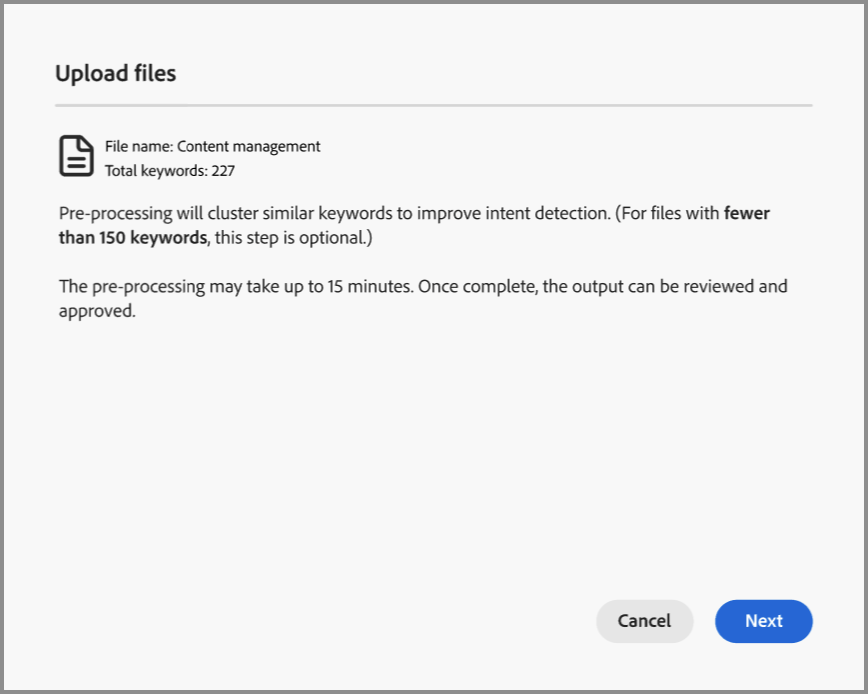

# Datos de intención

En Journey Optimizer B2B edition, el modelo de detección de intención predice una solución o producto de interés con una confianza lo suficientemente alta según la actividad de un posible cliente. También aprovecha las actividades de otros miembros de la cuenta, junto con el contenido etiquetado. La intención de una persona puede interpretarse como la probabilidad de tener interés en un producto.

* Niveles de intención: disponible en el nivel de cliente potencial, cuenta y grupo de compra conocido.
* Tipos de señal de intención: palabras clave, producto y solución

Los datos de intención se usan en [_Panel inteligente_](../dashboards/intelligent-dashboard.md), [_Detalles de la cuenta_ página](../accounts/account-details.md), [_Detalles del grupo de compra_ página](../buying-groups/buying-group-details.md) y [_Detalles de la persona_ página](../accounts/person-details.md).

{width="700" zoomable="yes"}

## Preparación de los datos de asignación por intención

Para activar esta función, cree una hoja de cálculo, como un archivo de Excel de Microsoft, con pestañas para definir la taxonomía por intención. Toda la hoja de cálculo se carga como una categoría que puede tener varios productos y cada producto puede tener varias palabras clave. Utilice las siguientes definiciones para la hoja de cálculo de asignación por intención para cada categoría que desee definir:

* Nombre de la hoja de cálculo = _Nombre de categoría_
* Cada pestaña = el nombre de su producto
* Cada pestaña incluye una columna = palabras clave del producto (máximo 150)

Puede descargar un archivo de Excel para utilizarlo como plantilla para preparar los datos de asignación. Para descargar la plantilla:

1. En el panel de navegación izquierdo, elija **[!UICONTROL Administración]** > **[!UICONTROL Configuración]**.

1. Haga clic en **[!UICONTROL Asignación por intención]** en el panel intermedio.

1. Haga clic en **[!UICONTROL Crear categoría]**.

1. En el cuadro de diálogo, haga clic en **[!UICONTROL Descargar plantilla de archivo]**.

   {width="500"}

1. Haga clic en **[!UICONTROL Cancelar]**.

   Puede volver para cargar el archivo preparado cuando se haya completado.

1. Utilice la plantilla para definir los datos de asignación por intención:

   * Cambie el nombre del archivo para que refleje su nombre de categoría, como _Personalization a escala_.
   * Cambie el nombre de cada ficha según sus nombres de producto, como _Journey Optimizer B2B_, _Marketo Engage_ y _Experience Manager_.
   * Agregue las palabras clave del producto para cada ficha, como _Marketing B2B_, _Reconocimiento de marca_ y _Participación del posible cliente_.

   {width="600" zoomable="yes"}

## Cargar un archivo de categoría

Cuando la hoja de cálculo esté lista, vuelva a la página de configuración _[!UICONTROL Asignación de intención]_ y cargue el archivo.

1. Haga clic en **[!UICONTROL Crear categoría]**.

1. Arrastre y suelte el archivo en el cuadro de diálogo _[!UICONTROL Cargar archivos]_ o haga clic en **[!UICONTROL Seleccionar un archivo]** para buscar y seleccionar el archivo en su sistema.

1. Haga clic en **[!UICONTROL Siguiente]**.

   El preprocesamiento se ejecuta para agrupar palabras clave similares, lo que mejora la detección de intención y evita la dilución de palabras clave. Se muestra una notificación de pulso en cuanto se completa este preprocesamiento (hasta 15 minutos, según los datos).

   {width="500"}

   El resultado se muestra en la página _Asignación de intención_.

   {width="600" zoomable="yes"}

## Aprobar o rechazar la categoría

Revise el listado de categorías y haga clic en **[!UICONTROL Aprobar]** para activar las palabras clave que quiera usar en las páginas Tablero inteligente, Detalles de la cuenta, Detalles del grupo de compra y Detalles de persona. Haga clic en **[!UICONTROL Ver todo]** para mostrar la lista completa de cada producto, o haga clic en **[!UICONTROL Descargar]** para revisar la lista completa como archivo de Excel.

Si no está satisfecho con la lista, puede hacer clic en **[!UICONTROL Eliminar]** para quitar la categoría. A continuación, puede realizar ajustes en el archivo de hoja de cálculo antes de volver a iniciar el proceso de carga para definir esa categoría.

>[!IMPORTANT]
>
>Debe aprobar o rechazar (eliminar) la nueva categoría antes de agregar otra o editar una categoría.

Si agrega otra categoría y su taxonomía afectan a una categoría existente, aparece una advertencia. Tenga en cuenta este impacto cuando decida aprobar o rechazar la categoría. La asignación de producto a palabra clave debe ser la misma en todas las categorías si el producto se utiliza en más de una categoría.

{width="600" zoomable="yes"}
