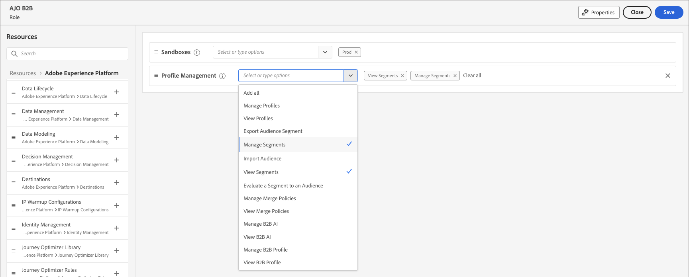

# Administración de usuarios

Una vez completado el aprovisionamiento y enlazados los entornos limitados, complete los siguientes pasos para proporcionar acceso a Adobe Journey Optimizer B2B edition a su equipo y a los usuarios.

1. [Crear un perfil de producto de Marketo Engage](#marketo-engage-profile) en el Admin Console (solo para la nueva instancia de Marketo Engage).
1. [Crear un grupo de usuarios](#create-user-group) en el Admin Console.
1. [Crear una función](#create-role) en Permisos de AEP.
1. [Agregar usuarios](#add-users) al Admin Console.

Como administrador, puede completar estas tareas en Adobe Admin Console, que es un lugar central para administrar las licencias y los usuarios de productos de Adobe. En el Admin Console, puede crear y administrar usuarios en una sola ubicación en lugar de en las distintas soluciones individuales. Consulte la página [descripción general del Admin Console](https://helpx.adobe.com/es/enterprise/using/admin-console.html) para obtener más información sobre sus funciones y capacidades.

## Acceso al Admin Console

Antes de poder usar el Admin Console para administrar usuarios dentro de su equipo, debe asegurarse de que puede acceder al Admin Console y de que dispone de los permisos adecuados.

1. Como administrador del sistema, debe recibir varios correos electrónicos de Adobe como parte del proceso de incorporación.

   Busque el correo electrónico de bienvenida que proporciona la información acerca del nombre de la organización a la que se le ha concedido acceso.

1. Haga clic en el vínculo **[!UICONTROL Introducción]** del correo electrónico de bienvenida para ir al Admin Console.

   Si no encuentra el correo electrónico, abra un explorador directamente al Admin Console en [https://adminconsole.adobe.com](https://adminconsole.adobe.com).

1. Inicie sesión con su Adobe ID.

   Una vez que inicie sesión correctamente, verá la página _Información general_ de Adobe Admin Console.

1. Si tiene acceso a varias organizaciones, asegúrese de haber iniciado sesión en la organización correcta.

   Para cambiar su organización, haga clic en el nombre de la organización en la esquina superior derecha y seleccione la organización a la que necesita acceder.

1. Seleccione **[!UICONTROL Administradores]** de la tarjeta _[!UICONTROL Usuarios]_ para comprobar que es administrador del sistema.

   {width="700" zoomable="yes"}

1. Busque introduciendo su correo electrónico, nombre de usuario, nombre o apellidos de Adobe ID.

   * Si el acceso está configurado correctamente, la búsqueda devolverá el registro.

   * Si el valor de la columna **[!UICONTROL ROL DE ADMINISTRADOR]** muestra `System`, sabrá que usted (o el usuario mostrado) es administrador del sistema.

## Creación del perfil de producto del Marketo Engage {#marketo-engage-profile}

Al conceder a los usuarios acceso a una solución de Adobe, no necesariamente desea darles acceso completo. Los perfiles de producto permiten que cada solución tenga su propio conjunto de permisos de usuario. Utilice el Admin Console para asignar perfiles de producto.

Para obtener más información sobre el uso de perfiles de producto para las autorizaciones de usuario, consulte [Administrar perfiles de producto para usuarios empresariales](https://helpx.adobe.com/es/enterprise/using/manage-product-profiles.html){target="_blank"} en la documentación de Admin Console.

>[!BEGINSHADEBOX]

Cuando agrega un usuario al perfil de producto del Marketo Engage, se agrega posteriormente al rol _Usuario estándar_ dentro del área de trabajo predeterminada de la suscripción del Marketo Engage. Esta función les otorga a todos los _usuarios estándar_ permisos para el Marketo Engage en ese área de trabajo. Actualmente, todos los usuarios de Journey Optimizer B2B edition deben ser usuarios Marketo Engage. Un administrador de Marketo Engage puede restringir el acceso actualizando los permisos del rol _Usuario estándar_ o moviendo al usuario a otro rol de usuario de Marketo Engage con permisos más restrictivos.

Para obtener más información acerca de la administración de estos permisos en el Marketo Engage, consulte [Administración de roles y permisos de usuarios](https://experienceleague.adobe.com/en/docs/marketo/using/product-docs/administration/users-and-roles/managing-user-roles-and-permissions){target="_blank"} en la documentación del Marketo Engage.

>[!ENDSHADEBOX]

>[!NOTE]
>
>Un Admin Console de sistemas o de productos de Marketo Engage puede realizar estos pasos.

1. Inicie sesión en [https://adminconsole.adobe.com](https://adminconsole.adobe.com).

1. Seleccione la ficha **[!UICONTROL Productos]**.

1. Abra la instancia de Market Engage en la que desea agregar el perfil y haga clic en Nuevo perfil.

   {width="700" zoomable="yes"}

1. Escriba un nombre de perfil de producto, como _Usuario estándar_.

1. Haz clic en **Siguiente** y luego en **Guardar**.

## Crear un grupo de usuarios {#create-user-group}

Un grupo de usuarios es una colección de usuarios a los que se concede un conjunto compartido de permisos. Puede agregar o quitar usuarios de su grupo de usuarios. Los permisos del grupo siguen siendo los mismos mientras cambian los usuarios dentro del grupo.

Para obtener más información sobre cómo se usan los grupos de usuarios para administrar permisos, consulte [Administrar grupos de usuarios](https://helpx.adobe.com/es/enterprise/using/user-groups.html){target="_blank"} en la documentación del Admin Console.

>[!NOTE]
>
>Un Admin Console del sistema puede realizar estos pasos.

1. Inicie sesión en [https://adminconsole.adobe.com](https://adminconsole.adobe.com).

1. Seleccione la ficha **[!UICONTROL Usuarios]**.

1. Elija **[!UICONTROL grupos de usuarios]** en el panel de navegación izquierdo.

1. Haga clic en **[!UICONTROL Nuevo grupo de usuarios]** en la parte superior derecha.

1. Escriba un nombre para el grupo de usuarios, como _Usuarios estándar_ y haga clic en **[!UICONTROL Guardar]**.

1. Haga clic en el grupo de usuarios que acaba de crear.

1. Seleccione la ficha **[!UICONTROL Perfiles de producto asignados]** y haga clic en **[!UICONTROL Asignar perfil]**.

1. Haga clic en **+** y agregue cada instancia de los siguientes productos:

   * [!UICONTROL Marketo Engage]
   * [!UICONTROL Adobe Experience Platform - AEP-Default-All-Users]
   * [!UICONTROL Recopilación de datos de Adobe Experience Platform]
   * [!UICONTROL Acceso completo a la recopilación de datos]

   {width="700" zoomable="yes"}

1. Haga clic en **[!UICONTROL Guardar]**.

## Crear una función en Permisos de AEP {#create-role}

Los permisos son derechos unitarios que le permiten definir las autorizaciones asignadas a un perfil de producto. Cada permiso se recopila en una funcionalidad, como recorridos o grupos de compra, que representa las diferentes funcionalidades u objetos de Journey Optimizer B2B edition.

El área _Permisos_ de Adobe Experience Platform es donde los administradores pueden definir roles de usuario y directivas de acceso para administrar permisos de acceso para características y objetos dentro de una aplicación de producto. En esta aplicación, puede crear y administrar funciones, así como asignar los permisos de recursos deseados para estas. Los permisos también le permiten administrar las etiquetas, las zonas protegidas y los usuarios asociados a una función específica.

Para obtener más información, consulte [Administrar permisos para una función](https://experienceleague.adobe.com/en/docs/experience-platform/access-control/abac/permissions-ui/permissions){target="_blank"} en la documentación del Experience Platform.

>[!NOTE]
>
>Para completar los siguientes pasos, debe ser administrador de productos de Adobe Experience Platform.

1. Vaya a [experience.adobe.com](https://experience.adobe.com/).

1. En el panel _[!UICONTROL Acceso rápido]_, seleccione **[!UICONTROL Permisos]**.

   >[!NOTE]
   >
   >Si no ve _[!UICONTROL Permisos]_, es posible que tenga que hacer clic en **[!UICONTROL Ver todos]** y seleccionarlo entre las aplicaciones disponibles.

   {width="700" zoomable="yes"}

1. Seleccione **[!UICONTROL Roles]** en el panel de navegación izquierdo y seleccione **[!UICONTROL Crear rol]**.

1. En el cuadro de diálogo _[!UICONTROL Crear nuevo rol]_, escriba un nombre para el rol, como _AJO B2B_, y una descripción (opcional).

1. Haga clic en **[!UICONTROL Confirmar]**.

1. Seleccione las zonas protegidas.

   {width="700" zoomable="yes"}

1. Añada los permisos de perfil:

   * En la lista _[!UICONTROL Recursos]_ de la izquierda, busque el elemento **[!UICONTROL Administración de perfiles]** y haga clic en el icono de signo más (**+**) para agregar el atributo.

   * Para el atributo, agregue los siguientes permisos:
      * [!UICONTROL Ver segmentos]
      * [!UICONTROL Administrar segmentos]
      * [!UICONTROL Ver perfiles]
      * [!UICONTROL Administrar perfiles]
      * [!UICONTROL Ver perfil B2B]
      * [!UICONTROL Administrar perfil B2B]

   {width="700" zoomable="yes"}

1. Haga clic en **[!UICONTROL Guardar]** en la parte superior derecha.

1. Vaya a los detalles de la función y seleccione la pestaña **[!UICONTROL Grupos de usuarios]**.

1. Haga clic en **[!UICONTROL Agregar grupos]**.

   {width="700" zoomable="yes"}

1. Seleccione la casilla de verificación situada junto al grupo de usuarios que creó anteriormente en el Admin Console.

1. Haga clic en **[!UICONTROL Guardar]**.

## Agregar usuarios al grupo en el Admin Console

>[!NOTE]
>
>Un Admin Console de sistemas o de productos puede realizar estos pasos.

Para obtener información acerca de la administración de usuarios, consulte [usuarios Admin Console](https://helpx.adobe.com/es/enterprise/using/user-groups.html) en la documentación de Admin Console.

1. Vaya a [https://adminconsole.adobe.com](https://adminconsole.adobe.com).

1. En _[!UICONTROL Vínculos rápidos]_, haga clic en **[!UICONTROL Agregar usuarios]**.

1. Añada cada usuario:

   * Introduzca la dirección de correo electrónico, el nombre y los apellidos del usuario.

     {width="600" zoomable="yes"}

   * Para **[!UICONTROL grupos de usuarios]**, haga clic en **+**.

   * Seleccione el grupo de usuarios que creó anteriormente.

   * Haga clic en **[!UICONTROL Aplicar]**.

1. Haga clic en **[!UICONTROL Guardar]**.
