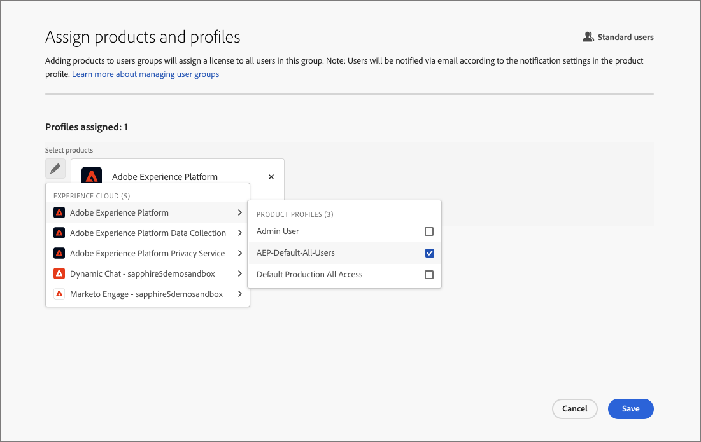
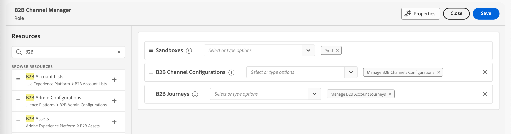

# Administración de usuarios

Una vez completado el aprovisionamiento y enlazados los entornos limitados, complete los siguientes pasos para proporcionar acceso a Adobe Journey Optimizer B2B edition a su equipo y a los usuarios.

1. [Crear un perfil de producto de Marketo Engage](#marketo-engage-profile) en el Admin Console (solo para la nueva instancia de Marketo Engage).
1. [Crear un grupo de usuarios](#create-user-group) en el Admin Console.
1. [Editar funciones integradas](#edit-roles) o [crear una función personalizada](#create-a-custom-role) con permisos de Journey Optimizer B2B edition.
1. [Agregar usuarios](#add-users) o [grupos](#add-user-groups-to-a-role) a los roles.

Como administrador, puede completar estas tareas en Adobe Admin Console, que es un lugar central para administrar las licencias y los usuarios de productos de Adobe. En el Admin Console, puede crear y administrar usuarios en una sola ubicación en lugar de en las distintas soluciones individuales. Consulte la página [descripción general del Admin Console](https://helpx.adobe.com/es/enterprise/using/admin-console.html) para obtener más información sobre sus funciones y capacidades.

## Acceso al Admin Console

Antes de poder usar el Admin Console para administrar usuarios dentro de su equipo, debe asegurarse de que puede acceder al Admin Console y de que dispone de los permisos adecuados.

1. Como administrador del sistema, debe recibir varios correos electrónicos de Adobe como parte del proceso de incorporación.

   Busque el correo electrónico de bienvenida que proporciona la información acerca del nombre de la organización a la que se le ha concedido acceso.

1. Haga clic en el vínculo **[!UICONTROL Introducción]** del correo electrónico de bienvenida para ir al Admin Console.

   Si no encuentra el correo electrónico, abra un explorador directamente al Admin Console en [https://adminconsole.adobe.com](https://adminconsole.adobe.com).

1. Inicie sesión con su Adobe ID.

   Una vez que inicie sesión correctamente, verá la página _Información general_ de Adobe Admin Console.

1. Si tiene acceso a varias organizaciones, asegúrese de haber iniciado sesión en la organización correcta.

   Para cambiar su organización, haga clic en el nombre de la organización en la esquina superior derecha y seleccione la organización a la que necesita acceder.

1. Seleccione **[!UICONTROL Administradores]** de la tarjeta _[!UICONTROL Usuarios]_ para comprobar que es administrador del sistema.

   {width="700" zoomable="yes"}

1. Busque introduciendo su correo electrónico, nombre de usuario, nombre o apellidos de Adobe ID.

   * Si el acceso está configurado correctamente, la búsqueda devolverá el registro.

   * Si el valor de la columna **[!UICONTROL ROL DE ADMINISTRADOR]** muestra `System`, sabrá que usted (o el usuario mostrado) es administrador del sistema.

## Creación del perfil de producto del Marketo Engage {#marketo-engage-profile}

Al conceder a los usuarios acceso a una solución de Adobe, no necesariamente desea darles acceso completo. Los perfiles de producto permiten que cada solución tenga su propio conjunto de permisos de usuario. Utilice el Admin Console para asignar perfiles de producto.

Para obtener más información sobre el uso de perfiles de producto para las autorizaciones de usuario, consulte [Administrar perfiles de producto para usuarios empresariales](https://helpx.adobe.com/es/enterprise/using/manage-product-profiles.html){target="_blank"} en la documentación de Admin Console.
<!--
>[!BEGINSHADEBOX]

When you add a user to the Marketo Engage product profile, they are subsequently added to the _Standard User_ role within the Default workspace of the Marketo Engage subscription. This role grants them all _Standard User_ permissions for Marketo Engage in that workspace. Currently, all Journey Optimizer B2B Edition users are required to be Marketo Engage users. A Marketo Engage administrator can restrict access by updating the permissions for the _Standard User_ role or by moving the user to a different Marketo Engage user role with more restrictive permissions.

For more information about managing these permissions within Marketo Engage, see [Managing User Roles and Permissions](https://experienceleague.adobe.com/en/docs/marketo/using/product-docs/administration/users-and-roles/managing-user-roles-and-permissions){target="_blank"} in the Marketo Engage documentation.

>[!ENDSHADEBOX]-->

>[!NOTE]
>
>Un Admin Console de sistemas o de productos de Marketo Engage puede realizar estos pasos.

1. Inicie sesión en [https://adminconsole.adobe.com](https://adminconsole.adobe.com).

1. Seleccione la ficha **[!UICONTROL Productos]**.

1. Abra la instancia de Marketo Engage donde desee agregar el perfil y haga clic en **[!UICONTROL Nuevo perfil]**.

   {width="700" zoomable="yes"}

1. Escriba un nombre de perfil de producto, como _Usuario estándar_.

1. Haz clic en **Siguiente** y luego en **Guardar**.

## Crear un grupo de usuarios {#create-user-group}

Un grupo de usuarios es una colección de usuarios a los que se concede un conjunto compartido de permisos. Puede agregar o quitar usuarios de su grupo de usuarios. Los permisos del grupo siguen siendo los mismos mientras cambian los usuarios dentro del grupo.

Para obtener más información sobre cómo se usan los grupos de usuarios para administrar permisos, consulte [Administrar grupos de usuarios](https://helpx.adobe.com/es/enterprise/using/user-groups.html){target="_blank"} en la documentación del Admin Console.

>[!NOTE]
>
>Un Admin Console del sistema puede realizar estos pasos.

1. Inicie sesión en [https://adminconsole.adobe.com](https://adminconsole.adobe.com).

1. Seleccione la ficha **[!UICONTROL Usuarios]**.

1. Elija **[!UICONTROL grupos de usuarios]** en el panel de navegación izquierdo.

1. Haga clic en **[!UICONTROL Nuevo grupo de usuarios]** en la parte superior derecha.

1. Escriba un nombre para el grupo de usuarios, como _Usuarios estándar_ y haga clic en **[!UICONTROL Guardar]**.

1. Haga clic en el grupo de usuarios que acaba de crear.

1. Seleccione la ficha **[!UICONTROL Perfiles de producto asignados]** y haga clic en **[!UICONTROL Asignar perfil]**.

1. Haga clic en **+** y agregue cada instancia de los siguientes productos:

   * [!UICONTROL Marketo Engage]
   * [!UICONTROL Adobe Experience Platform - AEP-Default-All-Users]
   * [!UICONTROL Recopilación de datos de Adobe Experience Platform]
   * [!UICONTROL Acceso completo a la recopilación de datos]

   {width="700" zoomable="yes"}

1. Haga clic en **[!UICONTROL Guardar]**.

## Adición de usuarios a un grupo

>[!NOTE]
>
>Un Admin Console del sistema puede realizar estos pasos.

Para obtener información acerca de la administración de usuarios, consulte [usuarios Admin Console](https://helpx.adobe.com/es/enterprise/using/user-groups.html) en la documentación de Admin Console.

1. Vaya a [https://adminconsole.adobe.com](https://adminconsole.adobe.com).

1. En _[!UICONTROL Vínculos rápidos]_, haga clic en **[!UICONTROL Agregar usuarios]**.

1. Añada cada usuario:

   * Introduzca la dirección de correo electrónico, el nombre y los apellidos del usuario.

     {width="600" zoomable="yes"}

   * Para **[!UICONTROL grupos de usuarios]**, haga clic en **+**.

   * Seleccione el grupo de usuarios que creó anteriormente.

   * Haga clic en **[!UICONTROL Aplicar]**.

1. Haga clic en **[!UICONTROL Guardar]**.

## Editar funciones para permisos de productos {#edit-roles}

Los permisos son derechos unitarios que le permiten definir las autorizaciones asignadas a un perfil de producto. Cada permiso se recopila en una funcionalidad, como recorridos o grupos de compra, que representa las diferentes funcionalidades u objetos de Journey Optimizer B2B edition.

El área _Permisos_ de Adobe Experience Platform es donde los administradores pueden definir roles de usuario y directivas de acceso para administrar permisos de acceso para características y objetos dentro de una aplicación de producto. En esta aplicación, puede crear y administrar funciones, así como asignar los permisos de recursos deseados para estas. Los permisos también le permiten administrar los entornos limitados y los usuarios asociados a una función específica.

Para obtener más información acerca de los permisos de funciones en el Experience Platform, consulte [Administrar permisos para una función](https://experienceleague.adobe.com/en/docs/experience-platform/access-control/abac/permissions-ui/permissions){target="_blank"} en la documentación del Experience Platform.
<!-- 
### B2B product permissions

The following permissions govern access to Journey Optimizer B2B Edition capabilities:

| Category | Description | Permissions |
| -------- | ----------- | ---------- |
| B2B Account Lists | Configure, manage, view, and publish permissions for B2B account lists. These permissions include actions such as add, remove, import, and delete accounts from account lists. | <li>Manage B2B Account Lists |
| B2B Admin Configurations | Configure, manage, and view permissions for B2B administrative configurations. These permissions include digital asset management connections, asset repositories, and events. | <li>Manage B2B Admin Configurations |
| B2B Assets | Configure, manage, and view permissions for B2B assets. These permissions include emails, SMS, landing pages, fragments, templates, and images. | <li>Manage B2B Assets <li>Manage B2B Templates <li>Manage B2B Fragments|
| B2B Buying Groups | Configure, manage, and view permissions for B2B buying groups. These permissions include solution interests, roles templates, and buying group status. | <li>Manage B2B Buying Groups |
| B2B Channel Configurations | Configure, manage, and view permissions for B2B channel configurations. These permissions include settings for communication limits, API credentials, and security settings. | <li>Manage B2B Channels Configurations |
| B2B Dashboards |Configure and view permissions for B2B dashboards. These permissions include account engagement, buying group stages, surging accounts, and contact coverage. | <li>Manage B2B Dashboards |
| B2B Journeys | Configure manage, view, and publish permissions for B2B journeys. These permissions include account and person actions, event listeners, and split paths | <li>Manage B2B Journeys |

### B2B built-in roles

When your organization has the Journey Optimizer B2B Edition product provisioned, Experience Platform includes a set of built-in (default) roles that you can use to manage access to the product capabilities:

| Role | Permissions |
| ---- | ----------- |
| B2B Journey Manager | <li>Manage B2B Journeys <li>Manage B2B Buying Groups <li>Manage B2B Account Lists <li>View B2B Intelligent Dashboard <li>View B2B Insights Dashboard |
| B2B Channel Manager | <li>Manage B2B Assets <li>Manage B2B Templates <li>Manage B2B Fragments |
| B2B System Administrator | <li>Manage B2B Channels Configurations <li>Manage B2B Admin Configurations |
| B2B Sales User | <li>View Intelligent Dashboard |

### Edit role permissions

For built-in or custom roles, you can decide at any time to add or delete permissions. If you modify a default or custom role, it impacts every user assigned to the role.

In the following example, you want to add permissions related to the B2B Journeys resource for users assigned to the B2B Channel Manager role. This change enables users for that role to manage account journeys also.

>[!NOTE]
>
>An Admin Console system administrator can perform these steps.

_To change the permissions for a role:_

1. Go to [experience.adobe.com](https://experience.adobe.com/).

1. In the _[!UICONTROL Quick access]_ panel, select **[!UICONTROL Permissions]**.

   >[!NOTE]
   >
   >If you don't see _[!UICONTROL Permissions]_, you may need to click **[!UICONTROL View all]** and select it from the available applications.

   {width="700" zoomable="yes"}

1. Select **[!UICONTROL Roles]** in the left navigation.

1. Click the **_B2B Channel Manager_** role name.

1. In the details page, click **[!UICONTROL Edit]** at the top right.

   {width="700" zoomable="yes"}

   In the role editor, the _[!UICONTROL Resources]_ menu displays the list of resources that apply to the Experience Cloud - Platform powered applications products.

   You can enter _B2B_ in the search tool to filter the list for the B2B product permissions. 
   
1. Click the _Add_ icon (**+**) for the B2B Journeys resource.

   {width="700" zoomable="yes"}

1. In the _[!UICONTROL B2B Journeys]_ permissions card, select **[!UICONTROL Manage B2B Account Journeys]**.

1. Click **[!UICONTROL Save]**.

   {width="700" zoomable="yes"}

1. Click **[!UICONTROL Close]** to return to the details page. -->

### Adición de usuarios a una función

>[!NOTE]
>
>Un Admin Console del sistema puede realizar estos pasos.

1. Abra los detalles de la función y seleccione la ficha **[!UICONTROL Usuarios]**.

   Esta pestaña muestra una lista de todos los usuarios asignados a la función.

1. Haga clic en **[!UICONTROL Agregar usuarios]**.

   {width="700" zoomable="yes"}

1. En el cuadro de diálogo _[!UICONTROL Agregar usuarios]_, busque y seleccione los usuarios que desee agregar al rol.

   * Puede utilizar la herramienta Buscar para filtrar la lista de usuarios.

   * Seleccione la casilla de verificación de cada usuario.

   {width="600" zoomable="yes"}

1. Haga clic en **[!UICONTROL Guardar]** cuando haya seleccionado todos los usuarios que desea agregar.

### Agregar grupos de usuarios a un rol

>[!NOTE]
>
>Un Admin Console del sistema puede realizar estos pasos.

Para obtener información acerca de la administración de usuarios, consulte [usuarios Admin Console](https://helpx.adobe.com/es/enterprise/using/user-groups.html) en la documentación de Admin Console.

1. Abra los detalles de la función y seleccione la ficha **[!UICONTROL Grupos de usuarios]**.

   Esta pestaña muestra una lista de todos los grupos de usuarios asignados a la función.

1. Haga clic en **[!UICONTROL Agregar grupos]**.

   {width="700" zoomable="yes"}

1. En el cuadro de diálogo _[!UICONTROL Agregar grupos]_, busque y seleccione los grupos que desee agregar al rol.

   * Puede utilizar la herramienta Buscar para filtrar la lista de grupos de usuarios.

   * Seleccione la casilla de verificación de cada grupo de usuarios.

   {width="600" zoomable="yes"}

1. Haga clic en **[!UICONTROL Guardar]** cuando haya seleccionado todos los usuarios que desea agregar.

## Crear una función personalizada

>[!NOTE]
>
>Un Admin Console del sistema puede realizar estos pasos.

1. Seleccione **[!UICONTROL Roles]** en el panel de navegación izquierdo y seleccione **[!UICONTROL Crear rol]**.

1. En el cuadro de diálogo _[!UICONTROL Crear nuevo rol]_, escriba un nombre para el rol, como _Especialistas en marketing B2B_, y una descripción (opcional).

1. Haga clic en **[!UICONTROL Confirmar]**.

1. Seleccione las zonas protegidas.

   {width="700" zoomable="yes"}

1. Añada los permisos de perfil:

   * En la lista _[!UICONTROL Recursos]_ de la izquierda, busque el elemento **[!UICONTROL Administración de perfiles]** y haga clic en el icono _Agregar_ (**+**) para agregar el atributo.

   * Para el atributo, agregue los siguientes permisos:
      * [!UICONTROL Ver segmentos]
      * [!UICONTROL Administrar segmentos]
      * [!UICONTROL Ver perfiles]
      * [!UICONTROL Administrar perfiles]
      * [!UICONTROL Ver perfil B2B]
      * [!UICONTROL Administrar perfil B2B]

   {width="700" zoomable="yes"}

1. Añadir permisos de productos B2B:

   Consulte la lista de [permisos de producto B2B](#b2b-product-permissions) para determinar qué capacidades de producto desea para la función.

   En la lista _[!UICONTROL Recursos]_ de la izquierda, busque los elementos **[!UICONTROL B2B]** y haga clic en el icono _Agregar_ (**+**) para agregar cada atributo que desee habilitar para el rol.

   Puede introducir _B2B_ en la herramienta de búsqueda para filtrar la lista de permisos de productos B2B.

1. Haga clic en **[!UICONTROL Guardar]** en la parte superior derecha.

1. Vaya a los detalles de la función y seleccione la pestaña **[!UICONTROL Grupos de usuarios]**.

1. Haga clic en **[!UICONTROL Agregar grupos]**.

   {width="700" zoomable="yes"}

1. Seleccione la casilla de verificación situada junto al grupo de usuarios que creó anteriormente en el Admin Console.

1. Haga clic en **[!UICONTROL Guardar]**.
