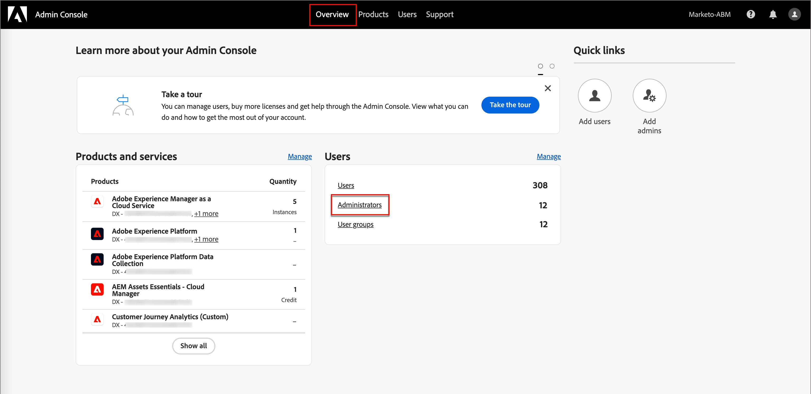

# Administración de usuarios

Una vez completado el aprovisionamiento y enlazados los entornos limitados, complete los siguientes pasos para proporcionar acceso a Adobe Journey Optimizer B2B edition a su equipo y a los usuarios.

1. [Crear un perfil de producto de Marketo Engage](#marketo-engage-profile) en Admin Console (solo una nueva instancia de Marketo Engage).
1. [Crear un grupo de usuarios](#create-user-group) en Admin Console.
1. [Editar funciones integradas](#edit-roles) o [crear una función personalizada](#create-a-custom-role) con permisos de Journey Optimizer B2B edition.
1. [Agregar usuarios](#add-users) o [grupos](#add-user-groups-to-a-role) a los roles.

Como administrador, puede completar estas tareas en Adobe Admin Console, que es un lugar central para administrar las licencias y los usuarios de productos de Adobe. En Admin Console, puede crear y administrar usuarios en una sola ubicación en lugar de en las distintas soluciones individuales. Consulte la página [Información general de Admin Console](https://helpx.adobe.com/es/enterprise/using/admin-console.html) para obtener más información sobre sus funciones y capacidades.

## Acceso a Admin Console

Antes de poder usar Admin Console para administrar usuarios dentro de su equipo, debe asegurarse de que puede acceder a Admin Console y de que dispone de los permisos adecuados.

1. Como administrador del sistema, debe recibir varios correos electrónicos de Adobe como parte del proceso de incorporación.

   Busque el correo electrónico de bienvenida que proporciona la información acerca del nombre de la organización a la que se le ha concedido acceso.

1. Haga clic en el vínculo **[!UICONTROL Introducción]** del correo electrónico de bienvenida para ir a Admin Console.

   Si no encuentra el correo electrónico, abra un explorador directamente en Admin Console en [https://adminconsole.adobe.com](https://adminconsole.adobe.com).

1. Inicie sesión con su Adobe ID.

   Una vez que inicie sesión correctamente, verá la página _Información general_ de Adobe Admin Console.

1. Si tiene acceso a varias organizaciones, asegúrese de haber iniciado sesión en la organización correcta.

   Para cambiar su organización, haga clic en el nombre de la organización en la esquina superior derecha y seleccione la organización a la que necesita acceder.

1. Seleccione **[!UICONTROL Administradores]** de la tarjeta _[!UICONTROL Usuarios]_ para comprobar que es administrador del sistema.

   {width="700" zoomable="yes"}

1. Busque introduciendo su correo electrónico, nombre de usuario, nombre o apellidos de Adobe ID.

   * Si el acceso está configurado correctamente, la búsqueda devolverá el registro.

   * Si el valor de la columna **[!UICONTROL ROL DE ADMINISTRADOR]** muestra `System`, sabrá que usted (o el usuario mostrado) es administrador del sistema.

## Creación del perfil de producto de Marketo Engage {#marketo-engage-profile}

Al conceder a los usuarios acceso a una solución de Adobe, no necesariamente desea darles acceso completo. Los perfiles de producto permiten que cada solución tenga su propio conjunto de permisos de usuario. Utilice Admin Console para asignar perfiles de producto.

Para obtener más información sobre el uso de perfiles de producto para las autorizaciones de usuario, consulte [Administrar perfiles de producto para usuarios empresariales](https://helpx.adobe.com/es/enterprise/using/manage-product-profiles.html){target="_blank"} en la documentación de Admin Console.

>[!BEGINSHADEBOX]

Cuando agrega un usuario al perfil de producto de Marketo Engage, posteriormente se agrega al rol _Usuario estándar_ dentro del área de trabajo predeterminada de la suscripción de Marketo Engage. Esta función les otorga a todos los _usuarios estándar_ permisos para Marketo Engage en ese espacio de trabajo. Actualmente, todos los usuarios de Journey Optimizer B2B edition deben ser usuarios de Marketo Engage. Un administrador de Marketo Engage puede restringir el acceso actualizando los permisos de la función _Usuario estándar_ o moviendo al usuario a una función de usuario de Marketo Engage diferente con permisos más restrictivos.

Para obtener más información sobre la administración de estos permisos en Marketo Engage, consulte [Administración de roles y permisos de usuarios](https://experienceleague.adobe.com/es/docs/marketo/using/product-docs/administration/users-and-roles/managing-user-roles-and-permissions){target="_blank"} en la documentación de Marketo Engage.

>[!ENDSHADEBOX]

{width="30"} Un administrador del sistema o de producto de Marketo Engage puede realizar los siguientes pasos.

1. Inicie sesión en [https://adminconsole.adobe.com](https://adminconsole.adobe.com).

1. Seleccione la ficha **[!UICONTROL Productos]**.

1. Abra la instancia de Marketo Engage donde desee agregar el perfil y haga clic en **[!UICONTROL Nuevo perfil]**.

   {width="700" zoomable="yes"}

1. Escriba un nombre de perfil de producto, como _Usuario estándar_.

1. Haz clic en **Siguiente** y luego en **Guardar**.

## Crear un grupo de usuarios {#create-user-group}

Un grupo de usuarios es una colección de usuarios a los que se concede un conjunto compartido de permisos. Puede agregar o quitar usuarios de su grupo de usuarios. Los permisos del grupo siguen siendo los mismos mientras cambian los usuarios dentro del grupo.

Para obtener más información sobre cómo se usan los grupos de usuarios para administrar permisos, consulte [Administrar grupos de usuarios](https://helpx.adobe.com/es/enterprise/using/user-groups.html){target="_blank"} en la documentación de Admin Console.

{width="30"} Un administrador del sistema puede realizar los siguientes pasos.

1. Inicie sesión en [https://adminconsole.adobe.com](https://adminconsole.adobe.com).

1. Seleccione la ficha **[!UICONTROL Usuarios]**.

1. Elija **[!UICONTROL grupos de usuarios]** en el panel de navegación izquierdo.

1. Haga clic en **[!UICONTROL Nuevo grupo de usuarios]** en la parte superior derecha.

1. Escriba un nombre para el grupo de usuarios, como _Usuarios estándar_ y haga clic en **[!UICONTROL Guardar]**.

1. Haga clic en el grupo de usuarios que acaba de crear.

1. Seleccione la ficha **[!UICONTROL Perfiles de producto asignados]** y haga clic en **[!UICONTROL Asignar perfil]**.

1. Haga clic en **+** y agregue cada instancia de los siguientes productos:

   * [!UICONTROL Marketo Engage]
   * [!UICONTROL Adobe Experience Platform - AEP-Default-All-Users]
   * [!UICONTROL Recopilación de datos de Adobe Experience Platform]
   * [!UICONTROL Acceso completo a la recopilación de datos]

   {width="700" zoomable="yes"}

1. Haga clic en **[!UICONTROL Guardar]**.

## Adición de usuarios a un grupo

Para obtener información acerca de la administración de usuarios, consulte [Usuarios de Admin Console](https://helpx.adobe.com/es/enterprise/using/user-groups.html) en la documentación de Admin Console.

{width="30"} Un administrador del sistema o de producto puede realizar los siguientes pasos. Un administrador de productos solo puede agregar usuarios que ya existen en su organización.

1. Vaya a [https://adminconsole.adobe.com](https://adminconsole.adobe.com).

1. En _[!UICONTROL Vínculos rápidos]_, haga clic en **[!UICONTROL Agregar usuarios]**.

1. Añada cada usuario:

   * Introduzca la dirección de correo electrónico, el nombre y los apellidos del usuario.

     {width="600" zoomable="yes"}

   * Para **[!UICONTROL grupos de usuarios]**, haga clic en **+**.

   * Seleccione el grupo de usuarios que creó anteriormente.

   * Haga clic en **[!UICONTROL Aplicar]**.

1. Haga clic en **[!UICONTROL Guardar]**.

## Editar funciones para permisos de productos {#edit-roles}

Los permisos son derechos unitarios que le permiten definir las autorizaciones asignadas a un perfil de producto. Cada permiso se recopila en una funcionalidad, como recorridos o grupos de compra, que representa las diferentes funcionalidades u objetos de Journey Optimizer B2B edition.

El área _Permisos_ de Adobe Experience Platform es donde los administradores pueden definir roles de usuario y directivas de acceso para administrar permisos de acceso para características y objetos dentro de una aplicación de producto. En esta aplicación, puede crear y administrar funciones, así como asignar los permisos de recursos deseados para estas. Los permisos también le permiten administrar los entornos limitados y los usuarios asociados a una función específica.

Para obtener más información sobre los permisos de funciones en Experience Platform, consulte [Administrar permisos para una función](https://experienceleague.adobe.com/es/docs/experience-platform/access-control/abac/permissions-ui/permissions){target="_blank"} en la documentación de Experience Platform.

### Permisos de productos B2B

Los siguientes permisos rigen el acceso a las funciones de Journey Optimizer B2B edition:

| Categoría | Descripción | Permisos |
| -------- | ----------- | ---------- |
| Listas de cuentas B2B | Configure, administre, visualice y publique permisos para listas de cuentas B2B. Estos permisos incluyen acciones como agregar, quitar, importar y eliminar cuentas de listas de cuentas. | <li>Administrar listas de cuentas B2B |
| Configuraciones de administración B2B | Configure, administre y visualice permisos para configuraciones administrativas B2B. Estos permisos incluyen conexiones de administración de recursos digitales, repositorios de recursos y eventos. | <li>Administrar configuraciones de administración B2B |
| Assets B2B | Configure, administre y visualice permisos para recursos B2B. Estos permisos incluyen correos electrónicos, SMS, páginas de aterrizaje, fragmentos, plantillas e imágenes. | <li>Administración de Assets B2B <li>Administrar plantillas B2B <li>Administrar fragmentos B2B |
| Grupos de compra B2B | Configure, administre y visualice permisos para grupos de compra B2B. Estos permisos incluyen intereses de la solución, funciones, plantillas y el estado del grupo de compra. | <li>Administrar grupos de compra B2B |
| Configuraciones de canal B2B | Configure, administre y visualice permisos para configuraciones de canal B2B. Estos permisos incluyen configuración para límites de comunicación, credenciales de API y configuración de seguridad. | <li>Administrar configuraciones de canales B2B |
| Paneles B2B | Configure y vea permisos para paneles B2B. Estos permisos incluyen la participación en la cuenta, la compra de etapas de grupo, las cuentas emergentes y la cobertura de contactos. | <li>Administración de paneles B2B |
| Recorridos B2B | Configuración, administración, visualización y publicación de permisos para recorridos B2B. Estos permisos incluyen acciones de cuenta y persona, detectores de eventos y rutas divididas | <li>Administración de Recorridos B2B |

### Funciones integradas B2B

Cuando su organización tiene el producto Journey Optimizer B2B edition aprovisionado, Experience Platform incluye un conjunto de funciones integradas (predeterminadas) que puede utilizar para administrar el acceso a las funciones del producto:

| Función | Permisos |
| ---- | ----------- |
| Administrador de Recorrido B2B | <li>Administración de Recorridos B2B <li>Administrar grupos de compra B2B <li>Administrar listas de cuentas B2B <li>Ver tablero de participación B2B <li>Ver tablero de perspectivas B2B |
| Administrador de canales B2B | <li>Administración de Assets B2B <li>Administrar plantillas B2B <li>Administrar fragmentos B2B |
| Administrador del sistema B2B | <li>Administrar configuraciones de canales B2B <li>Administrar configuraciones de administración B2B |
| Usuario de ventas B2B | <li>Ver tablero de participación B2B |

### Editar permisos de funciones

Para las funciones integradas o personalizadas, puede decidir en cualquier momento agregar o eliminar permisos. Si modifica una función predeterminada o personalizada, afectará a todos los usuarios asignados a la función.

En el ejemplo siguiente, se desea añadir permisos relacionados con el recurso Recorridos B2B para usuarios asignados a la función Administrador de canales B2B. Este cambio permite que los usuarios de esa función también administren recorridos de cuenta.

>[!NOTE]
>
>Un administrador del sistema de Admin Console puede realizar estos pasos.

_Para cambiar los permisos de un rol :_

1. Vaya a [experience.adobe.com](https://experience.adobe.com/).

1. En el panel _[!UICONTROL Acceso rápido]_, seleccione **[!UICONTROL Permisos]**.

   >[!NOTE]
   >
   >Si no ve _[!UICONTROL Permisos]_, es posible que tenga que hacer clic en **[!UICONTROL Ver todos]** y seleccionarlo entre las aplicaciones disponibles.

   {width="700" zoomable="yes"}

1. Seleccione **[!UICONTROL Roles]** en el panel de navegación izquierdo.

1. Haga clic en el nombre de rol de **_Administrador de canales B2B_**.

1. En la página de detalles, haga clic en **[!UICONTROL Editar]** en la parte superior derecha.

   {width="700" zoomable="yes"}

   En el editor de funciones, el menú _[!UICONTROL Recursos]_ muestra la lista de recursos que se aplican a los productos de aplicaciones de Experience Cloud con tecnología de plataforma.

   Puede introducir _B2B_ en la herramienta de búsqueda para filtrar la lista de permisos de productos B2B.

1. Haga clic en el icono _Agregar_ (**+**) para el recurso de Recorridos B2B.

   {width="700" zoomable="yes"}

1. En la tarjeta de permisos _[!UICONTROL Recorridos B2B]_, seleccione **[!UICONTROL Administrar Recorridos de cuenta B2B]**.

1. Haga clic en **[!UICONTROL Guardar]**.

   {width="700" zoomable="yes"}

1. Haga clic en **[!UICONTROL Cerrar]** para volver a la página de detalles.

### Adición de usuarios a una función

{width="30"} Un administrador del sistema o de producto de AEP puede realizar los siguientes pasos.

1. Abra los detalles de la función y seleccione la ficha **[!UICONTROL Usuarios]**.

   Esta pestaña muestra una lista de todos los usuarios asignados a la función.

1. Haga clic en **[!UICONTROL Agregar usuarios]**.

   {width="700" zoomable="yes"}

1. En el cuadro de diálogo _[!UICONTROL Agregar usuarios]_, busque y seleccione los usuarios que desee agregar al rol.

   * Puede utilizar la herramienta Buscar para filtrar la lista de usuarios.

   * Seleccione la casilla de verificación de cada usuario.

   {width="600" zoomable="yes"}

1. Haga clic en **[!UICONTROL Guardar]** cuando haya seleccionado todos los usuarios que desea agregar.

### Agregar grupos de usuarios a un rol

Para obtener información acerca de la administración de usuarios, consulte [Usuarios de Admin Console](https://helpx.adobe.com/es/enterprise/using/user-groups.html) en la documentación de Admin Console.

{width="30"} Un administrador del sistema o de producto de AEP puede realizar los siguientes pasos.

1. Abra los detalles de la función y seleccione la ficha **[!UICONTROL Grupos de usuarios]**.

   Esta pestaña muestra una lista de todos los grupos de usuarios asignados a la función.

1. Haga clic en **[!UICONTROL Agregar grupos]**.

   {width="700" zoomable="yes"}

1. En el cuadro de diálogo _[!UICONTROL Agregar grupos]_, busque y seleccione los grupos que desee agregar al rol.

   * Puede utilizar la herramienta Buscar para filtrar la lista de grupos de usuarios.

   * Seleccione la casilla de verificación de cada grupo de usuarios.

   {width="600" zoomable="yes"}

1. Haga clic en **[!UICONTROL Guardar]** cuando haya seleccionado todos los usuarios que desea agregar.

## Crear una función personalizada

{width="30"} Un administrador del sistema o de producto de AEP puede realizar los siguientes pasos.

1. Seleccione **[!UICONTROL Roles]** en el panel de navegación izquierdo y seleccione **[!UICONTROL Crear rol]**.

1. En el cuadro de diálogo _[!UICONTROL Crear nuevo rol]_, escriba un nombre para el rol, como _Especialistas en marketing B2B_, y una descripción (opcional).

1. Haga clic en **[!UICONTROL Confirmar]**.

1. Seleccione las zonas protegidas.

   {width="700" zoomable="yes"}

1. Añada los permisos de perfil:

   * En la lista _[!UICONTROL Recursos]_ de la izquierda, busque el elemento **[!UICONTROL Administración de perfiles]** y haga clic en el icono _Agregar_ (**+**) para agregar el atributo.

   * Para el atributo, agregue los siguientes permisos:
      * [!UICONTROL Ver segmentos]
      * [!UICONTROL Administrar segmentos]
      * [!UICONTROL Ver perfiles]
      * [!UICONTROL Administrar perfiles]
      * [!UICONTROL Ver perfil B2B]
      * [!UICONTROL Administrar perfil B2B]

   {width="700" zoomable="yes"}

1. Añadir permisos de productos B2B:

   Consulte la lista de [permisos de producto B2B](#b2b-product-permissions) para determinar qué capacidades de producto desea para la función.

   En la lista _[!UICONTROL Recursos]_ de la izquierda, busque los elementos **[!UICONTROL B2B]** y haga clic en el icono _Agregar_ (**+**) para agregar cada atributo que desee habilitar para el rol.

   Puede introducir _B2B_ en la herramienta de búsqueda para filtrar la lista de permisos de productos B2B.

1. Haga clic en **[!UICONTROL Guardar]** en la parte superior derecha.

1. Vaya a los detalles de la función y seleccione la pestaña **[!UICONTROL Grupos de usuarios]**.

1. Haga clic en **[!UICONTROL Agregar grupos]**.

   {width="700" zoomable="yes"}

1. Seleccione la casilla de verificación situada junto al grupo de usuarios que creó anteriormente en Admin Console.

1. Haga clic en **[!UICONTROL Guardar]**.
