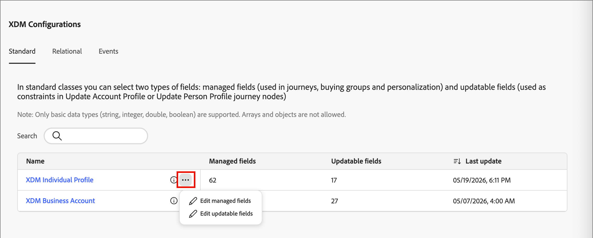
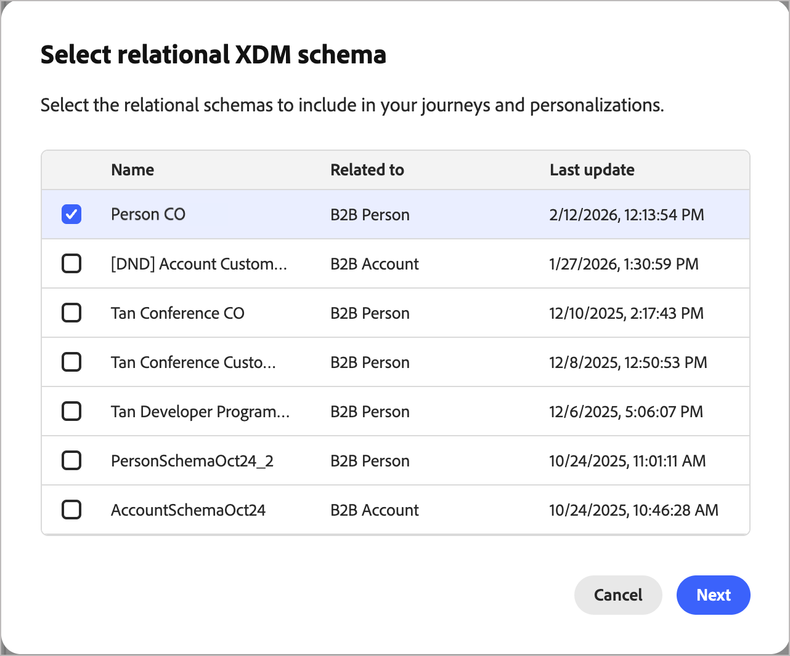

# Administración de campos XDM

Los campos XDM (Experience Data Model) son elementos de esquema que proporcionan datos a la aplicación [!DNL Journey Optimizer B2B Edition]. Utilice campos XDM como filtros y restricciones en nodos de recorrido, grupos de compra y para funciones de contenido, como personalización de correo electrónico y contenido condicional.

Los esquemas definen campos basados en clases XDM estándar. Las clases XDM estándar incluyen Perfil individual, Cuenta empresarial y Evento de experiencia. Los esquemas relacionales también definen campos que permiten modelar datos estructurados de manera similar a las bases de datos relacionales tradicionales.

Los esquemas de Adobe Experience Platform (AEP) suelen contener muchos campos en jerarquías complejas. Recorrer los árboles de esquema XDM lleva tiempo. La administración de campos XDM optimiza la selección de campos al mostrar solo los campos relevantes para los recorridos, los grupos de compra y la personalización.  Los administradores habilitan estos campos para usarlos en Journey Optimizer B2B edition, incluidos los que son de solo lectura o editables.

Los administradores que comprenden XDM y colaboran con los ingenieros de datos o las partes interesadas en el modelado de datos de la plataforma de datos del cliente (CDP) B2B deben seguir los siguientes pasos para configurar clases XDM para [!DNL Journey Optimizer B2B Edition].

## Acceso a clases XDM

1. En el panel de navegación izquierdo, elija **[!UICONTROL Administración]** > **[!UICONTROL Configuración]**.

1. Haga clic en **[!UICONTROL Clases XDM]** en el panel intermedio.

   * Utilice las fichas **[!UICONTROL Estándar]** y **[!UICONTROL Relacional]** para agregar nuevos campos y hacer que estén disponibles en Journey Optimizer B2B edition.

   * Use la ficha **Eventos** para [seleccionar eventos de experiencia de AEP específicos y sus campos asociados](./configure-aep-events.md) para usarlos en los nodos de eventos de recorrido.

## Selecciones de campos

>[!IMPORTANT]
>
>Puede actualizar la selección de campos en cualquier momento seleccionando nuevos campos o anulando la selección de los campos que ya no necesite. Cuando publica un recorrido con este esquema, bloquea la estructura del esquema. No se admite la eliminación o el cambio de nombre del esquema, la adición de nuevos campos o el cambio de tipos de campos, y puede provocar errores de recorrido.

Utilice la siguiente guía para realizar selecciones de campo:

* Solo puede agregar nuevos campos después de que un esquema se esté utilizando activamente en un recorrido.
* Eliminar, cambiar el nombre o los tipos de campo pueden causar problemas de funcionalidad de recorrido. Tenga cuidado al manipular esquemas.
* No cambie el nombre ni elimine esquemas, ni modifique claves en esquemas relacionales.

### Clases estándar

En la ficha _[!UICONTROL Estándar]_, puede editar _Campos administrados_ y _Campos actualizables_ para las clases estándar:

* Los campos administrados aparecen en los recorridos, los grupos de compra y las funciones de personalización.
* Los campos actualizables sirven como restricciones para los nodos de recorrido _Actualizar perfil de cuenta_ y _Actualizar perfil de persona_.

{width="600" zoomable="yes"}

La lista incluye dos clases:

* **[!UICONTROL Perfil individual de XDM]**
* **[!UICONTROL Cuenta empresarial de XDM]**

La información de clase mostrada incluye:

* Número de campos administrados
* Número de campos actualizables
* Hora de la última actualización

Para seleccionar campos del esquema de unión, haga clic en el nombre de clase para abrir el cuadro de diálogo de selección Campos administrados. O bien, haga clic en el _menú Más_ (**...**) y elija entre los campos Managed y Updatable.

{width="550" zoomable="yes"}

>[!NOTE]
>
>Un campo debe ser _Administrado_ antes de que pueda ser _Actualizable_. Los _campos actualizables_ que seleccione deben existir en el esquema proporcionado por el usuario. Es posible que el esquema no incluya campos obligatorios, excepto para los campos definidos por el sistema.

#### Campos administrados

Al elegir **[!UICONTROL Campos administrados]**, el cuadro de diálogo _Seleccionar campos_ enumera todos los campos configurables.

1. Seleccione hasta 100 campos para cada clase XDM.

   Utilice el campo _[!UICONTROL Buscar]_ para filtrar la lista mostrada por nombre. Use el control deslizante **[!UICONTROL Mostrar solo los campos seleccionados]** para revisar las selecciones actuales.

   {width="450" zoomable="yes"}

1. Haga clic en **[!UICONTROL Guardar]** para confirmar las selecciones.

#### Campos actualizables

Establezca los campos actualizables para elegir qué campos se pueden modificar mediante las acciones de recorrido **[!UICONTROL Actualizar perfil de cuenta]** o **[!UICONTROL Actualizar perfil de persona]**.

Antes de configurar campos actualizables, deben residir en un conjunto de datos personalizado. Para ver un tutorial del flujo de trabajo del conjunto de datos personalizado, consulte [Crear conjuntos de datos e ingerir datos](https://experienceleague.adobe.com/en/docs/journey-optimizer-learn/tutorials/data-management/create-datasets-and-ingest-data#){target="_blank"}, y use la opción **[!UICONTROL Crear conjunto de datos a partir del esquema]**. Este conjunto de datos se utiliza para aislar campos actualizables. Todos los campos actualizables deben estar en este conjunto de datos.

>[!IMPORTANT]
>
>Protecciones para campos actualizables:
>
>* Esquemas: el esquema debe utilizar la identidad principal de la persona B2B (`b2b.personKey.sourceKey`). En la clase Perfil individual de XDM, cualquier campo requerido en el esquema debe estar definido por el sistema, como `identityMap` o `personID`.
>* Conjuntos de datos: no utilice un conjunto de datos que ya esté en uso para otro propósito. Se recomienda crear conjuntos de datos específicos para almacenar campos actualizables. Utilice un conjunto de datos independiente para cada clase XDM.

Cree un conjunto de datos para Perfil individual y otro para Cuenta empresarial. Seleccione cada nuevo conjunto de datos durante el proceso de configuración:

1. Para **[!UICONTROL Conjuntos de datos]**, seleccione el nuevo origen de datos que creó.

1. Elija los campos del conjunto de datos seleccionado.

   {width="450" zoomable="yes"}

1. Haga clic en **[!UICONTROL Guardar]** para aplicar los cambios.

### Esquemas relacionales

Los esquemas relacionales permiten crear clases de datos personalizadas. Con acceso a varios conjuntos de datos, puede crear clases adaptadas específicamente a sus necesidades de datos. Utilice esquemas relacionales para entidades comerciales, como compras, licencias y registros de eventos, en las decisiones de recorrido y la personalización de correo electrónico. Puede seleccionar hasta 20 esquemas y hasta 50 campos por esquema.

Existen varias funciones que admiten el uso de los campos y esquemas relacionales configurados:

* [Personalización de contenido](../content/personalization.md#custom-datasets)
* [Recorrido de decisiones (rutas divididas)](../journeys/split-merge-paths-nodes.md#custom-data-filtering)
* [Funciones de grupo de compra](../buying-groups/buying-groups-role-templates.md#add-the-template-roles) (solo persona B2B)

>[!AVAILABILITY]
>
>Los [esquemas relacionales](https://experienceleague.adobe.com/en/docs/experience-platform/xdm/schema/relational#) están disponibles para [!DNL Journey Optimizer B2B Edition] como una versión de disponibilidad limitada. Los esquemas relacionales y de Data Mirror están disponibles para [!DNL Journey Optimizer Orchestrated Campaigns] titulares de licencias. Los esquemas relacionales también están disponibles como una versión limitada para [!DNL Customer Journey Analytics] usuarios, según su licencia y la habilitación de características. Póngase en contacto con su representante de Adobe para obtener acceso.

>[!NOTE]
>
>Actualmente, esta función admite casos de uso de objetos personalizados relacionados con cuentas y personas, y tiene previsto admitir más casos de uso de objetos predeterminados en el futuro.

Puede crear esquemas relacionales mediante el editor de esquemas (vaya a **[!UICONTROL Administración de datos]** > **[!UICONTROL Esquemas]** en el panel de navegación izquierdo).

>[!BEGINSHADEBOX]

**Requisitos de esquema**

Al [crear un esquema para utilizarlo con [!DNL Journey Optimizer B2B Edition]](https://experienceleague.adobe.com/es/docs/platform-learn/tutorials/schemas/create-schemas-for-b2b-data), se requieren los siguientes valores de configuración:

* Comportamiento: Registro
* Segmentación: habilitada
* Tipo de relación: varios a uno
* Esquema de referencia: Cuenta B2B o Persona B2B
* Campos obligatorios: Clave principal, clave externa y descriptor de versión
* Conjunto de datos asociado: definido y asignado al esquema

>[!ENDSHADEBOX]

Para seleccionar campos de esquema relacional para usarlos en [!DNL Journey Optimizer B2B Edition]:

1. Seleccione la pestaña **[!UICONTROL Relacional]** para ver los esquemas.

   {width="600" zoomable="yes"}

1. Haga clic en **[!UICONTROL Seleccionar esquema XDM relacional]**.

   >[!NOTE]
   >
   >En esta versión de la funcionalidad beta, solo se admiten _objetos personalizados de cuenta y personas varios a uno_.

1. Seleccione un esquema relacional y haga clic en **[!UICONTROL Siguiente]**.

   {width="500" zoomable="yes"}

1. Introduzca un área de nombres o utilice la predeterminada. Haga clic en **[!UICONTROL Next]**.

   Solo puede establecer el área de nombres una vez y no puede revertir esta acción.

   {width="400" zoomable="yes"}

1. Revise los campos de esquema relacional.

   Haga clic en el icono _Información_  para ver los metadatos del campo.

1. Seleccione los campos que desea habilitar para recorridos y personalización.

   La plataforma selecciona automáticamente los siguientes campos obligatorios:

   * Clave extranjera
   * Clave principal
   * Descriptor de versión

   Utilice el campo _[!UICONTROL Buscar]_ para filtrar la lista mostrada por nombre. Use el control deslizante **[!UICONTROL Mostrar solo los campos seleccionados]** para revisar las selecciones actuales.

   {width="500" zoomable="yes"}

1. Haga clic en **[!UICONTROL Guardar]**.
