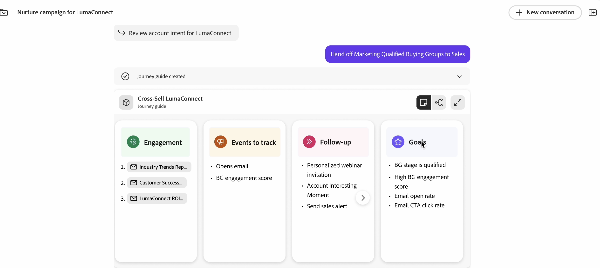

# Agente de Recorrido Build para B2B

Recorrido Builder Agent B2B es un agente de IA que le ayuda en el diseño/creación, ejecución y optimización de recorridos mediante la automatización y las recomendaciones basadas en datos. Recorrido Builder Agent for B2B automatiza y reduce el tiempo necesario para ejecutar la creación de nuevos recorridos B2B.

Journey Agent en Journey Optimizer B2B edition aborda tres de los desafíos clave a los que se enfrentan los especialistas en marketing B2B en la actualidad:

* Cómo hacer frente a recorridos de clientes cada vez más complejos (complejidad de audiencia, contenido y mensajería, y omnicanal)
* Mayor eficiencia a la luz de presupuestos más ajustados
* Averiguar cómo se debe estructurar el recorrido óptimo del cliente

El agente B2B del agente de Recorrido Builder se puede utilizar para generar y actualizar recorridos:

* CREAR: traduzca los objetivos de marketing, los productos, la estrategia de participación y los KPI a un recorrido personalizado del cliente con automatización y condiciones
* RECOMENDACIÓN: aproveche la participación de marketing anterior y otros datos históricos para optimizar la creación de recorridos
* OPTIMIZAR: Analice, ajuste y optimice los recorridos activos en función de predicciones o rendimiento real
* ADMINISTRAR: priorice, administre y organice recorridos y envíos de mensajes superpuestos

## Uso básico

Para utilizar Journey Agent, escriba en la ventana del mensaje lo que desea crear con lenguaje natural:

&quot;Cree un recorrido B2B para invitar a los responsables de la toma de decisiones a un roadshow en cuentas comprometidas que probablemente abra una nueva canalización&quot;.

Cuantos más detalles pueda proporcionar, mejor será la respuesta. Si ya dispone de material de marketing que describe el evento, el producto, etc., péguelo en el mensaje para que el agente tenga una mejor idea del objetivo.

&quot;Actúe como estratega de recorrido B2B para crear un recorrido de cuentas de cliente de varias fases que nutra y involucre a los responsables de la toma de decisiones y a los profesionales de marketing en la fase de exploración temprana de `Solution Name`. El objetivo es convertir a los visitantes anónimos en contactos conocidos, profundizar la participación con contenido relevante en `domain`.com y crear posibles clientes cualificados para el alcance de ventas de `Product Name`. Utilice canales como correo electrónico y medios de pago, aprovechando los segmentos de audiencia y el contenido existentes. Estructurar el recorrido a través de las etapas de sensibilización, consideración y evaluación durante 4-6 semanas, con déclencheur, acciones y objetivos claros para cada etapa. Incluya KPI como tasas de conversión, puntuaciones de participación y solicitudes de demostración, y devuelva el resultado como un flujo de recorrido estructurado&quot;.

Esta solicitud detallada proporciona lo siguiente:

* Borrar intención: ¿Qué desea que haga la IA? Sea específico sobre la tarea o el resultado.
* Enriquecido con el contexto: Proporcione antecedentes o restricciones relevantes. Incluya ejemplos o referencias, si es posible.
* Formato estructurado: utilice puntos de viñeta, pasos numerados o plantillas.
* Asignación de funciones: especifique la función de la API: &quot;Actuar como analista de datos...&quot;

Utilice el agente para repetir el refinamiento: Inicie simple y, a continuación, perfeccione el mensaje en función de los resultados. Los bucles de comentarios mejoran los resultados con el tiempo.

## Creación de Recorridos B2B de extremo a extremo (Recorrido de cuenta o persona) a partir de archivos de texto o mensajes.

Journey Agent puede generar un flujo de recorrido de extremo a extremo (recorrido de cuenta o persona) a partir de mensajes de texto y metadatos en lenguaje natural, a través de una experiencia de conversación en lugar de una interfaz de usuario tradicional.

Ejemplos de mensajes de Recorrido de extremo a extremo:

* Cree un recorrido en canales múltiples para nutrir cuentas que no hayan participado en mi contenido en los últimos 30 días.
* Cree un recorrido para realizar ventas cruzadas de una solución a cuentas que muestren una alta intención sin canalizaciones abiertas, proporcionando contenido personalizado para las funciones de grupo de compra más importantes.
* Cree un recorrido B2B para invitar a los responsables de la toma de decisiones a un roadshow en cuentas comprometidas que probablemente abra una nueva canalización.
* Cree un recorrido para cuentas de espacio en blanco con la intención de usar mi solución, centrado en las personas que participan con contenido en el sitio web.

## Recorridos de varias etapas

Puede actuar como diseñador de recorridos B2B para crear un recorrido de cuentas de cliente de varias fases que informe a los responsables de la toma de decisiones y a las personas de marketing al principio de la fase de exploración.
El objetivo es convertir a los visitantes anónimos en contactos conocidos, profundizar la participación con contenido relevante y crear posibles clientes cualificados para el alcance de las ventas.

* Use canales como `Email`, `Paid media`, `Personalized web experiences` para aprovechar el contenido y los segmentos de audiencia existentes.
* Estructurar el recorrido en `awareness`, `consideration` y `evaluation` etapas durante 4-6 semanas, con déclencheur, acciones y objetivos claros para cada etapa.
* Incluya KPI, como `conversion rates`, `engagement scores` y `demo requests`, y devuelva el resultado como un flujo de recorrido estructurado.
