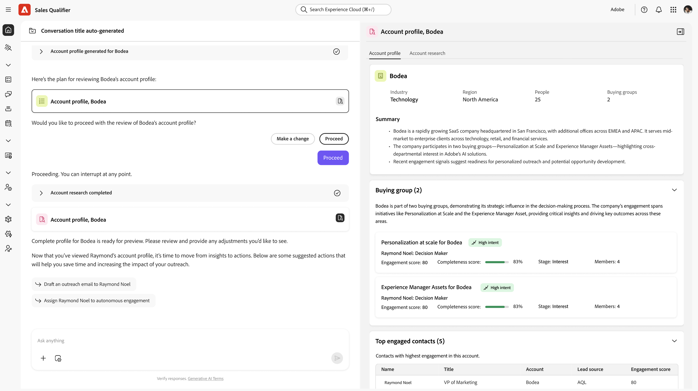

# Calificador de ventas

>[!NOTE]
>
>Esta función se encuentra actualmente en disponibilidad limitada y no está disponible para todos los usuarios.

Sales Qualifier es una aplicación complementaria de Adobe Journey Optimizer B2B edition basada en IA que contiene Account Qualification Agent y que está diseñada para optimizar los flujos de trabajo de los representantes de desarrollo empresarial (BDR). El Cualificador de ventas automatiza los flujos de trabajo de cualificación de clientes potenciales, alcance y participación del comprador en todos los canales. Reduce la carga manual de BDR y acelera la velocidad de la canalización para las empresas B2B empresariales.
Utilice los complementos de explorador y correo electrónico para acceder a inteligencia empresarial directamente desde CRM o Outlook.

El calificador de ventas se incluye con [!UICONTROL Journey Optimizer B2B edition], pero es una aplicación independiente dentro de Experience Platform Experience Cloud.

## Account Qualification Agent

Account Qualification Agent (AQA) es el núcleo del Calificador de ventas. El AQA utiliza IA para leer sus cuentas y determinar cuáles están listas para el siguiente paso. Ayuda con la investigación, la redacción de correos electrónicos y las actualizaciones de CRM.

* **Investigación prospectiva**

  Realice investigaciones de clientes potenciales utilizando la recuperación automática y la visualización de información clave del cliente potencial (como el puesto, los compromisos recientes, la pertenencia al grupo de compra) para proporcionar una imagen completa en segundos.

* **Investigación de la cuenta**

  Investigue la cuenta utilizando la recuperación automática y la visualización de información detallada sobre la organización de un cliente potencial. Esta información incluye elementos vitales de la empresa, noticias recientes, prioridades estratégicas y miembros de alto compromiso.

* **Correos electrónicos de borrador**

  Genere borradores de correos electrónicos sintetizando la investigación a partir de perspectivas y perspectivas de cuenta para producir contenido de correo electrónico único relevante y personalizado en función del objetivo de BDR.

* **Correos electrónicos del plan de participación**

  Cree borradores de correo electrónico de plan de participación personalizados para cada paso de una cadencia de alcance definida por BDR, lo que garantiza que toda la secuencia esté personalizada.

### Uso básico

Los agentes de inteligencia artificial aplicada a Adobe usan _consultas en lenguaje natural_, lo que significa que usan el mismo idioma en el mensaje de texto que cuando se habla con una persona. Cuanto más detallado sea, mejores serán los resultados.

Con el lenguaje natural, puede pedir al agente que:

* `Show me my assigned leads with no engagement yet`
* `Show me all my leads that are not part of any autonomous engagement`
* `Give me a detailed summary on Acme company, including their buying group, recent intent signals, and our past engagement.`

Puedes entender inmediatamente qué cuentas y clientes potenciales son los más activos y mostrar la intención más alta, para que puedas enfocar tu energía donde tenga el mayor impacto.

Itere sobre el recorrido refinando los indicadores para obtener los resultados que necesita. Por ejemplo:

* Redacte un borrador de un correo electrónico de seguimiento a partir de un contexto como llamadas de ganancias o informes. Hasta 120 palabras. Línea de asunto: cautivador, que incorpora un tema clave. Introducción: enlace con una cita directa de fuentes de contexto. Cuerpo: conéctese a puntos problemáticos y propuestas de valor. CTA: Proponga una breve llamada para explorar más a fondo.

* El objetivo de este correo electrónico es iniciar una conversación y generar credibilidad. Redacte un correo electrónico con menos de 120 palabras que tenga un tono consultivo y empático. Asegúrese de evitar un enfoque demasiado familiar o de ventas y no utilice las frases &quot;espero que esté bien&quot;, &quot;solo registrarse&quot; o &quot;por favor&quot;.

## Clientes potenciales

Esta ventana enumera todos los posibles clientes a los que tiene acceso. Es una comprobación rápida de cosas, como el estado del posible cliente y la última actividad.

Haga clic en el icono _Filtrar_  para filtrar la lista mostrada por estado de posible cliente.

## Planes de participación

Esta ventana proporciona detalles sobre cualquier plan de participación definido.

Para crear un nuevo plan de participación, haga clic en **[!UICONTROL Crear plan de participación]**.

1. En la fase _Detalles_, proporcione un nombre y una descripción opcional. Haga clic en **[!UICONTROL Guardar y continuar]**.
1. En la fase _Seleccionar posibles clientes_, seleccione los posibles clientes que deben pertenecer a este plan.
1. En la fase _Definir cadencia_, establezca los parámetros del plan.
1. En el paso _Vista previa_, asegúrese de que todo funciona según lo esperado.

## Bandeja de salida de correo

El panel Bandeja de salida de correo electrónico enumera todos los correos electrónicos automatizados que ha enviado.

## Reservas de reunión

Este panel muestra todas las reuniones configuradas mediante automatización.

## Bandeja de entrada de chat

Este panel muestra todos los hilos de chat.

Puede interactuar con los clientes y ver resúmenes del contacto y del subproceso para saber rápidamente dónde se encuentra en el subproceso.

## Integraciones

Con las integraciones, el cualificador de ventas puede aprovechar los CRM y otras fuentes de datos para enriquecer los perfiles de los clientes y aprovechar las actividades de ventas:

* Integre con la bandeja de entrada de su correo electrónico para realizar un seguimiento de los correos electrónicos entrantes relevantes y ayudar a generar respuestas.
* Leer y actualizar datos de CRM, como Salesforce o Microsoft® Dynamics, ZoomInfo o BuiltWith.

### Configuración de una nueva integración

Para iniciar una nueva integración, haga clic en **[!UICONTROL Crear integración]** en la parte superior derecha.

Defina la URL de la integración y establezca la carga útil que desea enviar:

1. Proporcione un nombre único y una descripción (opcional) para la integración.
1. Establezca el campo URL en el punto final de autenticación de integración de su sitio de integración.
1. En Parámetros de ruta, establezca el método HTTP.
1. En Parámetros de encabezado, configure los encabezados HTTP que necesite enviar. Por lo general, se envía un objeto JSON y requiere un encabezado de tipo de contenido.
1. En Parámetros de consulta, establezca los parámetros necesarios.
1. En Autenticación, configure la información de inicio de sesión para el sitio de integración.

   * Ninguna
   * OAuth 2.0
   * Clave de API
   * Autenticación básica

1. Establezca los valores de restricción y caché en la sección **[!UICONTROL Configuración de carga útil]**.
   * Haga clic en el icono de lápiz.
   * En el cuadro de diálogo _Pegar carga útil_, pegue o escriba su objeto de carga útil JSON.

      * **[!UICONTROL Solicitar carga útil]**: un objeto JSON que contiene datos para enviar al sitio de integración.
      * **[!UICONTROL Carga de respuesta]**: La estructura de datos que espera que se devuelva.

1. Haga clic en **[!UICONTROL Probar conexión]** para asegurarse de que la configuración es correcta.

Cuando la configuración de conexión sea válida, haga clic en **[!UICONTROL Guardar como borrador]**.

Cuando vuelva a la tabla principal de _[!UICONTROL Integraciones]_, seleccione la integración y haga clic en **[!UICONTROL Activar]** para activar la integración. Si no está listo para activarlo, haga clic en **[!UICONTROL Guardar como borrador]**.

#### Administrar acceso

Puede administrar el acceso a los usuarios y el tipo de datos que se comparten con distintos grupos de usuarios.

Haga clic en **[!UICONTROL Administrar acceso]** para abrir el cuadro de diálogo _[!UICONTROL Administrar acceso]_.

Este cuadro de diálogo enumera todas las etiquetas establecidas para su organización. Seleccione las etiquetas que desee aplicar a esta integración.

Si necesita una etiqueta nueva, haga clic en **[!UICONTROL Crear etiqueta]** e introduzca la información de la etiqueta:

* Nombre
* Nombre descriptivo
* Descripción

## Configuración de representante

La configuración de representante especifica información sobre usted, incluyendo detalles personales, configuración de correo electrónico y calendario, y disponibilidad de chat.

### Detalles

En la ficha **[!UICONTROL Detalles]** se escribe información sobre usted:

### Configuración de correo electrónico

En la pestaña **[!UICONTROL Configuración de correo electrónico]**, configure las conexiones de correo electrónico.

* **[!UICONTROL Conexiones de correo electrónico]** - Haga clic en **[!UICONTROL Conectar]** y siga el procedimiento de inicio de sesión de Microsoft.

* **[!UICONTROL Firma de correo electrónico]**: configure la firma de correo electrónico que se usa en los correos electrónicos generados automáticamente.

### Configuración del calendario

En la ficha **[!UICONTROL Configuración del calendario]**, establezca la zona horaria y la disponibilidad.

* **[!UICONTROL Conexión de calendario]** - Haga clic en **[!UICONTROL Conectar]** y siga el procedimiento de inicio de sesión de Microsoft para integrar su calendario.

* **[!UICONTROL Correo electrónico de confirmación de la reunión]**: cuando un cliente confirma una reunión con usted, recibe el correo electrónico de confirmación como respuesta. Utilice esta configuración para definir el asunto y el cuerpo del correo electrónico.

* **[!UICONTROL Preferencias]**: establezca la duración predeterminada de la reunión y el tiempo que desee entre reuniones consecutivas.

### Configuración de chat

En la pestaña **[!UICONTROL Configuración de chat]**, establece la disponibilidad del chat en vivo de Timezone.

## Gestión representativa

El panel _[!UICONTROL Administración de representantes]_ muestra los representantes definidos y su estado de calendario.

## Rendimiento de las reuniones

Este panel presenta análisis en torno a las reuniones completadas.

## Configuración del complemento de Chrome

El complemento AI Assistant Chrome está disponible en [Google Store](https://chromewebstore.google.com/detail/ai-assistant/hancbabllcmckehonngbdkhilocpdfji?authuser=0&hl=en).

Cuando el complemento está instalado en Chrome, el logotipo de Adobe aparece en el centro a la derecha cuando se encuentra en un sitio integrado:

* Aplicaciones web de Adobe
* Salesforce
* Outlook
* Microsoft Dynamics y aplicaciones web
* Aplicaciones de Google

## Editar la barra de navegación izquierda

En la parte inferior izquierda de la aplicación, haga clic en **[!UICONTROL Editar]** para controlar cuáles de los iconos son visibles en la navegación. También puede arrastrarlos y soltarlos para reordenarlos como desee.

## Vídeo de demostración

El siguiente vídeo proporciona una breve demostración del Cualificador de ventas y Account Qualification Agent.

>[!VIDEO](https://video.tv.adobe.com/v/3476550)
