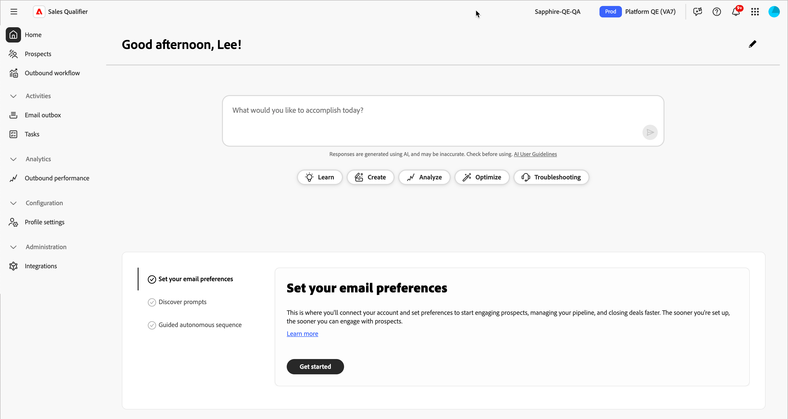
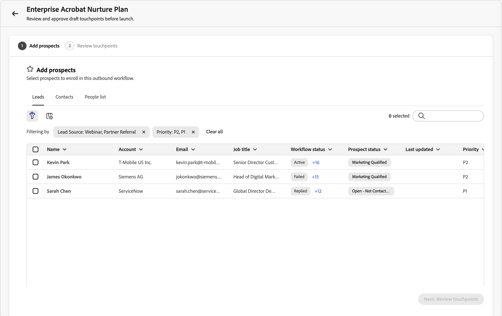
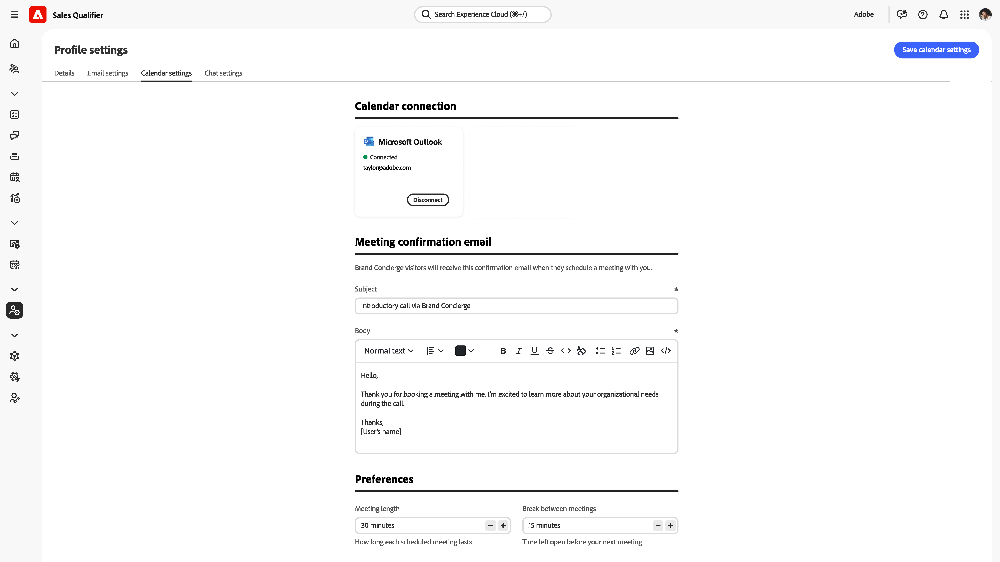
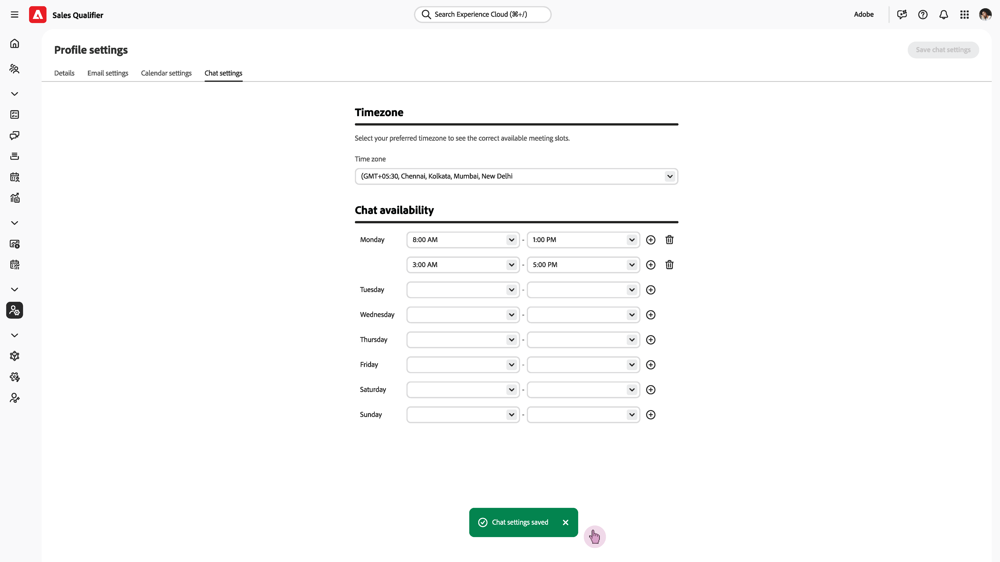

# Calificador de ventas

El cualificador de ventas es una aplicación controlada por IA que puede utilizar con Adobe Journey Optimizer B2B edition. Implementa Account Qualification Agent y está diseñado para optimizar los flujos de trabajo para los representantes de desarrollo empresarial (BDR). El Cualificador de ventas automatiza los flujos de trabajo de cualificación de clientes potenciales, alcance y participación del comprador en todos los canales. Reduce la carga manual de BDR y acelera la velocidad de la canalización para las empresas B2B empresariales.

Los BDR pueden utilizar los complementos de explorador y correo electrónico para acceder a inteligencia empresarial directamente desde CRM o Outlook. El siguiente vídeo proporciona una breve demostración del Cualificador de ventas y Account Qualification Agent.

>[!VIDEO](https://video.tv.adobe.com/v/3476564?captions=spa)

## Inicio de aplicación

El Calificador de ventas se incluye con [!UICONTROL Journey Optimizer B2B edition], pero es una aplicación independiente dentro de Adobe Experience Platform.

{width="800" zoomable="yes"}

### Account Qualification Agent

Account Qualification Agent (AQA) es el núcleo del Calificador de ventas. El AQA utiliza IA para leer sus cuentas y determinar cuáles están listas para el siguiente paso. Ayuda con la investigación, el borrador del correo electrónico y el contexto informado sobre CRM cuando su organización se ha conectado a CRM (solo lectura).

<!--
## Edit the left navigation bar

At the bottom left of the application, click the _Edit_ (  ) icon to control which elements are visible in the left navigation. You can also drag and drop them to reorder as you want.
-->

### Uso básico del agente

Los agentes de Adobe AI usan _consultas en lenguaje natural_, lo que significa que usan el mismo idioma en el mensaje de texto que cuando se habla con una persona. Cuanto más detallado sea, mejores serán los resultados.

Con el lenguaje natural, puede pedir al agente que:

* `Tell me the latest financial results of Bodea`
* `Tell me more about hiring at TechNova`
* `Tell me about the new AI features in Bodea LumaSecure4`

Itere los flujos de trabajo salientes refinando los indicadores para obtener los resultados que necesita. Por ejemplo:

* _Borrador de un dibujo de seguimiento de correo electrónico a partir de contexto, como llamadas de ganancias o informes._ Hasta 120 palabras. Línea de asunto: cautivador, que incorpora un tema clave. Introducción: enlace con una cita directa de fuentes de contexto. Cuerpo: conéctese a puntos problemáticos y propuestas de valor. CTA: Proponga una breve llamada para explorar más en profundidad._

* _El objetivo de este correo electrónico es iniciar una conversación y generar credibilidad._ Redacte un correo electrónico con menos de 120 palabras que tenga un tono consultivo y empático. Evite un enfoque demasiado familiar o de ventas y no utilice las frases &quot;espero que esté bien&quot;, &quot;solo registrarse&quot; o &quot;por favor&quot;._

### Acceso a productos y grupos de usuarios

El acceso a las funciones del cualificador de ventas se administra mediante grupos de usuarios en Adobe Admin Console. Los administradores de productos deben configurar los grupos de usuarios adecuados para que los usuarios puedan acceder a la aplicación.

#### Administradores de productos

Los administradores de productos que necesitan tener acceso a la funcionalidad [Integraciones](#integrations) deben ser miembros del grupo de usuarios `Sales Qualifier Admins`.

1. En Adobe Admin Console, cree un grupo de usuarios denominado `Sales Qualifier Admins`.
1. Agregue usuarios que necesiten configurar las conexiones de CRM y la configuración de la Base de conocimiento.

#### Usuarios de BDR estándar

Los usuarios de BDR estándar deben ser miembros del grupo de usuarios `Sales Qualifier users` para acceder al Calificador de ventas.

1. En Adobe Admin Console, cree un grupo de usuarios denominado `Sales Qualifier users`.
1. Asigne el perfil de AEP **Acceso predeterminado a todos los equipos de producción** al grupo.
1. Agregar usuarios al grupo.

>[!NOTE]
>
>Los nombres de los grupos de usuarios deben coincidir exactamente como se muestra en los pasos anteriores.

## Clientes potenciales

Seleccione **[!UICONTROL Clientes potenciales]** en el panel de navegación izquierdo para ver una lista de todos los posibles clientes a los que puede acceder. Proporciona una revisión rápida de la información, como el estado del posible cliente y la última actividad.

{width="800" zoomable="yes"}

Haga clic en el icono _Filtrar_  para filtrar la lista mostrada por estado de posible cliente.

## Flujos de trabajo salientes

>[!NOTE]
>
>Los flujos de trabajo salientes creados por los administradores de productos se comparten con todos los usuarios de su organización.

Un _flujo de trabajo saliente_ es la estructura que usa el calificador de ventas para ejecutar una secuencia de correo electrónico dirigida por objetivos. Usted define un objetivo de alcance y criterios de segmentación, y la IA propone una cadencia multitáctil y escribe contenido de correo electrónico personalizado para cada cliente potencial. Revise y apruebe cada correo electrónico antes de que la inscripción active la secuencia, de modo que los mensajes se envíen únicamente durante la ventana configurada.

Un flujo de trabajo saliente conecta cuatro elementos:

* **Objetivo**: el resultado que desea obtener del alcance (por ejemplo, reservar una llamada de contacto o registrar un evento de conducción).
* **Filtros de segmentación**: condiciones que determinan qué clientes potenciales son elegibles.
* **Cadencia de puntos de contacto**: la secuencia ordenada de pasos, cada uno en un día programado. Los puntos de contacto pueden ser **correos electrónicos**, **llamadas telefónicas** o **InMails de LinkedIn**.
* **Contenido de correo electrónico personalizado**: para cada punto de contacto de correo electrónico, la inteligencia artificial aplicada crea borradores de contenido usando el perfil del posible cliente, el contexto de la cuenta, el historial de participación y las noticias recientes.

El objetivo impulsa todo hacia abajo: la IA lo utiliza para sugerir filtros de direccionamiento, diseñar la cadencia, dibujar indicadores de punto de contacto y dar forma a la personalización para cada correo electrónico generado.

{width="800" zoomable="yes"}

### Conceptos clave

| Concepto | Descripción |
| --- | --- |
| **Flujo de trabajo** | Una actividad saliente reutilizable definida por un objetivo, filtros de objetivo, cadencia y configuración. |
| **Meta** | Lo que debe lograr el alcance. |
| **Punto de contacto** | Un paso en la secuencia (correo electrónico, llamada de teléfono o LinkedIn In InMail), programado en relación con la inscripción. |
| **Mensaje de Touchpoint** | Instrucciones que sigue la IA al generar el cuerpo y el asunto del correo electrónico para un cliente potencial: tono, longitud, enfoque y call to action. |
| **Cadencia** | La secuencia completa de puntos de contacto: cuántos, en qué orden y en qué días. |
| **Filtro de segmentación** | Condición que limita el flujo de trabajo a un subconjunto de posibles clientes. |
| **Borrador** | Un correo electrónico generado que está listo para revisarse, pero aún no se ha aprobado. |
| **Razonamiento** | La explicación de la IA de cómo escribió un correo electrónico determinado (qué señales y fuentes de datos utilizó). |
| **Inscripción** | Aprobación de los borradores de un cliente potencial, que activa la cadencia y pone en cola los correos electrónicos que se enviarán durante la ventana de envío del flujo de trabajo. |

Las secciones siguientes describen el ciclo de vida completo: creación de un flujo de trabajo en el asistente, revisión de correos electrónicos generados, aprobación de clientes potenciales y administración de flujos de trabajo a lo largo del tiempo.

### Creación de un flujo de trabajo saliente

La creación del flujo de trabajo es un asistente de cinco pasos: **Objetivo**, **Segmentación**, **Generar puntos de contacto**, **Configuración** y **Agregar perspectivas**. Cada paso se basa en el último; su objetivo inicial moldea cada decisión posterior.

1. En el panel de navegación izquierdo, seleccione **[!UICONTROL Flujo de trabajo saliente]**.

1. En la ficha **[!UICONTROL Examinar]**, haga clic en **[!UICONTROL + Crear flujo de trabajo]** en la esquina superior derecha.

#### Paso 1: Defina su objetivo

El objetivo es la entrada más importante: indica a la IA el aspecto del éxito y ancla el direccionamiento, la cadencia y la generación de correo electrónico.

1. Elige **[!UICONTROL Comenzar desde cero]** para escribir tu propio objetivo o **[!UICONTROL Comenzar desde la plantilla]** para usar una plantilla guardada.

   {width="700" zoomable="yes"}

1. Elige una de las **[!UICONTROL metas recomendadas]** como punto de partida o ingresa tu propia meta.

1. Haga clic en **[!UICONTROL Siguiente: Segmentación]**.

Los objetivos funcionan mejor cuando establecen un **resultado concreto**, no solo un tema. Por ejemplo, `Book a 15-minute discovery call with marketing leaders evaluating campaign automation` da a la IA más trabajo con que `Promote campaign automation`.

#### Paso 2: Configuración de los filtros de segmentación

Los filtros de segmentación definen qué clientes potenciales son aptos. Cuando se agregan perspectivas más adelante, sólo aparecen en la lista de selección los posibles clientes que coinciden con estos filtros.

1. Haga clic en la flecha hacia abajo para mostrar la lista **[!UICONTROL Agregar un filtro]** y seleccione el filtro que desee aplicar.

   {width="700" zoomable="yes"}

1. Establezca valores para el filtro.

1. Añada más filtros si necesita reducir la audiencia.

   {width="600" zoomable="yes"}

1. Haga clic en **[!UICONTROL Siguiente: Generar puntos de contacto]**.

#### Paso 3: Generar y revisar puntos de contacto

Una vez establecido el objetivo, la IA crea la **_cadencia_**: analiza el objetivo y el objetivo, define la secuencia de puntos de contacto y escribe un **_indicador de punto de contacto_** para cada paso. Verá una cadencia de varios pasos con cada punto de contacto en un día específico. La cadencia puede combinar pasos de correo electrónico, llamada de teléfono y LinkedIn In InMail.

{width="700" zoomable="yes"}

Expanda un punto de contacto de correo electrónico para leer su solicitud. Esta instrucción guía a la inteligencia artificial aplicada al escribir el correo electrónico de cada posible cliente, incluido el tono, la longitud, el enfoque y _call to action_.

**Volver a generar la cadencia**

Si la cadencia no es la deseada, haga clic en **[!UICONTROL Volver a generar]** e introduzca una instrucción de refinamiento. Por ejemplo:

* `Make it 3 touchpoints across 2 weeks`
* `Lead with an executive briefing offer in the first email`
* `Add a nurture touch focused on a relevant case study`

La IA reescribe la cadencia completa en función de sus instrucciones.

Para ajustar un solo punto de contacto de correo electrónico sin regenerar toda la cadencia, edite el texto del mensaje directamente en su área de texto.

Cuando la cadencia y las indicaciones tengan el aspecto correcto, haga clic en **[!UICONTROL Siguiente: configuración]**.

Refinar los indicadores de punto de contacto antes de la generación de clientes potenciales importa: estos indicadores son las instrucciones principales que la IA utiliza para cada cliente potencial más adelante. El tiempo empleado aquí se escala en todos los correos electrónicos generados.

#### Paso 4: Configuración del flujo de trabajo

El paso **Configuración** controla cómo se ejecuta el flujo de trabajo.

{width="700" zoomable="yes"}

1. Revise **[!UICONTROL Workflow name]** y cámbielo si desea una etiqueta más clara.
1. En **[!UICONTROL Máximo de clientes potenciales por flujo de trabajo]**, confirme el límite superior de cuántos clientes potenciales puede administrar el flujo de trabajo a la vez.
1. Establece la ventana de **[!UICONTROL envío]** para las horas en las que se permite enviar correos electrónicos salientes.
1. Confirmar **[!UICONTROL Incluir vínculo de exclusión]** para que cada correo electrónico pueda incluir un vínculo de exclusión.
1. Confirme que la **[!UICONTROL zona horaria]** coincida con su audiencia.
1. Haga clic en **[!UICONTROL Guardar y agregar clientes potenciales]**.

#### Paso 5: Añadir clientes potenciales e iniciar la generación de correo electrónico

Guardar abre la vista de selección de clientes potenciales, ya filtrada por la segmentación del Paso 2.

{width="700" zoomable="yes"}

1. Revise la lista.

   Las filas suelen incluir el nombre del cliente potencial, la cuenta, el correo electrónico, el puesto, el estado de participación y el estado del cliente potencial.

1. Ajuste los filtros aquí si necesita expandir o reducir la lista.
1. Seleccione los clientes potenciales mediante las casillas de verificación.
1. Haga clic en **[!UICONTROL Siguiente: revise los puntos de contacto]** para iniciar la generación de correo electrónico de **por cliente potencial**.

La IA genera correos electrónicos personalizados para cada posible cliente seleccionado para **cada punto de contacto de correo electrónico** en la cadencia. Los puntos de contacto de Phone y LinkedIn In InMail permanecen en la secuencia como pasos programados. La generación se puede ejecutar en segundo plano: use **[!UICONTROL Notificar cuando esté listo]** si desea continuar con otro trabajo mientras se completa.

Para cada cliente potencial, la IA combina cada mensaje de punto de contacto con datos específicos del cliente potencial (persona, cuenta, historial de participación, noticias recientes) para producir la línea de asunto y el cuerpo.

### Revisar y perfeccionar correos electrónicos generados

Cuando termina la generación, la vista de detalles del flujo de trabajo muestra un banner para revisar los borradores. La revisión es obligatoria y nada envía hasta que la apruebe.

{width="700" zoomable="yes"}

1. En la vista de detalles del flujo de trabajo, haga clic en **[!UICONTROL Revisar borradores]** en el banner.
1. El paso **[!UICONTROL Revisar puntos de contacto]** tiene dos pestañas:
   * **[!UICONTROL Listo para revisión]** - Correos electrónicos que terminaron de generarse.
   * **[!UICONTROL Generando]**: se siguen escribiendo correos electrónicos.
1. En la lista de clientes potenciales de la izquierda, haga clic en un nombre para cargar los puntos de contacto de ese cliente potencial a la derecha.
1. Use las comillas angulares (**>**) en un punto de contacto para expandir y leer la línea de asunto y el cuerpo completos.

#### Lea el razonamiento de IA

Para cada correo electrónico generado, **[!UICONTROL Reasoning]** explica cómo la IA creó ese mensaje, incluidas las señales, atributos y fuentes que dieron forma al contenido y a call to action. Revise esta información y valide la personalización antes de aprobarla.

{width="600" zoomable="yes"}

#### Editar correos electrónicos directamente

Para pequeñas ediciones (redacción, tono, una sola frase):

1. En el punto de contacto expandido, haga clic en el icono _Editar_ para abrir el editor.
1. Edite la línea de asunto o el cuerpo.
1. Haga clic en **[!UICONTROL Guardar]**.

#### Refinamiento de correos electrónicos con IA

Para cambios más grandes (reestructurar, cambiar el énfasis o reformular el mensaje), use **[!UICONTROL Generar con IA]**. El agente de IA reescribe el correo electrónico y mantiene el contexto de personalización.

1. En el editor de correo electrónico, haga clic en **[!UICONTROL Generar con IA]**.

   {width="600" zoomable="yes"}

1. Introduzca una instrucción de borrado, por ejemplo:
   * `Make it shorter and more direct. Keep it under 100 words.`
   * `Focus more on the prospect's role and how the solution helps them specifically.`
   * `Change the call-to-action to suggest a 15-minute introductory call instead.`
1. Revise la revisión y realice la modificación manualmente si es necesario.
1. Haga clic en **[!UICONTROL Guardar]**.

>[!TIP]
>
>Las ediciones directas se adecúan a la redacción y al tono. _[!UICONTROL Generar con IA]_ es mejor cuando de lo contrario volvería a escribir el correo electrónico desde cero.

### Aprobar e inscribir clientes potenciales

La aprobación activa la cadencia de un cliente potencial. Hasta que se aprueba e inscribe a un posible cliente, el sistema no le envía correos electrónicos.

1. En la lista de clientes potenciales de la izquierda, seleccione los clientes potenciales cuyos correos electrónicos ha revisado y que están listos para enviar.
1. Haga clic en **[!UICONTROL Aprobar e inscribir clientes potenciales]** (parte inferior derecha).

{width="700" zoomable="yes"}

Los correos electrónicos aprobados se envían durante el flujo de trabajo **ventana de envío** en la **zona horaria** configurada, en el día programado de cada punto de contacto en relación con la inscripción. Los clientes potenciales que no apruebe permanecerán en **[!UICONTROL Listo para revisión]** hasta que actúe. Después de la aprobación, el flujo de trabajo se ejecuta según la cadencia definida.

### Administrar flujos de trabajo existentes

En la página _[!UICONTROL Flujo de trabajo saliente]_, la pestaña **[!UICONTROL Examinar]** muestra todos los flujos de trabajo. Cada tarjeta muestra el objetivo, los puntos de contacto configurados y las métricas de rendimiento. Utilice esta vista para monitorizar los flujos de trabajo activos, volver a los borradores que aún deben revisarse o abrir un flujo de trabajo para agregar más posibles clientes.

### Prácticas recomendadas de flujo de trabajo saliente

* **Invierta en la meta.** El direccionamiento descendente, la cadencia y los correos electrónicos se remontan al objetivo. Los objetivos específicos, centrados en los resultados, superan a los vagos.
* **Finalizar mensajes de punto de contacto antes de la generación por cliente potencial.** Después de la generación masiva, los cambios se suelen realizar de un cliente potencial a la vez.
* **Usar razonamiento como comprobación de calidad.** Si se enfatiza la señal incorrecta (o falta una obvia), edite el correo electrónico o vuelva a visitar el indicador de punto de contacto y vuelva a generar la cadencia.
* **Hacer coincidir la herramienta de edición con el cambio.** Ediciones directas de redacción y tono; **[!UICONTROL Generar con IA]** para reestructurar o reenmarcar.
* **Aprobar solo lo que ha revisado.** Amplíe los puntos de contacto, lea el contenido y perfeccione lo que necesite antes de inscribirse.

## Bandeja de salida de correo

El panel Bandeja de salida de correo electrónico enumera todos los correos electrónicos automatizados que ha enviado.

<!--
## Meeting bookings

This panel displays all meetings set up through automation.

## Chat inbox

This panel displays all your chat threads.


You can interact with clients, and see summaries for the contact and the thread so that you can quickly know where you are in the thread.

-->

## Tareas

El área _Tareas_ del Calificador de ventas proporciona a los Representantes de desarrollo de negocios (BDR) un espacio dedicado para administrar y procesar sus acciones de flujo de trabajo salientes. El motor de flujo de trabajo saliente genera automáticamente tareas que representan las acciones específicas que un BDR necesita realizar con cada posible cliente: llamadas telefónicas, InMails de LinkedIn y revisiones de correo electrónico.

La experiencia de administración de tareas está diseñada como una **cola de procesamiento**, no solamente como una lista de tareas pendientes. Puede abrir una tarea, realizar acciones, marcarla como completada y pasar al siguiente sin salir de la página.

Seleccione **[!UICONTROL Tareas]** en la barra de navegación izquierda para abrir la página de tareas completa. Esta página es el espacio de trabajo principal para procesar las tareas una por una.

{width="800" zoomable="yes"}

<!--
**Homepage feed** - The homepage displays a running feed of your most urgent tasks, with overdue items at the top followed by today's tasks. Each item in the feed has an "Open" button that takes you directly to that task in the Tasks page with the detail panel already loaded.
-->

### Tipos de tareas

Todas las tareas están vinculadas a pasos de flujo de trabajo salientes. Existen tres tipos:

**Llamada telefónica**: se crea cuando una secuencia de flujo de trabajo alcanza un paso de llamada telefónica. El panel de tareas muestra los puntos de paso generados por el agente y un campo de notas en línea para capturar notas de llamada.

**LinkedIn In InMail**: se crea cuando una secuencia alcanza un paso de LinkedIn In InMail. El panel de tareas muestra contenido de InMail sugerido que puede copiar y enviar fuera del producto.

**Revisión de correo electrónico**: creada una vez que el sistema termina de generar correos electrónicos personalizados para un cliente potencial inscrito en un flujo de trabajo. Revise y apruebe los mensajes de correo electrónico antes de que comience la salida para ese cliente potencial. Cada cliente potencial recibe una tarea de revisión de correo electrónico independiente; si inscribe a 10 clientes potenciales en un flujo de trabajo, verá hasta 10 tareas de revisión de correo electrónico a medida que se complete la generación.

### Administración de tareas

La página Tareas se divide en dos paneles:

* **Izquierda — Lista de tareas:** Su cola de tareas, ordenadas y filtradas según la configuración de orden y vista seleccionada.
* **Derecha — Panel de trabajo de la tarea:** Detalles de la tarea seleccionada, incluida la información del cliente potencial, el contexto del flujo de trabajo, el contenido específico de la tarea (puntos de presentación, copia sugerida, borradores de correo electrónico) y los controles de acción.

Al seleccionar cualquier tarea en el panel izquierdo, se cargan sus detalles en el panel derecho sin salir de la página.

#### Controles de cola

El panel de trabajo incluye los controles **Siguiente** y **Anterior** para moverlos por la cola de tareas en orden. La cola respeta la configuración de ordenación y filtro que aplique a la lista. Por lo tanto, si está trabajando en tareas de llamada de teléfono vencidas ordenadas por fecha de vencimiento, _Siguiente_ y _Anterior_ se mueven exactamente a través de ese conjunto.

Cuando marca una tarea como completada, el panel avanza automáticamente a la siguiente tarea de la cola.

#### Notas

Para las tareas de Phone Call y LinkedIn In InMail, hay un campo de notas en línea disponible en el panel de trabajo. Las notas se guardan automáticamente cuando hace clic fuera para no perderlas cuando vaya a otra tarea antes de marcar la tarea actual como completada.

#### Acciones de tarea

Utilice las siguientes acciones para administrar sus tareas:

* **[!UICONTROL Marcar como completada]** - La acción principal. Utilice esta acción después de ejecutar la tarea: realizar la llamada, enviar el mensaje de InMail o revisar y aprobar los mensajes de correo electrónico. Al finalizar, la tarea se registra como **Completada** y la cola avanza automáticamente.

* **[!UICONTROL Omitir punto de contacto]**: disponible en el menú de desbordamiento del panel de trabajo. Utilice esta opción cuando no pueda completar este paso, pero el cliente potencial siga siendo un destino válido en el flujo de trabajo.
   * El cliente potencial avanza al siguiente paso de la secuencia. Las tareas futuras se siguen generando según lo programado.
   * Seleccione un motivo: *Información de contacto incorrecta*, *mal tiempo*, *Contenido no relevante* o *Otro* (con un campo de texto libre).
   * El estado de la tarea se ha establecido en **Omitido** y se ha registrado con el motivo y la marca de tiempo.
   * Si este fue el último paso del flujo de trabajo, finaliza la ejecución del flujo de trabajo del cliente potencial. La tarea sigue registrándose como Omitido (no eliminado).

* **[!UICONTROL Quitar del flujo de trabajo]** - Disponible en el menú de desbordamiento del panel de trabajo. Utilícelo cuando el cliente potencial ya no pertenezca a este flujo de trabajo.

  Cuando elimina un cliente potencial de un flujo de trabajo:
   * Todas las tareas pendientes y futuras de ese cliente potencial dentro de este flujo de trabajo se cancelan.
   * El estado de inscripción del cliente potencial cambia a **Eliminado por BDR**.
   * Seleccione un motivo: *Se fue de la compañía*, *Duplicado*, *Ajuste incorrecto*, *Ya se ha convertido* o *Otro* (con un campo de texto).
   * Aparece un cuadro de diálogo de confirmación: *&quot;Esta acción cancelará todos los puntos de contacto restantes para [Cliente potencial] en [Nombre de flujo de trabajo]. ¿Continuar?&quot;*
   * El estado de la tarea se ha establecido en **Eliminada**. Todas las tareas del mismo nivel canceladas también están marcadas como **Eliminadas**.

>[!NOTE]
>
>Los datos de omisión y eliminación de motivos informan a los análisis, incluida la tasa de omisión por canal, la tasa de eliminación por flujo de trabajo y los motivos principales. Esto ayuda a mejorar la calidad del flujo de trabajo e informa al análisis del rendimiento a lo largo del tiempo.

### Estado de tarea

Cada tarea se desplaza por los siguientes estados:

| Estado | Descripción |
|---|---|
| **Pendiente** | Se ha creado, pero el paso de flujo de trabajo anterior aún no se ha completado. No visible en la lista de tareas. |
| **Próximamente** | El paso anterior se ha completado, pero la fecha de vencimiento es futura. Visible y procesable: puede completarlo antes si es el momento adecuado. |
| **Abri** | Vence hoy. Visible y procesable. |
| **Vencido** | Fecha de vencimiento pasada, aún no completada. Visible, procesable y marcado visualmente. |
| **Completado** | Ha ejecutado y marcado la tarea como completada. |
| **Omitido** | Se ha omitido este punto de contacto. El cliente potencial avanza en el flujo de trabajo. |
| **Eliminado** | Ha eliminado al posible cliente del flujo de trabajo. Todas las tareas del mismo nivel se cancelan. |
| **Cancelado** | Cancelado por el sistema debido a un cambio en el flujo de trabajo o a una posible eliminación. |

### Vistas de lista

Utilice las pestañas de la parte superior de la lista de tareas para cambiar entre vistas:

* **Hoy** *(predeterminado)* — Tareas pendientes hoy que no se han completado.

* **Vencidas**: tareas cuya fecha de vencimiento ha pasado y siguen abiertas. Aborde primero estas tareas.

* **Próximas**: tareas con una fecha de vencimiento futura en las que el paso anterior del flujo de trabajo ya se haya completado. Estas tareas se pueden ver antes de tiempo, por lo que puede planificar con antelación o actuar antes si el momento es el adecuado (por ejemplo, si ya está en una llamada con un posible cliente). Se muestra la fecha de vencimiento programada para que sepa el tiempo previsto.

* **Completadas**: un registro de tareas que ha completado, omitido o eliminado. Útil para fines de revisión y auditoría.

### Filtrado y búsqueda

Existen varias formas de filtrar la lista de tareas:

* Filtre por tipo de tarea mediante una lista de selección múltiple. Si se seleccionan varios tipos, se mostrarán las tareas que coincidan con *cualquier* de los tipos seleccionados (por ejemplo, Llamada telefónica **o** Revisión de correo electrónico).

* Filtrar por estado de tarea. Al seleccionar varios estados, se muestran las tareas que coinciden con cualquiera de los estados seleccionados.

* Filtre entre grupos con la lógica **AND**. Por ejemplo, `Type = Phone Call and Status = Overdue` muestra solamente las tareas de llamada vencidas.

Utilice la barra de búsqueda para buscar tareas por nombre del cliente potencial, nombre de la empresa o nombre de la participación. La búsqueda se aplica junto con cualquier filtro activo. Coincidencia de texto solamente: coincidencias parciales exactas, sin búsqueda parcial.

### Orden

Utilice el control **Ordenar por** para elegir cómo se ordena la lista de tareas. La ordenación también determina el orden en que Siguiente y Anterior se mueven por la cola.

| Opción de orden | Comportamiento |
|---|---|
| **Fecha de vencimiento (ascendente)** *(predeterminado)* | Primero, la fecha límite más antigua. Las tareas vencidas aparecen antes de las tareas de hoy. |
| **Fecha de vencimiento (descendente)** | Primero la fecha límite. |
| **Fecha de creación (más reciente)** | Primero las tareas creadas más recientemente. |
| **Fecha de creación (más antigua)** | Primero, las tareas creadas más antiguas. |
| **Tipo de tarea** | Agrupadas por tipo en orden: Llamada telefónica → revisión de correo electrónico de → de LinkedIn. Dentro de cada grupo, ordenado por fecha de vencimiento en orden ascendente. |

### Tareas vencidas

Una tarea pasa a estar vencida el día siguiente a su fecha de vencimiento si no se ha completado. Tareas vencidas:

* Aparecen en la vista **Vencido** y en la parte superior de la fuente de la página principal.
* Se marcan visualmente con un distintivo &quot;Vencido&quot; en la lista de tareas.
* Permanecer totalmente procesable: puede completarlos, omitirlos o eliminarlos.

### Próximas tareas

Las próximas tareas se crean en el momento en que un cliente potencial completa un paso del flujo de trabajo, incluso si la fecha de vencimiento del siguiente paso sigue siendo futura. Esta visibilidad le proporciona la incorporación temprana de insight a su canalización para que pueda planificar con anticipación o actuar con anticipación cuando se presente la oportunidad.

Las próximas tareas muestran su fecha de vencimiento programada, para que siempre sepa cuándo se van a abordar. La finalización anticipada de una tarea inminente es totalmente compatible: el motor de flujo de trabajo registra la fecha real de finalización y adelanta al posible cliente normalmente.

### Finalización de tarea

La finalización de tareas no se limita a la página Tareas.

**Vista del posible cliente comprometido:** Las vistas previas del punto de contacto en la página de un posible cliente comprometido incluyen una acción _Marcar como completado_ junto con una vista previa de contenido y un campo de notas opcional. Al completar una tarea aquí, se actualiza su estado inmediatamente en la página Tareas. Esta vista no almacena en déclencheur el comportamiento de avance automático; es una superficie de vista y acción, no una superficie de procesamiento de colas.

**Salesforce (complemento CRM):** El complemento Calificador de ventas de Salesforce muestra el estado de la tarea (próxima, pendiente, finalizada, vencida, omitida) en la tarjeta de flujo de trabajo saliente. En la versión actual, la tarjeta CRM es **de solo lectura**; puede ver el estado de la tarea, pero debe completar las tareas desde el Calificador de ventas.

### Estados vacíos

* **Hoy sin tareas:** Verá un mensaje de _Se ha puesto al día con respecto al mensaje de hoy_. Si existen tareas próximas, aparece un mensaje como _Tiene [N] tareas próximas — ver_ próximas.
* **Tareas vencidas presentes:** Un mensaje le recomienda que primero aborde las tareas vencidas.

## Integraciones

Con las integraciones, el cualificador de ventas puede utilizar su CRM para que el Account Qualification Agent (AQA) y los flujos de trabajo salientes compartan una vista coherente de los posibles clientes, las cuentas, los contactos, las actividades y los propietarios en Salesforce o Microsoft Dynamics 365. Las integraciones de CRM se conectan con acceso de **solo lectura** para que AQA pueda recuperar datos y actividades de ventas de CRM (por ejemplo, correos electrónicos, llamadas, tareas y citas) para enriquecer las perspectivas. Los datos CRM se utilizan para obtener perspectivas y eficacia operativa en la aplicación. No se utiliza para modificar los registros CRM a través de esta conexión.

>[!IMPORTANT]
>
>El acceso a las integraciones en el Calificador de ventas requiere la pertenencia de `Sales Qualifier Admins` al grupo de usuarios.

### Ámbito de acceso CRM

La conexión de CRM es **_de solo lectura_**. Las entidades habituales utilizadas incluyen usuarios, contactos, asignaciones de propietarios, posibles clientes, cuentas, oportunidades y actividades. El administrador de CRM prepara el acceso a la API en Salesforce o Dynamics. A continuación, conecte el cualificador de ventas y asigne los campos de entrada en la aplicación.

### Preparar credenciales en su CRM

Póngase en contacto con el administrador de CRM antes de conectar el cualificador de ventas. A continuación se resume lo que se suele crear en cada sistema.

#### Microsoft Dynamics 365 (Dataverse/Power Platform)

1. En Azure Active Directory, registre una aplicación (**[!UICONTROL Registros de aplicaciones]**).

   Observe **ID de cliente** y **ID de inquilino**, y cree un **Secreto de cliente**.

1. En el **[!UICONTROL Centro de administración de Power Platform]**, abra su entorno y vaya a **[!UICONTROL Configuración]** > **[!UICONTROL Usuarios + permisos]** > **[!UICONTROL Usuarios de la aplicación]**.

1. Cree un usuario de aplicación vinculado a esa aplicación de Azure AD.

1. Asigne una función de seguridad que conceda a **read** acceso a las necesidades del calificador de ventas de las entidades (por ejemplo, posibles clientes, contactos, cuentas, oportunidades y actividades).

   La aplicación requiere una función de seguridad con acceso de lectura para leer datos.

**Información que se debe proporcionar al conectar con Dynamics:**

* Identificación del cliente
* Secreto de cliente
* ID de inquilino
* URL de instancia de Dynamics (URL de organización)

#### Salesforce

En Salesforce, [cree una aplicación cliente externa](https://help.salesforce.com/s/articleView?id=xcloud.create_a_local_external_client_app.htm&type=5) (o una _aplicación conectada_) con OAuth habilitado y ámbitos que permitan el acceso de API a la identidad y los datos, siguiendo los estándares de seguridad de su organización. El usuario que realiza la integración (por ejemplo, al utilizar una configuración de estilo de credenciales de cliente) debe tener acceso de lectura a objetos como posibles clientes, cuentas, contactos, tareas, eventos, oportunidades y objetos de oportunidad relacionados. Las tareas administrativas a menudo requieren que un usuario con **[!UICONTROL Administrar aplicaciones conectadas]** (entre otros permisos) vea una clave de consumidor y un secreto después de la creación.

>[!PREREQUISITES]
>
>Para crear una aplicación de cliente externa, un administrador de productos debe comprobar que tiene lo siguiente habilitado (de Perfil o Conjunto de permisos):
>
>* Personalizar aplicación
>* Ver instalación y configuración
>* Modificar todos los datos
>* Administrar aplicaciones conectadas (importante)
>
>   Si _Administrar aplicaciones conectadas_ no está habilitada, es posible que no pueda ver el ID de cliente y el secreto de cliente después de crear la aplicación cliente externa.

Cuando cree la aplicación cliente externa, habilite OAuth y conceda permisos. Habilite también las siguientes credenciales de cliente:

* Acceso al servicio de URL de identidad (ID, perfil, correo electrónico, dirección, teléfono)
* Administración de datos de usuario mediante API
* Acceso a identificadores de usuario únicos (openid)

Después de crear la aplicación, vuelva a habilitar el flujo de credenciales del cliente y utilice el correo electrónico de contacto como nombre de usuario.  Cuando las credenciales del cliente estén habilitadas, configure un usuario para _Ejecutar como_.

Asegúrese de que el usuario configurado tenga acceso de lectura a los siguientes objetos:

* Clientes potenciales
* Cuentas
* Contactos
* Tareas
* Eventos
* Oportunidad
* OpportunityContactRoles
* OpportunityLineItems

**Información que se debe proporcionar al conectar Salesforce en el Calificador de ventas:**

* ID de cliente (clave del cliente)
* Secreto del cliente (Secreto del consumidor)
* URL de devolución de llamada (según la configuración en la aplicación conectada)
* URL de instancia de Salesforce

>[!IMPORTANT]
>
>No enviar secretos de cliente por correo electrónico. Utilice el canal seguro aprobado de su organización para compartir credenciales con quien las introduzca en el cualificador de ventas.

### Conéctese a su CRM

1. Inicie sesión en el cualificador de ventas y confirme que la zona protegida o el entorno correctos están seleccionados.

1. En el panel de navegación izquierdo, expanda **[!UICONTROL Administración]** y seleccione **[!UICONTROL Integraciones]**.

   La página muestra tarjetas para Salesforce y Microsoft Dynamics.

   {width="800" zoomable="yes"}

1. Haga clic en **[!UICONTROL Conectar]** para el CRM que utilice.

1. Introduzca el ID de cliente, los secretos, los valores de inquilino o devolución de llamada y la **URL de instancia** de su administrador de CRM.

1. Después de una conexión correcta, la tarjeta muestra **[!UICONTROL Conectado]**.

### Directrices de URL de instancia

La **URL de instancia** debe ser la URL base de entorno que su CRM use para la configuración de integración y API, no un nombre de host solo de interfaz de usuario.

**Salesforce**

1. Inicie sesión y anote el subdominio de organización _Mi dominio_ desde la barra de direcciones del explorador (el valor `{{mydomain}}`).

1. Para el Calificador de ventas, use el formulario canónico: `https://{{mydomain}}.my.salesforce.com` .

   **no** usa una dirección URL `lightning.force.com` como dirección URL de instancia.

**Microsoft Dynamics 365**

1. Abra el CRM en el explorador y copie la URL base de la barra de direcciones.

   Suele estar en el formulario `https://{{org}}.crm.dynamics.com`.

### Asignar campos CRM (asignación de entrada)

Una vez conectado el CRM, abra **[!UICONTROL Administrar]** en la integración para que funcione con **[!UICONTROL asignación de entrada de CRM]**.

1. Haga clic en **[!UICONTROL Agregar sección]** e introduzca un nombre, una descripción opcional y un tipo de entidad (por ejemplo, cliente prospecto).

1. Seleccione los campos CRM que desea importar, previsualice la asignación y guarde.

   La sección aparece en la pestaña de asignación de entrada.

1. Los campos de clientes potenciales asignados aparecen en la ficha **[!UICONTROL Persona]** para los clientes potenciales:
   * Campos de cuenta en la vista de cuentas.
   * Campos relacionados con la oportunidad en las áreas de oportunidad de la experiencia de la cuenta.

### Referencia: Parámetros de API de muestra

Su equipo de CRM puede utilizar estos ejemplos para confirmar que el acceso de lectura devuelve los campos de posibles clientes esperados.

**Dynamics (extracto estilo OData)**

```text
$select=fullname,_ownerid_value,leadid,emailaddress1,jobtitle,statuscode,createdon,modifiedon,statecode
$filter=_ownerid_value eq '<crmUserId>' [AND additional filters]
$expand=Lead_ActivityPointers(...),parentaccountid(...)
$orderby=modifiedon desc
```

**Salesforce (extracto de SOQL)**

```sql
SELECT Id, Salutation, FirstName, LastName, Name, Title, Company, Email,
  LeadSource, Status, OwnerId, LastModifiedDate, LastActivityDate, CreatedDate,
  (SELECT Id, Subject, ActivityDate, Status FROM Tasks ORDER BY ActivityDate DESC LIMIT 1),
  (SELECT Id, Subject, ActivityDateTime FROM Events ORDER BY ActivityDateTime DESC LIMIT 1)
FROM Lead
WHERE OwnerId = '<crmUserId>' AND IsDeleted = false
ORDER BY LastModifiedDate DESC
```

### Centro de información

El _[!UICONTROL Centro de conocimientos]_ proporciona acceso de control de calidad a los documentos de los clientes y a los conocimientos vinculados para que el calificador de ventas pueda generar mejores perspectivas de investigación y calificación utilizando sus propios materiales. Cargue el contenido y los recursos informativos que desee utilizar para generar correos electrónicos.

{width="700" zoomable="yes"}

## Configuración de perfil

La configuración de perfil especifica información sobre usted, incluidos sus detalles personales, la configuración de correo electrónico y calendario y la disponibilidad del chat.

### Configuración de correo electrónico

En la pestaña **[!UICONTROL Configuración de correo electrónico]**, configure las conexiones de correo electrónico.


* **[!UICONTROL Conexiones de correo electrónico]** - Haga clic en **[!UICONTROL Conectar]** y siga el procedimiento de inicio de sesión de Microsoft.

* **[!UICONTROL Firma de correo electrónico]**: configure la firma de correo electrónico que se usa en los correos electrónicos generados automáticamente.

### Configuración del calendario

En la ficha **[!UICONTROL Configuración del calendario]**, establezca la zona horaria y la disponibilidad.

<!-- 

-->

* **[!UICONTROL Conexión de calendario]** - Haga clic en **[!UICONTROL Conectar]** y siga el procedimiento de inicio de sesión de Microsoft para integrar su calendario.

* **[!UICONTROL Correo electrónico de confirmación de la reunión]**: cuando un cliente confirma una reunión con usted, recibe el correo electrónico de confirmación como respuesta. Utilice esta configuración para definir el asunto y el cuerpo del correo electrónico.

* **[!UICONTROL Preferencias]**: establezca la duración predeterminada de la reunión y el tiempo entre reuniones consecutivas.

Si desconecta el calendario:

* Los vínculos de reserva activos están desactivados.
* La página de reserva muestra un estado descriptivo, temporalmente no disponible.
* La reconexión conserva la configuración.

### Disponibilidad del calendario

La disponibilidad del calendario en el Cualificador de ventas se basa en dos entradas:

* Calendario de trabajo conectado (Outlook o Gmail)
* Su disponibilidad configurada y reglas de franja horaria en _Configuración del calendario_.

El calificador de ventas lee el estado de disponibilidad del calendario conectado, no del contenido completo del evento, y lo utiliza junto con las reglas configuradas para decidir qué espacios de reserva puede ver un cliente potencial.

Puede configurar lo siguiente:

* Horas laborables por día de la semana
* Varios bloques al día (por ejemplo: 9:00-12:00 y 1:00-5:00)
* Su huso horario
* Duración de la reunión
* Búfer antes/después de las reuniones
* Aviso mínimo
* Ventana de reserva

<!-- 
### Chat settings

In the **[!UICONTROL Chat settings]** tab, set your Timezone Live chat availability.



## Representative management

The _[!UICONTROL Representative management]_ panel displays the defined representatives and their calendar status.

## Meeting performance

This panel presents analytics around your completed meetings.
-->

<!--
 SHPHR-24341 remove section
## Set up the Chrome plugin

The AI Assistant Chrome plugin is available on the [Google Store](https://chromewebstore.google.com/detail/ai-assistant/hancbabllcmckehonngbdkhilocpdfji?authuser=0&hl=en).

When the plugin is installed in Chrome, the Adobe logo appears on the middle right when you are on an integrated site:

* Adobe web applications
* Salesforce
* Outlook
* Microsoft Dynamics and web applications
* Google applications 
-->
