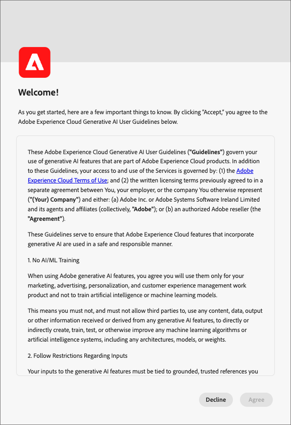

# Asistente de IA en Journey Optimizer B2B edition

El Asistente de IA en Journey Optimizer B2B edition se creó a partir de la misma base tecnológica de [Asistente de IA en Adobe Experience Platform](https://experienceleague.adobe.com/es/docs/experience-platform/ai-assistant/home){target="_blank"}. Es una experiencia de conversación que puede utilizar para acelerar los flujos de trabajo en Adobe Journey Optimizer B2B edition. Puede utilizar el asistente de IA para comprender mejor las funciones del producto, solucionar problemas o buscar información y encontrar perspectivas operativas para Journey Optimizer B2B edition.

>[!IMPORTANT]
>
>Se requiere un acuerdo con las [directrices de usuario](https://www.adobe.com/legal/licenses-terms/adobe-dx-gen-ai-user-guidelines.html) para poder usar el Asistente de IA en Journey Optimizer B2B edition. Este acuerdo también contiene el acuerdo beta público para que pueda utilizar funciones adicionales del asistente de IA a medida que se implementen en una capacidad beta.

+++Ver la interfaz de acuerdo de usuario

+++

## Funciones del asistente de IA en Journey Optimizer B2B edition

Para formular una respuesta a las preguntas enviadas, AI Assistant consulta una base de datos y traduce los datos de la base de datos a una respuesta legible en lenguaje natural. Esta respuesta es una representación interna de los datos subyacentes y también se conoce como _&#x200B;**_Gráfico de conocimientos_**&#x200B;_, una completa web de conceptos, datos y metadatos para una respuesta determinada. El gráfico de conocimiento consta de subgráficos a los que se hace referencia cada vez que se envían consultas:

* Documentación de Experience League.
* Artefactos operativos, como esquemas, campos, audiencias y recorridos.

Piense en el tipo de consulta que necesita antes de enviar una consulta del asistente de IA:

### Conocimiento del producto

El conocimiento del producto hace referencia a conceptos y temas basados en la documentación de Journey Optimizer B2B edition en Adobe Experience League. Las preguntas sobre conocimientos del producto se pueden especificar en los siguientes subgrupos:

| Conocimiento del producto | Ejemplos |
| --- | --- |
| Aprendizaje puntual | <li>¿Qué es un grupo de compra? <li> ¿Desea mostrar un ejemplo de una plantilla de funciones de grupo de compra? |
| Abrir detección | <li>¿Cuáles son los pasos para crear grupos de compra? <li>¿Cómo utilizo los campos personalizados en una plantilla de funciones de grupo de compra? |
| Resolución de problemas | <li>¿Por qué no se crearon los grupos de compra para mi recorrido? <li>¿Por qué no puedo encontrar eventos de experiencia para escuchar en el recorrido? |

### Perspectivas operativas

_Perspectivas operativas_ se refiere a las respuestas que genera AI Assistant sobre sus objetos de metadatos (atributos, audiencias de cuenta, flujos de datos, conjuntos de datos, destinos, recorridos de cuenta, esquemas, fuentes, plantillas de grupos de compras e intereses de soluciones). Estas perspectivas incluyen recuentos, búsquedas e impacto de linaje. No buscan ningún dato dentro de la zona protegida.

* ¿Qué audiencia de cuenta tiene el tamaño de audiencia más grande y cuál es ese tamaño?
* ¿Cuántas audiencias de cuenta nunca se han utilizado en ningún recorrido?
* ¿Qué recorridos activos usan el interés de la solución _x_?

Puede hacer preguntas al asistente de IA sobre sus perspectivas operativas en los siguientes dominios:

| Dominio | Metadatos admitidos | Metadatos no admitidos |
| --- | --- | --- |
| Atributos/campos | <li>Búsqueda de nombre de atributo <li>Atributo: relación de esquema <li>Atributo: relación de conjunto de datos <li>Atributo: relación de audiencia <li>Atributo: relación de destino | <li>Clase de atributo <li>Auditoría <li>Estado de obsolescencia <li>Etiquetas <li>Valor almacenado en atributos |
| Audiencias de cuenta   **_Nota:_**&#x200B;El Asistente de IA B2B de AJO solo puede responder preguntas de audiencia para Audiencias de cuenta, mientras que el Asistente de IA de Experience Platform solo puede responder preguntas para Audiencias de persona | <li>Recuento de público <li>Tipo de audiencia (flujo continuo o por lotes) <li>Fechas de creación/modificación <li>Estado de activación <li>Recuento de miembros <li>Duplicar audiencias <li>Búsqueda de nombre e ID | <li>Solapamientos de público <li>Audience Activation <li>Auditoría <li>Crear/modificar <li>Etiquetas <li>Tendencias de cualificaciones de miembros |
| Flujos de datos | <li>Recuentos de flujo de datos <li>Estado de flujo de datos <li>Flujo de datos: relación de conjunto de datos <li>Flujo de datos: relación de origen | <li>Creación/modificación <li>Relaciones entre flujo de datos y lotes <li>Ingesta de recuento de perfiles |
| Conjuntos de datos | <li>Recuento de conjuntos de datos <li>Estado de habilitación de perfil <li>Fecha de creación/modificación <li>Conjunto de datos: relación de esquema <li>Conjunto de datos: relación de audiencia <li>Conjunto de datos: relación de atributos <li>Conjunto de datos: relación de flujo de datos <li>Búsqueda de nombres <li>Búsqueda de nombre e ID | <li>Auditoría <li>Creado por <li>Conjunto de datos: relación por lotes <li>Creación/modificación de conjuntos de datos <li>Tamaño del conjunto de datos <li>Número de perfiles <li>Número de filas <li>Búsqueda de valores |
| Destinos | <li>Recuentos de destino configurados <li>Destino: relación de audiencia <li>Relación de atributo de destino | <li>Configuración de cuenta <li>Información de credenciales de cuenta <li>Perfiles únicos activados |
| Recorridos (Recorridos de cuenta) | <li>Recuento <li>Búsqueda de nombre e ID <li>Estado del recorrido <li>Fechas de creación/modificación | <li>Atributos - Auditoría de relaciones de recorrido <li>Creación/modificación <li>Creado por |
| Esquemas | <li>Recuentos de esquemas <li>Fecha de creación/modificación <li>Esquema: relación de atributos <li>Esquema: relación del conjunto de datos <li>Esquema: relación de audiencia <li>Estado de habilitación de perfil <li>Búsqueda de nombres <li>Búsqueda de nombre e ID | <li>Auditoría <li>Creación/modificación <li>Creado por <li>Grupos de campos <li>Identidades <li>Áreas de nombres de identidad <li>Etiquetas <li>Número de perfiles |
| Fuentes | <li>Recuentos de cuentas <li>Estado de cuenta <li>Flujos de datos activos/inactivos para cada cuenta <li>Conector de Source: relación de flujo de datos <li>cuenta de Source: relación de flujo de datos | <li>Información de credenciales de cuenta <li>Configuración de cuentaMétricas de ingesta de datos <li>Número de perfilesOrigen - relaciones por lotes |
| Plantilla de grupo de compra | <li>Recuentos <li>Estado <li>Funciones <li>Búsqueda de nombre e ID | <li>Reglas de rol |
| Interés de solución | <li>Recuentos <li>Estado <li>Interés de la solución: relación de plantilla del grupo de compra <li>Búsqueda de nombre e ID | <li>Interés de la solución: relación de grupo de compra |

{style="table-layout:fixed"}

Para las preguntas de información operativa, es posible que las respuestas no reflejen el estado actual de la interfaz de usuario. Los datos que respaldan estas preguntas se actualizan una vez cada 24 horas. Por ejemplo, los cambios que los usuarios realizan en Real-Time CDP durante el día se sincronizan con los almacenes de datos por la noche y, a continuación, están disponibles para que los usuarios formulen preguntas por la mañana. Inicie sesión en una zona protegida para consultar sobre datos específicos relacionados con objetos.

### Alcance de la función

En la actualidad, el ámbito del asistente de IA es el siguiente:

* **Conocimiento del producto**: el Asistente de IA puede responder preguntas de conocimiento del producto para Real-Time Customer Data Platform y Adobe Journey Optimizer B2B edition.

* **Perspectivas operativas**: puede hacer preguntas al Asistente de IA sobre perspectivas operativas para los siguientes objetos de datos: atributos, audiencias de cuenta, flujos de datos, conjuntos de datos, destinos, recorridos de cuenta, esquemas, fuentes, plantillas de grupos de compra e intereses de soluciones.

### Privacidad, seguridad y gobernanza

El asistente de IA de Journey Optimizer B2B edition está diseñado con privacidad, seguridad y control en la vanguardia. Revise la siguiente información para obtener más información acerca de las capacidades centradas en la confianza del cliente que puede esperar de AI Assistant:

* AI Assistant no utiliza datos personales hoy en día, ni siquiera con fines formativos.

* El asistente de IA desconoce los datos del cliente, como las personas, la cuenta, las oportunidades y los grupos de compra.

* Debe tener permiso explícito para interactuar con el Ayudante de IA.

   * Un administrador puede establecer permisos mediante [la interfaz de usuario de permisos](https://experienceleague.adobe.com/es/docs/experience-platform/access-control/abac/permissions-ui/permissions){target="_blank"} y [Admin Console](https://experienceleague.adobe.com/es/docs/experience-platform/access-control/ui/browse){target="_blank"}.

   * Los permisos son granulares y el administrador de la zona protegida puede configurar qué usuarios pueden hacer diferentes categorías de preguntas (preguntas basadas en el conocimiento del producto con el asistente de IA o preguntas sobre perspectivas operativas).

* Puede ver un registro de las interacciones anteriores con el asistente de IA con una política de retención de 30 días.

* El asistente de IA se basa en datos específicos de zonas protegidas y en la documentación pública de Adobe al responder a las solicitudes de los usuarios. Los datos no se comparten en entornos limitados.

* Los mensajes que proporcione al asistente de IA no se comparten con otros clientes.

### Preguntas frecuentes

A continuación, se muestra una lista de respuestas a las preguntas frecuentes sobre AI Assistant en Journey Optimizer B2B edition.

**¿La información del Asistente de IA se proporciona en tiempo real?**

Los datos presentados en las respuestas del asistente de IA se actualizan diariamente. Este ciclo significa que los datos incluidos en las respuestas pueden ser hasta 24 horas anteriores a los datos que se muestran en la interfaz de usuario en el momento de la respuesta.

**¿Cuáles son las capacidades del Asistente de IA?**

El asistente de IA puede abordar las consultas sobre conocimientos de productos de Adobe y puede responder preguntas relacionadas con perspectivas operativas de sus artefactos operativos.

**¿Puede el Asistente de IA proporcionar información sobre los datos del cliente?**

No. El asistente de IA no tiene acceso a los datos del cliente y, por lo tanto, no lo analiza ni lo utiliza.

**¿Se utiliza mi información personal en los datos de aprendizaje del Asistente de IA?**

AI Assistant no utiliza información personal con fines formativos. No proporcione ninguna información personal sobre usted (incluyendo su nombre o información de contacto) o sobre otras partes de AI Assistant.

## Pasos siguientes

Con una comprensión general de AI Assistant, habilite y utilice AI Assistant durante los flujos de trabajo. Consulte la siguiente documentación para obtener más información:

* [Habilitar el acceso al Asistente de IA](./enable-ai-assistant-access.md)
* [Guía de preguntas](./question-guidance.md)
* [Utilizar el Asistente de IA](./use-ai-assistant.md)
