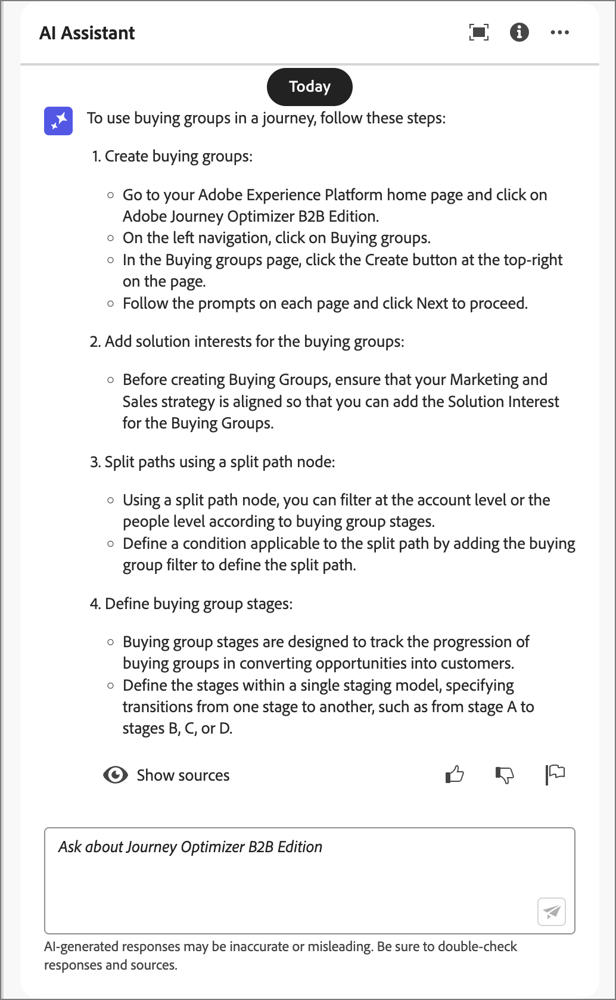
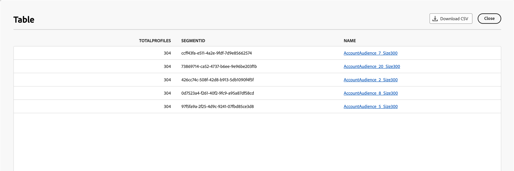
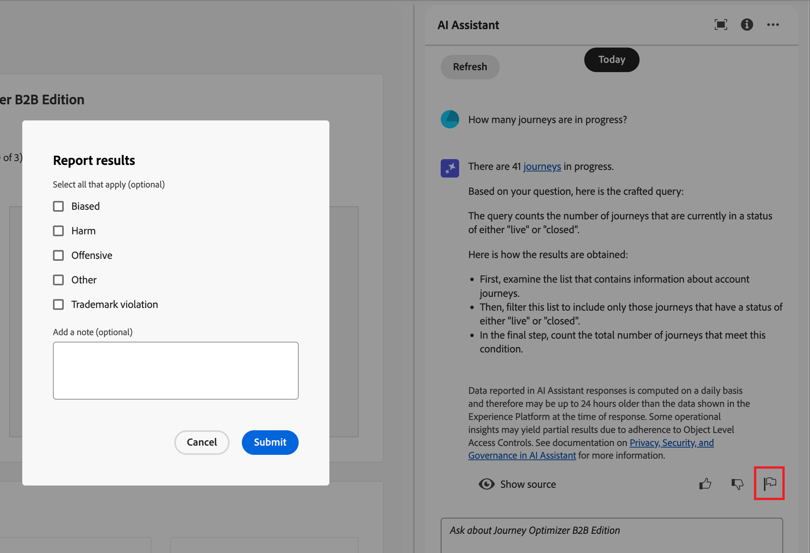

# Uso del asistente de IA en Journey Optimizer B2B edition

En Journey Optimizer B2B edition, el asistente de IA es una función de la interfaz de usuario que puede utilizar para comprender los conceptos del producto, navegar rápidamente por las funciones del producto y obtener información operativa para su entorno. También está disponible en varios productos de Adobe Experience Cloud.

>[!IMPORTANT]
>
>Se requiere un acuerdo para las Directrices del usuario de IA generativas de Adobe Experience Cloud antes de poder utilizar el asistente de IA. Para obtener más información sobre este contrato y las directrices de uso, consulte [Directrices del usuario de IA generativa de Adobe Experience Cloud](https://www.adobe.com/legal/licenses-terms/adobe-dx-gen-ai-user-guidelines.html).

Para acceder al asistente de IA, haga clic en el icono del encabezado. El asistente de IA se abre en un panel a la derecha.

{width="420"}

Aparecerá la interfaz del Asistente de IA, que le proporcionará inmediatamente información para empezar. Puede usar las opciones que se proporcionan en _Ideas para empezar_ a responder preguntas y comandos como los siguientes:

* ¿Qué recorridos se publicaron?
* ¿Qué intereses de solución se han creado?
* Cuéntame las ventajas clave de Journey Optimizer B2B edition.

En Adobe Journey Optimizer B2B edition, el asistente de IA es compatible con los siguientes casos de uso:

## Formular preguntas sobre conocimientos del producto

Las preguntas sobre conocimientos del producto se refieren a conceptos e información de procedimientos de Journey Optimizer B2B edition. Algunos ejemplos de preguntas sobre el conocimiento del producto son:

* ¿Cómo configuro las cuentas de proveedor de SMS?
* ¿Cómo se envía un correo electrónico en un recorrido?
* ¿Cómo puedo personalizar el contenido de mi correo electrónico?

Para hacer una pregunta sobre un producto, indíquela en el campo situado en la parte inferior del panel y pulse Intro. Por ejemplo, cuando necesita aprender a utilizar un grupo de compra en un recorrido. En este caso, ingresa _¿Cómo uso un grupo de compra en un recorrido?_ Después de enviar la pregunta, el Asistente de inteligencia artificial consultará su base de conocimiento y compilará una respuesta en unos segundos.

{width="420"}

+++Ver una respuesta de ejemplo

{width="420"}

+++

## Formular preguntas sobre perspectivas operativas

Las preguntas de Operational Insights se refieren a los objetos de recorrido de la zona protegida de su organización. Puede hacer preguntas sobre artefactos operativos, como la audiencia de la cuenta, el recorrido de la cuenta, el interés de la solución y la plantilla del grupo de compra. Algunos ejemplos de preguntas o mensajes de información operativa son los siguientes:

* ¿Cuántos recorridos en directo tengo en Adobe Journey Optimizer B2B edition?
* Dame una lista de todos los recorridos programados
* ¿Cuántos recorridos se han creado en los últimos 7 días?

Debe estar en una zona protegida activa para que AI Assistant proporcione una respuesta suficiente a una pregunta sobre sus perspectivas operativas.

>[!NOTE]
>
>Los únicos objetos de Adobe Journey Optimizer B2B edition compatibles con las preguntas de perspectivas operativas del Asistente de IA se enumeran en la [tabla de dominio de perspectivas operativas](./ai-assistant-overview.md#operational-insights). Solo puede acceder a los datos de la zona protegida en la que se encuentra actualmente.

Para hacer una pregunta de información operativa, indíquela en el campo situado en la parte inferior del panel y pulse Intro. Por ejemplo, cuando desea conocer las audiencias de su zona protegida. En este caso, ingresa _¿Cuántas audiencias hay?_.  El asistente de IA proporciona un recuento de las audiencias de la zona protegida y una explicación de cómo calculó la respuesta. En la siguiente respuesta de ejemplo, el Asistente de IA proporciona un vínculo para acceder a las audiencias en la interfaz de usuario y describe los pasos que se han realizado para identificar el número de audiencias.

{width="420"}

Puede seguir su consulta inicial solicitando una lista de artefactos, como _Enumerar los primeros 5 por tamaño_. El Asistente de IA devuelve una tabla con los cinco elementos principales de la consulta y sus ID correspondientes. Haga clic en el icono _Descargar_ (  ) para descargar la tabla como archivo CSV.

{width="420"}

Para ver toda la tabla en el Asistente de IA, haga clic en el icono _Maximizar_ (  ). En la vista de tabla expandida, haga clic en **[!UICONTROL Descargar CSV]** para guardar la información como archivo CSV.

{width="600" zoomable="yes"}

## Verificar respuestas

El Asistente de IA incluye herramientas que puede utilizar para verificar y validar respuestas.

### Fuentes de conocimiento del producto

Después de recibir una respuesta a una pregunta sobre un producto, selecciona **[!UICONTROL Mostrar origen]** para ver las citas de la fuente de conocimiento del producto que se usaron para generar la respuesta del Asistente de IA.

El asistente de IA proporciona vínculos a la documentación que corrobora la respuesta inicial. También agrega notas al pie de la respuesta para indicar las partes específicas de la respuesta que hacen referencia a las fuentes de documentación vinculadas.

{width="420"}

### Fuentes de datos operativos

Después de recibir una respuesta a una pregunta de información operativa, haga clic en **[!UICONTROL Mostrar origen]** y, a continuación, seleccione **[!UICONTROL Ver consulta de origen]**.

Puede verificar cada respuesta relacionada con las preguntas de información operativa mediante una consulta SQL que proporciona el Asistente de inteligencia artificial. Cuando se consulta con una pregunta de información operativa, el Asistente de IA proporciona una consulta SQL que puede utilizar para verificar el proceso que llevó calcular la respuesta. Esta consulta de origen es solo para fines de verificación y no se admite en el servicio de consultas.

{width="550" zoomable="yes"}

## Proporcionar comentarios

Use los iconos _Pulgar arriba_ () o _Pulgar abajo_ ( ) para evaluar la utilidad y la calidad de la respuesta. Complete el breve formulario de la encuesta según su experiencia y haga clic en **[!UICONTROL Enviar]**. La información que proporciona se utiliza para realizar mejoras en AI Assistant.

Si nota algún problema en la respuesta, haga clic en el icono _Indicador_ (  ). Use el formulario para describir el problema y haga clic en **[!UICONTROL Enviar]** para informar el problema.

{width="420"}

+++Ver formularios

>[!BEGINTABS]

>[!TAB Pulgar arriba]

{width="600" zoomable="yes"}

>[!TAB Pulgar abajo]

{width="600" zoomable="yes"}

>[!TAB Indicador]

{width="600" zoomable="yes"}

>[!ENDTABS]

+++
