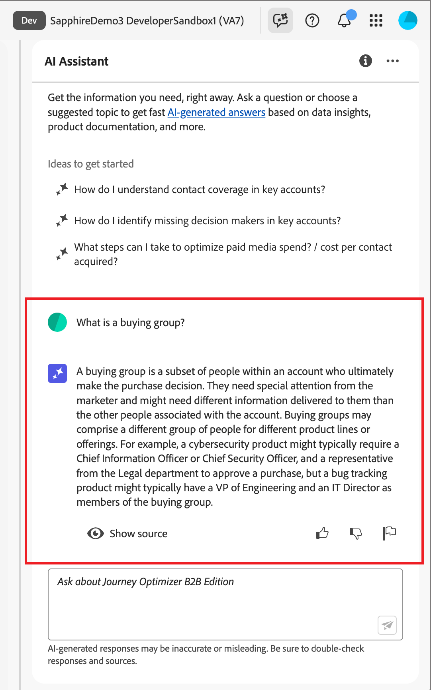

# Usar AI Assistant en Journey Optimizer B2B Edition

En Journey Optimizer B2B Edition, AI Assistant es una característica de interfaz usuario que puede usar para comprender conceptos de productos, navegar rápidamente y aprender sobre las características de Journey Optimizer B2B Edition y obtener información operativa para su entorno específica. También está disponible en varios productos en todo Adobe Experience Cloud.

>[!IMPORTANT]
>
>Se requiere un acuerdo para las Directrices del usuario de IA generativa de Adobe Experience Cloud antes de poder usar el Asistente de IA. Para obtener más información sobre este acuerdo y las pautas de uso, consulte las Adobe Experience Cloud Pautas](https://www.adobe.com/legal/licenses-terms/adobe-dx-gen-ai-user-guidelines.html) del [usuario de IA generativa.

Para acceder a AI Assistant, haga clic en el icono del encabezado. AI Assistant se abre en un panel a la derecha.

{width="420" zoomable="yes"}

Aparece la interfaz del Asistente de IA, que le proporciona inmediatamente información para comenzar. Utilice las opciones proporcionadas en _Ideas para empezar_ a responder preguntas y comandos, como:

* ¿Cuáles de mis cuenta viajes fueron publicados?
* ¿Qué intereses de solución se crearon?
* Cuénteme cuáles son las principales ventajas de Journey Optimizer B2B Edition.

En Adobe Systems Journey Optimizer B2B Edition, AI Assistant admite los siguientes casos de uso:

## Conocimiento del producto

Las preguntas sobre el conocimiento del producto son sobre conceptos de Journey Optimizer B2B Edition relacionados con aspectos de Adobe Systems Journey Optimizer. Algunos ejemplos de preguntas sobre conocimiento del producto son:

* ¿Cómo configuro las cuentas de proveedor de SMS?
* ¿Cómo envío un correo electrónico en un viaje cuenta?
* ¿Cómo puedo personalizar mi correo electrónico contenido?

Para hacer una pregunta sobre un producto, introdúzcala en el campo situado en la parte inferior del panel y pulse intro.

{width="420" zoomable="yes"}

Puede verificar las respuestas devueltas por AI Assistant revisando las citas disponibles con cada respuesta de conocimiento del producto.

Para vista citas y validar la respuesta de AI Assistant, seleccione **[!UICONTROL Mostrar fuentes]**.

{width="420" zoomable="yes"}

AI Assistant actualiza la interfaz y le proporciona enlaces a documentación que corroboran la respuesta inicial. Además, cuando las citas están habilitadas, AI Assistant actualiza la respuesta para incluir notas al pie para indicar las partes específicas de la respuesta que hacen referencia a la documentación proporcionada.

Utilice el pulgar hacia arriba o hacia abajo para calificar la calidad de la respuesta.

## Información operativa

Las preguntas de conocimiento operativas se refieren a los objetos de recorrido en el entorno limitado de su organización. Algunos ejemplos de preguntas o mensajes de conocimiento operativos incluyen:

* ¿Cuántos viajes en vivo tengo en Adobe Systems Journey Optimizer B2B Edition?
* Dame una lista de todos los viajes programados
* ¿Cuántos viajes se han creado en los últimos 7 días?

Debe estar en una caja de arena activa para AI Assistant para proporcionar una respuesta suficiente a una pregunta sobre sus conocimientos operativos.

>[!NOTE]
>
>Los únicos objetos de Adobe Systems Journey Optimizer B2B Edition compatibles con las preguntas de información operativa de AI Assistant se enumeran en la tabla](./ai-assistant-overview.md#operational-insights) de dominio de [perspectivas operativas. Solo puede acceder a los datos del entorno de pruebas en el que se encuentre actualmente.

<!-- Select to view an example of an operational insights question.

In the following example, AI Assistant receives the following query: _Show me dataflows that were created using the Amazon S3 source._

screen

AI Assistant responds with a table list of your dataflows and their corresponding IDs. Click the _Download_ icon ( Download icon ) to download the table as a CSV file. To view the entire table, click the _Expand_ icon ( Expand icon ).

screen

An expanded view of the table appears, providing you with a more comprehensive list of dataflows based on the parameters of your query.

screen

When prompted with an operational insights question, AI Assistant provides an explanation of how it computed the answer. In the following example, AI Assistant outlines the steps it took in order to identify the dataflows that were created using the Amazon S3 source.

screen

You can also provide filters and modifications to your questions, and you can instruct AI Assistant to render its findings based on the filters that you include. For example, you can ask AI Assistant to show you a trend of the count of segment definitions in the order of their created date, remove segment definitions with zero total profiles, and use month names instead of integers when displaying the data.

### Verify operational insights responses

You can verify each response related to operational insights questions using an SQL query that AI Assistant provides.

Select to view example of verifying operational insights responses

After receiving an answer for an operational insights question, click **[!UICONTROL Show sources]** and then select **[!UICONTROL View source query]**.

screen

When queried with an operational insights question, AI Assistant provides an SQL query that you can use to verify the process that it took to compute its answer. This source query is for verification purposes only and is not supported on Query Service.

screen  

 -->
