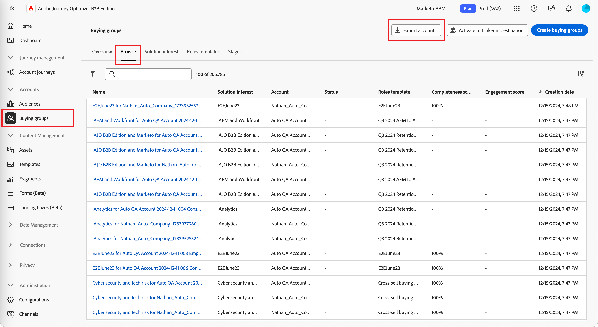

# Exportación de cuentas

Use la función _Exportar cuentas_ para exportar todas las cuentas o un conjunto de cuentas según el filtro que defina. El proceso de exportación genera un archivo CSV y envía la dirección URL del archivo almacenado dentro de una notificación de impulsos. Puede utilizar esta función para mover cuentas a plataformas de terceros cuando sea necesario.

1. En Journey Optimizer B2B Edition, vaya a **[!UICONTROL Cuentas]** > **[!UICONTROL Grupos de compra]** en el panel de navegación izquierdo.

1. Seleccione la pestaña **[!UICONTROL Examinar]**.

1. Haga clic en **[!UICONTROL Exportar cuentas]** en la parte superior derecha.

   {width="800" zoomable="yes"}

1. En el cuadro de diálogo, defina los parámetros de los públicos de cuenta que se exportarán.

   {width="400"}

   Para la **[!UICONTROL puntuación de participación]**, el operador `Between` es inclusivo, al igual que los intervalos de porcentaje. Por ejemplo, 5.1 y 5 son ambos _entre_ 5 y 6.

   Los parámetros de filtrado vacíos se tratan como `Is Any`.

1. Haga clic en **[!UICONTROL Exportar cuentas]** para generar el archivo CSV con los filtros especificados.

1. Cuando reciba la notificación de que la exportación ha finalizado, haga clic en el vínculo de notificación para acceder al archivo CSV.

   {width="425"}

   >[!NOTE]
   >
   >Si tiene una suscripción de notificación por correo electrónico configurada en las preferencias de cuenta de usuario de Adobe, puede ser una notificación por correo electrónico.

   La página de la aplicación redirige a la pestaña de exploración _Grupo de compras_ y el cuadro de diálogo de guardar archivo del sistema le pedirá que guarde el archivo en su sistema. Si necesita compartir los datos, puede utilizar el sistema compartir archivos de su equipo.
