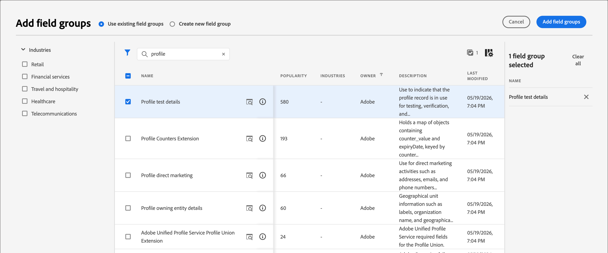
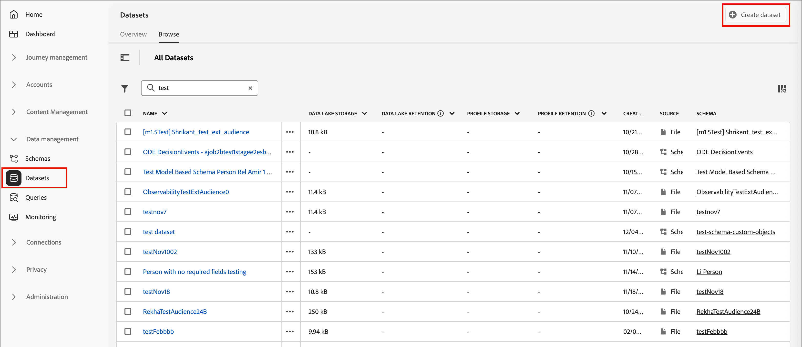
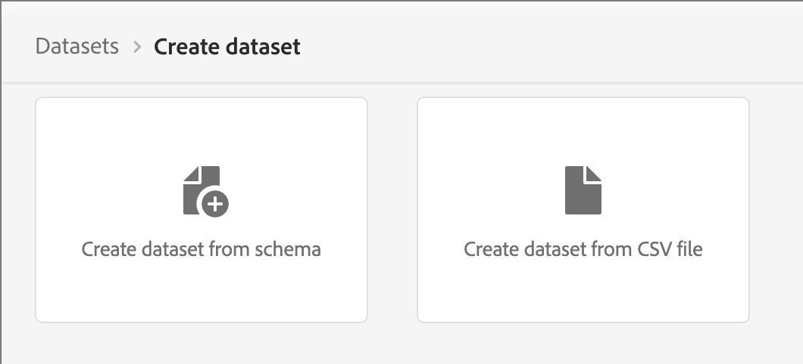

# Perfiles de prueba {#test-profiles}

Se requieren perfiles de prueba para [previsualizar y probar el contenido de la página de aterrizaje](../content/landing-pages-create-publish.md#test-landing-page) en Journey Optimizer B2B edition. Puede definir un conjunto de perfiles de prueba creando un esquema, el conjunto de datos y cargando un archivo CSV.

<!--
>[!NOTE]
>
>[!DNL Journey Optimizer B2B Edition] allows testing different variants of your content by previewing it and sending proofs using sample input data uploaded from a CSV or JSON file, or added manually. 
-->

Crear un perfil de prueba es similar a crear perfiles normales en [!DNL Adobe Experience Platform]. Para obtener más información, consulte la [Documentación del perfil del cliente en tiempo real](https://experienceleague.adobe.com/docs/experience-platform/profile/home.html?lang=es){target="_blank"}.


## Creación de un esquema {#create-schema}

Para crear perfiles, primero debe crear un esquema en [!DNL Journey Optimizer B2B Edition].

1. Expanda **[!UICONTROL Administración de datos]** en el panel de navegación izquierdo, seleccione **[!UICONTROL Esquemas]** y haga clic en **[!UICONTROL Crear esquema]** en la parte superior derecha.

   {width="800" zoomable="yes"}

1. Seleccione **[!UICONTROL Standard]** como opción de creación de esquema.

1. Seleccione un tipo de esquema, por ejemplo **[!UICONTROL Manual]**, y haga clic en **[!UICONTROL Seleccionar]**.

   {width="500"}

1. Seleccione un tipo de esquema, por ejemplo **[!UICONTROL Perfil individual]**, y haga clic en **[!UICONTROL Siguiente]**.

   {width="700" zoomable="yes"}

1. Escriba un nombre (obligatorio) y una descripción (opcional) para el esquema y haga clic en **[!UICONTROL Finalizar]**.

   {width="700" zoomable="yes"}

   Se muestra la estructura del esquema, con el panel _[!UICONTROL Composition]_ a la izquierda.

1. En la sección **[!UICONTROL Grupos de campos]**, haga clic en **[!UICONTROL Agregar]** y seleccione los grupos de campos correspondientes.

   Use la herramienta de búsqueda para buscar y seleccionar el grupo de campos **[!UICONTROL Detalles de la prueba del perfil]**.

   {width="700" zoomable="yes"}

   Una vez finalizado, haga clic en **[!UICONTROL Agregar grupos de campos]** y la lista de grupos de campos se mostrará en la pantalla de información general del esquema.

   Repita este paso para agregar grupos de campos adicionales que desee usar para perfiles de prueba, como **[!UICONTROL Detalles de contacto de persona]** y **[!UICONTROL Detalles de contacto de trabajo]**.

1. En la lista de campos, haga clic en el campo que desee definir como identidad principal.

1. En el panel derecho de _[!UICONTROL Propiedades del campo]_, compruebe las opciones **[!UICONTROL Identidad]** e **[!UICONTROL Identidad principal]** y seleccione un área de nombres.

   Si desea que la identidad principal sea una dirección de correo electrónico, elija el área de nombres **[!UICONTROL Correo electrónico]**.

   {width="700" zoomable="yes"}

   Haga clic en **[!UICONTROL Aplicar]**.

1. Seleccione el esquema y habilite la opción **[!UICONTROL Perfil]** en el panel **[!UICONTROL Propiedades del esquema]**.

   {width="700" zoomable="yes"}

1. Haga clic en **[!UICONTROL Guardar]**.

Para obtener más información sobre la creación de esquemas, consulte la [documentación de XDM](https://experienceleague.adobe.com/docs/experience-platform/xdm/ui/resources/schemas.html?lang=es#prerequisites){target="_blank"}.

>[!IMPORTANT]
>
>Al crear o reemplazar un conjunto de datos para la ingesta de perfiles de prueba, asegúrese de que el esquema tenga el descriptor de identidad correcto aplicado al campo de identidad principal (`/personID`) para el área de nombres deseada. Si falta el descriptor de identidad o está configurado incorrectamente, es posible que los perfiles ingeridos en este conjunto de datos no se marquen como perfiles de prueba (`testProfile = true`), aunque el proceso de ingesta se complete correctamente.
>
>Si los perfiles de prueba no se marcan correctamente después de la ingesta:
>
>1. Revise el esquema asociado al conjunto de datos.
>1. Confirme que el campo de identidad principal tiene el descriptor de identidad correcto para el área de nombres.
>1. Si falta el descriptor, actualice el esquema para agregar el descriptor de identidad y vuelva a introducir los datos.

## Crear un conjunto de datos {#create-dataset}

Después de crear el esquema, cree el conjunto de datos que se utiliza para importar los perfiles. Para obtener más información sobre la creación de conjuntos de datos, consulte la [documentación del servicio de catálogo](https://experienceleague.adobe.com/docs/experience-platform/catalog/datasets/user-guide.html?lang=es#getting-started){target="_blank"}.

1. En _[!UICONTROL Administración de datos]_ en la navegación izquierda, seleccione **[!UICONTROL Conjuntos de datos]**.

1. En la parte superior derecha, haga clic en **[!UICONTROL Crear conjunto de datos]**.

   {width="800" zoomable="yes"}

1. Elija **[!UICONTROL Crear conjunto de datos a partir del esquema]**.

   {width="500"}

1. Seleccione el esquema creado anteriormente y haga clic en **[!UICONTROL Siguiente]**.

1. Elija un nombre y haga clic en **[!UICONTROL Finalizar]**.

   {width="700" zoomable="yes"}

1. En el panel derecho, habilite la opción **[!UICONTROL Perfil]**.

## Creación de perfiles de prueba con un archivo CSV {#create-test-profiles-csv}

En [!DNL Adobe Experience Platform], puede crear perfiles cargando un archivo CSV que contiene los diferentes campos de perfil en el conjunto de datos. Este es el método más sencillo.

1. Cree un archivo CSV simple con un software de hoja de cálculo.

1. Agregue una columna para cada campo obligatorio.

   Asegúrese de agregar el campo de identidad principal (`personID`, por ejemplo) y el campo `testProfile` establecido en `true`.

1. Añada una línea por perfil y los valores de cada campo.

   {width="600" zoomable="yes"}

1. Guarde la hoja de cálculo como archivo csv, asegurándose de que se utilizan comas como separadores.

1. En [!DNL Adobe Experience Platform], vaya a **[!UICONTROL Flujos de trabajo]**.

1. Elija **[!UICONTROL Asignar CSV al esquema XDM]** y haga clic en **[!UICONTROL Iniciar]**.

   {width="800" zoomable="yes"}

1. Seleccione el conjunto de datos que se usará para la importación y haga clic en **[!UICONTROL Siguiente]**.

   {width="700" zoomable="yes"}

1. Haga clic en **[!UICONTROL Elegir archivos]** y seleccione el archivo CSV, o bien arrastre y suelte el archivo desde el sistema.

   Una vez completada la carga del archivo, haga clic en **[!UICONTROL Siguiente]**.

   {width="700" zoomable="yes"}

1. Asigne los campos csv de origen a los campos de esquema y haga clic en **[!UICONTROL Finalizar]**.

   {width="700" zoomable="yes"}

   Comienza la importación de datos. El estado pasa de _Procesando_ a _Correcto_.

1. En la parte superior derecha, haga clic en **[!UICONTROL Vista previa del conjunto de datos]** y compruebe que los perfiles de prueba agregados al conjunto de datos son correctos.

   {width="700" zoomable="yes"}

   Los perfiles de prueba se pueden usar para [probar contenido de página de aterrizaje](../content/landing-pages-create-publish.md#test-landing-page).

>[!NOTE]
>
>Para obtener más información sobre la importación de datos CSV, consulte la [documentación de ingesta de datos](https://experienceleague.adobe.com/docs/experience-platform/ingestion/tutorials/map-a-csv-file.html?lang=es#tutorials){target="_blank"}.

<!--
## Create test profiles using API calls {#create-test-profiles-api}

You can also create test profiles via API calls. Learn more in [[!DNL Adobe Experience Platform] documentation](https://experienceleague.adobe.com/docs/experience-platform/profile/home.html?lang=es){target="_blank"}.

You must use a Profile schema that contains the **[!UICONTROL Profile test details]** field group. The `testProfile` flag is part of this field group.
When creating a profile, make sure you pass the value: `testProfile = true`.

You can also update an existing profile to change its `testProfile` flag to `true`.

Here is an example of an API call to create a test profile:

```bash
curl -X POST \
'https://dcs.adobedc.net/collection/xxxxxxxxxxxxxx' \
-H 'Cache-Control: no-cache' \
-H 'Content-Type: application/json' \
-H 'Postman-Token: xxxxx' \
-H 'cache-control: no-cache' \
-H 'x-api-key: xxxxx' \
-H 'x-gw-ims-org-id: xxxxx' \
-d '{
"header": {
"msgType": "xdmEntityCreate",
"msgId": "xxxxx",
"msgVersion": "xxxxx",
"xactionid":"xxxxx",
"datasetId": "xxxxx",
"imsOrgId": "xxxxx",
"source": {
"name": "Postman"
},
"schemaRef": {
"id": "https://example.adobe.com/mobile/schemas/xxxxx",
"contentType": "application/vnd.adobe.xed-full+json;version=1"
}
},
"body": {
"xdmMeta": {
"schemaRef": {
"contentType": "application/vnd.adobe.xed-full+json;version=1"
}
},
"xdmEntity": {
"_id": "xxxxx",
"_mobile":{
"ECID": "xxxxx"
},
"testProfile":true
}
}
}'
```
-->
