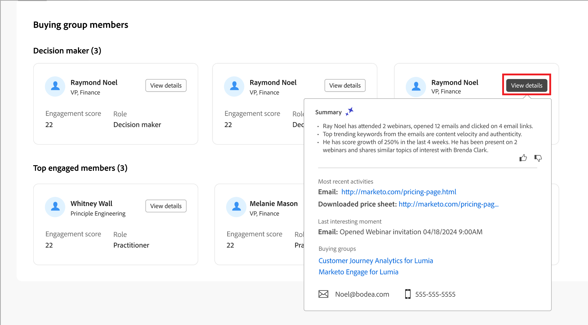

# Detalles del grupo de compras

Al hacer clic en el nombre de un grupo de compra desde cualquier lugar de Journey Optimizer B2B edition, se muestran los detalles del grupo de compra. Esta descripción general proporciona información útil sobre el grupo comprador, incluidos resúmenes de IA generativos. También hay [acciones](#buying-group-actions) que puedes ejecutar para los contactos asociados con la cuenta.

{width="800" zoomable="yes"}

Use la ficha **[!UICONTROL Información general]** para revisar la información sobre la cuenta y la ficha **[!UICONTROL Miembros]** para obtener acceso a una lista de los miembros del grupo comprador.

## Pestaña Información general

La pestaña Información general consta de tres secciones principales:

### Resumen del grupo de compra

{zoomable="yes"}

La sección de resumen del grupo de compra incluye la siguiente información sobre el grupo de compra:

* Nombre del grupo de compras
* Nombre de cuenta (haga clic en el nombre para abrir [detalles de la cuenta](../accounts/account-details.md))
* Número de miembros del grupo comprador
* Puntuación de participación
* Puntuación de integridad
* Fase de grupo de compra actual
* Plantilla de rol (haga clic en el nombre para abrir la [plantilla de roles](buying-groups-role-templates.md#access-and-browse-role-templates))
* Fecha de la última modificación/actualización
* Resumen de IA generativa del grupo comprador

### Resumen de cuenta

{zoomable="yes"}

La sección de descripción general de la cuenta incluye la siguiente información de la cuenta:

* Nombre de la cuenta (haga clic en el nombre para abrir los detalles de la cuenta)
* Número de personas en la cuenta
* Industria
* Abrir oportunidades
* Últimos tres recorridos de cuenta en los que la cuenta está actualmente en uso (haga clic en el nombre para abrir los detalles del recorrido)
* Resumen de IA generativa de la cuenta

### Datos de intención

En Journey Optimizer B2B edition, el modelo de detección de intención predice una solución o producto de interés con una confianza lo suficientemente alta según la actividad de los miembros del grupo de compra. La intención de comprar miembros del grupo puede interpretarse como la probabilidad de tener interés en un producto.

{{intent-data-note}}

{width="700" zoomable="yes"}

* Niveles de intención
* Tipos de señal de intención: palabras clave, producto y solución

### Abonados del grupo de compras

{width="800" zoomable="yes"}

La sección _[!UICONTROL Comprar miembros del grupo]_ muestra dos filas que resaltan los miembros del grupo compradores:

* **[!UICONTROL Responsable de la toma de decisiones]**: los tres responsables principales según la puntuación de participación de la persona
* **[!UICONTROL Miembros con mayor participación]** - Otros miembros con mayor participación según la puntuación de participación de la persona

Cada tarjeta de miembro incluye los siguientes detalles:

* Nombre
* Título
* Función
* Puntuación de participación del posible cliente

Haga clic en **[!UICONTROL Ver detalles]** para obtener acceso a la siguiente información de miembro:

* Resumen de IA generativa
* Último momento interesante
* Actividades más recientes (dos)
* Otros grupos de compra de los que es miembro el posible cliente (limitado a tres grupos de compra según el último añadido).
* Dirección de correo electrónico
* Número de teléfono

{width="600" zoomable="yes"}

## Pestaña Miembros

Seleccione la ficha **[!UICONTROL Miembros]** para ver una lista de todos los miembros del grupo compradores. Cada lista de miembros incluye el nombre, la función, el cargo, la dirección de correo electrónico, el número de teléfono y el origen.

{width="700" zoomable="yes"}

Hay varias acciones que puede ejecutar desde la ficha _Miembros_:

### Asignar un nuevo miembro

Una cuenta puede tener uno o más grupos de compra asociados a ella, y los miembros del grupo de compra suelen ser un subconjunto de contactos de la cuenta. Puede añadir manualmente cualquier contacto de la cuenta asociada al grupo de compras.

1. Haga clic en **[!UICONTROL Asignar nuevo miembro]** en la parte superior derecha.

1. En el cuadro de diálogo _[!UICONTROL Asignar miembro]_, seleccione los posibles clientes de la cuenta que desee agregar al grupo comprador y haga clic en **[!UICONTROL Siguiente]**.

   {width="700" zoomable="yes"}

1. En el cuadro de diálogo _[!UICONTROL Editar nuevo rol de miembro]_, seleccione el rol que desea asignar a cada uno de los nuevos miembros.

   {width="700" zoomable="yes"}

1. Haga clic en **[!UICONTROL Guardar]**.

### Quitar un miembro

Puede eliminar uno o más miembros seleccionados (hasta 50 a la vez) del grupo de compra.

1. Seleccione las casillas de verificación de los miembros que desee quitar.

1. En la barra de selección de la parte inferior, haga clic en **[!UICONTROL Quitar miembros]**.

   {width="700" zoomable="yes"}

1. En el cuadro de diálogo de confirmación, haga clic en **[!UICONTROL Quitar]**.

### Editar función

Puede cambiar la función de uno o más miembros seleccionados (hasta 50 a la vez) del grupo comprador.

1. Seleccione las casillas de verificación de los miembros cuyos roles desee cambiar.

1. En la barra de selección de la parte inferior, haga clic en **[!UICONTROL Editar roles]**.

   {width="700" zoomable="yes"}

1. En el cuadro de diálogo _[!UICONTROL Editar rol de miembro]_, seleccione el rol que desea asignar a cada uno de los miembros.

   {width="700" zoomable="yes"}

1. Haga clic en **[!UICONTROL Guardar]**.

### Enviar correo electrónico

Puede enviar un correo electrónico aprobado por el experto en marketing a uno o más miembros seleccionados (hasta 50 a la vez) de un grupo de compra. La lista de correos electrónicos disponibles se limita a los correos electrónicos aprobados de la instancia de Marketo Engage conectada.

1. Seleccione las casillas de verificación de los miembros que desee que reciban el correo electrónico.

1. En la parte superior derecha o en la barra de selección de la parte inferior, haz clic en **[!UICONTROL Enviar correo electrónico]**.

   {width="700" zoomable="yes"}

1. En el cuadro de diálogo _[!UICONTROL Enviar correo electrónico]_, seleccione el espacio de trabajo de Marketo Engage y, a continuación, active la casilla de verificación del correo electrónico que desee enviar.

   {width="700" zoomable="yes"}

1. Haga clic en **[!UICONTROL Enviar]**.
