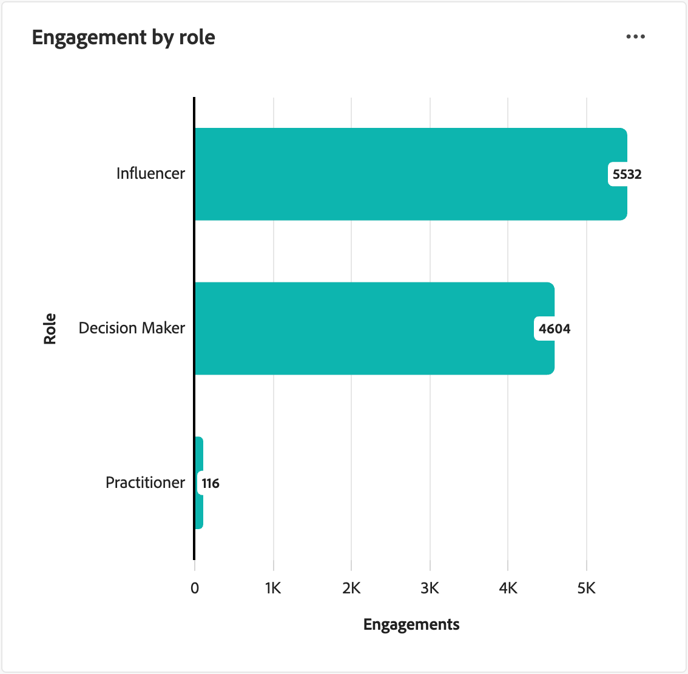
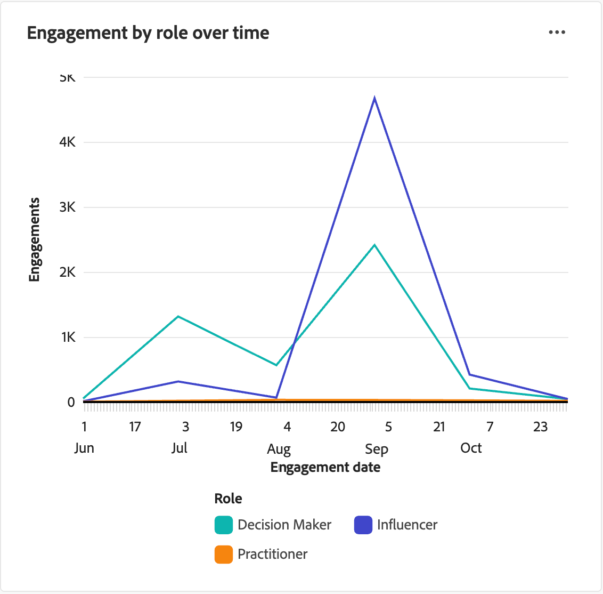

# Panel de perspectivas de rol

El tablero Perspectivas de funciones proporciona visibilidad sobre cómo las funciones de grupo de compra evolucionan y se relacionan con el paso del tiempo. Ayuda a los especialistas en marketing a comprender las tendencias de adquisición de funciones, los patrones de participación y cómo las campañas recientes impulsan la participación en diferentes funciones dentro de los grupos de compra.

Para acceder a este panel, expande **[!UICONTROL Cuentas]** en el panel de navegación izquierdo y, a continuación, selecciona **[!UICONTROL Grupos compradores]**. Seleccione la ficha **[!UICONTROL Información sobre funciones]**.

{width="800" zoomable="yes"}

El tablero incluye tres vistas:

| Ver | Descripción |
| ---- | ----------- |
| [!UICONTROL Adquisición de rol con el tiempo] | Visualiza el número de miembros añadidos a los grupos de compra a lo largo del tiempo, segmentados por función y agrupados por mes. |
| [!UICONTROL Participación por rol] | Muestra los recuentos totales de actividad de participación (como aperturas de correo electrónico, clics y envíos de formularios) al comprar la función de grupo. |
| [!UICONTROL Participación por rol a lo largo del tiempo] | Registra las actividades de participación del grupo comprador a lo largo del tiempo, mostrando las tendencias mensuales de participación por función. |

## Filtrado de datos

Haga clic en el icono _Filtro_ (  ) en la parte superior izquierda para filtrar los datos mostrados mediante cualquiera de estos atributos:

* **[!UICONTROL Rol]**: filtra los datos por uno o más roles de grupo de compra seleccionados.
* **[!UICONTROL Interés en la solución]**: filtra los datos según uno o más intereses seleccionados de la solución para centrarse en líneas u ofertas de productos específicas.
* **[!UICONTROL Intervalo de fechas]**: restringe los datos a un período de tiempo específico (el valor predeterminado es el año anterior).

{width="400"}

Para cada atributo, seleccione los valores que desee usar para filtrar los datos y haga clic en **[!UICONTROL Aplicar]**.

## [!UICONTROL Adquisición de rol con el tiempo]

A medida que los equipos de marketing y ventas adquieren nuevas personas, impulsan la participación y enriquecen los datos, los nuevos miembros del grupo de compra se califican. Este informe muestra cómo estos esfuerzos se traducen en miembros del grupo de compra recién cualificados, desglosados por función. Cada vez que se añade una persona a un grupo comprador, el informe registra dicha adición en la función correspondiente.

{width="600" zoomable="yes"}

Cada línea del gráfico representa una función. Pase el ratón sobre un punto de trazado de la línea para ver los detalles, incluidos los siguientes:

* Fecha de adquisición
* Recuento de adquisiciones

Para ver información más detallada, haga clic en el icono de menú **...** en la parte superior derecha.

## [!UICONTROL Participación por rol]

Este informe resume el volumen total de actividad de participación comprando un rol de grupo durante el período de tiempo seleccionado. Utilice este informe para ver cómo participa cada función en la respuesta a sus iniciativas de marketing.

{width="500" zoomable="yes"}

Cada barra del gráfico representa una función. Pase el ratón sobre una barra para ver los detalles de los recuentos mostrados, incluidos los siguientes:

* Nombre de la función
* Recuento de participaciones

Para ver información más detallada, haga clic en el icono de menú **...** en la parte superior derecha.

## [!UICONTROL Participación por rol a lo largo del tiempo]

Este informe realiza un seguimiento de las actividades de compra de grupo a lo largo del tiempo, lo que le ayuda a comprender cómo las campañas recientes impulsan la participación en diferentes funciones. Utilice esta información para optimizar sus estrategias de marketing y segmentar funciones específicas de forma más eficaz.

{width="500" zoomable="yes"}

Cada línea del gráfico representa una función. Pase el ratón sobre un punto de trazado de la línea para ver los detalles, incluidos los siguientes:

* Fecha
* Recuento de participaciones

Para ver información más detallada, haga clic en el icono de menú **...** en la parte superior derecha.

## Interactúe con los datos

Para interactuar con los datos, use _Más_ (**...**) en la parte superior derecha de cada gráfico.

### [!UICONTROL Obtener detalles]

Para la _[!UICONTROL participación por función]_, elija **[!UICONTROL Obtener detalles]** para obtener un análisis detallado de las participaciones por función y por interés de solución.

Los filtros globales aplicados al panel se transfieren. Haga clic en el icono _Filtro_ (  ) en la parte superior izquierda para [cambiar los filtros de atributo](#filter-the-data) para la vista de obtención de detalles.

### [!UICONTROL Ver más]

Elija **[!UICONTROL Ver más]** para ver datos y perspectivas ampliados.

La ventana emergente que se muestra incluye un gráfico y una tabla que muestran el desglose de los datos.

<!-- To download the data, click **[!UICONTROL Download CSV]** at the top right of the data table. -->
