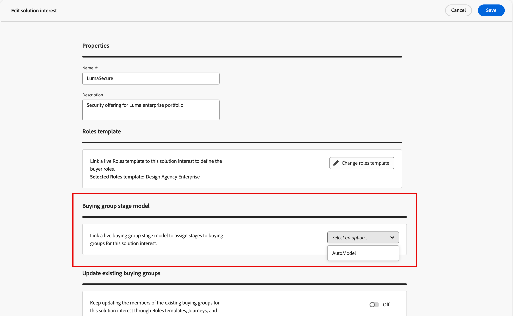
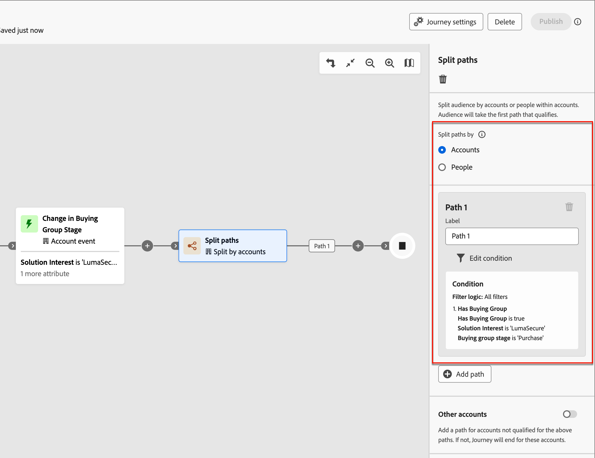
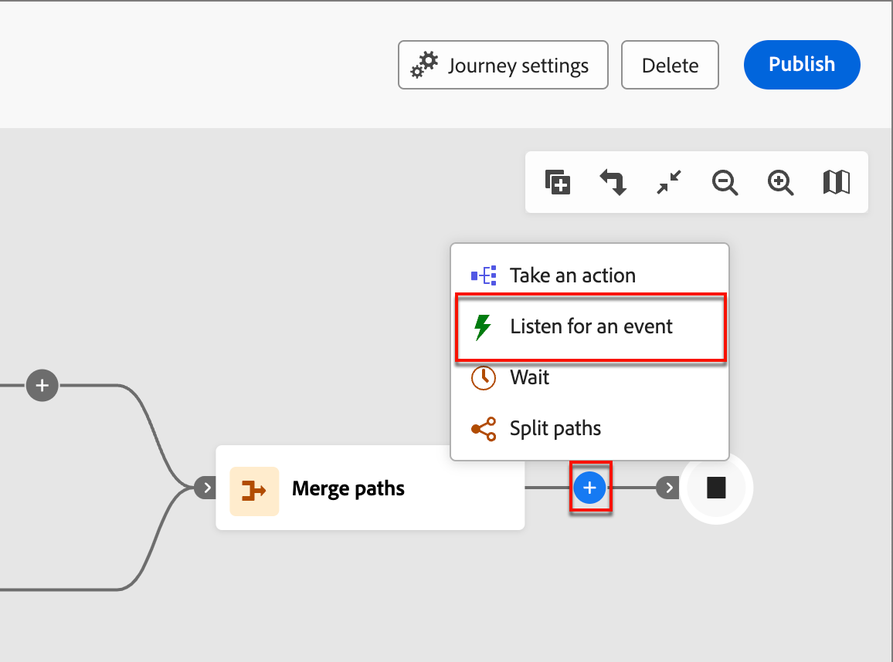

# Fases del grupo de compras

Las etapas de compra de grupos están diseñadas para seguir la progresión de los grupos de compra en la conversión de oportunidades en clientes. Utilice esta función para realizar un seguimiento de la progresión del grupo de compra e identificar las siguientes mejores acciones para comprar miembros del grupo.

Defina las fases dentro de un solo modelo de ensayo y defina varias fases y el flujo de transición entre ellas. Se designan una o más fases para la entrada en el ciclo vital. El modelo también permite la progresión no lineal, donde puede especificar transiciones de una etapa a otra, como de la etapa A a las etapas B, C o D. Se requiere que se designe una etapa como la etapa de éxito, como una compra o un contrato firmado. Es opcional que se designe otra etapa como de fracaso, como un contrato rechazado o la compra de una solución de la competencia a otro proveedor. Esto se logra a través de [paneles inteligentes](../dashboards/intelligent-dashboard.md) que muestran el progreso de los grupos de compras en términos de completar una oportunidad de venta o convertirla en un cliente.

{width="800" zoomable="yes"}

{width="30"} [Vea la descripción general del vídeo](#overview-video)

## Defina el modelo de fases del grupo de compra

Para crear y configurar un modelo de fases de un grupo de compra:

* Adición de las fases del ciclo vital
* Definición de los flujos de transición
* Designación de las fases de entrada y destino

Solo se admite un modelo, por lo que es importante trabajar en todos los equipos de marketing y ventas para planificar el modelo óptimo para su organización antes de crearlo y publicarlo en Journey Optimizer B2B edition.<!-- Initially, only one stage model can be created, but future releases will support multiple stage models, allowing users to select which model to use in a journey. -->

Cuando crea el modelo de fase de grupo de compra, se encuentra automáticamente en el estado _Borrador_ y no se puede eliminar ni cambiar el nombre. Permanece en este estado a medida que define las fases y configura el flujo de transición entre las fases. Cuando el modelo se encuentra en estado publicado (_Activo_), no se puede cambiar.

### Creación del modelo

1. En el panel de navegación de la izquierda, ve a **[!UICONTROL Cuentas]** > **[!UICONTROL Grupos compradores]**.

1. En la página Grupos de compra, selecciona la pestaña **[!UICONTROL Fases]**.

   {width="800" zoomable="yes"}

   Esta ficha _[!UICONTROL Fases]_ está en estado _vacío_ hasta que cree el modelo.

1. Haga clic en **[!UICONTROL Crear modelo]** en el centro de la página.

1. En el cuadro de diálogo, escriba **[!UICONTROL Nombre]** (obligatorio) y **[!UICONTROL Descripción]** (opcional) para el modelo.

   {width="700" zoomable="yes"}

   Si hace clic en _[!UICONTROL Cancelar]_ en este cuadro de diálogo, vuelve a la ficha _[!UICONTROL Fases]_ con el estado _vacío_.

1. Haga clic en **[!UICONTROL Crear]**.

### Definición de las fases

Una vez creado el modelo, se abrirá en el espacio de trabajo y se le solicitará que cree las fases para el modelo.

1. Haga clic en **[!UICONTROL Editar etapas]**.

   {width="700" zoomable="yes"}

1. Defina el primer paso introduciendo **[!UICONTROL Name]** (obligatorio) y **[!UICONTROL Description]** (opcional).

   {width="700" zoomable="yes"}

   Las fases no tienen que añadirse en un orden específico, pero sí determina cómo se enumeran las fases en la página de detalles del modelo. La fase de entrada y el flujo entre fases se designan al definir las reglas de transición.

1. Haga clic en **[!UICONTROL Agregar etapa]** y repita el paso 2 para definir otra etapa.

   Repita este paso hasta que tenga las fases necesarias para el modelo.

   {width="700" zoomable="yes"}

1. Cuando esté satisfecho con las fases definidas, haga clic en **[!UICONTROL Guardar]**.

   >[!IMPORTANT]
   >
   >**Una vez guardadas las fases del grupo de compra, no se pueden eliminar.** Sin embargo, puede cambiar el nombre y la descripción de cualquiera de las fases siempre que el modelo permanezca en el estado _Borrador_.

### Configuración del flujo de trabajo y las reglas de transición

Después de guardar las fases, vuelve al espacio de trabajo del modelo. La columna _[!UICONTROL Tránsito permitido a]_ está vacía, lo que indica que las reglas de transición para las fases del modelo aún no están definidas.

{width="700" zoomable="yes"}

Las reglas de transición determinan cómo un grupo comprador puede pasar de una fase a otra. Por ejemplo, puede pasar de una etapa de entrada a una etapa media y de una etapa media a varias otras etapas. Una fase de entrada es una fase inicial que un grupo comprador puede introducir desde un estado en blanco, y las fases de destino se clasifican como fases de éxito o de fracaso.

1. Haga clic en **[!UICONTROL Editar reglas de transición]** en la parte superior derecha.

   Esta acción abre el diálogo _[!UICONTROL Editar reglas de etapa]_, donde se define la lógica para el flujo.

   A medida que establece las opciones, hay algunas protecciones y mensajes integrados que le ayudan a evitar cometer errores lógicos en el flujo. Puede hacer clic en _[!UICONTROL Cancelar]_ para cerrar el cuadro de diálogo y volver a la página de fichas _[!UICONTROL Fases]_ sin ningún cambio.

1. En la sección _[!UICONTROL Seleccionar etapa]_, designe las etapas de inicio y finalización para el flujo:

   * **[!UICONTROL Fase de punto de entrada]** (obligatorio): designa una o más fases de entrada para la oportunidad de grupo de compra.

   * **[!UICONTROL Fase de éxito]** (obligatorio): designa la fase que indica que la oportunidad del grupo de compra es satisfactoria (destino).

   * **[!UICONTROL Fase del error]** (opcional): designa una o más fases que indican que la oportunidad del grupo de compra ha alcanzado un punto de error (destino).

   {width="700" zoomable="yes"}

1. Para cada fase que no sea de destino, defina una o más etapas que vengan después en el flujo (transición).

   Todas las etapas que no sean de destino deben tener seleccionado al menos un **[!UICONTROL Tránsito permitido a]** etapa. De lo contrario, la lógica del modelo no es válida y las cuentas pueden quedar _atascadas_ en ese momento sin que haya forma de progresar hacia el éxito o el fracaso.

   {width="700" zoomable="yes"}

   Si lo desea, puede especificar una transición desde una fase de error. Por ejemplo, podría designar una etapa denominada _Sin respuesta_ como una etapa de error. Pero también designe una etapa llamada _Resurgence_ como una posible transición para identificar casos en los que se reactiva una cuenta inactiva.

1. Haga clic en **[!UICONTROL Guardar]**.

   Con la página Volver a los detalles del modelo, las fases se enumeran en una tabla con las transiciones permitidas y las propiedades de destino y entrada.

| Columna | Descripción |
| ------ | ---------- |
| **[!UICONTROL Nombre del escenario]** | Nombre de la fase. Haga clic en el icono de información para ver la descripción de la fase. |
| **[!UICONTROL Tránsito permitido a]** | Enumera las fases válidas para una acción _mover a_ dentro del modelo. |
| **[!UICONTROL Fase de punto de entrada]** | Indica si la fase es válida como fase de punto de entrada ([!UICONTROL Sí] o [!UICONTROL No]). |
| **[!UICONTROL Destino]** | Indica si la etapa está designada como etapa de destino ([!UICONTROL Éxito] o [!UICONTROL Error]). |

{width="700" zoomable="yes"}

## Edición de un modelo de borrador

Mientras el modelo de etapas de grupo de compra permanezca en un estado _Borrador_, puede editar las etapas y las reglas de transición.

_Para ver el modelo de borrador :_

1. En el panel de navegación de la izquierda, ve a **[!UICONTROL Cuentas]** > **[!UICONTROL Grupos compradores]**.

1. En la página _Grupos de compra_, selecciona la pestaña **[!UICONTROL Fases]**.

1. Haga clic en el nombre del modelo para abrir sus detalles.

### Cambiar las fases del modelo

1. Haga clic en **[!UICONTROL Editar etapas]**.

   En el cuadro de diálogo _[!UICONTROL Editar etapas]_, puede agregar nuevas etapas o cambiar el nombre y la descripción de las etapas existentes.

   * Cambie **[!UICONTROL Name]** o **[!UICONTROL Description]** de cualquier etapa según sea necesario.

   * Desplácese hasta la parte inferior y haga clic en **[!UICONTROL Agregar etapa]** para definir una nueva etapa para el modelo si es necesario.

1. Cuando esté satisfecho con las fases definidas, haga clic en **[!UICONTROL Guardar]**.

   También puede hacer clic en _[!UICONTROL Cancelar]_ para cerrar el cuadro de diálogo y volver a la página de detalles del modelo sin ningún cambio.

### Editar las reglas de transición del modelo

1. Haga clic en **[!UICONTROL Editar reglas de transición]**.

1. En el diálogo _Editar reglas de etapa_, cambie las opciones de flujo según sea necesario.

   Consulte [Configurar el flujo de trabajo y las reglas de transición](#configure-the-workflow-and-transition-rules) para obtener más información sobre estas opciones y cómo afectan al flujo del modelo.

1. Cuando esté satisfecho con las reglas de transición definidas, haga clic en **[!UICONTROL Guardar]**.

   También puede hacer clic en _[!UICONTROL Cancelar]_ para cerrar el cuadro de diálogo y volver a la página de detalles del modelo sin ningún cambio.

## Publicación del modelo de fases de grupo de compra

Si no hay errores de validación, el modelo se puede publicar. Cuando se publica, cambia a un estado _Activo_ y se puede usar para avanzar en la compra de etapas de grupo en los recorridos de cuenta.

>[!IMPORTANT]
>
>**Una vez publicado el modelo, no se puede actualizar ni eliminar.** Asegúrese de que lo que tiene es correcto antes de publicar el modelo.

1. Revise detenidamente las fases y transiciones definidas.

   Si es necesario realizar revisiones, edite las fases del modelo.

1. Haga clic en **[!UICONTROL Publicar]**.

1. En el diálogo de confirmación, haga clic en **[!UICONTROL Publicar]**.

   Al volver a la página de detalles del modelo, el modelo se designa como _[!UICONTROL Activo]_. Haga clic en la flecha _Atrás_ en la parte superior izquierda para regresar a la página de fichas _[!UICONTROL Fases]_.

{width="700" zoomable="yes"}
<!-- list these later when the Published columns are working correctly

Columns - Name, Status, Created by, Created date, Last updated by, Last update, Published by, Published on.
Name - Name of the stage model, hyperlinked. Clicking on it will navigate to the stage inventory page. 
Info icon beside the name - display the description on click.
Status - Live, Draft. If a draft stage model is Published, then its status is updated to Live. -->

## Eliminar el modelo de etapas de grupo de compra

Puede eliminar el modelo de fases del grupo de compras cuando esté en estado borrador o publicado. Si se publica (activo), solo puede eliminarse cuando no esté asociado a un interés de solución.

1. En el panel de navegación de la izquierda, ve a **[!UICONTROL Cuentas]** > **[!UICONTROL Grupos compradores]**.

1. En la página _Grupos de compra_, selecciona la pestaña **[!UICONTROL Fases]**.

1. Haga clic en el icono de menú _Más_ (**...**) junto al nombre del modelo de fases y elija **[!UICONTROL Eliminar]**.

   {width="700"}

1. En el cuadro de diálogo, haga clic en **[!UICONTROL Eliminar]** para confirmar.

## Uso del modelo en recorridos de cuenta

Cuando el modelo de fases de compra esté en estado _Activo_ (publicado), agréguelo a los intereses de la solución donde desee utilizarlo para rastrear la progresión del grupo de compra. En los recorridos de cuenta, puede incluir acciones para transferir cuentas a una fase especificada y agregar transiciones de fase como eventos que determinan cómo se mueven las cuentas a través de la recorrido.

### Asociación de interés de solución

Para cada interés de solución existente donde desee asociar el modelo de fases de grupo de compra, abra los detalles del interés de solución y añada el modelo. También puede agregar el modelo a las propiedades cuando [cree un interés de solución](./solution-interests.md#create-a-solution-interest).

1. Seleccione la ficha _[!UICONTROL Interés de la solución]_.

1. Abra el interés de la solución mediante uno de los siguientes métodos para abrir las propiedades del interés de la solución que desee editar:

   * Haga clic en el nombre de interés de la solución.
   * Haga clic en los puntos suspensivos (**...**) junto a él y elija **[!UICONTROL Editar]**.

   {width="500" zoomable="no"}

1. Seleccione el **[!UICONTROL modelo de fase de grupo de compra]** para usar la progresión de fase de grupo de compra (opcional).

   {width="700" zoomable="yes"}

1. Si es necesario, cambia la configuración **[!UICONTROL Actualizar grupos de compras existentes]**.

   Cuando esta opción está habilitada, todos los grupos de compra existentes vinculados con el interés de la solución se actualizan a través del ciclo de sincronización de 24 horas.

1. Haga clic en **[!UICONTROL Guardar]**.

### Dividir rutas

Con un [nodo de ruta dividida](../journeys/journey-nodes.md#split-paths), puede filtrar a nivel de cuenta o de personas según las fases del grupo de compra. Por ejemplo, añada una fase de grupo de compra como condición de ruta al dividir rutas comprando un miembro del grupo.

>[!BEGINTABS]

>[!TAB Nivel de cuenta]

1. Abra el recorrido de la cuenta en el editor.

1. Haga clic en el icono de signo más ( **+** ) en una ruta y elija **[!UICONTROL Dividir rutas]**.

   {width="300"}

1. En las propiedades del nodo a la derecha, elija **[!UICONTROL Cuentas]** para la división.

1. Para definir una condición aplicable a _[!UICONTROL Ruta 1]_, haga clic en **[!UICONTROL Aplicar condición]**.

   {width="500"}

1. En el editor de condiciones, añada el filtro de grupo de compra para definir la ruta dividida.

   * A la izquierda, expanda los **[!UICONTROL filtros especiales]** de la parte inferior y arrastre el atributo **[!UICONTROL Tiene grupo de compra]** al área de trabajo de filtros.

   * Establezca el **[!UICONTROL interés de la solución]** en uno que esté asociado con el modelo de fases de grupo de compra.

   * Haga clic en **[!UICONTROL Agregar restricción]** y elija **[!UICONTROL Fase de grupo de compra]**.

     {width="700" zoomable="yes"}

   * Haga clic en **[!UICONTROL Finalizado]**.

   La ruta dividida se define en las propiedades del nodo a la derecha.

   {width="600" zoomable="yes"}

1. Continúe definiendo otras rutas para el nodo dividido y guarde el recorrido.

>[!TAB Nivel de personas]

1. Abra el recorrido de la cuenta en el editor.

1. Haga clic en el icono de signo más ( **+** ) en una ruta y elija **[!UICONTROL Dividir rutas]**.

   {width="300"}

1. En las propiedades del nodo a la derecha, elija **[!UICONTROL Personas]** para la división.

   Deje el valor predeterminado de _[!UICONTROL Atributo utilizado para condiciones]_ como **[!UICONTROL Solo atributos de personas]**.

1. Para definir una condición aplicable a _[!UICONTROL Ruta 1]_, haga clic en **[!UICONTROL Aplicar condición]**.

   {width="500"}

1. En el editor de condiciones, añada el filtro de grupo de compra para definir la ruta dividida.

   * A la izquierda, expanda los **[!UICONTROL filtros especiales]** de la parte inferior y arrastre el atributo **[!UICONTROL Miembro del grupo de compra]** al área de trabajo de filtros.

   * Establezca el **[!UICONTROL interés de la solución]** en uno que esté asociado con el modelo de fases de grupo de compra.

   * Haga clic en **[!UICONTROL Agregar restricción]** y elija **[!UICONTROL Fase de grupo de compra]**.

     {width="700" zoomable="yes"}

   * Haga clic en **[!UICONTROL Finalizado]**.

   La ruta dividida se define en las propiedades del nodo a la derecha.

   {width="600" zoomable="yes"}

1. Continúe definiendo otras rutas para el nodo dividido y guarde el recorrido.

>[!ENDTABS]

### Actualizar acción de cuenta de fase de grupo de compra

Con un [nodo de acción de cuenta](../journeys/journey-nodes.md#add-an-account-action), puede actualizar la fase de grupo de compra. Definir este nodo implica seleccionar el interés de la solución y definir la nueva etapa para el grupo comprador.

>[!NOTE]
>
>Si la nueva etapa no es una transición válida (como se define en el modelo), la acción no se aplica a la cuenta.

1. Abra el recorrido de la cuenta en el editor.

1. Haga clic en el icono de signo más ( **+** ) en una ruta y elija **[!UICONTROL Realizar una acción]**.

   {width="400"}

1. En las propiedades del nodo a la derecha, elija **[!UICONTROL Cuentas]** para la acción.

1. Defina la acción para actualizar la fase de grupo de compra.

   * Para **[!UICONTROL Acción en las cuentas]**, selecciona **[!UICONTROL Actualizar fase de grupo de compra]**.

   * Para **[!UICONTROL Seleccionar interés de solución]**, seleccione uno que esté asociado con el modelo de fases de grupo de compra.

   * Para **[!UICONTROL Nueva etapa]**, seleccione la etapa para realizar la transición de la cuenta.

   La acción se define en las propiedades del nodo a la derecha.

   {width="600" zoomable="yes"}

1. Continúe con los demás cambios y guarde el recorrido.

### Evento de cuenta

Utilice la ocurrencia de un cambio de fase de grupo de compra para mover la cuenta al siguiente paso del recorrido. Definir este nodo implica seleccionar el interés de la solución y las restricciones adicionales para satisfacer el déclencheur de evento.

1. Abra el recorrido de la cuenta en el editor.

1. Haga clic en el icono de signo más (**+** ) en una ruta y elija **[!UICONTROL Escuchar un evento]**.

   {width="400"}

1. En las propiedades del nodo de la derecha, elija **[!UICONTROL Cuentas]** para el tipo de evento.

1. Para el evento **[!UICONTROL Seleccionar cuentas]**, elige **[!UICONTROL Cambiar en la fase de grupo de compra]**.

1. Haga clic en **[!UICONTROL Editar evento]** y defina los detalles del evento.

   * Para **[!UICONTROL interés de solución]**, coincida con la condición de un interés de solución asociado con el modelo de fases de grupo de compra.

   * Haga clic en **[!UICONTROL Agregar restricción]** y seleccione el cambio de etapa de grupo de compra que desee usar para activar el evento.

     {width="700" zoomable="yes"}

   * Haga clic en **[!UICONTROL Finalizado]**.

   El evento se define en las propiedades del nodo a la derecha.

   {width="700" zoomable="yes"}

1. Continúe con los demás cambios y guarde el recorrido.

## Vídeo de información general

>[!VIDEO](https://video.tv.adobe.com/v/3448697/?learn=on&captions=spa)
