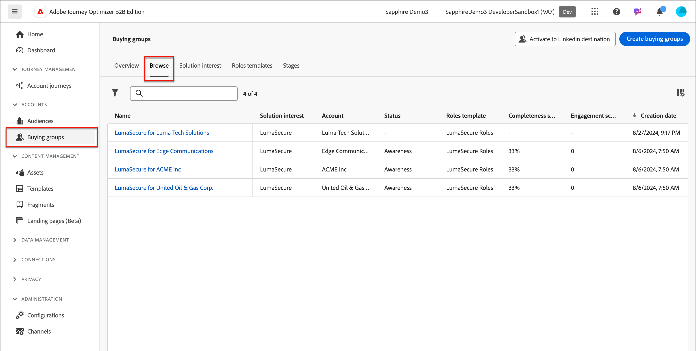
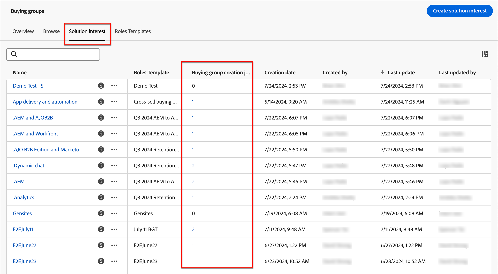

# Creación de los grupos de compra

Una vez creado el grupo de compra, estará disponible para su uso en un recorrido de cuentas a través de [interés de solución](./solution-interests.md).

1. En el panel de navegación izquierdo, haz clic en **[!UICONTROL Comprar grupos]**.

1. En la página _[!UICONTROL Grupos de compra]_, haz clic en **[!UICONTROL Crear grupos de compra]** en la parte superior derecha de la página.

   {width="700" zoomable="yes"}

1. Siga las indicaciones de cada página y haga clic en **[!UICONTROL Siguiente]** para continuar.

{width="30"} [Vea el vídeo explicativo](#how-to-video)

## Página de orientación

La primera página proporciona instrucciones sobre los requisitos previos/componentes necesarios para crear grupos de compra. Si sabe que dispone de los componentes necesarios, haga clic en **[!UICONTROL Siguiente]**.

## Componentes

1. Seleccione cada componente que desee utilizar:

   * **[!UICONTROL Interés en la solución]**: seleccione el interés en la solución de la lista.

   * **[!UICONTROL Audiencia de cuenta]** - Haga clic en # y seleccione una audiencia de cuenta de la lista.

   En _[!UICONTROL Propiedades]_, el nombre de los grupos compradores se genera automáticamente (solo lectura) como &lt; nombre de interés de solución > para &lt; nombre de cuenta >.

   {width="700" zoomable="yes"}

1. Después de seleccionar el interés de la solución y la audiencia de la cuenta, haga clic en **[!UICONTROL Crear]**.

## Confirmación

El cuadro de diálogo de confirmación proporciona un resumen del proceso de compra de grupos y una hora estimada para la finalización. Para confirmar e iniciar el proceso, haga clic en **[!UICONTROL Crear]**.

{width="400" zoomable="yes"}

## Trabajos de creación de grupos de compras

El trabajo de creación crea automáticamente grupos de compra para cada nueva cuenta en la audiencia de la cuenta. Puede navegar a la pestaña _[!UICONTROL Interés de la solución]_, que muestra el recuento de trabajos de creación creados para cada interés de la solución. Haga clic en el número de la columna **[!UICONTROL Trabajos de creación de grupos de compra]** para ver la lista de trabajos de creación.

{width="700" zoomable="yes"}

<!--
 Other buying group activities:

Member of buying group.
Assign a member of the buying group.
Remove a member of the buying group. 
-->

## Vídeo práctico

>[!VIDEO](https://video.tv.adobe.com/v/3451764/?captions=spa&learn=on)
