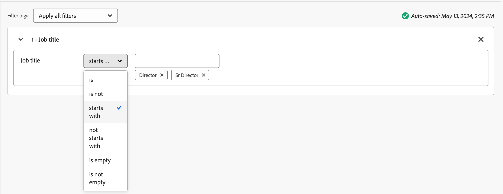

# Plantillas de función del grupo de compras

En un mercado B2B, las decisiones de compra suelen ser tomadas por varios individuos. Esas personas participan en el proceso de adopción de decisiones de acuerdo con su función dentro de la organización. Cree plantillas de rol Grupo de compra que contengan un grupo de definiciones de rol según cada tipo de oferta de producto o caso de uso de cuenta.

{width="30"} [Vea el vídeo de información general](#overview-video)

## Acceso y exploración de plantillas de función

1. En el panel de navegación izquierdo, haz clic en **[!UICONTROL Comprar grupos]**.

1. En la página _[!UICONTROL Comprar grupos]_, seleccione la pestaña **[!UICONTROL Plantillas de roles]**.

   {width="800" zoomable="yes"}

   La pestaña proporciona una lista de inventario de todas las plantillas de funciones existentes y muestra la siguiente información en formato de columna:

   * [!UICONTROL Nombre]
   * [!UICONTROL Estado]
   * [!UICONTROL Fecha de creación]
   * [!UICONTROL Creado por]
   * [!UICONTROL Última actualización]
   * [!UICONTROL Última actualización]
   * [!UICONTROL Publicado el]
   * [!UICONTROL Publicado por]

   La lista está ordenada por _[!UICONTROL Última actualización]_ de manera predeterminada. Todas las plantillas de roles tienen un estado de `Draft` o `Live`.

1. Para filtrar la lista por nombre, utilice el campo de búsqueda situado en la parte superior de la lista.

   Introduzca los primeros caracteres del nombre para reducir la lista mostrada a los elementos coincidentes.

   {width="700" zoomable="yes"}

## Crear una plantilla de funciones

1. En la ficha _[!UICONTROL Plantillas de roles]_, haga clic en **[!UICONTROL Crear plantilla]** en la esquina superior derecha.

1. En el cuadro de diálogo, escriba un **[!UICONTROL Nombre]** único (obligatorio) y **[!UICONTROL Descripción]** (opcional) para la plantilla.

   {width="400"}

1. Haga clic en **[!UICONTROL Crear]**.

### Añadir las funciones de plantilla

Después de crear la plantilla, esta se abrirá en el espacio de trabajo y se le pedirá que añada las funciones. La tarjeta de la primera función se muestra de forma predeterminada.

Cada rol que defina para la plantilla utiliza un conjunto de filtros o _condiciones_ para determinar los miembros asignados al rol. Utilice los siguientes tipos de filtros para definir las condiciones de un rol:

| Tipo | Condición |
| ---- | --------- |
| Atributos de la persona | <li>Dirección de correo electrónico <li>Email no válido <li>Email suspendido <li>Número de fax <li>Nombre <li>Región del estado inferida <li>Cargo <li>Apellido <li>Segundo nombre <li>Número de teléfono móvil <li>Puntuación de participación de persona <li>Número de teléfono <li>Código postal <li>Estado <li>Suscripción cancelada <li>Razón de la cancelación de la suscripción |
| Filtros especiales | <li>Miembro de la lista <li>Miembro del programa |
| Datos de intención | <li>Intento de categoría <li>Intención del producto <li>Intento de palabra clave [Más información acerca de los datos de intención](../admin/intent-data.md) |

1. Para la primera tarjeta de función, defina las propiedades de la función.

   * Elija **[!UICONTROL Comprar rol de grupo]** de la lista.

     Hay seis funciones predeterminadas: `Decision Maker`, `Influencer`, `Practitioner`, `Executive Steering Committee`, `Champion` y `Other`. La lista también incluye [roles personalizados definidos en la lista _Roles_](./default-custom-roles.md#custom-roles).

     {width="700" zoomable="yes"}

   * Defina **[!UICONTROL Ponderación]** para el rol, el cual se usa para calcular la puntuación de participación.

     El valor de cada opción se traduce en un porcentaje para el cálculo de puntuación: [!UICONTROL Trivial] = 20, [!UICONTROL Menor] = 40, [!UICONTROL Normal] = 60, [!UICONTROL Importante] = 80 y [!UICONTROL Vital] = 100.

     Por ejemplo, una plantilla de función con funciones que utilizan Vital, Importante y Normal se convierte a continuación como 100/240, 80/240, 60/240.

   * **[!UICONTROL Agregar condiciones para la asignación automática]**: seleccione esta casilla de verificación para agregar condiciones para la asignación automática de miembros al grupo de compra que cumplan la condición. Si la casilla de verificación no está seleccionada, la adición de condiciones NO es obligatoria.

   * **[!UICONTROL Necesario para la puntuación de integridad]**. Seleccione esta casilla de verificación para el rol si desea que sea un requisito para calcular una puntuación de integridad.

1. Haga clic en **[!UICONTROL Agregar condición]** y defina la regla de condición para el rol.

   * En el cuadro de diálogo _[!UICONTROL Condición]_, expanda la lista de **[!UICONTROL Atributos de persona]** y busque un atributo que desee usar para que coincida con el rol. Arrástrela a la derecha y suéltela en el espacio de filtro.

     {width="700" zoomable="yes"}

     >[!NOTE]
     >
     >Si tiene campos de persona personalizados definidos en el esquema de audiencia de cuenta en Experience Platform, estos campos también están disponibles para usarlos como atributos de persona en condiciones.

   * Utilice el atributo para crear un filtro coincidente con uno o más valores.

     En el ejemplo siguiente, se utiliza el atributo Job title para identificar una coincidencia para Decision Maker. Cualquier valor del título que comience por `Director` o `Sr Director` se evalúa como verdadero para la condición.

     {width="700" zoomable="yes"}

   * Si es necesario, agregue otro atributo y condición que restrinja aún más los criterios para una coincidencia en la función.

   * Haga clic en **[!UICONTROL Finalizado]**.

1. Para cada rol adicional que desee incluir en la plantilla, haga clic en **[!UICONTROL Agregar otro rol]** y repita los pasos 1 y 2 para definir el rol.

   {width="700" zoomable="yes"}

>[!BEGINSHADEBOX &quot;inscripción a la lista Marketo Engage&quot;]

En Marketo Engage, _Campañas inteligentes_ comprueba la pertenencia de los programas para asegurarte de que los posibles clientes no reciban correos electrónicos duplicados y no sean miembros de varios flujos de correos electrónicos al mismo tiempo. En Journey Optimizer B2B, puede comprobar la pertenencia a listas de Marketo Engage como condición para la plantilla de funciones a fin de eliminar la duplicación en la compra de actividades de recorrido y pertenencia a grupos.

Para usar la pertenencia a una lista como condición de rol, expanda **[!UICONTROL Filtros especiales]** y arrastre la condición **[!UICONTROL Miembro de la lista]** al espacio de filtro. A continuación, complete la definición del filtro para evaluar la pertenencia a una o varias listas de Marketo Engage.

{width="700" zoomable="yes"}
 

>[!NOTE]
>
>**Desaprobación de características**  
>
>Con la [arquitectura simplificada](../simplified-architecture.md) para Journey Optimizer B2B edition, no se admite el filtrado basado en la pertenencia a listas o programas en una instancia de Marketo Engage.

>[!ENDSHADEBOX]

Los cambios se guardarán automáticamente en el estado _Borrador_. Si no está listo para publicar la plantilla de roles, haga clic en la flecha izquierda (atrás) en la parte superior de la página y vuelva a la lista _[!UICONTROL Plantillas de roles]_.

### Cambio de la configuración de puntuación de integridad

De forma predeterminada, la integridad de un rol se define como un miembro asignado al rol. Si desea usar la integridad del grupo de compra como indicador de la preparación para las ventas o del éxito <!-- journey decisioning coming later-->, puede usar esta configuración para alinear la puntuación con el número de miembros por rol necesario para cerrar una oportunidad.

Por ejemplo, para cerrar un acuerdo para la solución _X_, es necesario que se identifiquen y se involucren varios encargados de tomar decisiones de marketing, ya que varios equipos de marketing de una organización usarían la solución. En este caso, desea aumentar el umbral para calcular un grupo de compra _completo_ requiriendo al menos dos encargados de la toma de decisiones de marketing.

Consulte las [Puntuaciones de integridad](./completeness-scores.md) para obtener información detallada acerca de los cálculos y la puntuación de integridad.

1. En la parte superior derecha de la página de plantilla de funciones, haga clic en **[!UICONTROL Configuración de puntuación de integridad]**.

   {width="700" zoomable="yes"}

1. En el cuadro de diálogo, cambie el valor **[!UICONTROL Miembros necesarios]** para cada rol definido según sea necesario.

   Puede introducir el valor o hacer clic en **&amp;plus;** o **−** para aumentarlo o reducirlo.

   {width="450"}

1. Haga clic en **[!UICONTROL Guardar]**.

### Publicación de la plantilla de funciones

Si la plantilla está lista para usarse, haga clic en **[!UICONTROL Publicar]** en la parte superior derecha.

Al publicar la plantilla, se establece el estado en _Activo_ y está disponible para asociarla con un interés de solución. Debe haber al menos una función definida para publicar la plantilla de funciones.

## Editar una plantilla de funciones de borrador

Cuando una plantilla de roles se encuentra en estado _Borrador_, puede seguir editando los roles definidos. Los cambios que realice se guardarán automáticamente.

Cambie cualquiera de las configuraciones en el encabezado de la tarjeta de función, incluido el requisito de rol de grupo de compra, ponderación, asignación automática y puntuación de integridad.

{width="600"}

### Modificación de las condiciones de un rol

Para cambiar la lógica de condición/filtrado de cualquiera de los roles, haga clic en el icono _Editar_ (  ) en la parte superior derecha de la tarjeta de roles. Esta acción abre el área de trabajo _[!UICONTROL Conditions]_, donde puede modificar un filtro existente, agregar o quitar un filtro, o cambiar la lógica del filtro.

### Eliminar una tarjeta de función

Si desea quitar una función de la plantilla, haga clic en el icono _Eliminar_ (  ) de la tarjeta de funciones.

### Establecer la prioridad de los roles

Puede reordenar las funciones dentro de la plantilla, lo que determina la prioridad para asignar posibles clientes a una función. Hay un controlador **[!UICONTROL Priority]** a la derecha de cada tarjeta de rol. Haga clic en la flecha _Arriba_ o _Abajo_ a la derecha para subir o bajar la tarjeta de rol en la prioridad.

{width="700"}

## Eliminar una plantilla de funciones

Puede eliminar una plantilla de funciones si se encuentra en el estado _Borrador_.

1. Seleccione la plantilla de funciones de la lista para abrirla.

1. Haga clic en **[!UICONTROL Eliminar]** en la parte superior derecha.

   {width="700"}

1. En el cuadro de diálogo, haga clic en **[!UICONTROL Eliminar]** para confirmar.

## Vídeo resumen

>[!VIDEO](https://video.tv.adobe.com/v/3433079/?learn=on)
