# Plantillas de función del grupo de compras

En un mercado B2B, varias personas suelen tomar decisiones de compra. Esas personas participan en el proceso de adopción de decisiones de acuerdo con su función dentro de la organización. Cree plantillas de funciones de grupo de compra que contengan un grupo de definiciones de funciones según cada tipo de oferta de producto o caso de uso de cuenta.

{width="30"} [Vea el vídeo de información general](#overview-video)

>[!BEGINSHADEBOX]

## Audience Agent B2B

[Audience Agent B2B](../agents/audience-agent-b2b.md) puede generar una plantilla de roles de grupo de compra a partir de la detección de intención de origen y la asignación de personas. En el flujo guiado, puede identificar personas vinculadas a un producto, revisar las asignaciones de funciones a personas recomendadas por IA y refinar la plantilla con lenguaje natural antes de publicarla.

**Indicadores para intentarlo:**

* Crear una plantilla de grupo de compra para `<product>`
* Agregar `<role>` asignado a `<persona>`
* Eliminar `<role>` / `<persona>`

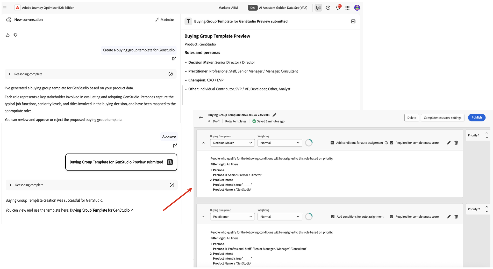{width="800" zoomable="yes"}

>[!ENDSHADEBOX]

>[!PREREQUISITES]
>
>Antes de crear una plantilla de funciones, configure los datos que pueden utilizar las condiciones de funciones:
>
>* [Asignación de campos de perfil de persona](../admin/field-mapping.md#xdm-business-person-attributes) para filtros de atributos de persona
>* [Datos por intención](../admin/intent-data.md) si usa filtros por intención en condiciones de rol
>* [Funciones de grupo de compra personalizadas](./default-custom-roles.md#create-a-custom-role) (opcional) si necesita funciones que superen los seis valores predeterminados

## Acceso y exploración de plantillas de función {#access-and-browse-role-templates}

1. En el panel de navegación izquierdo, haz clic en **[!UICONTROL Comprar grupos]**.

1. En la página _[!UICONTROL Comprar grupos]_, seleccione la pestaña **[!UICONTROL Plantillas de roles]**.

   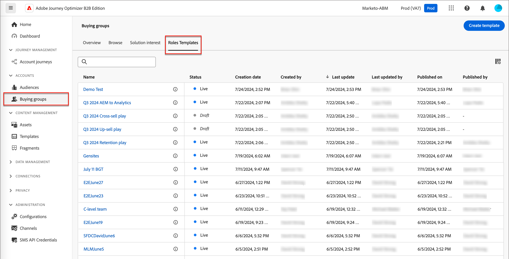{width="800" zoomable="yes"}

   La pestaña proporciona una lista de inventario de todas las plantillas de funciones existentes y muestra la siguiente información en formato de columna:

   * [!UICONTROL Nombre]
   * [!UICONTROL Estado]
   * [!UICONTROL Fecha de creación]
   * [!UICONTROL Creado por]
   * [!UICONTROL Última actualización]
   * [!UICONTROL Última actualización]
   * [!UICONTROL Publicado el]
   * [!UICONTROL Publicado por]

   El sistema ordena la lista por _[!UICONTROL Última actualización]_ de forma predeterminada. Todas las plantillas de roles tienen un estado de `Draft` o `Live`.

1. Para filtrar la lista por nombre, utilice el campo de búsqueda situado en la parte superior de la lista.

   Introduzca los primeros caracteres del nombre para reducir la lista mostrada a los elementos coincidentes.

   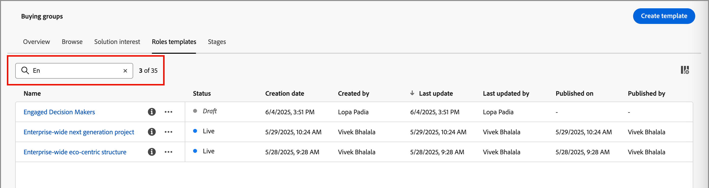{width="700" zoomable="yes"}

## Crear una plantilla de funciones

1. En la ficha _[!UICONTROL Plantillas de roles]_, haga clic en **[!UICONTROL Crear plantilla]** en la esquina superior derecha.

1. En el cuadro de diálogo, escriba un **[!UICONTROL Nombre]** único (obligatorio) y **[!UICONTROL Descripción]** (opcional) para la plantilla.

   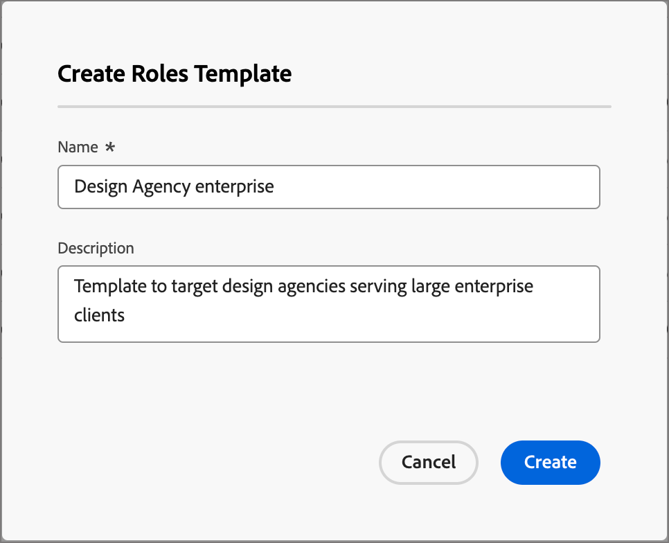{width="400"}

1. Haga clic en **[!UICONTROL Crear]**.

### Añadir las funciones de plantilla {#add-the-template-roles}

Después de crear la plantilla, esta se abrirá en el espacio de trabajo y se le pedirá que añada las funciones. El sistema muestra la primera tarjeta de función de forma predeterminada.

#### Tipos de filtro de condición de rol

Cada rol que defina para la plantilla utiliza un conjunto de filtros o _condiciones_ para determinar los miembros asignados al rol. Utilice los siguientes tipos de filtros para definir las condiciones de un rol:

| Tipo | Condiciones |
| ---- | --------- |
| [!UICONTROL Atributos de persona] | Atributos del [perfil de persona](../admin/field-mapping.md#xdm-business-person-attributes), entre ellos: <li>Ciudad <li>País <li>Dirección de correo electrónico <li>Email no válido <li>Email suspendido <li>Nombre <li>Región del estado inferida <li>Cargo <li>Apellido <li>Número de teléfono móvil <li>Puntuación de participación de personas <li>Número de teléfono <li>Código postal <li>Estado |
| [!UICONTROL Objetos Personalizados] > Tiene `<custom object>` | [!BADGE Beta]{type=Informative tooltip="Función Beta"}: la cuenta o la persona tiene o no registros de esquema relacional. También se puede evaluar según cualquiera de los criterios de objeto personalizados seleccionados, según se han configurado en los [esquemas relacionales XDM](../admin/xdm-field-management.md#relational-schemas). |
| Filtros especiales | <li>Miembro de la lista (obsoleto) <li>Miembro del programa (obsoleto) |
| Datos de intención | <li>Intento de categoría <li>Intención del producto <li>Intento de palabra clave   (consulte [_Datos de intención_](../admin/intent-data.md)) |

#### Definir propiedades de rol

1. Para la primera tarjeta de función, defina las propiedades de la función.

   * Elija **[!UICONTROL Comprar rol de grupo]** de la lista.

     Hay seis funciones predeterminadas: `Decision Maker`, `Influencer`, `Practitioner`, `Executive Steering Committee`, `Champion` y `Other`. La lista también incluye [roles personalizados definidos en la lista _Roles_](./default-custom-roles.md#create-a-custom-role).

     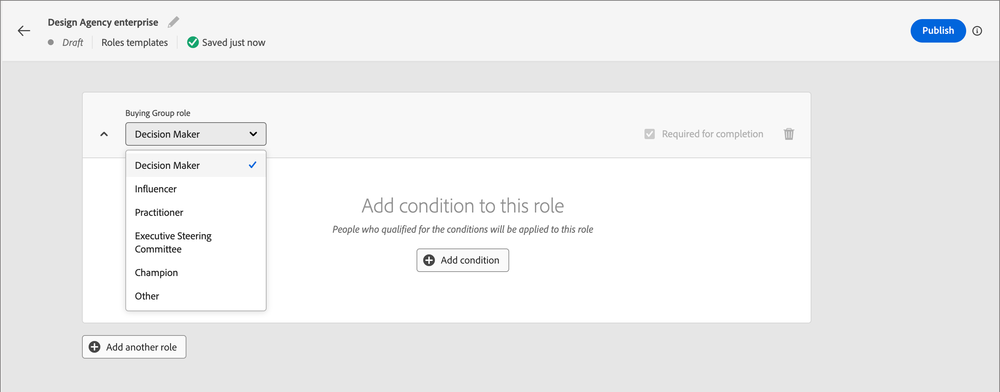{width="700" zoomable="yes"}

   * Defina **[!UICONTROL Ponderación]** para el rol, el cual se usa para calcular la puntuación de participación.

     El valor de cada opción se traduce en un porcentaje para el cálculo de puntuación: [!UICONTROL Trivial] = 20, [!UICONTROL Menor] = 40, [!UICONTROL Normal] = 60, [!UICONTROL Importante] = 80 y [!UICONTROL Vital] = 100.

     Por ejemplo, una plantilla de rol con las funciones Vital, Importante y Normal se convierte en 100, 80 y 60 de 240.

   * **[!UICONTROL Agregar condiciones para la asignación automática]**: seleccione esta casilla de verificación para agregar condiciones para la asignación automática de miembros al grupo de compra que cumplan la condición. Si la casilla de verificación no está seleccionada, la adición de condiciones NO es obligatoria.

   * **[!UICONTROL Necesario para la puntuación de integridad]**. Seleccione esta casilla de verificación para el rol si desea que sea un requisito para calcular una puntuación de integridad.

#### Agregar condiciones para la asignación automática

1. Haga clic en **[!UICONTROL Agregar condición]** y defina la regla de condición para el rol.

   * En el cuadro de diálogo _[!UICONTROL Condición]_, expanda la lista de **[!UICONTROL Atributos de persona]** y busque un atributo que desee usar para que coincida con el rol. Arrástrela a la derecha y suéltela en el espacio de filtro.

     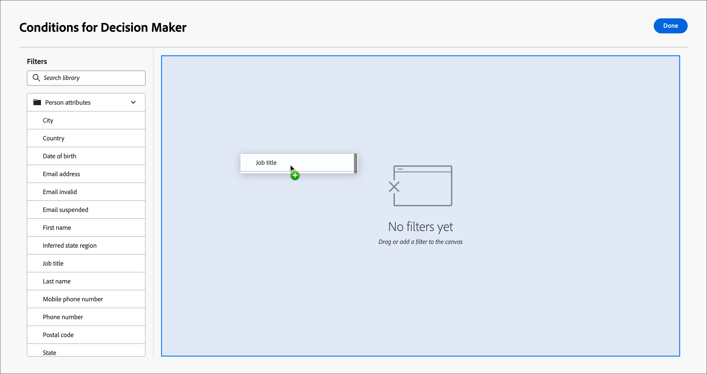{width="700" zoomable="yes"}

     >[!NOTE]
     >
     >Si tiene campos de persona personalizados definidos en el esquema de persona de negocios de Experience Platform, puede utilizarlos como atributos de persona en las condiciones.

     Utilice el atributo para crear un filtro coincidente con uno o más valores.

     En el ejemplo siguiente, se utiliza el atributo Job title para identificar una coincidencia para Decision Maker. Cualquier valor del título que comience por `Director` o `Sr Director` se evalúa como verdadero para la condición.

     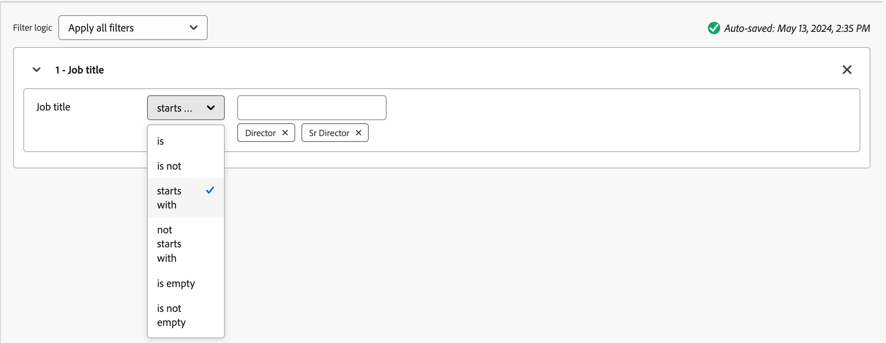{width="700" zoomable="yes"}

   * Si hay objetos personalizados configurados relacionados con las personas [definidas en los esquemas relacionales de XDM](../admin/xdm-field-management.md#relational-schemas), expanda la lista de **[!UICONTROL objetos personalizados]** para usarlos en la condición de rol.

     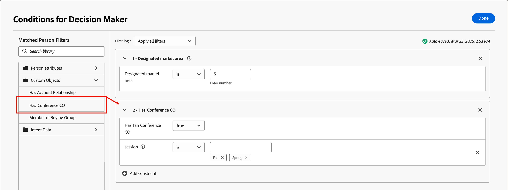{width="700" zoomable="yes"}

   * Si es necesario, agregue otro atributo/objeto y condición que restrinja aún más los criterios para una coincidencia al rol.

   * Haga clic en **[!UICONTROL Finalizado]**.

#### Agregar más funciones

1. Para cada rol adicional que desee incluir en la plantilla, haga clic en **[!UICONTROL Agregar otro rol]** y repita los pasos de **Definir propiedades de rol** y **Agregar condiciones para la asignación automática** para definir el rol.

   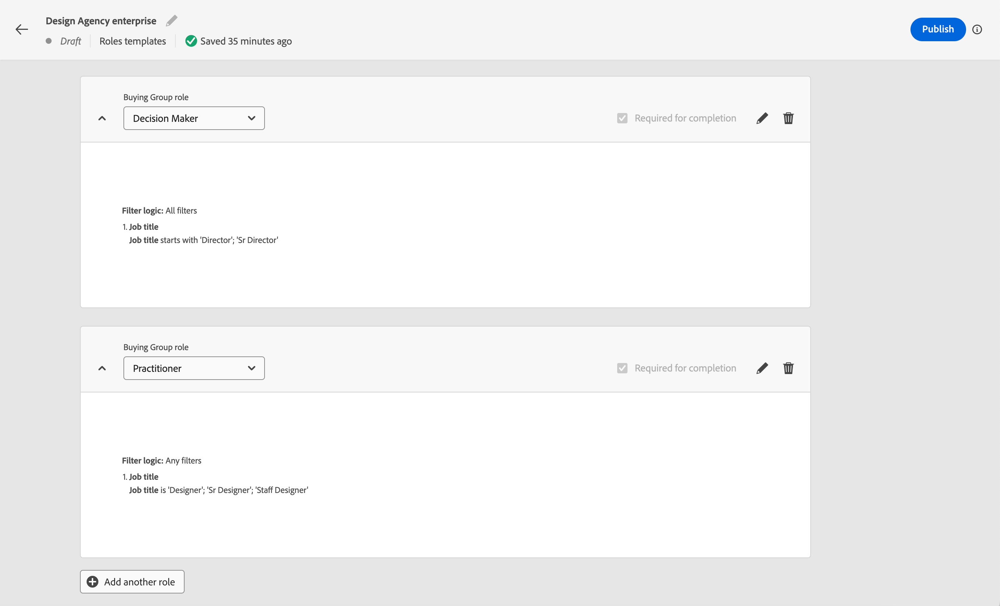{width="700" zoomable="yes"}

   Los cambios se guardarán automáticamente en el estado _Borrador_. Si no está listo para publicar la plantilla de roles, haga clic en la flecha izquierda (atrás) en la parte superior de la página y vuelva a la lista _[!UICONTROL Plantillas de roles]_.

### Cambio de la configuración de puntuación de integridad {#change-the-completeness-score-settings}

De forma predeterminada, la integridad de un rol se define como un miembro asignado al rol. Cuando utilice la integridad del grupo de compra para indicar la preparación de las ventas, utilice estos ajustes para alinear la puntuación con el número de miembros necesarios para cerrar una oportunidad.

Por ejemplo, para cerrar un acuerdo para la solución _X_ es necesario identificar y atraer a varios encargados de tomar decisiones de marketing, ya que varios equipos de marketing de una organización utilizan la solución. En este caso, desea aumentar el umbral para calcular un grupo de compra _completo_ requiriendo al menos dos encargados de la toma de decisiones de marketing.

Consulte las [Puntuaciones de integridad](./completeness-scores.md) para obtener información detallada acerca de los cálculos y la puntuación de integridad.

1. En la parte superior derecha de la página de plantilla de funciones, haga clic en **[!UICONTROL Configuración de puntuación de integridad]**.

   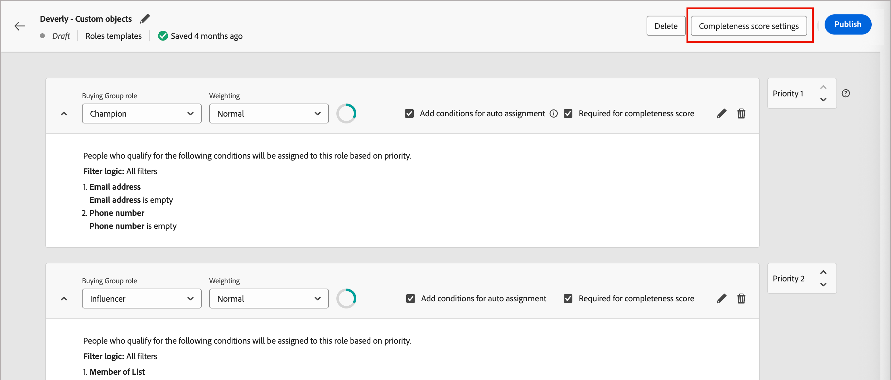{width="700" zoomable="yes"}

1. En el cuadro de diálogo, cambie el valor **[!UICONTROL Miembros necesarios]** para cada rol definido según sea necesario.

   Puede escribir el valor o hacer clic en **&plus;** o **−** para aumentarlo o reducirlo.

   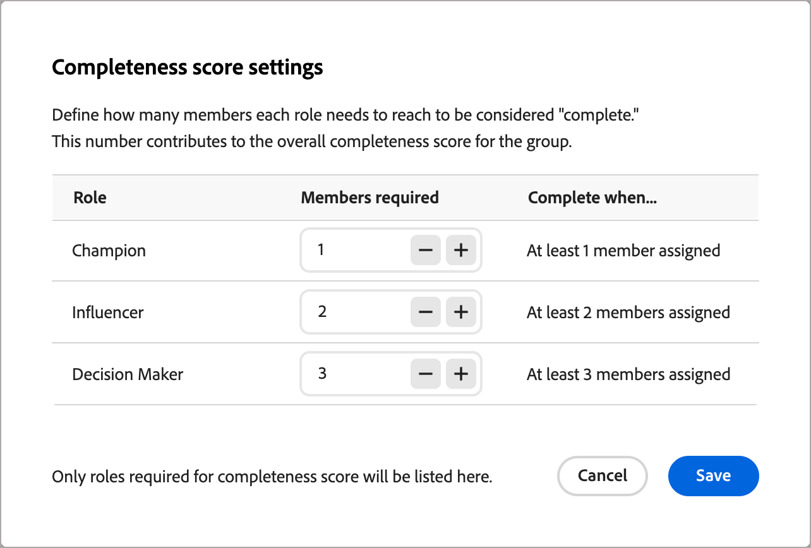{width="450"}

1. Haga clic en **[!UICONTROL Guardar]**.

### Publicación de la plantilla de funciones

Si la plantilla está lista para usarse, haga clic en **[!UICONTROL Publicar]** en la parte superior derecha.

Para que la plantilla esté disponible para asociarla con un interés de solución, publíquela para establecer el estado en _Activo_. Debe haber al menos una función definida para publicar la plantilla de funciones.

Después de publicar, el estado de la plantilla es _Activo_ en la ficha **[!UICONTROL Plantillas de roles]** y puede seleccionarla cuando [cree un interés de solución](./solution-interests.md).

## Editar una plantilla de funciones de borrador

Cuando una plantilla de roles se encuentra en estado _Borrador_, puede seguir editando los roles definidos. Los cambios que realice se guardarán automáticamente.

Cambie la configuración del encabezado de la tarjeta de funciones, como la función, la ponderación, la asignación automática o los requisitos de integridad.

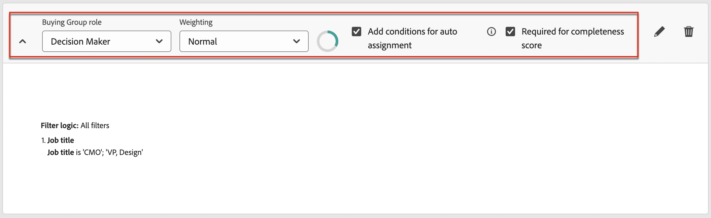{width="600"}

### Modificación de las condiciones de un rol

Para cambiar la lógica de condición/filtrado de cualquiera de los roles, haga clic en el icono _Editar_ (  ) en la parte superior derecha de la tarjeta de rol. Esta acción abre el área de trabajo _[!UICONTROL Conditions]_, donde puede modificar un filtro existente, agregar o quitar un filtro, o cambiar la lógica del filtro.

### Eliminar una tarjeta de función

Si desea quitar una función de la plantilla, haga clic en el icono _Eliminar_ (  ) de la tarjeta de funciones.

### Establecer la prioridad de los roles

Puede reordenar las funciones dentro de la plantilla, lo que determina la prioridad para asignar posibles clientes a una función. Hay un controlador **[!UICONTROL Priority]** a la derecha de cada tarjeta de rol. Haga clic en la flecha _Arriba_ o _Abajo_ a la derecha para subir o bajar la tarjeta de rol en la prioridad.

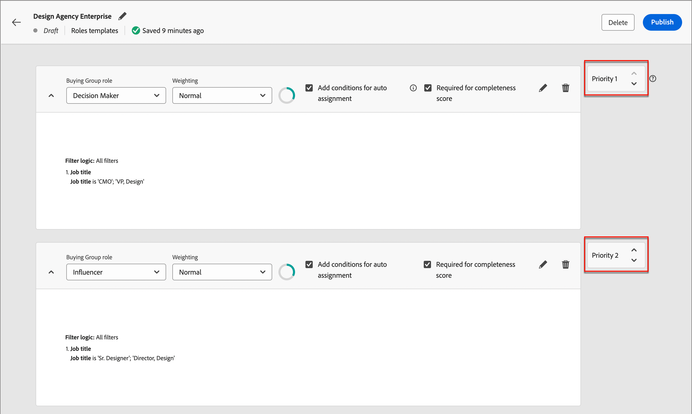{width="700"}

## Eliminar una plantilla de funciones

Puede eliminar una plantilla de funciones si se encuentra en el estado _Borrador_.

1. Seleccione la plantilla de funciones de la lista para abrirla.

1. Haga clic en **[!UICONTROL Eliminar]** en la parte superior derecha.

   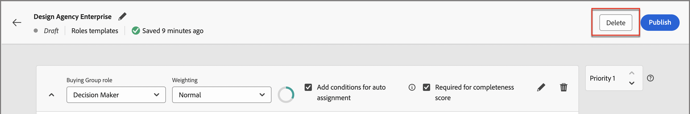{width="700"}

1. En el cuadro de diálogo, haga clic en **[!UICONTROL Eliminar]** para confirmar.

   Después de confirmar, la plantilla de roles se quita de la lista de inventario **[!UICONTROL Plantillas de roles]**.

## Vídeo resumen {#overview-video}

>[!VIDEO](https://video.tv.adobe.com/v/3453303/?captions=spa&learn=on)
