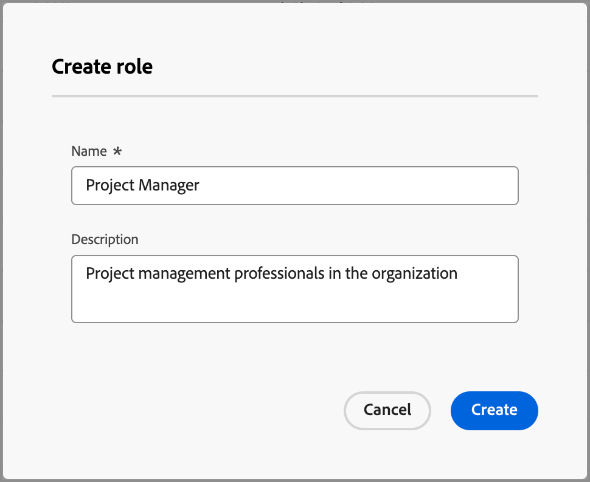

# Funciones predeterminadas y personalizadas

Journey Optimizer B2B edition incluye un conjunto de funciones predeterminadas que se utilizan en las plantillas de funciones para comprar grupos. Sin embargo, muchas organizaciones requieren funciones personalizadas que pueden definir según sus objetivos y estrategias empresariales. Puede usar la lista _[!UICONTROL Roles]_ para crear sus propias definiciones de roles que admitan sus grupos compradores.

## Acceder a funciones

1. En el panel de navegación izquierdo, haz clic en **[!UICONTROL Comprar grupos]**.

1. En la página _[!UICONTROL Comprar grupos]_, seleccione la pestaña **[!UICONTROL Roles]**.

   {width="700" zoomable="yes"}

   La pestaña proporciona una lista de inventario de todas las funciones existentes y muestra la siguiente información en formato de columna:

   * [!UICONTROL Nombre] - El nombre de rol.
   * [!UICONTROL Tipo] - Todos los roles tienen un tipo de `Default` o `Custom`.
   * [!UICONTROL Creado el] - Para un rol personalizado, la fecha y la hora de creación del rol.
   * [!UICONTROL Creado por] - Para un rol personalizado, el usuario que creó el rol.
   * [!UICONTROL Última actualización el] - Para un rol personalizado, la fecha y la hora en que se actualizó por última vez el rol.
   * [!UICONTROL Actualizado por]: para un rol personalizado, el usuario que actualizó el rol por última vez.

   La lista muestra las funciones predeterminadas en la parte superior:

   * Persona responsable de la toma de decisiones
   * Marcador de tendencias
   * Profesional
   * Comité de Dirección Ejecutiva
   * Campeón
   * Otro

   >[!NOTE]
   >
   >No puede cambiar ni eliminar las funciones predeterminadas. Hay un límite máximo de 20 funciones, incluidas las funciones predeterminadas y personalizadas.

## Crear una función personalizada

1. En la ficha _[!UICONTROL Roles]_, haga clic en **[!UICONTROL Crear rol]** en la esquina superior derecha.

1. En el cuadro de diálogo, escriba un **[!UICONTROL Nombre]** único (obligatorio) y **[!UICONTROL Descripción]** (opcional) para el rol.

   {width="400"}

1. Haga clic en **[!UICONTROL Crear]**.

## Administrar funciones personalizadas

Puede administrar sus roles personalizados en la ficha _[!UICONTROL Roles]_, que incluye la edición del nombre y la descripción del rol y la eliminación de un rol de la lista de roles. Haga clic en el icono de menú _Más_ (**...**) junto al nombre del modelo de fases y elija **[!UICONTROL Editar]** o **[!UICONTROL Eliminar]**.

{width="600"}
