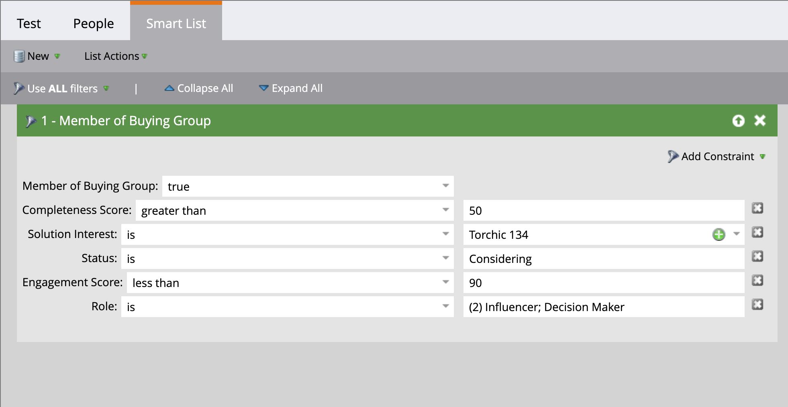

# Comprar filtros de grupo en Market Engage

Como experto en marketing, es posible que desee suprimir las campañas de Marketo Engage para las personas que forman parte de grupos de compra en Journey Optimizer B2B edition. También puede informar a los flujos de trabajo de puntuación de posibles clientes en Marketo Engage mediante la información sobre los posibles clientes asociados con la compra de grupos. Por ejemplo:

* ¿Es este cliente potencial parte de un grupo de compra?
* ¿Está completo y comprometido el grupo comprador?

Si estas condiciones son verdaderas, puede elegir puntuar como posible cliente más alto. Si no es así, puede optar por no marcarlo como posible cliente calificado de marketing (MQL).

En la instancia de Marketo Engage que está conectada a Journey Optimizer B2B edition, puede usar el filtro _[!UICONTROL Miembro del grupo de compra]_ en sus listas inteligentes para identificar a estos posibles clientes según su estrategia de campaña.

1. Después de [crear una lista inteligente en el Marketo Engage](https://experienceleague.adobe.com/es/docs/marketo/using/product-docs/core-marketo-concepts/smart-lists-and-static-lists/creating-a-smart-list/create-a-smart-list){target="_blank"}, seleccione la ficha **[!UICONTROL Lista inteligente]** para abrir el editor de filtros.

1. En la lista de filtros de la derecha, desplácese hacia abajo por la lista y expanda la carpeta **[!UICONTROL Filtros especiales]**.

1. Haz clic en el filtro **[!UICONTROL Miembro del grupo de compra]** y arrástralo al área de definición del filtro.

   {width="700" zoomable="yes"}

1. Establece la opción _[!UICONTROL Miembro del grupo de compra]_ en **[!UICONTROL true]** o **[!UICONTROL false]**.

   Esta restricción es necesaria para la definición.

1. (Opcional) Agregue otras restricciones relacionadas con grupos de compra al filtro según cómo desee identificar posibles clientes para la lista inteligente.

   * Haga clic en **[!UICONTROL Agregar restricción]** en la parte superior derecha de la tarjeta de filtro.

     {width="700" zoomable="yes"}

   * Seleccione la restricción que desee agregar, como _Puntuación de integridad_ o _Interés de la solución_.

   * Establezca la evaluación que desee utilizar para una coincidencia. Para una puntuación, puede utilizar una coincidencia exacta o un rango que esté por encima o por debajo del número introducido.

     Para un elemento discreto, como los intereses de la solución definidos en Journey Optimizer B2B edition, puede seleccionar uno o varios elementos para la lista.

     {width="600" zoomable="yes"}

     Seleccione el primero y vuelva a hacer clic en el selector para abrir el cuadro de diálogo _[!UICONTROL Selector de varios valores]_.

     {width="500" zoomable="yes"}

     Mueva cualquiera de los elementos restantes hacia la derecha y haga clic en **[!UICONTROL Aceptar]** cuando tenga la lista de elementos que desea utilizar para la restricción.

   * Repita estas acciones para agregar tantas restricciones como necesite.

   {width="600" zoomable="yes"}
