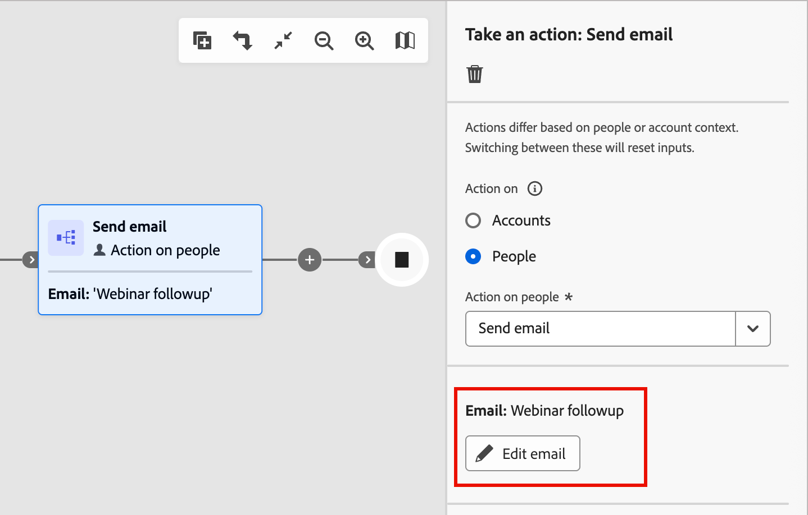

# Añadir un correo electrónico al recorrido

Utilice Adobe Journey Optimizer B2B edition para enviar mensajes de correo electrónico a sus clientes a través de los recorridos de cuenta. Puede elegir crear, personalizar y previsualizar mensajes en el espacio de diseño de correo electrónico. Una vez que los correos electrónicos estén activos en los recorridos, supervisa el envío, la entrega y la participación en el [informe de rendimiento del correo electrónico](../dashboards/email-performance-dashboard.md).

>[!NOTE]
>
>Si envía un correo electrónico por primera vez, asegúrese de que el canal de correo electrónico esté configurado. Para obtener más información, consulte [Protocolos para el seguimiento y la entrega por correo electrónico](../start/email-protocols.md).
>
>Para obtener más información sobre cómo se evalúan las preferencias de consentimiento de correo electrónico en el momento de la entrega, consulte [Preferencias de consentimiento](./channels-consent-preferences.md).

## Añadir un nodo de acción de envío de correo electrónico {#send-email-node}

Puede configurar los envíos de correo electrónico en un recorrido cuando [agregue un nodo _[!UICONTROL Realizar una acción]_](../journeys/action-nodes.md) y hacer lo siguiente:

1. _(Solo recorridos de cuenta)_ Para la _[!UICONTROL Acción en]_ destino, elige **[!UICONTROL Personas]**.

1. Para la acción, elige **[!UICONTROL Enviar correo electrónico]**.

1. Haga clic en **[!UICONTROL Crear correo electrónico]**.

   {width="500"}

1. En el cuadro de diálogo _Crear nuevo correo electrónico_, elija crear un nuevo recurso de contenido de correo electrónico o duplicar un recurso de contenido de correo electrónico existente.

   * Elija la opción **[!UICONTROL Nuevo correo electrónico]** cuando quiera crear un correo electrónico con un lienzo vacío o una plantilla de correo electrónico.

     {width="400"}

     * Escriba un **[!UICONTROL Nombre]** único para el correo electrónico y una **[!UICONTROL Línea de asunto]**.

     * Haga clic en **[!UICONTROL Crear]**.

   * Elija la opción **[!UICONTROL Duplicar correo electrónico existente]** cuando desee crear un correo electrónico utilizando un correo electrónico existente del recorrido actual o de otro recorrido.

     Puede realizar cambios en el correo electrónico duplicado según el objetivo para el nodo de recorrido.

     * Para que **[!UICONTROL el correo electrónico existente duplique]**, haga clic en el icono _Selección_ (  ) y seleccione el correo electrónico que desea duplicar y usar para el nodo de recorrido.

       Puede filtrar la lista de correos electrónicos introduciendo una cadena de texto en el campo de búsqueda para que coincida con el nombre del correo electrónico. Seleccione la casilla de verificación del correo electrónico que desea duplicar y haga clic en **[!UICONTROL Seleccionar]**.

       {width="600" zoomable="yes"}

     * Escriba un **[!UICONTROL Nombre]** único para el correo electrónico y una **[!UICONTROL Línea de asunto]**.

       {width="400"}

     * Haga clic en **[!UICONTROL Crear]**.

1. Haga clic en **[!UICONTROL Editar correo electrónico]** para definir la [configuración](#email-settings) y el [contenido](./email-authoring.md) del correo electrónico.

   {width="500"}

## Definir la configuración de correo electrónico {#email-settings}

Con la pestaña **[!UICONTROL Detalles]** seleccionada en el panel _Resumen_ de la derecha, desplácese hacia abajo para ver y definir la configuración de correo electrónico.

{width="700" zoomable="yes"}

| Opción | Descripción |
| ------ | ----------- |
| [!UICONTROL De nombre] | El nombre del remitente utilizado en el encabezado del correo electrónico. Introduzca el nombre del remitente tal como desea que aparezca al destinatario. Haga clic en el icono _Personalizar_ (  ) para usar un token de personalización en el campo. |
| [!UICONTROL Del correo electrónico] | La dirección del remitente utilizada en el encabezado del correo electrónico. El valor predeterminado se rellena desde la [configuración de envío del canal de correo electrónico](../admin/configure-channels-emails.md#delivery-settings). Haga clic en el icono _Personalizar_ (  ) para usar un token de personalización en el campo. |
| [!UICONTROL Dirección de respuesta] | La dirección del remitente utilizada en el encabezado del correo electrónico. El valor predeterminado se rellena desde la [configuración de envío del canal de correo electrónico](../admin/configure-channels-emails.md#delivery-settings) ([!UICONTROL de la etiqueta]). Introduzca la dirección de correo electrónico que desea rellenar si el destinatario utiliza la función de respuesta (puede ser diferente o igual a la dirección del remitente). Haga clic en el icono _Personalizar_ (  ) para usar un token de personalización en el campo. |
| [!UICONTROL Línea de asunto] | Texto mostrado en el campo de asunto del correo electrónico. El valor predeterminado se rellena a partir del texto que ingresó en el cuadro de diálogo _[!UICONTROL Crear nuevo correo electrónico]_. Puede cambiar el texto si es necesario. Haga clic en el icono _Personalizar_ ( ) para usar un token de personalización en el campo.<!-- Click the AI Assistant button ( {width="30" zoomable="no"} ) to generate the subject line based on the current email content.--> |
| [!UICONTROL Dominio de marca] | Si tiene más de un [dominio de personalización de marca](../admin/configure-channels-emails.md#branding-domains) definido en el sistema, seleccione el dominio de personalización de marca que se utilizará para enviar el correo electrónico. Utilice un dominio de promoción de la marca específico para enviar correos electrónicos que parezcan provenir de su marca en lugar de la compañía en su conjunto. Crea confianza con la marca, personaliza la experiencia de correo electrónico y aumenta las tasas de apertura y respuesta. |
| [!UICONTROL Correo electrónico operativo] | Seleccione la casilla de verificación si desea designar el correo electrónico como operativo. Los correos electrónicos operativos se excluyen de las listas de exclusión/cancelación de suscripción y de los límites de comunicación. Seleccione esta opción únicamente cuando el destinatario no pueda considerar que el mensaje de correo electrónico es un mensaje comercial no solicitado (SPAM). |
| [!UICONTROL Incluir vista como página web] | Seleccione la casilla de verificación para incluir un vínculo a una página web que se genera a partir del contenido del mensaje de correo electrónico. Los mensajes de correo electrónico tienen capacidades más limitadas que las páginas web, por lo que son útiles para JavaScript, CSS extendido y formularios. El texto usado para generar el vínculo está configurado en la [configuración de envío del canal de correo electrónico](../admin/configure-channels-emails.md#delivery-settings) ([!UICONTROL Ver como página web HTML] y [!UICONTROL Ver como texto de página web]). |
| [!UICONTROL Deshabilitar seguimiento de aperturas] | Seleccione la casilla de verificación cuando no desee rastrear la actividad de apertura de correo electrónico. Con la función desactivada, los recuentos de actividades abiertas de correo electrónico solo se incrementan cuando una persona única abre el correo electrónico. Puede [administrar el seguimiento de vínculos de contenido de correo electrónico](./email-authoring.md#edit-linked-url-tracking) al diseñar el contenido del cuerpo del correo electrónico. |
| [!UICONTROL Encabezado previo] | Seleccione la casilla de verificación para incluir un encabezado previo. Un preencabezado es el texto de resumen corto que se muestra después de la línea de asunto en algunos clientes de correo electrónico. Generalmente proporciona un breve resumen del correo electrónico y, por lo general, es una sola frase. Escriba el texto de resumen en el campo <!-- , or click the AI Assistant button ( {width="30" zoomable="no"} ) to generate summary text based on the current email content -->. |

<!-- 
Removed, but may reappear elsewhere
| [!UICONTROL Dedicated IP] | If you have more than one dedicated IP addresses defined, select a dedicated IP address to use for sending the email. When you use a specific dedicated IP for your programs, you can track and monitor deliverability more closely and respond quickly to any changes in your delivery metrics. For more information about adding a dedicated IP for the connected Marketo Engage instance, refer to the [Marketo Engage documentation](https://experienceleague.adobe.com/es/docs/marketo/using/product-docs/email-marketing/deliverability/use-your-dedicated-ip-addresses-to-send-emails){target="_blank"}.|
| [!UICONTROL Fields used as CC addresses] | If available, select up to 25 Lead or Company fields that are set up in Marketo Engage using the `Email` type.  |
-->

## Comprobación de alertas {#check-alerts}

A medida que define la configuración de correo electrónico y el contenido, las alertas se muestran en la interfaz (parte superior derecha de la página) cuando falta la configuración clave. Si no ve este botón, no se detectan problemas.

{width="600" zoomable="yes"}

Existen dos tipos de alertas:

* **_Advertencias_** que hacen referencia a recomendaciones y prácticas recomendadas, como:

  * `The opt-out link is not present in the email body`: se recomienda agregar un vínculo para cancelar la suscripción al cuerpo del correo electrónico.

    >[!NOTE]
    >
    >Los mensajes de correo electrónico de estilo marketing deben incluir un vínculo de no participación, que no es necesario para los mensajes transaccionales.

  * `Text version of HTML is empty`: defina una versión de texto de su cuerpo del correo electrónico, que se utiliza cuando no se puede mostrar el contenido de HTML.

  * `Empty link is present in email body`: compruebe que todos los vínculos del correo electrónico sean correctos.

  * `Email size has exceeded the limit of 100KB`: para una entrega óptima, asegúrese de que el tamaño del correo electrónico no supere los 100 KB.

* **_Errores_** que impiden probar o activar el recorrido o la campaña siempre y cuando no se resuelvan, como:

  * `From name is empty`: el campo _De_ del correo electrónico (obligatorio) no está definido.

  * `The subject line is missing`: la línea de asunto del correo electrónico (obligatorio) no está definida.

  * `The email version of the message is empty`: el contenido del correo electrónico no está definido.
