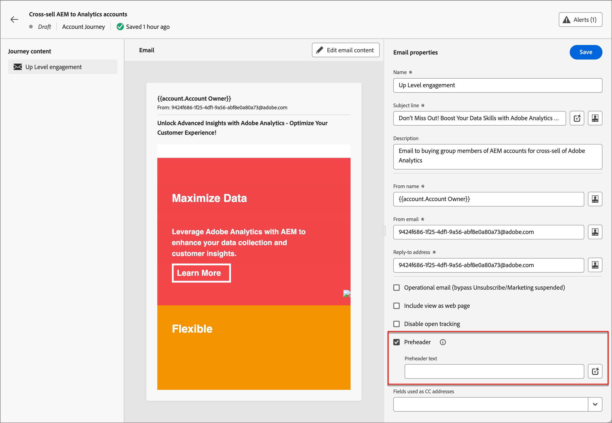
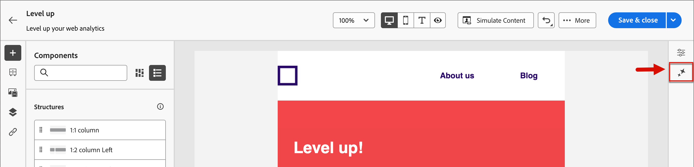

# Asistente de IA para la creación de correo electrónico

A medida que el sector de marketing se vuelve más competitivo, las marcas buscan formas eficientes de generar contenido impactante de forma rápida y eficaz. AI Assistant para la creación de correo electrónico en Adobe Journey Optimizer B2B Edition es la capacidad de generación de contenido con tecnología de IA de Adobe que revoluciona la forma en que los especialistas en marketing crean contenido de correo electrónico profesional y coherente con la marca. Con los modelos avanzados de GenAI y una comprensión profunda de las directrices de marca, el asistente de IA genera automáticamente contenido personalizado, atractivo y eficaz en función del objetivo de marketing, con contenido optimizado para los estilos, diseños, tonos y mucho más definidos por la marca. El asistente de IA hace que la creación y ejecución de campañas de marketing por correo electrónico sea intuitiva, sencilla y sin complicaciones. Añadir esta capacidad a los flujos de trabajo le permite ahorrar tiempo, mejorar la eficacia y obtener mejores resultados.

Esta nueva funcionalidad proporciona una generación de texto basada en mensajes, una generación de correo electrónico completa y una generación de contenido dentro de las estructuras de correo electrónico. Las imágenes no se generan, pero se recomiendan desde el catálogo de imágenes en el recurso de marca de entrada al modelo. También puede utilizar esta capacidad para generar líneas de asunto y encabezados óptimos para afectar a la velocidad de apertura.

>[!NOTE]
>
>Esta funcionalidad está disponible en su versión de Beta y sujeta a cambios sin previo aviso.

## Directrices y limitaciones

Antes de empezar a utilizar el asistente de IA en Adobe Journey Optimizer B2B Edition para la generación de contenido de correo electrónico, revise estas directrices:

* El objetivo/mensaje de marketing que defina es un factor determinante de la calidad del contenido generado. Utilice un indicador bien definido para que el modelo GenAI interprete con precisión.
* Cargue recursos de marca para tener información precisa sobre el contenido de la marca. Sin estos recursos, el contenido se basa en información disponible públicamente.
   * Los recursos cargados pueden tener los siguientes formatos: PDF, JPEG, PNG o archivos ZIP (que contengan formatos de archivo compatibles).
   * El tamaño máximo de un recurso de marca cargado es de 50 MB. Los archivos más grandes o las grandes cantidades de imágenes pueden funcionar, pero el tiempo de procesamiento aumenta.
* Utilice plantillas de correo electrónico creadas por Adobe Journey Optimizer B2B Edition, preferiblemente las plantillas integradas o de ejemplo, una plantilla específica de la marca o una plantilla personalizada para crear el contenido del correo electrónico. Se recomiendan plantillas de correo electrónico con entre ocho y diez imágenes.
* Asegúrese de informar de cualquier resultado problemático mediante los iconos de miniatura o indicador con una variante generada.
* Su uso del Asistente de IA está sujeto a las [Directrices del usuario de IA generativa de Adobe](https://www.adobe.com/es/legal/licenses-terms/adobe-gen-ai-user-guidelines.html).

Las siguientes limitaciones se aplican a AI Assistant en Adobe Journey Optimizer B2B Edition para la generación de contenido de correo electrónico:

* El inglés es el único idioma admitido.
* Solo está disponible para el canal de correo electrónico.
* El contenido de GenAI puede no ser preciso: comparta sus comentarios para que los ingenieros de Adobe puedan refinar los modelos.
* Puede cargar varios recursos de marca, pero solo puede aprovechar uno para una generación específica.

>[!BEGINSHADEBOX]

## Biblioteca de mensajes

Un aviso eficaz es esencial para generar el mejor contenido posible. Si necesita ayuda para redactar el mensaje, acceda a la _Biblioteca de mensajes_. Esta biblioteca proporciona una amplia gama de ideas rápidas para mejorar la generación de contenido.

{width="500" zoomable="no"}

Seleccione el mensaje que mejor refleje los objetivos deseados y añada los valores necesarios que especifiquen su marca, oferta, campaña y casos de uso.

>[!ENDSHADEBOX]

## Comprar roles de grupo

Adobe Journey Optimizer B2B Edition ofrece cinco funciones de grupo de compra B2B estándar listas para usar. Cada función de grupo de compra tiene un objetivo de mensajería distinto:

| Función | Enfoque de mensajería |
| ---- | --------------- |
| Comité de Dirección Ejecutiva | Información del producto  Precios  Detalles técnicos de la integración  Características y funciones del producto |
| Influenciador | Prueba de calidad  Facilidad de implementación  Experiencia en la materia  Ventajas competitivas |
| Toma de decisiones | Rendimiento de la inversión  Valor financiero (RoI)  Historias de clientes |
| Profesional | Fácil de usar  Funcionalidades y características del producto  Compatibilidad del producto  Facilidad de integración del producto |
| Campeón | Contenido educativo  Contenido de liderazgo mental  Historias de clientes |

Al elegir una de estas funciones de grupo de compra, se personaliza automáticamente la salida en función de las características y los temas de interés de cada una de estas funciones.

## Generar propiedades de correo electrónico con el asistente de IA

Cuando [agrega una acción de correo electrónico](./email-authoring.md#add-an-email-action-in-an-account-journey) a un recorrido de cuenta, define un conjunto de propiedades de correo electrónico que se utilizan para enviar el correo electrónico. El Asistente de inteligencia artificial puede ayudar a lograr una mejor participación en el correo electrónico mediante la generación de contenido recomendado para el correo electrónico **línea de asunto** y **encabezado previo**.

1. Cree un correo electrónico a partir de un recorrido de cuenta o abra un correo electrónico existente desde un nodo de recorrido.

   La página de vista previa del correo electrónico se muestra con las _[!UICONTROL propiedades de correo electrónico]_ a la derecha.

1. Seleccione cualquiera de las siguientes pestañas para aprender a utilizar el asistente de IA en la creación de propiedades de correo electrónico.

>[!BEGINTABS]

>[!TAB Generación de línea de asunto]

Los siguientes pasos describen la secuencia de tareas para utilizar el Asistente de IA a fin de generar una línea de asunto optimizada para el correo electrónico:

1. En _[!UICONTROL Propiedades de correo electrónico]_, haga clic en el icono del Asistente de IA ( {width="30" zoomable="no"} ) a la derecha del campo **[!UICONTROL Línea de asunto]**.

   {width="600" zoomable="yes"}

   La ventana emergente Ayudante de IA se abre con la configuración de generación de la línea de asunto del correo electrónico.

   Según el contenido del correo electrónico asociado con el correo electrónico o cómo desee utilizar la línea de asunto para adaptarla a su propósito, hay un par de opciones para generar el texto de la línea de asunto:

   * Puede hacer clic inmediatamente en **[!UICONTROL Generar]** sin un mensaje de solicitud ni un recurso de marca para usar el cuerpo del correo electrónico existente como contexto para la generación de la línea de asunto.

   * (Recomendado) Puede proporcionar un mensaje de aviso, un recurso de marca y otros valores de configuración para proporcionar un contexto que genere el texto de línea de asunto más óptimo para sus necesidades. (Pasos 2 a 7)

1. En el campo **[!UICONTROL Preguntar]**, escriba una descripción de lo que desea generar.

   Use la [Biblioteca de mensajes](#prompt-library) si necesita ayuda para crear un mensaje eficaz.

1. Especifique un recurso de marca que contenga contenido para que sirva como origen de la generación de texto.

   * Seleccione el recurso del catálogo.

   * Haga clic en **[!UICONTROL Cargar recurso de marca]** para agregar el archivo de recurso de marca.

   {width="600" zoomable="yes"}

1. Desplácese si es necesario y seleccione la **[!UICONTROL función de grupo de compra]** que se utilizará como audiencia de destino para el texto generado.

1. Si es necesario, utilice las opciones de mensajería para adaptar el contenido:

   * **[!UICONTROL Estrategia de comunicación]**: elige el estilo de comunicación más adecuado para el texto generado.
   * **[!UICONTROL Idioma]**: seleccione el idioma en el que desea que se genere su contenido.
   * **[!UICONTROL Tono]**: elige un tono que resuene en tu audiencia. Si especifica que desea que suene informativo, lúdico o persuasivo, el asistente de IA puede adaptar el mensaje en consecuencia.

1. Si es necesario, utilice el control deslizante para definir la longitud deseada del texto que se va a generar.

1. Cambia la opción **[!UICONTROL Usar emojis]** (activada o desactivada) según tus preferencias.

1. Cuando la solicitud y la configuración estén listas, haga clic en **[!UICONTROL Generar]**.

1. Desplácese por el panel Asistente de IA y examine las variaciones generadas para determinar cuál es la que mejor se ajusta.

   * Haga clic en **[!UICONTROL Vista previa]** para ver una versión en pantalla completa de una variación seleccionada.

   * Proporcione comentarios sobre las variantes generadas haciendo clic en los iconos _Pulgares arriba_, _Pulgares abajo_ o _Marca_ y elija el motivo que mejor resuma sus comentarios.

1. Vaya a las opciones de _Refine_ en la ventana Vista previa para acceder a características de personalización adicionales:

   * **[!UICONTROL Usar como contenido de referencia]**: seleccione esta opción para usar la variante como contenido de referencia para generar otros resultados.

   * **[!UICONTROL Reformular]**: el Asistente de inteligencia artificial puede reformular su mensaje de diferentes maneras, manteniendo su escritura fresca y atractiva para diversas audiencias.

   * **[!UICONTROL Use un lenguaje más sencillo]**: aproveche el Asistente para IA a fin de simplificar su lenguaje y garantizar la claridad y accesibilidad para una audiencia más amplia.

   {width="600" zoomable="yes"}

1. Haga clic en **[!UICONTROL Seleccionar]** para reemplazar el texto de la línea de asunto con la variante seleccionada y volver a las propiedades de correo electrónico.

>[!TAB Generación de encabezado previo]

Un preencabezado de correo electrónico es el texto corto de resumen que sigue a la línea de asunto cuando se ve un correo electrónico en la bandeja de entrada. Es un elemento opcional para un correo electrónico, pero una gran oportunidad para mejorar la participación. Los siguientes pasos describen la secuencia de tareas para utilizar el Asistente de IA a fin de generar un encabezado previo optimizado para el correo electrónico:

1. En las Propiedades del correo electrónico, seleccione la casilla de verificación **[!UICONTROL Preencabezado]** y haga clic en el icono del Asistente de IA ( {width="30" zoomable="no"} ) a la derecha.

   {width="600" zoomable="yes"}

   El elemento emergente Ayudante de IA se abre con la configuración de generación del encabezado previo del correo electrónico.

   Según el contenido del correo electrónico asociado al mismo o cómo desee enviarlo, hay un par de opciones para generar el preencabezado:

   * Puede hacer clic inmediatamente en **[!UICONTROL Generar]** sin un mensaje de solicitud ni un recurso de marca para usar el cuerpo del correo electrónico existente como contexto para la generación del encabezado previo.

   * (Recomendado) Puede proporcionar un mensaje de aviso, un recurso de marca y otros valores de configuración para proporcionar un contexto que genere el encabezado previo más óptimo para sus necesidades. (Pasos 2 a 7)

1. En el campo **[!UICONTROL Preguntar]**, escriba una descripción de lo que desea generar.

   Use la [Biblioteca de mensajes](#prompt-library) si necesita ayuda para crear un mensaje eficaz.

1. Especifique un recurso de marca que contenga contenido para que sirva como origen de la generación de texto.

   * Seleccione el recurso del catálogo.

   * Haga clic en **[!UICONTROL Cargar recurso de marca]** para agregar el archivo de recurso de marca.

   {width="600" zoomable="yes"}

1. Desplácese si es necesario y seleccione la **[!UICONTROL función de grupo de compra]** que se utilizará como audiencia de destino para el texto generado.

1. Si es necesario, utilice las opciones de mensajería para adaptar el contenido:

   * **[!UICONTROL Estrategia de comunicación]**: elige el estilo de comunicación más adecuado para el texto generado.
   * **[!UICONTROL Idioma]**: seleccione el idioma en el que desea que se genere su contenido.
   * **[!UICONTROL Tono]**: elige un tono que resuene en tu audiencia. Si especifica que desea que suene informativo, lúdico o persuasivo, el asistente de IA puede adaptar el mensaje en consecuencia.

1. Si es necesario, utilice el control deslizante para definir la longitud deseada del texto que se va a generar.

1. Cambia la opción **[!UICONTROL Usar emojis]** (activada o desactivada) según tus preferencias.

1. Cuando la solicitud y la configuración estén listas, haga clic en **[!UICONTROL Generar]**.

1. Desplácese por el panel Asistente de IA y examine las variaciones generadas para determinar cuál es la que mejor se ajusta.

   * Haga clic en **[!UICONTROL Vista previa]** para ver una versión en pantalla completa de una variación seleccionada.

   * Proporcione comentarios sobre las variantes generadas haciendo clic en los iconos _Pulgares arriba_, _Pulgares abajo_ o _Marca_ y elija el motivo que mejor resuma sus comentarios.

1. Vaya a las opciones de _Refine_ en la ventana Vista previa para acceder a características de personalización adicionales:

   * **[!UICONTROL Usar como contenido de referencia]**: seleccione esta opción para usar la variante como contenido de referencia para generar otros resultados.

   * **[!UICONTROL Reformular]**: el Asistente de inteligencia artificial puede reformular su mensaje de diferentes maneras, manteniendo su escritura fresca y atractiva para diversas audiencias.

   * **[!UICONTROL Use un lenguaje más sencillo]**: aproveche el Asistente para IA a fin de simplificar su lenguaje y garantizar la claridad y accesibilidad para una audiencia más amplia.

   {width="600" zoomable="yes"}

1. Haga clic en **[!UICONTROL Seleccionar]** para reemplazar el preencabezado con la variante seleccionada y volver a las propiedades de correo electrónico.

>[!ENDTABS]

## Generar contenido del cuerpo del correo electrónico con el asistente de IA

Después de [crear y personalizar tu correo electrónico](./email-authoring.md#create-the-email-content), usa el Asistente de IA en Adobe Journey Optimizer B2B Edition, con tecnología de IA generativa para elevar el contenido de tu cuerpo de correo electrónico al siguiente nivel.

En el diseñador de correo electrónico, el asistente de IA puede ayudarle a optimizar el impacto de sus envíos mediante la generación del cuerpo completo del correo electrónico, el contenido de texto de destino y las recomendaciones para imágenes que interesen a su audiencia. Esta optimización de las campañas de correo electrónico está diseñada para producir una mejor participación.

1. Cree un correo electrónico a partir de un recorrido de cuenta y haga clic en **[!UICONTROL Abrir correo electrónico en Designer]** o **[!UICONTROL Agregar contenido de correo electrónico]**.

1. Seleccione y abra una plantilla de correo electrónico en el diseñador de correo electrónico visual.

1. Personalice el correo electrónico según sea necesario para el nodo de recorrido.

1. Seleccione cualquiera de las siguientes pestañas para aprender a utilizar el asistente de IA en la creación de contenido del cuerpo del correo electrónico.

>[!BEGINTABS]

>[!TAB Generación completa de correo electrónico]

Los siguientes pasos describen la secuencia de tareas para utilizar el Asistente de IA con el fin de refinar una plantilla de correo electrónico existente:

1. En el diseñador de correo electrónico, acceda al menú Asistente de IA haciendo clic en el icono ( {width="30" zoomable="no"} ) a la derecha.

   {width="600" zoomable="yes"}

   La configuración del Asistente de IA de la derecha refleja la configuración de _generación (correo electrónico completo)_.

1. En el campo **[!UICONTROL Preguntar]**, escriba una descripción de lo que desea generar.

   Use la [Biblioteca de mensajes](#prompt-library) si necesita ayuda para crear un mensaje eficaz.

   {width="600" zoomable="yes"}

1. Especifique un recurso de marca que contenga contenido que pueda proporcionar contexto adicional para el asistente de IA.

   * Seleccione el recurso del catálogo.

   * Haga clic en **[!UICONTROL Cargar recurso de marca]** para agregar el archivo de recurso de marca.

   Este recurso de entrada sirve como fuente para la generación de contenido y la recomendación de imágenes dentro del correo electrónico.

1. Seleccione el **[!UICONTROL rol de grupo de compra]** que se usará como audiencia de destino para la comunicación por correo electrónico.

1. Si es necesario, utilice las opciones de mensajería para adaptar el contenido:

   * **[!UICONTROL Estrategia de comunicación]**: elige el estilo de comunicación más adecuado para el texto generado.
   * **[!UICONTROL Idioma]**: seleccione el idioma en el que desea que se genere su contenido.
   * **[!UICONTROL Tono]**: elige un tono que resuene en tu audiencia. Si especifica que desea que suene informativo, lúdico o persuasivo, el asistente de IA puede adaptar el mensaje en consecuencia.
   * **Tipo de contenido**: elija una opción que refleje la naturaleza de los elementos visuales. Esta configuración distingue entre diferentes formas de representación visual, como fotografías, gráficos o arte.

1. Cuando la solicitud esté lista, haga clic en **[!UICONTROL Generar]**.

1. Desplácese por el panel Asistente de IA y examine las variaciones generadas para determinar cuál es la que mejor se ajusta.

   * Haga clic en **[!UICONTROL Vista previa]** para ver una versión en pantalla completa de una variación seleccionada.

   * Proporcione comentarios sobre las variantes generadas haciendo clic en los iconos _Pulgares arriba_, _Pulgares abajo_ o _Marca_ y elija el motivo que mejor resuma sus comentarios.

     {width="600" zoomable="yes"}

1. Haga clic en **[!UICONTROL Seleccionar]** para reemplazar el contenido de la plantilla por la variante seleccionada y volver al diseñador de correo electrónico.

   En el diseñador de correo electrónico, puede utilizar las herramientas de edición y formato del lienzo para modificar el contenido, así como las opciones _[!UICONTROL Settings]_ y _[!UICONTROL Style]_ de la derecha.

>[!TAB Generación de texto]

Los siguientes pasos describen la secuencia de tareas para utilizar el Asistente de IA con el fin de refinar o mejorar el contenido de texto de un correo electrónico existente:

1. En el diseñador de correo electrónico, acceda al menú Asistente de IA haciendo clic en el icono ( {width="30" zoomable="no"} ) a la derecha.

   {width="600" zoomable="yes"}

1. Seleccione un componente _Texto_ para segmentar el contenido específico.

   La configuración del Asistente de IA de la derecha refleja la configuración de _generación (texto)_.

1. En el campo **[!UICONTROL Preguntar]**, escriba una descripción de lo que desea generar.

   {width="600" zoomable="yes"}

   Use la [Biblioteca de mensajes](#prompt-library) si necesita ayuda para crear un mensaje eficaz.

1. Especifique un recurso de marca que contenga contenido para que sirva como origen de la generación de texto.

   * Seleccione el recurso del catálogo.

   * Haga clic en **[!UICONTROL Cargar recurso de marca]** para agregar el archivo de recurso de marca.

1. Seleccione el **[!UICONTROL rol de grupo de compra]** que se usará como audiencia de destino para el texto generado.

1. Si es necesario, utilice las opciones de idioma y mensajería para adaptar el contenido:

   * **[!UICONTROL Estrategia de comunicación]**: elige el estilo de comunicación más adecuado para el texto generado.
   * **[!UICONTROL Idioma]**: seleccione el idioma en el que desea que se genere su contenido.
   * **[!UICONTROL Tono]**: elige un tono que resuene en tu audiencia. Si especifica que desea que suene informativo, lúdico o persuasivo, el asistente de IA puede adaptar el mensaje en consecuencia.

1. Si es necesario, utilice el control deslizante para definir la longitud deseada del texto que se va a generar.

1. Cuando la solicitud esté lista, haga clic en **[!UICONTROL Generar]**.

1. Examine las _variaciones_ generadas y haga clic en **[!UICONTROL Vista previa]** para ver una versión en pantalla completa de la variación seleccionada.

1. Vaya a las opciones de _Refine_ en la ventana Vista previa para acceder a características de personalización adicionales:

   * **[!UICONTROL Usar como contenido de referencia]**: seleccione esta opción para usar la variante como contenido de referencia para generar otros resultados.

   * **[!UICONTROL Elaborar]**: el asistente de IA puede ayudarle a ampliar temas específicos y proporcionar detalles adicionales para una mejor comprensión y participación.

   * **[!UICONTROL Resumir]**: la información larga puede sobrecargar los destinatarios de correo electrónico. Utilice el asistente de IA para condensar los puntos clave en resúmenes claros y concisos que llamen la atención y los animen a leer más.

   * **[!UICONTROL Reformular]**: el Asistente de inteligencia artificial puede reformular su mensaje de diferentes maneras, manteniendo su escritura fresca y atractiva para diversas audiencias.

   * **[!UICONTROL Use un lenguaje más sencillo]**: aproveche el Asistente para IA a fin de simplificar su lenguaje y garantizar la claridad y accesibilidad para una audiencia más amplia.

   {width="700" zoomable="yes"}

1. Cuando tenga el contenido que desea, haga clic en **[!UICONTROL Seleccionar]** para reemplazar el texto con la variante seleccionada y volver al diseñador de correo electrónico.

   En el diseñador de correo electrónico, puede utilizar las herramientas de edición y formato del lienzo para modificar el texto, así como las opciones _[!UICONTROL Settings]_ y _[!UICONTROL Style]_ de la derecha.

>[!TAB Recomendaciones de imagen]

Puede utilizar el asistente de IA para optimizar y mejorar sus recursos y garantizar una experiencia más fácil de usar. Los siguientes pasos describen la secuencia de tareas para utilizar el Ayudante de IA para mejorar el contenido de imagen del correo electrónico:

1. Acceda al menú Asistente de IA haciendo clic en el icono ( {width="30" zoomable="no"} ) que hay a la derecha.

   {width="600" zoomable="yes"}

1. Seleccione un componente _Image_ para segmentar el contenido específico y acceder al menú del Asistente de IA.

   La configuración de la derecha refleja la configuración de _[!UICONTROL generación (imagen)]_.

1. Para ajustar el recurso, escriba una descripción de lo que desea en el campo **[!UICONTROL Preguntar]**.

   {width="600" zoomable="yes"}

   Use la [Biblioteca de mensajes](#prompt-library) si necesita ayuda para crear un mensaje eficaz.

1. Haga clic en **[!UICONTROL Cargar recurso de marca]** para agregar cualquier recurso de marca que contenga contenido que pueda proporcionar contexto adicional para el asistente de IA.

   Si el recurso necesario ya está disponible, expanda **[!UICONTROL Recursos de marca cargados]** y seleccione el recurso.

   El mensaje siempre debe estar vinculado a un recurso existente.

1. Utilice la configuración de la imagen para restringir el mensaje:

   * **[!UICONTROL Proporción de aspecto]**: esta configuración determina la anchura y la altura del recurso. Tiene la opción de elegir entre proporciones comunes, como 16:9, 4:3, 3:2 o 1:1, o bien puede introducir un tamaño personalizado.
   * **[!UICONTROL Color y tono]**: esta configuración influye en el aspecto general de los colores de una imagen y en el estado de ánimo o la atmósfera que transmite.
   * **[!UICONTROL Tipo de contenido]**: esta configuración categoriza la naturaleza del elemento visual y distingue entre diferentes formas de representación visual, como fotografías, gráficos o arte.
   * **[!UICONTROL Iluminación]**: este ajuste ajusta el rayo presente en una imagen, lo que da forma a su atmósfera y resalta elementos específicos.
   * **[!UICONTROL Composición]**: esta configuración determina la disposición de elementos dentro del marco de una imagen.

1. Cuando esté satisfecho con la configuración de la solicitud, haga clic en **[!UICONTROL Generar]**.

   El asistente de IA procesa la solicitud y recomienda las imágenes más adecuadas desde el recurso de marca de entrada y en función del mensaje y otras entradas.

   >[!IMPORTANT]
   >
   >Si no hay imágenes en el recurso de marca de entrada o no hay imágenes relevantes para el mensaje de entrada, la salida está vacía.

1. Examine _[!UICONTROL Variaciones]_ y seleccione la que mejor se ajuste al correo electrónico.

   Para ver una versión en pantalla completa de la variación seleccionada, haz clic en **[!UICONTROL Vista previa]**.

1. Resalte la imagen que desee y haga clic en **[!UICONTROL Seleccionar]** para reemplazar la imagen o el marcador de posición por el elemento seleccionado y volver al diseñador de correo electrónico.

   En el diseñador de correo electrónico, puede utilizar las herramientas de edición y formato del lienzo para modificar el contenido, así como las opciones _[!UICONTROL Settings]_ y _[!UICONTROL Style]_ de la derecha.

>[!ENDTABS]
