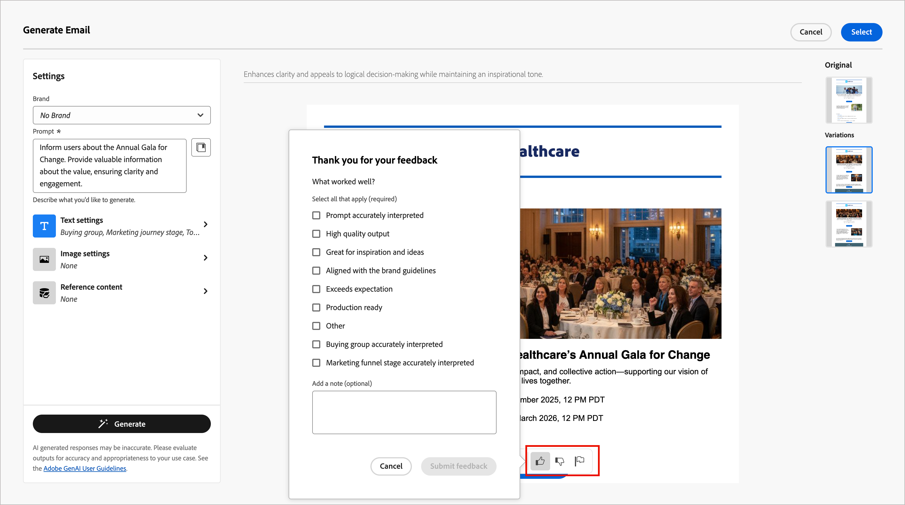

# Asistente de IA para contenido de correo electrónico

A medida que el sector de marketing se vuelve más competitivo, las marcas buscan formas eficientes de generar contenido impactante de forma rápida y eficaz. El asistente de IA para la creación de correo electrónico en [!DNL Adobe Journey Optimizer B2B Edition] es la capacidad de generación de contenido de Adobe que funciona con IA y que revoluciona la forma en que los especialistas en marketing crean contenido de correo electrónico profesional y coherente con la marca. Con modelos de IA generativos avanzados y una comprensión profunda de las directrices de marca, el asistente de IA genera automáticamente contenido personalizado, atractivo y eficaz. Utiliza su objetivo de marketing y optimiza el contenido para los estilos, diseños, tonos y mucho más descritos de la marca. El asistente de IA hace que la creación y ejecución de campañas de marketing por correo electrónico sea intuitiva, sencilla y sin complicaciones. Añadir esta capacidad a los flujos de trabajo le permite ahorrar tiempo, mejorar la eficacia y obtener mejores resultados.

Esta nueva capacidad proporciona una generación de contenido basada en mensajes para la generación completa de correo electrónico o dirigida dentro de los componentes estructurales del correo electrónico. Para las imágenes, puede generar nuevos recursos de imagen o simplemente generar recomendaciones desde el catálogo de imágenes en el recurso de marca de entrada. También puede utilizar esta capacidad para generar líneas de asunto y encabezados óptimos para afectar a la tasa de apertura de los correos electrónicos.

>[!IMPORTANT]
>
>Para acceder a estas funciones en Adobe Journey Optimizer B2B edition, debe tener el permiso _[!UICONTROL Asistente de IA]_ > _[!UICONTROL Generar contenido]_. Para obtener más información sobre cómo un administrador de productos puede conceder permisos de características, consulte [Editar roles para permisos de productos](../admin/user-management.md#edit-roles-for-product-permissions).

## Directrices y limitaciones

Antes de empezar a usar esta capacidad, revise las [directrices y limitaciones](../ai-assistant/generative-ai-content.md#general-guidelines-and-limitations). [También se requiere la aceptación del acuerdo de usuario ](https://www.adobe.com/legal/licenses-terms/adobe-dx-gen-ai-user-guidelines.html){target="_blank"} para poder usar las capacidades de IA en [!DNL Journey Optimizer B2B Edition]. Para obtener más información, contacte con su representante de Adobe.

Con el compromiso de Adobe de promover la transparencia en el uso de herramientas de IA generativa en la creación de medios, Adobe aplica [credenciales de contenido](https://helpx.adobe.com/firefly/web/get-started/learn-the-basics/content-credentials-overview.html){target="_blank"} para cualquier contenido o proyecto que incluya un recurso generado por Firefly cuando se descarga o exporta.

Las siguientes limitaciones y directrices se aplican a las funciones del Asistente de inteligencia artificial utilizadas para generar contenido de correo electrónico en [!DNL Journey Optimizer B2B Edition]:

* El inglés es el único idioma admitido.
* El contenido generado puede no ser preciso: comparta sus comentarios para que los ingenieros de Adobe puedan refinar los modelos.
* Puede cargar varios recursos de referencia de contenido, pero solo puede aprovechar uno para una generación específica.
* Utilice una plantilla personalizada o específica de la marca para generar contenido para un correo electrónico completo. Se recomiendan plantillas de correo electrónico con hasta 8-10 imágenes.
* Asegúrese de informar de cualquier salida problemática mediante los iconos de miniatura hacia arriba, miniatura hacia abajo o indicador al seleccionar variantes generadas.

## Entrada y configuración para la generación de contenido

Puede generar contenido completo para un correo electrónico o para los componentes seleccionados en el correo electrónico. Cuando utilice las herramientas del Asistente de IA para generar el contenido que necesita, proporcione la entrada, incluidos los mensajes y el contenido de referencia, y la configuración para texto e imágenes.

### Indicadores

Utilice peticiones de datos bien definidas para que el modelo de IA generativa interprete con precisión. El objetivo/mensaje de marketing que proporcione afecta fuertemente a la calidad del contenido generado.

{width="320"}

Para obtener más información acerca de cómo crear mensajes efectivos, vea _[Prácticas recomendadas de mensajes](../ai-assistant/generative-ai-content.md#generative-ai-prompting-guide)_.

>[!BEGINSHADEBOX]

#### Biblioteca de mensajes

Un aviso eficaz es esencial para generar el mejor contenido posible. Si desea ayuda para redactar el mensaje, haga clic en el icono _Biblioteca de mensajes_  para acceder a una biblioteca de ideas de mensajes organizadas según los objetivos. Introduzca texto en el campo de búsqueda para buscar una solicitud basada en una cadena de palabra clave.

{width="600" zoomable="no"}

Seleccione la solicitud que mejor se ajuste a sus metas y haga clic en **[!UICONTROL Probar esta solicitud]**. En el campo _[!UICONTROL Preguntar]_, reemplace cualquier marcador de posición (como `[Key Feature/Information]`) con los valores necesarios que especifiquen su marca, oferta, campaña y casos de uso.

>[!ENDSHADEBOX]

### Configuración de texto

Expanda **[!UICONTROL Configuración de texto]** en el panel derecho y establezca las opciones para el texto generado.

* **[!UICONTROL Grupo de compra]** - Elige la función de [grupo de compra](../buying-groups/buying-groups-role-templates.md) que se usará para segmentar tu mensaje. [!DNL Journey Optimizer B2B Edition] ofrece cinco funciones de grupo de compra B2B estándar listas para usarse. Cada función de grupo de compra tiene un objetivo de mensajería distinto:

  | Función | Enfoque de mensajería |
  | ---- | --------------- |
  | Comité de Dirección Ejecutiva | Información del producto  Precios  Detalles técnicos de la integración  Características y funciones del producto |
  | Marcador de tendencias | Prueba de calidad  Facilidad de implementación  Experiencia en la materia  Ventajas competitivas |
  | Toma de decisiones | Rendimiento de la inversión  Valor financiero (RoI)  Historias de clientes |
  | Profesional | Fácil de usar  Funcionalidades y características del producto  Compatibilidad del producto  Facilidad de integración del producto |
  | Campeón | Contenido educativo  Contenido de liderazgo mental  Historias de clientes |

* **[!UICONTROL Fase de recorrido de marketing]**: elige la [fase de grupo de compra](../buying-groups/buying-group-stages.md) que se usará para dirigir los mensajes.
* **[!UICONTROL Estrategia de comunicación]**: elige el estilo de comunicación más adecuado para el texto generado.
* **[!UICONTROL Idioma]**: elige el idioma del contenido generado.
* **[!UICONTROL Tono]**: el tono debería interesar a su audiencia. Por ejemplo, puede ajustar el mensaje para que suene informativo, lúdico o persuasivo.

{width="350" zoomable="yes"}

Haga clic en la flecha izquierda para volver a la _[!UICONTROL configuración]_ principal.

### Configuración de imagen

Para incluir imágenes en el contenido generado, expanda **[!UICONTROL Configuración de imagen]** en el panel derecho y establezca las opciones.

La opción **[!UICONTROL Generar imágenes mediante IA]** está deshabilitada de manera predeterminada. Active esta función y defina las siguientes opciones para incluir las imágenes generadas en las variaciones de contenido propuestas:

<!-- * **[!UICONTROL Generative model]**: Select from available built-in models, custom Firefly models trained on your brand assets, or third-party image generation providers to create images that align with your specific needs and brand requirements. -->
* **[!UICONTROL Proporción de aspecto]**: cuando se selecciona un componente de imagen, esta configuración determina la anchura y la altura del recurso. Tiene la opción de elegir entre proporciones comunes como 16:9, 4:3, 3:2 o 1:1, o bien puede especificar un tamaño personalizado.
* **[!UICONTROL Tipo de contenido]**: El tipo categoriza la naturaleza del elemento visual, distinguiendo entre diferentes formas de representación visual, como fotografías, gráficos o arte.
* **[!UICONTROL Intensidad visual]**: controla el impacto de la imagen ajustando su intensidad. Un ajuste más bajo (por ejemplo, 2) crea un aspecto más suave y restringido, mientras que un ajuste más alto (por ejemplo, 10) hace que la imagen sea más vibrante y visualmente potente.
* **[!UICONTROL Color y tono]**: El aspecto general de los colores de una imagen y el estado de ánimo o atmósfera que transmite.
* **[!UICONTROL Iluminación]**: estilo de iluminación utilizado para la imagen, que da forma a su atmósfera y resalta elementos específicos.
* **[!UICONTROL Composición]**: La disposición de elementos dentro del marco de una imagen.

{width="350" zoomable="yes"}

Haga clic en la flecha izquierda para volver a la _[!UICONTROL configuración]_ principal.

### Contenido de referencia

Cargue recursos de contenido de referencia para generar contenido preciso y de marca. De lo contrario, el contenido generado se basa en información disponible públicamente. El contenido de referencia sirve como fuente para la generación de contenido y las recomendaciones de imágenes. Para obtener instrucciones y prácticas recomendadas, vea _[Contenido de referencia optimizado](../ai-assistant/generative-ai-content.md#reference-content)_.

En la configuración de **[!UICONTROL Contenido de referencia]**, haga clic en **[!UICONTROL Cargar archivo]** para agregar cualquier recurso que contenga contenido que desee usar para contexto adicional.

{width="350" zoomable="yes"}

El archivo que se va a cargar puede tener los siguientes formatos: PDF, JPEG, PNG o archivos ZIP (con los formatos de archivo compatibles). El tamaño máximo de un recurso de marca cargado es de 50 MB. Pueden funcionar archivos más grandes o un gran número de imágenes, pero esto aumenta el tiempo de procesamiento.

Si desea seleccionar un archivo cargado anteriormente, expanda la lista **[!UICONTROL Contenido de referencia cargado]** y habilite el recurso que desee usar para la generación de contenido.

{width="350" zoomable="yes"}

## Generar propiedades de correo electrónico con el asistente de IA

Cuando [agrega una acción de correo electrónico](./add-email.md#add-an-email-action-node-in-a-journey) a un recorrido de cuenta, define un conjunto de propiedades de correo electrónico que se utilizan para enviar el correo electrónico. El Asistente de inteligencia artificial puede ayudar a lograr una mejor participación en el correo electrónico mediante la generación de contenido recomendado para el correo electrónico **_línea de asunto_** y **_encabezado previo_**.

Cuando crea un correo electrónico a partir de un recorrido o abre un correo electrónico existente desde un nodo de recorrido, la página de vista previa del correo electrónico se muestra con las _[!UICONTROL propiedades de correo electrónico]_ a la derecha. En la ficha _[!UICONTROL Resumen]_, puede usar las herramientas de generación de contenido del Asistente de IA para generar una línea de asunto, un encabezado previo o ambos.

>[!BEGINTABS]

>[!TAB Generación de línea de asunto]

Los siguientes pasos describen la secuencia de tareas para utilizar el Asistente de IA a fin de generar una línea de asunto optimizada para el correo electrónico:

1. En el panel _Resumen_ con la ficha _Detalles_ seleccionada, desplácese hacia abajo hasta el campo **[!UICONTROL Línea de asunto]**.

1. Haga clic en el icono del Asistente de IA ( {width="30"} ) en la parte derecha del campo.

   {width="600" zoomable="yes"}

   Se abre el cuadro de diálogo _[!UICONTROL Generar línea de asunto]_ con la configuración de generación de la línea de asunto del correo electrónico.

1. (Obligatorio) En el campo **[!UICONTROL Preguntar]**, escriba una descripción de lo que desea generar.

   Use la [Biblioteca de mensajes](#prompt-library) si necesita ayuda para crear un mensaje eficaz.

1. (Opcional) Complete la configuración de la guía de contenido para proporcionar información adicional para generar el preencabezado:

   * [**[!UICONTROL Configuración de texto]**](#text-settings): proporcione instrucciones para el contenido de texto generado.
   * [**[!UICONTROL Contenido de referencia]**](#reference-content): proporcione el recurso de contenido que sirve como origen para la generación de contenido.

1. Cuando la solicitud y la configuración estén listas, haga clic en **[!UICONTROL Generar]**.

   Las variantes generadas se muestran en el cuadro de diálogo.

   {width="600" zoomable="yes"}

1. Desplácese por el panel Asistente de IA y examine las variaciones generadas para determinar cuál es la que mejor se ajusta.

   Puedes [enviar comentarios](#submit-variation-feedback) sobre una variante generada si haces clic en los iconos _Pulgares arriba_, _Pulgares abajo_ o _Marca_ y eliges el motivo que mejor resuma tus comentarios.

1. Haga clic en la opción **[!UICONTROL Refinar]** para obtener acceso a características de personalización adicionales:

   * **[!UICONTROL Reformular]**: vuelva a escribir el mensaje conservando su significado. Esta opción le ayuda a generar frases alternativas o a ajustar el estilo sin cambiar el mensaje principal.

   * **[!UICONTROL Use un lenguaje más sencillo]**: simplifique el lenguaje y garantice la claridad y accesibilidad para una audiencia más amplia.

   * **[!UICONTROL Traducir]** - Traduzca el texto a otro idioma. (Actualmente, el inglés es el único idioma admitido. Se han planificado otros idiomas para futuras versiones).

   * **[!UICONTROL Cambiar tono]**: ajuste el tono del mensaje para que se ajuste a su estilo de comunicación, por ejemplo, para que sea más cordial, profesional, urgente o inspirador.

   * **[!UICONTROL Cambiar estrategia de comunicación]**: modifique el enfoque de mensajería en función de sus objetivos, como crear urgencia o enfatizar atractivo interesante.

   {width="600" zoomable="yes"}

1. Haga clic en **[!UICONTROL Seleccionar]** para reemplazar el texto de la línea de asunto con la variante seleccionada y volver a las propiedades de correo electrónico.

>[!TAB Generación de encabezado previo]

Un preencabezado de correo electrónico es el texto corto de resumen que sigue a la línea de asunto cuando se ve un correo electrónico en la bandeja de entrada. Es un elemento opcional para un correo electrónico, pero una gran oportunidad para mejorar la participación. Los siguientes pasos describen la secuencia de tareas para utilizar el Asistente de IA a fin de generar un encabezado previo optimizado para el correo electrónico:

1. En el panel _Resumen_ con la ficha _Detalles_ seleccionada, desplácese hacia abajo y seleccione la casilla de verificación **[!UICONTROL Encabezado previo]**.

   {width="600" zoomable="yes"}

   Se abre el cuadro de diálogo _[!UICONTROL Generar encabezado previo]_ con la configuración de generación del encabezado previo del correo electrónico.

1. (Obligatorio) En el campo **[!UICONTROL Preguntar]**, escriba una descripción de lo que desea generar.

   Use la [Biblioteca de mensajes](#prompt-library) si necesita ayuda para crear un mensaje eficaz.

1. (Opcional) Complete la configuración de la guía de contenido para proporcionar información adicional para generar el preencabezado:

   * [**[!UICONTROL Configuración de texto]**](#text-settings): proporcione instrucciones para el contenido de texto generado.
   * [**[!UICONTROL Contenido de referencia]**](#reference-content): proporcione el recurso de contenido que sirve como origen para la generación de contenido.

1. Cuando la solicitud y la configuración estén listas, haga clic en **[!UICONTROL Generar]**.

   Las variantes generadas se muestran en el cuadro de diálogo.

   {width="600" zoomable="yes"}

1. Desplácese por el panel Asistente de IA y examine las variaciones generadas para determinar cuál es la que mejor se ajusta.

   Puedes [enviar comentarios](#submit-variation-feedback) sobre una variante generada si haces clic en los iconos _Pulgares arriba_, _Pulgares abajo_ o _Marca_ y eliges el motivo que mejor resuma tus comentarios.

1. Haga clic en la opción **[!UICONTROL Refinar]** para obtener acceso a características de personalización adicionales:

   * **[!UICONTROL Reformular]**: vuelva a escribir el mensaje conservando su significado. Esta opción le ayuda a generar frases alternativas o a ajustar el estilo sin cambiar el mensaje principal.

   * **[!UICONTROL Use un lenguaje más sencillo]**: simplifique el lenguaje y garantice la claridad y accesibilidad para una audiencia más amplia.

   * **[!UICONTROL Traducir]** - Traduzca el texto a otro idioma. (Actualmente, el inglés es el único idioma admitido. Se han planificado otros idiomas para futuras versiones).

   * **[!UICONTROL Cambiar tono]**: ajuste el tono del mensaje para que se ajuste a su estilo de comunicación, por ejemplo, para que sea más cordial, profesional, urgente o inspirador.

   * **[!UICONTROL Cambiar estrategia de comunicación]**: modifique el enfoque de mensajería en función de sus objetivos, como crear urgencia o enfatizar atractivo interesante.

   {width="500" zoomable="yes"}

1. Haga clic en **[!UICONTROL Seleccionar]** para reemplazar el preencabezado con la variante seleccionada y volver a las propiedades de correo electrónico.

>[!ENDTABS]

## Generar contenido del cuerpo del correo electrónico con el asistente de IA {#generative-ai-email-design}

Después de [crear y personalizar tu correo electrónico](./email-authoring.md), usa el Asistente de IA en [!DNL Journey Optimizer B2B Edition], con tecnología de IA generativa para elevar el contenido de tu cuerpo de correo electrónico al siguiente nivel.

En el espacio de diseño del correo electrónico, el asistente de IA puede ayudarle a optimizar el impacto de sus envíos al generar el cuerpo completo del correo electrónico, el contenido de texto de destino y las imágenes que interesan a su audiencia. Esta optimización de las campañas de correo electrónico está diseñada para producir una mejor participación. Seleccione el _Asistente de IA_ ({width="25" zoomable="no"} ) para mostrar las herramientas de generación de contenido disponibles para la selección de contenido actual.

{width="600" zoomable="yes"}

Siga estos pasos según el tipo de generación de contenido de correo electrónico que desee utilizar:

>[!BEGINTABS]

>[!TAB Generación completa de correo electrónico]

Siga estos pasos para utilizar el Asistente de IA para la generación completa de correo electrónico al refinar una plantilla de correo electrónico existente:

1. Después de [crear el correo electrónico](./add-email.md), haga clic en **[!UICONTROL Editar contenido del correo electrónico]**.

1. Seleccione una plantilla.

   La generación completa de contenido requiere una plantilla. Puede ser una plantilla estándar proporcionada por Adobe o una plantilla guardada. También puede usar la opción _[!UICONTROL Importar HTML]_ para importar una plantilla.

   Para obtener más información sobre cómo usar una plantilla de correo electrónico, consulte _[Seleccionar una plantilla](./email-authoring.md#select-a-template)_.

1. En el espacio de diseño de correo electrónico, acceda al menú Asistente de IA haciendo clic en el icono ( {width="25"} ) a la derecha.

   La configuración del Asistente de IA de la derecha refleja _Generar correo electrónico_.

   {width="600" zoomable="yes"}

1. Seleccione su **[!UICONTROL marca]** para asegurarse de que el contenido generado por IA se ajuste a las especificaciones de su marca.

   Si no hay marcas publicadas, haga clic en **[!UICONTROL Crear una marca]** para definir las [directrices de marca reutilizables](./brands-overview.md).

1. En el campo **[!UICONTROL Preguntar]**, escriba una descripción de lo que desea generar.

   Use la [Biblioteca de mensajes](#prompt-library) si necesita ayuda para crear un mensaje eficaz.

   >[!TIP]
   >
   >Si no tiene experiencia previa para solicitar contenido generado, consulte _[Prácticas recomendadas sobre solicitudes](../ai-assistant/generative-ai-content.md#generative-ai-prompting-guide)_.

1. Complete la configuración de la guía de contenido para adaptar el contenido generado:

   * [**[!UICONTROL Configuración de texto]**](#text-settings): proporcione instrucciones para el contenido de texto generado.
   * [**[!UICONTROL Configuración de imagen]**](#image-settings): si desea incluir imágenes en el contenido generado, habilite la generación de imágenes y proporcione instrucciones.
   * [**[!UICONTROL Contenido de referencia]**](#reference-content): proporcione el recurso de contenido que sirve como origen para la generación de contenido.

1. Cuando la solicitud y la configuración estén listas, haga clic en **[!UICONTROL Generar]**.

   Las variaciones generadas se muestran en el panel derecho.

1. Examine las variaciones generadas o haga clic en el icono _Pantalla completa_ (  ) para abrir el cuadro de diálogo _[!UICONTROL Generar correo electrónico]_.

   El cuadro de diálogo proporciona espacio adicional para comparar las variaciones, ajustar la configuración de texto y contenido de referencia (si es necesario) y volver a generar las variaciones.

   También puede ajustar una variación aplicando acciones de refinamiento y enviar comentarios sobre las variaciones generadas. Consulte _[Previsualización y refinamiento de contenido](#preview-and-content-refinement)_ para obtener más información sobre el refinamiento de la variación y los comentarios.

   {width="700" zoomable="yes"}

1. Haga clic en **[!UICONTROL Seleccionar]** para reemplazar el contenido de la plantilla por la variante seleccionada y regresar al espacio de diseño de correo electrónico.

   Puede utilizar las herramientas de edición y formato del lienzo para modificar el contenido generado, así como las opciones _[!UICONTROL Settings]_ y _[!UICONTROL Style]_ de la derecha.

>[!TAB Solo texto]

Siga estos pasos para utilizar el Asistente de IA para refinar o mejorar el contenido de texto de un correo electrónico existente:

1. En el espacio de diseño del correo electrónico, seleccione un componente _Texto_ para segmentar el contenido específico.

1. En el carril exterior del panel derecho, seleccione el icono _Asistente de IA_ ({width="25"} ).

   La configuración de la derecha refleja la configuración de generación de contenido para el componente de texto.

1. Seleccione su **[!UICONTROL marca]** para asegurarse de que el contenido generado por IA se ajuste a las especificaciones de su marca.

   Si no hay marcas publicadas, haga clic en **[!UICONTROL Crear una marca]** para [definir las directrices de marca reutilizables](./brands-overview.md).

1. En el campo **[!UICONTROL Preguntar]**, escriba una descripción de lo que desea generar.

   {width="600" zoomable="yes"}

   Use la [Biblioteca de mensajes](#prompt-library) si necesita ayuda para crear un mensaje eficaz.

1. Complete la configuración de la guía de contenido para adaptar el contenido generado:

   * [**[!UICONTROL Configuración de texto]**](#text-settings): proporcione instrucciones para el contenido de texto generado.

   * [**[!UICONTROL Contenido de referencia]**](#reference-content): proporcione los recursos de contenido que sirven como origen para la generación de contenido.

1. Cuando la solicitud y la configuración estén listas, haga clic en **[!UICONTROL Generar]**.

1. Examine las variaciones generadas o haga clic en el icono _Pantalla completa_ (  ) para abrir el cuadro de diálogo _[!UICONTROL Generar texto]_.

   El cuadro de diálogo proporciona espacio adicional para comparar las variaciones, ajustar la configuración de texto y contenido de referencia (si es necesario) y volver a generar las variaciones.

   También puede ajustar una variación aplicando acciones de refinamiento y enviar comentarios sobre las variaciones generadas. Consulte _[Previsualización y refinamiento de contenido](#preview-and-refine-the-content)_ para obtener más información sobre el refinamiento de la variación y los comentarios.

   {width="700" zoomable="yes"}

1. Cuando tenga el contenido que desee, haga clic en **[!UICONTROL Seleccionar]** para reemplazar el texto con la variante seleccionada y volver al espacio de diseño de correo electrónico.

   Puede usar las herramientas de edición y formato del lienzo para modificar el texto, así como las opciones _[!UICONTROL Settings]_ y _[!UICONTROL Style]_ de la derecha.

>[!TAB Solo imagen]

Siga estos pasos para utilizar el asistente de IA para refinar o mejorar el contenido de la imagen para un correo electrónico existente:

1. En el espacio de diseño del correo electrónico, seleccione un componente _Image_ para segmentar el contenido específico.

1. En el carril exterior del panel derecho, seleccione el icono _Asistente de IA_ ({width="25"} ).

   La configuración del Asistente de IA de la derecha refleja la configuración de generación del componente de imagen.

1. Seleccione su **[!UICONTROL marca]** para asegurarse de que el contenido generado por IA se ajuste a las especificaciones de su marca.

   Si no hay marcas publicadas, haga clic en **[!UICONTROL Crear una marca]** para [definir las directrices de marca reutilizables](./brands-overview.md).

1. Escriba una descripción de lo que desea en el campo **[!UICONTROL Preguntar]**.

   {width="600" zoomable="yes"}

   Use la [Biblioteca de mensajes](#prompt-library) si necesita ayuda para crear un mensaje eficaz.

1. Complete la configuración de la guía de contenido para adaptar el contenido generado:

   * [**[!UICONTROL Configuración de imagen]**](#image-settings): si desea incluir imágenes en el contenido generado, habilite la generación de imágenes y use la configuración de la guía.

   * [**[!UICONTROL Contenido de referencia]**](#reference-content): proporcione los recursos de contenido que sirven como origen para la generación de contenido.

1. Cuando esté satisfecho con la solicitud y la configuración, haga clic en **[!UICONTROL Generar]**.

   El asistente de IA procesa la solicitud y genera las imágenes más adecuadas en función del mensaje y otras entradas.

   >[!IMPORTANT]
   >
   >Si no hay imágenes en el contenido de referencia o no hay imágenes relevantes para el mensaje de entrada, la salida está vacía.

1. Examine las variaciones generadas o haga clic en el icono _Pantalla completa_ (  ) para abrir el cuadro de diálogo _[!UICONTROL Generar imagen]_.

   El cuadro de diálogo proporciona espacio adicional para comparar las variaciones, ajustar la imagen y la configuración del contenido de referencia (si es necesario) y regenerar las variaciones.

   Puede seleccionar una variación y hacer clic en **[!UICONTROL Generar similares]** para generar imágenes adicionales similares a la variante seleccionada. O bien, haz clic en **[!UICONTROL Editar en Adobe Express]** para realizar tus propios cambios en la imagen. Consulte [Acciones rápidas en Adobe Express](./image-edit-adobe-express.md#quick-actions-in-adobe-express) para obtener más información sobre cómo usar Adobe Express para restringir las imágenes.

   {width="700" zoomable="yes"}

   También puede [enviar comentarios](#submit-variation-feedback) sobre las variaciones generadas.

1. Resalte la imagen que desee y haga clic en **[!UICONTROL Seleccionar]** para reemplazar la imagen o el marcador de posición por el elemento seleccionado y volver al espacio de diseño de correo electrónico.

   Puede usar las herramientas de edición y formato del lienzo para modificar la imagen, así como las opciones _[!UICONTROL Settings]_ y _[!UICONTROL Style]_ de la derecha.

>[!ENDTABS]

## Previsualización y refinamiento del contenido {#refine-finalize}

Después de generar variaciones de contenido, puede ajustar los resultados para asegurarse de que cumplan con sus requisitos exactos. Revise la alineación de la marca, ajuste el tono y el idioma y prepare el contenido para un borrador revisable. También puede enviar comentarios sobre una variación para ayudar a formar al asistente de IA y mejorar el resultado futuro.

### Abrir la vista de pantalla completa

1. Después de la generación inicial del contenido, examine **[!UICONTROL Variaciones]**.

1. Identifique la variación que mejor se ajuste a sus objetivos y haga clic en el icono _Pantalla completa_ (  ) para ver con más detalle la variación seleccionada.

   {width="700" zoomable="yes"}

1. Cuando esté satisfecho con la variación seleccionada, haga clic en **[!UICONTROL Seleccionar]** para aplicarla al lienzo.

### Refinamiento de una variación

Haga clic en la opción **[!UICONTROL Refinar]** para acceder a las características de personalización adicionales para las variaciones de correo electrónico y texto:

* **[!UICONTROL Elaborar]**: el asistente de IA puede ayudarle a ampliar temas específicos y proporcionar detalles adicionales para una mejor comprensión y participación.

* **[!UICONTROL Resumir]**: la información larga puede sobrecargar los visores de la página. Utilice el asistente de IA para condensar los puntos clave en resúmenes claros y concisos que llamen la atención y los animen a leer más.

* **[!UICONTROL Reformular]**: vuelva a escribir el mensaje conservando su significado. Esta opción le ayuda a generar frases alternativas, mejorar el flujo o ajustar el estilo sin cambiar el mensaje principal.

* **[!UICONTROL Use un lenguaje más sencillo]**: simplifique el lenguaje y garantice la claridad y accesibilidad para una audiencia más amplia.

* **[!UICONTROL Traducir]** - Traduzca el texto a otro idioma. (Actualmente, el inglés es el único idioma admitido. Se han planificado otros idiomas para futuras versiones).

* **[!UICONTROL Cambiar tono]**: ajuste el tono del mensaje para que se ajuste a su estilo de comunicación, por ejemplo, para que sea más cordial, profesional, urgente o inspirador.

* **[!UICONTROL Cambiar estrategia de comunicación]**: modifique el enfoque de mensajería en función de sus objetivos, como crear urgencia o enfatizar atractivo interesante.

<!-- is this option coming back? * **[!UICONTROL Use as reference content]** - Select this option to use the variant as the reference content for generating other results. -->

{width="700" zoomable="yes"}

### Enviar comentarios de variación

Proporcione comentarios sobre las variantes generadas haciendo clic en los iconos _Pulgares arriba_, _Pulgares abajo_ o _Marca_ y elija el motivo que mejor resuma sus comentarios.

{width="700" zoomable="yes"}

### Compruebe la alineación de su marca (Beta)

<!-- Are we surfacing scoring here in the future, or will it be a separate post-creation task? 1. Click the percentage icon to view your **[!UICONTROL Brand Alignment Score]** and identify any misalignments with your brand. -->

La evaluación y la puntuación de alineación de marca le ayudan a garantizar la coherencia en el tono, la mensajería y la identidad visual de sus campañas de correo electrónico, a la vez que sirven como una comprobación de calidad antes de que su contenido se publique. Una vez completado el contenido del correo electrónico, haga clic en el icono _Alineación de marca_ (  ) que aparece a la derecha para abrir el panel derecho _Alineación de marca_ en el espacio de diseño de correo electrónico.

{width="600" zoomable="yes"}

Para obtener información detallada, consulte [Validar la alineación de marca](./brand-alignment.md#validate-your-brand-alignment)
