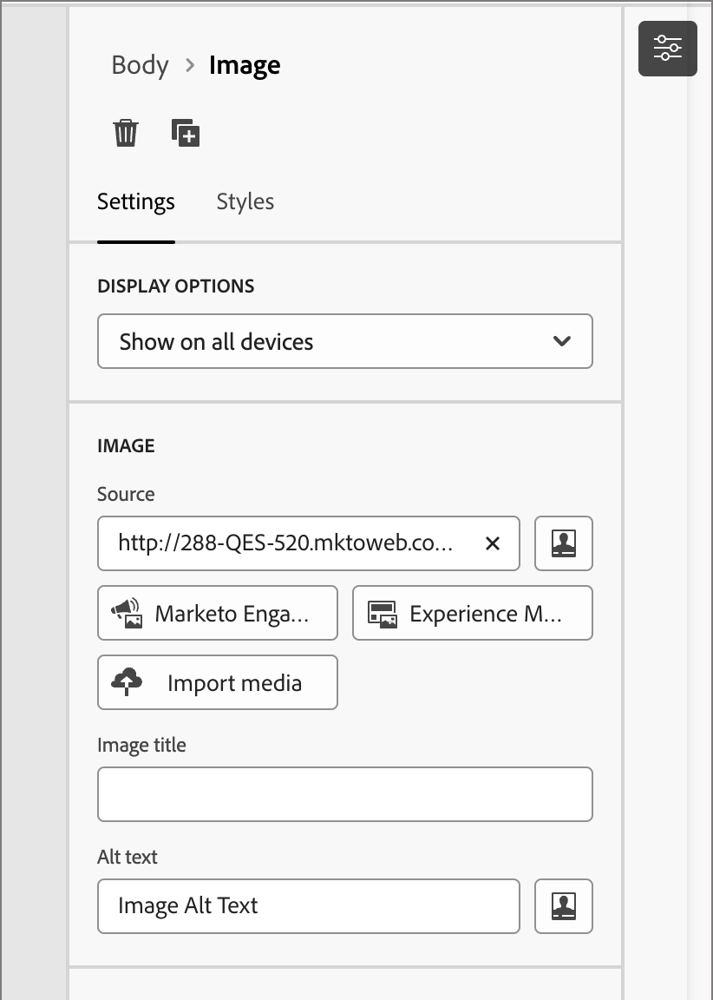

# Recursos

En Adobe Journey Optimizer B2B Edition, los recursos suelen ser las imágenes utilizadas al diseñar contenido para admitir recorridos de cuenta. Puede utilizar estas imágenes dentro de los correos electrónicos, las plantillas de correo electrónico y los fragmentos a través de un selector de recursos o una sencilla interfaz de arrastrar y soltar dentro del editor de contenido visual.

Adobe Journey Optimizer B2B Edition ofrece acceso a dos tipos de bibliotecas de recursos a los especialistas en marketing: Adobe Marketo Engage Design Studio y Adobe Experience Manager Assets as a Cloud Service. Solo puede utilizar Adobe Marketo Engage Design Studio o ambas bibliotecas configuradas al mismo tiempo (según la licencia de AEM Assets que tenga).

## Administración de recursos

Si se le proporciona Adobe Experience Manager as a Cloud Services, tendrá acceso a los repositorios tanto para Marketo Engage Design Studio como para Adobe Experience Manager Assets as a Cloud Service cuando su cuenta de usuario tenga los permisos necesarios. Estos repositorios son independientes y no están sincronizados. Puede utilizar imágenes de cualquier origen.

### Usuarios de Adobe Marketo Engage

El repositorio de recursos de Adobe Marketo Engage Design Studio se proporciona de forma predeterminada con cada suscripción a Journey Optimizer B2B Edition. Esto significa que tiene acceso a cualquiera de los recursos de imagen almacenados en Adobe Marketo Engage ([!UICONTROL Design Studio] > [!UICONTROL Imágenes y archivos]). Puede utilizar este repositorio como su biblioteca de recursos local, incluidas las funciones de carga y descarga de recursos. También puede utilizar estos recursos dentro del contenido del recorrido.

Existen protecciones integradas que impiden realizar ediciones en los recursos de Marketo Engage desde Journey Optimizer B2B Edition, así como eliminar y mover operaciones. Estas protecciones garantizan que los recursos de origen (Marketo Engage Design Studio) se mantengan, al tiempo que permiten una lectura y reutilización sin problemas en Journey Optimizer B2B Edition.

Formatos de archivo compatibles: JPG, JPEG, GIF, PNG, EPS, SVG y RGB

### Adobe Experience Manager Assets as a Cloud Service

Una los flujos de trabajo creativos y de marketing con Adobe Experience Manager Assets. Está integrado de forma nativa con Adobe Journey Optimizer B2B Edition, por lo que puede acceder fácilmente a Assets as a Cloud Service para descubrir y utilizar recursos digitales. Proporciona un único repositorio centralizado de recursos que puede utilizar para completar los mensajes.

Adobe Journey Optimizer B2B Edition puede conectarse a Adobe Experience Manager Assets as a Cloud Service para una administración de recursos centralizada que amplíe su sistema creativo y unifique los recursos digitales para la entrega de experiencias. Adobe Experience Manager Assets as a Cloud Service ofrece una solución en la nube fácil de usar para una administración eficiente de activos digitales y operaciones de Dynamic Media. Incorpora sin problemas funciones avanzadas, como inteligencia artificial y aprendizaje automático.

Obtenga más información en la [documentación de Adobe Experience Manager as a Cloud Service](https://experienceleague.adobe.com/es/docs/experience-manager-cloud-service/content/assets/overview){target="_blank"}.

{{aem-assets-licensing-note}}

Acceda a Adobe Experience Manager Assets directamente desde Journey Optimizer B2B Edition desde el elemento **[!UICONTROL Experience Manager Assets]** del menú de navegación izquierdo del diseño de contenido. También puede acceder a recursos y carpetas al diseñar el correo electrónico, la plantilla de correo electrónico y el contenido de los fragmentos visuales.

Actualmente, solo puede utilizar imágenes de Adobe Experience Manager Assets en Adobe Journey Optimizer B2B Edition.

## Uso de recursos para la creación de contenido

Utilice recursos a medida que crea sus correos electrónicos, plantillas de correo electrónico y fragmentos visuales. El editor de contenido visual proporciona acceso a las imágenes de los repositorios de recursos conectados. Si tiene una suscripción a Experience Manager Assets as a Cloud Service junto con Adobe Marketo Engage Design Studio predeterminado, puede elegir recursos de imagen de cualquier origen. También puede cargar un recurso de imagen, que lo coloca en el espacio de trabajo de Journey Optimizer B2B Edition del repositorio conectado de Marketo Engage Design Studio.

Puede elegir el origen de la imagen al editar la configuración de un componente de imagen o directamente en el lienzo.

* **_Configuración del componente de imagen_**: cuando tenga seleccionado un componente de imagen en el diseñador visual, podrá ver y editar la configuración en el panel derecho. Para añadir o cambiar el archivo de imagen que se muestra en el componente, elija el tipo de origen y seleccione un archivo de imagen.

  {width="350"}

* **_Componente vacío_**: cuando se añade un componente de imagen en el diseñador visual, está vacío y proporciona fácil acceso para elegir un origen y seleccionar un archivo de imagen.

  {width="500"}

* **_Barra de herramientas del componente de imagen_**: cuando tiene un componente de imagen seleccionado en el diseñador visual, la barra de herramientas proporciona un acceso fácil para elegir un origen y seleccionar el archivo de imagen.

  {width="500"}

Puede añadir un recurso de imagen a medida que crea el contenido, según el origen del recurso de imagen.

>[!BEGINTABS]

>[!TAB Marketo Engage Assets]

Haga clic en **[!UICONTROL Marketo Engage Assets]** para abrir el selector de recursos, donde podrá elegir una imagen de Marketo Engage Workspace o de Journey Optimizer B2B Edition Workspace.

{width="700" zoomable="yes"}

Puede utilizar la búsqueda y los filtros para localizar el recurso de imagen deseado. Seleccione el recurso y haga clic en **[!UICONTROL Seleccionar]** para utilizarlo en el componente de imagen.

Para obtener información más detallada sobre cómo usar los recursos de imagen de Marketo Engage, consulte [Usar recursos en el contenido](./marketo-engage-design-studio.md#use-assets-in-your-content).

>[!TAB Experience Manager Assets]

Haga clic en **[!UICONTROL Experience Manager Assets]** para abrir el selector de recursos, donde podrá elegir una imagen del repositorio de Experience Manager Assets.

{width="700" zoomable="yes"}

Puede utilizar la búsqueda y los filtros para localizar el recurso de imagen deseado. Seleccione el recurso y haga clic en **[!UICONTROL Seleccionar]** para utilizarlo en el componente de imagen.

Para obtener información más detallada sobre el uso de archivos de imagen de Experience Manager Assets, consulte [Acceder a imágenes de AEM Assets](./aem-assets.md#access-aem-assets-images).

>[!TAB Importar medios]

Haga clic en **[!UICONTROL Importar medios]** para seleccionar un archivo de imagen e importarlo como un recurso que se pueda usar para el contenido de Journey Optimizer B2B Edition.

{width="500" zoomable="yes"}

Después de arrastrar y soltar el archivo o seleccionarlo en el sistema de archivos, haga clic en **[!UICONTROL Importar]**. El recurso importado se almacena en el espacio de trabajo de Journey Optimizer B2B Edition del repositorio de Adobe Marketo Engage Design Studio.

>[!ENDTABS]
