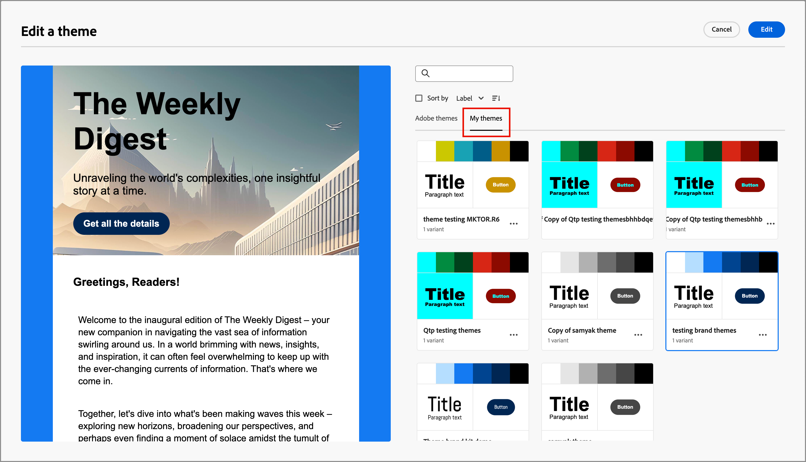

# Use temáticas de marca para el contenido de correo electrónico {#email-brand-themes}

>[!CONTEXTUALHELP]
>id="ajo-b2b_email_brand_theme"
>title="Aplique una temática de marca al correo electrónico o a la plantilla del correo electrónico"
>abstract="Seleccione una temática para su correo electrónico o plantilla de correo electrónico para aplicar un estilo específico que se ajuste a su marca y diseño."

Con las temáticas, los diseñadores no técnicos tienen la capacidad de crear directrices de diseño de contenido de correo electrónico reutilizables que se alineen con una marca y un estilo específicos. Los temas permiten a los especialistas en marketing aprovechar correos electrónicos visualmente atractivos y coherentes con la marca de forma más rápida y con menos esfuerzo, y proporcionan opciones de personalización avanzadas para satisfacer necesidades de diseño únicas.

## Directrices y limitaciones del tema {#themes-guidelines}

Cuando trabaje con temáticas, tenga en cuenta las siguientes directrices y limitaciones:

* Cuando crea un correo electrónico o una plantilla de correo electrónico a partir de un lienzo en blanco (_diseño desde cero_), puede elegir _modo de tema_ para empezar a crear el contenido mediante un tema y aplicar un estilo específico que se ajuste a su marca y diseño. Si elige _Modo manual_, no podrá aplicar un tema a menos que restablezca el diseño del correo electrónico o de la plantilla de correo electrónico.

* [Los fragmentos](./fragments.md) no son compatibles entre el _modo de tema_ y el _modo manual_ en el contenido del correo electrónico. Para utilizar un fragmento en el contenido del correo electrónico donde se aplique un tema, el fragmento también debe crearse en _Modo de tema_.

* Los cambios en una temática personalizada no se aplican en cascada automáticamente a todos los correos electrónicos o plantillas de correo electrónico que ya la utilizan. Edite el contenido de cada uno para actualizar la temática.

* Si elimina una temática, no afecta a ningún correo electrónico ni a ninguna plantilla de correo electrónico en los que ya se haya aplicado.
<!-- 
* If using a content created in HTML, you will be in [compatibility mode](existing-content.md) and you cannot apply themes to this content.
-->

## Crear un tema de marca {#create-theme}

Defina el tema de su propia marca que puede aplicar al contenido de su correo electrónico y plantilla de correo electrónico en el contenido futuro del correo electrónico.

1. Acceda a las herramientas de temáticas mediante uno de los siguientes métodos:

   * [Crea una nueva plantilla de correo electrónico](./email-templates.md#create-an-email-template) y haz clic en **[!UICONTROL Editar plantilla de correo electrónico]** para iniciar la página _[!UICONTROL Diseña tu plantilla]_.

   * Haga clic en **[!UICONTROL ... Más]** en la parte superior derecha del espacio de diseño de contenido de correo electrónico y elige **[!UICONTROL Cambiar el diseño]**.

     {width="700" zoomable="yes"}

     En el cuadro de diálogo de confirmación, haga clic en **[!UICONTROL Cambiar plantilla]** para abrir la página de diseño.

1. En la página de diseño, elija **[!UICONTROL Crear o editar temas]**.

   {width="800" zoomable="yes"}

1. Seleccione la temática predeterminada o utilice cualquiera de las temáticas de Adobe para utilizarla como punto de partida.

   >[!NOTE]
   >
   >Si desea usar uno de sus temas personalizados (_[!UICONTROL Mis temas]_) como punto de partida, puede [duplicarlo](#delete-or-duplicate-a-theme) y cambiar el nombre del tema cuando [edite el tema](#edit-a-theme).

1. Haga clic en **[!UICONTROL Crear]**.

   {width="750" zoomable="yes"}

   La página _[!UICONTROL Crear un tema]_ proporciona un lienzo con los elementos existentes de todos los tipos de texto, botones y contenedores del tema inicial.

1. Utilice la navegación derecha para acceder a las diferentes pestañas de estilo de la temática y cambiar la configuración de la temática:

   * [Configuración general](#general-settings)
   * [Colores](#colors)
   * [Configuración de texto](#text-settings)
   * [Espaciado y borde](#spacing-and-border)
   * [Botón](#button)
   * [Divisor](#divider)
   * [Cuadrícula](#grid)

   Los elementos visuales cambian en el lienzo a medida que define la nueva configuración del tema. Si el resultado no es el deseado, puede hacer clic en el icono _Deshacer_ ( {width="16"} ) en la parte inferior del panel derecho. Haga clic en el icono _Rehacer_ ( {width="16"} ) para volver a aplicar el cambio.

1. Cuando finalice la definición del tema, haz clic en **[!UICONTROL Guardar]**.

1. Haga clic en **[!UICONTROL Cerrar]** para volver a la página _[!UICONTROL Crear un tema]_ y, a continuación, en **[!UICONTROL Cancelar]** para volver a la página de diseño.

   A continuación, puede elegir **[!UICONTROL Diseñar desde cero]** para abrir el espacio de diseño visual y [usar el tema](#use-your-theme-for-email-content-authoring) para el correo electrónico o la plantilla.

### Configuración general

En la pestaña **[!UICONTROL Configuración general]**, defina los parámetros básicos de su tema:

* Escriba un **[!UICONTROL nombre de tema]** único.

* Ajuste la **[!UICONTROL anchura de la ventanilla]** para el contenido del correo electrónico (cuerpo). Utilice las flechas arriba y abajo para aumentar o disminuir la anchura o introduzca el valor (en píxeles).

{width="450"}
<!--  and also export the current theme to [share it across sandboxes](../configuration/copy-objects-to-sandbox.md).-->

### Colores

Seleccione la ficha **[!UICONTROL Colores]** y use la configuración para definir la paleta de colores del tema.

{width="450"}

* Haga clic en **[!UICONTROL Editar]** para mostrar la paleta de colores que incluye los colores del tema.

  Elija un **[!UICONTROL ajuste preestablecido]** para usar una combinación de colores para el tema o para ajustar cada color del conjunto. También puede utilizar una combinación de ambos.

  {width="350"}

  Para el cuadrado de color seleccionado en la parte superior, puede establecer el color introduciendo un valor RGB, HSL, HSB o hexadecimal conocido. O bien, puede utilizar el regulador de color y el campo de color para seleccionar el color.

  Haga clic en la flecha _Atrás_ para cerrar las herramientas de la paleta de colores.

* Haga clic en **[!UICONTROL Agregar variante]** para crear varias variantes de color, como un modo _claro_ y _oscuro_, en el que cada variante tiene su propia paleta de colores y controles de matices. Puede tener hasta seis variantes.

  Para cada variante, haga clic en el icono _Editar_ (  ). Puede utilizar la paleta predeterminada o cualquier color personalizado.

  {width="450"}

  Para cada color que desee cambiar para la variante, mueva el conmutador a la izquierda o a la derecha para desactivarlo o activarlo. Para una configuración de color habilitada, haga clic en el cuadrado de color para elegir el color.

  {width="450"}

  +++Configuración de color de variante

  La configuración se agrupa según el tipo:

  | Tipo | Configuración | Descripción |
  | ---- | -------- | ----------- |
  | [!UICONTROL General] | {width="300"} | Esta configuración determina los colores del cuerpo, las estructuras, los contenedores, los fondos, los vínculos, las cuadrículas y los bordes. |
  | [!UICONTROL Encabezados] | {width="300"} | Esta configuración se aplica a `Heading` elementos, donde puede establecer colores de texto y borde para cada uno de los seis niveles de encabezado. Expanda cada nivel de encabezado en el que desee establecer el color de la variante. |
  | [!UICONTROL Párrafos] | {width="300"} | Esta configuración se aplica a `Paragraph` elementos, donde puede establecer colores de texto y borde para cada uno de los tres tipos de párrafo. Expanda cada tipo de párrafo para el que desee establecer el color de la variante. |
  | [!UICONTROL Botones] | {width="300"} | La configuración se aplica a los elementos de botón, donde puede establecer el color de relleno, el color de borde y el color del texto para cada uno de los tres ajustes preestablecidos de botón: _Principal_, _Secundario_ y _Terciario_. |

  +++

### Configuración de texto

En la ficha **[!UICONTROL Configuración de texto]**, puede establecer los tipos de fuentes, estilos y tamaños globales que desee usar para el tema. Para un control más granular, también puede editar estos parámetros para tipos de encabezado y párrafo.

{width="450"}

+++Configuración de texto por tipo

| Tipo | Configuración | Descripción |
| ---- | -------- | ----------- |
| [!UICONTROL Global] | {width="300"} | Establezca **[!UICONTROL Font library]** en _[!UICONTROL Standard]_ o _[!UICONTROL Google Fonts]_. A continuación, elija la familia de fuentes que desea utilizar. Esta configuración de texto global se aplica en todo, a menos que establezca estilos de texto diferentes para los niveles de encabezado y los tipos de párrafo. |
| [!UICONTROL Encabezados] | {width="300"} | Para el nivel de encabezado que desea establecer, seleccione **[!UICONTROL H1]**, **[!UICONTROL H2]**, etc. Establezca **[!UICONTROL Font library]** en _[!UICONTROL Standard]_ o _[!UICONTROL Google Fonts]_. A continuación, elija la familia de fuentes, el tamaño y el estilo. Elija la **[!UICONTROL alineación del texto]**: _Izquierda_, _Centrada_, _Derecha_ o _Justificada_. |
| [!UICONTROL Párrafos] | {width="300"} | Para el nivel de encabezado que desea establecer, seleccione **[!UICONTROL P1]**, **[!UICONTROL HP]**, etc. Establezca **[!UICONTROL Font library]** en _[!UICONTROL Standard]_ o _[!UICONTROL Google Fonts]_. A continuación, elija la familia de fuentes, el tamaño y el estilo. Ajuste la **[!UICONTROL altura de línea]** según sea necesario. Elija la **[!UICONTROL alineación del texto]**: _Izquierda_, _Centrada_, _Derecha_ o _Justificada_. |

+++

### Espaciado y borde

En la ficha **[!UICONTROL Espaciado]**, puede establecer el relleno y el margen para los distintos tipos de elementos. Para **[!UICONTROL Seleccionar tipo]**, elija el tipo de contenido. A continuación, establezca el relleno, los márgenes, las esquinas y los bordes aplicables a ese tipo de elemento.

{width="450"}

+++Configuración de espaciado

| Tipo | Configuración | Descripción |
| ---- | -------- | ----------- |
| [!UICONTROL Márgenes] | {width="300"} | Elija el icono _Margin_ para mostrar la configuración que replica el parámetro `margin` de CSS, que controla el espacio fuera del borde de un componente y lo separa de otros componentes/elementos. Crea un espacio alrededor del componente para influir en su posición y el diseño del contenido circundante. Establezca los valores de los márgenes en píxeles según sus necesidades de diseño. Puede establecer el margen para todos los lados, el superior inferior, el izquierdo-derecho o cada lado del componente de forma independiente. Haga clic en los iconos _Bloquear_ y _Desbloquear_ para sincronizar o dessincronizar los valores de los márgenes superior-inferior e izquierdo-derecho. |
| [!UICONTROL Rellenos] | {width="300"} | Elija el icono _Padding_ para mostrar la configuración que replica el parámetro `padding` de CSS, que es el espacio entre el contenido de un componente o elemento y su borde. El relleno proporciona un espacio interno que puede utilizar para controlar la distancia entre el contenido y el borde del componente. Establezca los valores de relleno en píxeles según sus necesidades de diseño. Puede establecer el relleno para todos los lados, el botón superior, el lado izquierdo-derecho o cada lado del componente de forma independiente. Haga clic en los iconos _Bloquear_ y _Desbloquear_ para sincronizar o dessincronizar los valores de relleno superior-inferior e izquierdo-derecho. |
| [!UICONTROL Esquinas] | {width="300"} | Elija el icono _Esquinas_ para mostrar la configuración que replica el parámetro `border-radius` de CSS, que define el radio de las esquinas del componente o elemento. Defina el valor numérico según la curva que desee para las esquinas. Un valor de 0 (por defecto) produce una esquina cuadrada. |

+++

+++Configuración de borde

Mueva el selector **[!UICONTROL Borde]** a la derecha para habilitar las opciones de visualización de bordes y configúrelas según los criterios de diseño:

* Para establecer el **[!UICONTROL tamaño del borde]** (ancho de línea), haga clic en los iconos de flecha arriba y abajo para aumentar o reducir el número de píxeles.

* Para establecer el **[!UICONTROL estilo de borde]**, elija un valor de la lista de valores CSS `border-style` estándar, como _Sólido_, _Punteado_ y _Guiones_.

* Para determinar dónde se muestra el borde, active cada casilla de verificación **[!UICONTROL Posición del borde]**.

{width="250"}

+++

### Botones

En la ficha **[!UICONTROL Botones]**, puede establecer atributos diferentes (distintos del color) para elementos de botón, como el radio del borde (forma), el texto y el tamaño. Puede cambiar la configuración de cada uno de los tres ajustes preestablecidos de botón: _[!UICONTROL Principal]_, _[!UICONTROL Secundario]_ y _[!UICONTROL Terciario]_.

{width="450"}

+++Configuración del botón

| Tipo | Configuración | Descripción |
| ---- | -------- | ----------- |
| [!UICONTROL Texto] | {width="300"} | Establezca **[!UICONTROL Font library]** en _[!UICONTROL Standard]_ o _[!UICONTROL Google Fonts]_. A continuación, elija la familia de fuentes, el tamaño y el estilo. Elija la **[!UICONTROL alineación del texto]**: _Izquierda_, _Centrada_, _Derecha_ o _Justificada_. |
| [!UICONTROL Borde] | {width="300"} | Mueva el botón de alternancia **[!UICONTROL Border]** a la derecha para habilitar las opciones de visualización del borde del botón y configúrelas según los criterios de diseño. Establezca el **[!UICONTROL tamaño del borde]** (ancho de línea) aumentando o disminuyendo el número de píxeles. Establezca el **[!UICONTROL estilo de borde]** eligiendo un valor de la lista de valores CSS `border-style` estándar, como _Sólido_, _Punteado_ y _Guiones_. |
| [!UICONTROL Tamaño] | {width="300"} | Para la opción **[!UICONTROL Altura]**, haga clic en los iconos de flecha arriba y abajo para aumentar o reducir el número de píxeles. El valor predeterminado es un vacío (Automático), que ajusta el alto del botón según su contenido. Para **[!UICONTROL Width]**, use la opción para establecer el ancho en píxeles o porcentaje. Para una anchura porcentual, utilice el control deslizante para definir el valor porcentual. El porcentaje determina el tamaño del botón en función del cuadro de contenido del bloque contenedor, que excluye el relleno y los bordes. Por ejemplo, un valor de 50 establece el ancho del botón en el 50 % del ancho del contenido del bloque que lo contiene. Para un ancho basado en píxeles, haga clic en los iconos de flecha arriba y abajo para aumentar o reducir el número de píxeles. Un valor vacío (_Auto_) es el valor predeterminado y ajusta el ancho del botón según su contenido. |

+++

### Divisor

En la ficha **[!UICONTROL Divisor]**, puede establecer la configuración del estilo de línea y del contenedor para un componente divisor.

{width="450"}

+++Configuración del divisor

| Tipo | Configuración | Descripción |
| ---- | -------- | ----------- |
| [!UICONTROL Line] | {width="300"} | Establezca el **[!UICONTROL estilo de borde]** eligiendo un valor de la lista de valores CSS `border-style` estándar, como _Sólido_, _Punteado_ y _Guiones_. |
| [!UICONTROL Tamaño de contenedor] | {width="300"} | Para la opción **[!UICONTROL Altura]**, haga clic en los iconos de flecha arriba y abajo para aumentar o reducir el número de píxeles del componente o elemento. Un valor vacío (Automático) es el valor predeterminado y ajusta el tamaño de la altura según su contenido (estilo de línea). Para **[!UICONTROL Width]**, use la opción para establecer el ancho en píxeles o porcentaje. Para una anchura porcentual, utilice el control deslizante para definir el valor porcentual. El porcentaje determina el ancho del elemento en función del cuadro de contenido del bloque contenedor. Por ejemplo, un valor de 50 establece el ancho del divisor en el 50 % del ancho del contenido del bloque que lo contiene. Para un ancho basado en píxeles, haga clic en los iconos de flecha arriba y abajo para aumentar o reducir el número de píxeles. Un valor vacío (_Auto_) es el valor predeterminado y ajusta el ancho del divisor según su contenido. |
| [!UICONTROL Alineación] | {width="300"} | Elija la alineación horizontal dentro del bloque contenedor: _Izquierda_, _Centrada_ o _Derecha_. |

+++

### Cuadrícula

En la ficha **[!UICONTROL Cuadrícula]**, puede controlar los huecos de columna y fila de un elemento de cuadrícula:

* **[!UICONTROL Espacio entre columnas]**: haga clic en los iconos de flecha arriba y abajo para aumentar o reducir el número de píxeles del espacio entre las columnas de la cuadrícula. O bien, puede introducir un número en el campo.

* **[!UICONTROL Espacio de filas]**: haga clic en los iconos de flecha arriba y abajo para aumentar o reducir el número de píxeles del espacio entre las filas de la cuadrícula. O bien, puede introducir un número en el campo.

{width="700" zoomable="yes"}

## Editar una temática

Puede editar una temática con el mismo flujo de trabajo y las mismas herramientas que utiliza al crearla. La diferencia es que usted selecciona la ficha **[!UICONTROL Mis temas]** y selecciona el tema personalizado que desea cambiar.

{width="750" zoomable="yes"}

Utilice el carril de la derecha para navegar por las diferentes pestañas y cambiar la configuración del tema:

* [Configuración general](#general-settings)
* [Colores](#colors)
* [Configuración de texto](#text-settings)
* [Espaciado y borde](#spacing-and-border)
* [Botón](#button)
* [Divisor](#divider)
* [Cuadrícula](#grid)

{width="800" zoomable="yes"}

Los elementos visuales mostrados cambian a medida que cambia la configuración. Si el resultado en el lienzo no es el deseado, puede hacer clic en el icono _Deshacer_ ( {width="16"} ) en la parte inferior del panel derecho. Haga clic en el icono _Rehacer_ ( {width="16"} ) para volver a aplicar el cambio.

Una vez completados los cambios del tema, haz clic en **[!UICONTROL Guardar]**.

>[!NOTE]
>
>Los cambios guardados no se aplican en cascada automáticamente a todos los correos electrónicos o plantillas de correo electrónico que actualmente utilizan la temática. Edite el contenido de cada uno para actualizar la temática y hacer coincidir los estilos actualizados.

## Administrar temáticas personalizadas

Puede administrar las temáticas personalizadas utilizando el mismo flujo de trabajo y herramientas que utiliza al crear una temática. La diferencia es que seleccionas la pestaña **[!UICONTROL Mis temáticas]** y administras tus temáticas dentro de la lista mostrada.

Si tiene una lista grande de temáticas personalizadas, use el campo _Buscar_ y otros filtros para reducir la lista mostrada. A medida que administra la lista de temáticas disponibles, puede editar, eliminar o duplicar una temática personalizada en cualquier momento.

{width="750" zoomable="yes"}

### Editar una temática

1. Seleccione el tema que desee cambiar y haga clic en **[!UICONTROL Editar]** en la parte superior derecha.

   {width="750" zoomable="yes"}

1. Utilice la navegación de la derecha para utilizar las diferentes pestañas de estilo y cambiar la configuración del tema:

   * [Configuración general](#general-settings)
   * [Colores](#colors)
   * [Configuración de texto](#text-settings)
   * [Espaciado y borde](#spacing-and-border)
   * [Botón](#button)
   * [Divisor](#divider)
   * [Cuadrícula](#grid)

   {width="800" zoomable="yes"}

   Los elementos visuales mostrados cambian a medida que cambia la configuración. Si el resultado en el lienzo no es el deseado, puede hacer clic en el icono _Deshacer_ en la parte inferior del carril derecho. Haga clic en el icono _Rehacer_ para volver a aplicar el cambio.

1. Una vez completados los cambios del tema, haz clic en **[!UICONTROL Guardar]**.

>[!NOTE]
>
>Los cambios de temática guardados no se aplican en cascada automáticamente a todos los correos electrónicos o plantillas de correo electrónico que actualmente utilizan la temática. Edite el contenido de cada uno para actualizar la temática y hacer coincidir los estilos actualizados.

### Eliminar o duplicar una temática

Cuando encuentre el tema, haga clic en el icono _Menú más_ (**...**) en la parte inferior derecha de la tarjeta del tema y elija la acción que desee realizar:

{width="220"}

* **[!UICONTROL Duplicado]**: elija esta acción para duplicar el tema. El nuevo tema es idéntico a _Copia de_ anexada al nombre del original. Puede cambiar el nombre cuando [edite el tema](#edit-a-theme).

* **[!UICONTROL Eliminar]** - Elija esta acción para eliminar el tema personalizado. En el cuadro de diálogo de confirmación, haga clic en **[!UICONTROL Eliminar]**.

  >[!NOTE]
  >
  >La eliminación de la temática no afecta a ningún correo electrónico o plantilla de correo electrónico donde ya se haya aplicado.

## Uso de una temática para la creación de contenido de correo electrónico {#use-email-theme}

Al crear un nuevo correo electrónico o plantilla de correo electrónico, puede elegir utilizar un tema de marca que optimiza el proceso de creación de contenido y garantiza que el diseño se ajuste a los estándares definidos. Para un nuevo fragmento, también puede aplicar una temática antes de guardar el fragmento. El fragmento permanecerá en _modo de tema_ a partir de ese momento y es compatible con la adición a correos electrónicos y plantillas de correo electrónico que también están en _modo de tema_.

1. Seleccione una de las siguientes acciones:

   * Seleccione una plantilla de correo electrónico que incorpore un tema (creado en _Modo de tema_). La temática específica de cada plantilla se aplica automáticamente.

   * Use la opción _[!UICONTROL Diseñar desde cero]_ y seleccione **[!UICONTROL Usar temas]** para comenzar con un tema de estilo predefinido.

     {width="450"}

     >[!IMPORTANT]
     >
     >Si elige el modo _[!UICONTROL Estilo manual]_, debe restablecer el diseño de correo electrónico para aplicar un tema.
     >
     >Si elige el modo _[!UICONTROL Temas]_, solo los [fragmentos](./fragments.md) que también se crean en el modo _Temas_ están disponibles para agregar al contenido del correo electrónico.

1. En el espacio de diseño del correo electrónico, haga clic en el icono _Temas_ (  ) que hay a la derecha.

   {width="600" zoomable="yes"}

   Se muestra la temática predeterminada o la temática aplicada a la plantilla. Puede cambiar entre las variantes de color de esta temática.

1. Haga clic en la flecha situada junto a la temática mostrada para ver la lista de temáticas personalizadas y de Adobe disponibles.

1. Haz clic en **[!UICONTROL Mis temas]** y selecciona tu tema personalizado.

   {width="325"}

1. Haga clic fuera de la lista.

   La temática personalizada recién seleccionada aplica los estilos a todos los componentes de correo electrónico del lienzo. Puede alternar entre las variantes de color.

1. Si necesita anular los estilos del tema de un componente seleccionado, haga clic en el icono _Desbloquear estilos del componente_ (  ).

   {width="600" zoomable="yes"}

   En el cuadro de diálogo de confirmación, haga clic en **[!UICONTROL Desbloquear]**.

   Seleccione la ficha **[!UICONTROL Estilos]** en el panel derecho para cambiar la configuración del componente.

   {width="600" zoomable="yes"}

## Cambiar el tema del contenido del correo electrónico

Para un correo electrónico o una plantilla de correo electrónico creados en _Modo de tema_, puede cambiar el tema en cualquier momento. El contenido del correo electrónico permanece sin cambios, pero los estilos se actualizan para reflejar la nueva temática.

1. Abra el correo electrónico o la plantilla de correo electrónico en el espacio de diseño.

1. Haga clic en el icono _Temas_ (  ) que se encuentra a la derecha.

   El tema aplicado se muestra en el panel derecho.

1. Haga clic en la flecha situada junto a la temática mostrada para ver la lista de temáticas personalizadas y de Adobe disponibles.

1. Seleccione otra temática.

1. Haga clic fuera de la lista.

   La temática seleccionada aplica los estilos a todos los componentes de correo electrónico del lienzo. Puede alternar entre las variantes de color.

<!--
>[!NOTE]
> - Themes apply styles globally. Ensure your theme is finalized before applying it to multiple emails.
> - Switching themes may override custom styles applied to individual components.

>[!CAUTION]
> - When using fragments, the email's theme will override the fragment's styles. A warning will be displayed in the editor if there is a conflict.

## Example Use Cases {#example-use-cases}

### 1. Creating a New Theme
- A designer creates a theme with their brand's colors, fonts, and button styles.
- The theme is saved and reused by marketers to author multiple emails.

### 2. Switching Themes
- A marketer applies a holiday-themed design to an existing email by switching to a pre-designed holiday theme.-->
